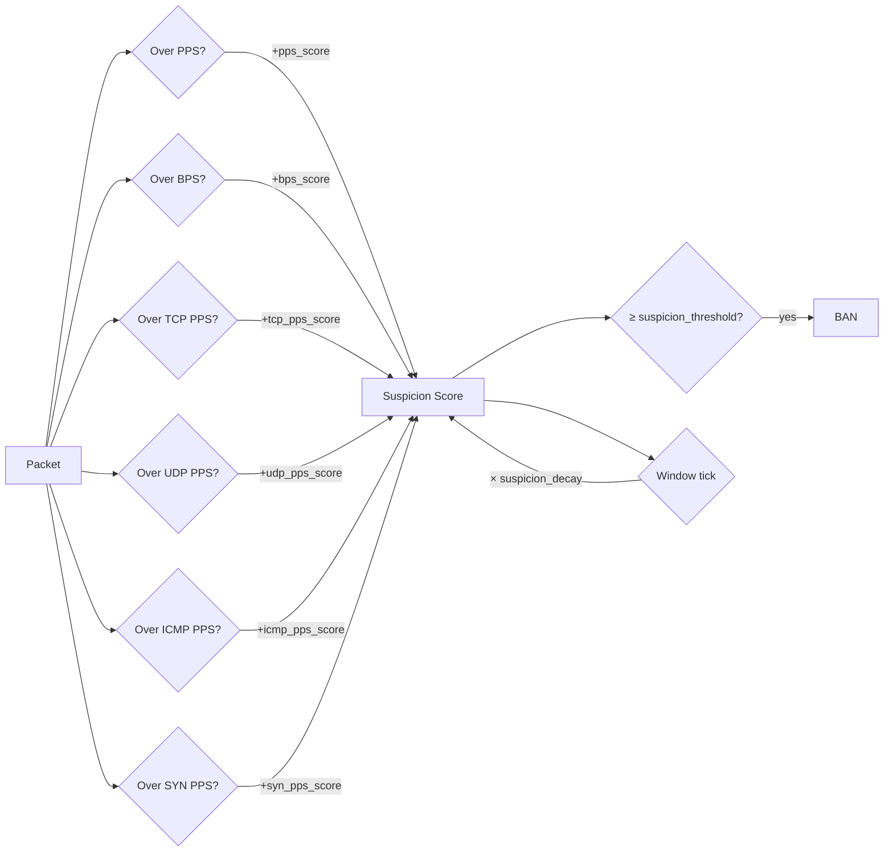

# Configuration Reference

Complete YAML reference for `/etc/openshield/openshield.yaml`. Every field is listed with its Go type, default value as set in `defaults.go`, valid range, and a description of what it controls.

Fields marked **🔄 Runtime-Safe** can be updated via the Unix socket without restarting the XDP program. Fields marked **🔒 Requires Reload** need `openshield fix && openshield load` to take effect.

::: warning Configuration File Location
The active config lives at `/etc/openshield/openshield.yaml`. An annotated example ships at `/opt/openshield/share/openshield.example.yaml`.

Run `openshield config` to generate a fresh defaults file.
:::

## Top-Level

| Field | Type | Default | Range | Description | Safe? |
|-------|------|---------|-------|-------------|-------|
| `interface` | `string` | `"eno1"` | any netdev name | Network interface for XDP attachment | 🔒 |
| `xdp_mode` | `string` | `"auto"` | `auto` / `native` / `generic` / `offload` | XDP attachment mode | 🔒 |

## `static` — Rate Thresholds & Scoring

| Field | Type | Default | Range | Description | Safe? |
|-------|------|---------|-------|-------------|-------|
| `static.enabled` | `bool` | `true` | `true` / `false` | Enable per-IP rate threshold checks | 🔄 |
| `static.pps_threshold` | `int` | **`850`** | `1` – `10,000,000` | Max packets/s per IP before suspicion | 🔄 |
| `static.bps_threshold` | `int` | **`8912896`** | `1024` – `10,737,418,240` | Max bytes/s per IP before suspicion (~8.5 MiB/s) | 🔄 |
| `static.tcp_pps_threshold` | `int` | **`680`** | `1` – `10,000,000` | Max TCP packets/s per IP | 🔄 |
| `static.udp_pps_threshold` | `int` | **`425`** | `1` – `10,000,000` | Max UDP packets/s per IP | 🔄 |
| `static.icmp_pps_threshold` | `int` | **`85`** | `1` – `10,000,000` | Max ICMP packets/s per IP | 🔄 |
| `static.syn_pps_threshold` | `int` | **`170`** | `1` – `10,000,000` | Max SYN packets/s per IP | 🔄 |
| `static.suspicion_threshold` | `int` | `100` | `1` – `10,000` | Score at which IP is banned | 🔄 |
| `static.ban_duration` | `int` | `3600` | `1` – `86,400` | How long bans last (seconds) | 🔄 |
| `static.pps_score` | `int` | `20` | `0` – `1000` | Score added for PPS violation | 🔄 |
| `static.bps_score` | `int` | `20` | `0` – `1000` | Score added for BPS violation | 🔄 |
| `static.tcp_pps_score` | `int` | `15` | `0` – `1000` | Score added for TCP PPS violation | 🔄 |
| `static.udp_pps_score` | `int` | `15` | `0` – `1000` | Score added for UDP PPS violation | 🔄 |
| `static.icmp_pps_score` | `int` | `25` | `0` – `1000` | Score added for ICMP PPS violation | 🔄 |
| `static.syn_pps_score` | `int` | `30` | `0` – `1000` | Score added for SYN PPS violation | 🔄 |
| `static.suspicion_decay` | `float64` | `0.5` | `0.0` – `1.0` | Score retention per window (0.5 = keep 50%) | 🔄 |
| `static.rate_limit_mode` | `string` | `"threshold"` | `threshold` / `token_bucket` | Rate limiting algorithm | 🔄 |
| `static.token_rate` | `uint32` | `0` | `0` – `10,000,000` | Tokens refilled per second per IP (token_bucket mode) | 🔄 |
| `static.token_burst` | `uint32` | `0` | `0` – `100,000,000` | Max burst tokens per IP (token_bucket mode) | 🔄 |
| `static.enable_connection_tracking` | `bool` | `true` | `true` / `false` | Drop blind SYN-ACK/RST/ACK (no prior SYN seen) | 🔄 |
| `static.ct_syn_timeout_sec` | `int` | `300` | `0` – `3600` | Seconds a connection stays proven after its SYN (0=disable). Keep ≥ app keepalive interval | 🔄 |
| `static.ct_server_port_max` | `int` | `32768` | `0` – `65535` | Only track connections to destination ports ≤ this (0 = track all ports; breaks outbound traffic like apt/curl) | 🔄 |
| `static.ct_established_exempt` | `bool` | `true` | `true` / `false` | Exempt sources with a proven TCP session (data within `ct_syn_timeout_sec` of SYN) from PPS/BPS/TCP_PPS scoring. SYN-rate, conn-rate, UDP/ICMP scoring and attack-mode caps still apply. Works even when `enable_connection_tracking` is `false` (v2.0+) | 🔄 |
| `static.port_thresholds` | `[]PortThreshold` | `[]` | max 8 entries | Per-port/range overrides replacing global PPS/BPS thresholds, peacetime AND attack mode (v2.0+) — see below | 🔄 |
| `static.star_duration_multiplicators` | `[]int` | `[1,2,4,8,16,32]` | array of 6 ints | Ban duration multipliers per star level (repeat-offender escalation) | 🔄 |
| `static.star_decay_seconds` | `int` | `3600` | `1` – `86,400` | Seconds before star rating decays by 1 | 🔄 |
| `static.ban_subnets` | `[]string` | `[]` | CIDR strings | Hardcoded subnet bans (e.g., `["10.0.0.0/8"]`) | 🔄 |
| `static.auto_subnet_ban` | `bool` | `false` | `true` / `false` | Automatically ban /24 subnets when too many single-IP bans occur | 🔄 |
| `static.auto_subnet_prefixes` | `[]int` | `[24]` | prefix lengths | CIDR prefix lengths for auto-subnet-ban | 🔄 |
| `static.subnet_ban_duration` | `int` | `7200` | `1` – `86,400` | Duration for auto subnet bans (seconds) | 🔄 |

### Port Threshold Entry Fields

Each entry in `static.port_thresholds` (max 8):

| Field | Type | Description |
|-------|------|-------------|
| `ports` | `string` | Single port (`"443"`) or inclusive range (`"8000-9000"`) — matched on destination port |
| `pps_threshold` | `int` | Packets/s limit for matching traffic (`0` = inherit global `pps_threshold`) |
| `bps_threshold` | `int` | Bytes/s limit for matching traffic (`0` = inherit global `bps_threshold`) |

At least one of the two thresholds must be non-zero. Overrides apply in peacetime and during attack mode.

### Scoring Model


```mermaid
graph LR
    A[Packet] --> B{Over PPS?} -->|+pps_score| S[Suspicion Score]
    A --> C{Over BPS?} -->|+bps_score| S
    A --> D{Over TCP PPS?} -->|+tcp_pps_score| S
    A --> E{Over UDP PPS?} -->|+udp_pps_score| S
    A --> F{Over ICMP PPS?} -->|+icmp_pps_score| S
    A --> G{Over SYN PPS?} -->|+syn_pps_score| S
    S --> H{≥ suspicion_threshold?} -->|yes| BAN[BAN]
    S --> I{Window tick} -->|× suspicion_decay| S
```

Each per-second evaluation window, the suspicion score is multiplied by `suspicion_decay` (emulating exponential decay). An IP is banned when its score reaches `suspicion_threshold`.

## `validation` — Packet Validation

| Field | Type | Default | Range | Description | Safe? |
|-------|------|---------|-------|-------------|-------|
| `validation.filter_private` | `bool` | `false` | `true` / `false` | Drop packets with private/bogon source IPs (enabled per-profile by stricter presets) | 🔄 |
| `validation.filter_bogon` | `bool` | `true` | `true` / `false` | Drop packets with bogon (unallocated) source IPs | 🔄 |
| `validation.filter_bogus_tcp` | `bool` | `true` | `true` / `false` | Drop impossible TCP flag combinations (e.g., SYN+FIN) | 🔄 |
| `validation.filter_malformed` | `bool` | `true` | `true` / `false` | Drop malformed headers (invalid lengths, truncated options) | 🔄 |
| `validation.drop_fragments` | `bool` | `false` | `true` / `false` | Drop fragmented IP packets (MF flag or non-zero fragment offset). Off by default — enabling can break legitimate large UDP/DNS traffic | 🔄 |

```yaml
validation:
  filter_private: true
  filter_bogon: true
  filter_bogus_tcp: true
  filter_malformed: true
  drop_fragments: false
```

## `dynamic` — Anomaly Detection & Attack Response

<!-- CONFIG-REFERENCE:BEGIN category="Dynamic" -->
| Field | Type | Default | Range | Description | Safe? |
|-------|------|---------|-------|-------------|-------|
| `dynamic.enabled` | `bool` | `true` | `true` / `false` | Enable attack mode and new source detection | 🔄 |
| `dynamic.new_source_limit` | `int` | `100` | `1` – `100,000` | New unique IPs/s before flood mode | 🔄 |
| `dynamic.new_source_ban_duration` | `int` | `30` | `1` – `3,600` | Ban duration for new source flood | 🔄 |
| `dynamic.attack_threshold_multiplier` | `float64` | `0.5` | `0.1` – `1` | Threshold multiplier during attack (0.5 = 50%) | 🔄 |
| `dynamic.panic_pps_rate` | `int` | `200000` | `0` – `100,000,000` | Per-CPU PPS that triggers panic circuit breaker (0=disabled, drops all further map lookups) | 🔄 |
| `dynamic.panic_drop_ratio` | `int` | `80` | `0` – `100` | Percentage of packets to drop when in panic mode (100 = drop all before map lookups) | 🔄 |
| `dynamic.attack_pps_threshold` | `int` | `0` | `0` – `1,000,000,000` | Global PPS trigger for attack state (0=disabled, uses baseline) | 🔄 |
| `dynamic.attack_bps_threshold` | `int` | `0` | `0` – `1,000,000,000,000` | Global BPS trigger for attack state (0=disabled) | 🔄 |
| `dynamic.spike_percentage` | `int` | `200` | `10` – `10,000` | % above baseline that triggers spike (200 = 3x) | 🔄 |
| `dynamic.baseline_mad_k` | `float64` | `3.5` | `0` – `20` | MAD multiplier added to the spike trigger band (0=median×spike% only) | 🔄 |
| `dynamic.spike_recovery_time` | `int` | `10` | `1` – `600` | Seconds below recovery factor before clearing | 🔄 |
| `dynamic.attack_per_ip_pps` | `int` | `1000` | `0` – `1,000,000` | Hard per-source pps cap while an attack is active (0=off). Drops flooders at XDP instantly — rotating spoofed sources never live long enough to be scored | 🔄 |
| `dynamic.attack_port_pps` | `int` | `10000` | `0` – `1,000,000` | Aggregate pps cap per destination port while an attack is active (0=off). Rotation-proof: throttles the attacked port as a whole regardless of how many source IPs the flood rotates through. Legit traffic on that port is throttled (not banned) until the attack clears | 🔄 |
| `dynamic.spike_recovery_factor` | `float64` | `0.7` | `0` – `1` | Fraction of spike threshold below which attack state clears (< 1.0) | 🔄 |
| `dynamic.attack_trigger_time` | `int` | `3` | `1` – `60` | Consecutive seconds above threshold before attack state | 🔄 |
| `dynamic.attack_max_duration` | `int` | `3600` | `0` – `86,400` | Hard cap on attack state seconds (0=disabled) | 🔄 |
| `dynamic.attack_warmup_sec` | `int` | `20` | `0` – `600` | Seconds after loader start with no attack declaration (0=disabled) | 🔄 |
| `dynamic.attack_min_pps` | `int` | `1000` | `0` – `1,000,000,000` | Absolute floor for the attack PPS trigger threshold | 🔄 |
| `dynamic.attack_min_bps` | `int` | `1048576` | `0` – `1,000,000,000,000` | Absolute floor for the attack BPS trigger threshold | 🔄 |
| `dynamic.baseline_alpha_min` | `float64` | `0.05` | `0` – `1` | Minimum EMA alpha (adaptive floor) | 🔄 |
| `dynamic.baseline_alpha_max` | `float64` | `0.5` | `0` – `1` | Maximum EMA alpha (adaptive ceiling) | 🔄 |
| `dynamic.baseline_alpha_variance_scale` | `float64` | `0.1` | `0` – `1` | How much variance adjusts alpha (0=none, 1=max) | 🔄 |
| `dynamic.panic_global_pps_threshold` | `int` | `5000000` | `0` – `100,000,000` | Total PPS across all CPUs that triggers coordinated panic (0=disabled) | 🔄 |
| `dynamic.panic_coordination_enabled` | `bool` | `true` | `true` / `false` | Enable userspace cross-CPU panic coordination | 🔄 |
| `dynamic.dns_amplification_enabled` | `bool` | `false` | `true` / `false` | Drop DNS amplification responses (sport=53, QR=1, large payload) | 🔄 |
| `dynamic.dns_amplification_payload_min` | `int` | `512` | `0` – `65,535` | Minimum UDP payload bytes for DNS amp detection | 🔄 |
| `dynamic.baseline_enabled` | `bool` | `true` | `true` / `false` | Master switch for ALL learned detection (baseline learning, seasonal thresholds, changepoint onset, behavior clustering). Off = static attack_min/overrides only (applies immediately) | 🔄 |
| `dynamic.attack_port_bps` | `int` | `25000000` | `0` – `1,099,511,627,776` | Aggregate bytes/sec cap per destination port during attacks / early spike (0=off). Catches jumbo-packet floods under the pps cap | 🔄 |
| `dynamic.attack_icmp_pps` | `int` | `1000` | `0` – `10,000,000` | Aggregate ICMP packets/sec cap while an attack is declared (0=off, default 1000). Legit ICMP is tens of pps | 🔄 |
| `dynamic.attack_udp_pps` | `int` | `100000` | `0` – `100,000,000` | Aggregate UDP packets/sec cap (attack mode or early spike trigger; 0=off, default 100000). Carpet-bomb answer; protected sources exempt | 🔄 |
| `dynamic.nic_tuning` | `bool` | `false` | `true` / `false` | Host-wide NIC tuning (throughput over latency; applies immediately) | 🔄 |
| `dynamic.udp_resp_enabled` | `bool` | `true` | `true` / `false` | Anti-amplification residual heuristic: sustained excess reply rates from privileged-sport sources lose the outbound-response exemption | 🔄 |
| `dynamic.udp_resp_factor` | `int` | `4` | `2` – `64` | Sustained rate above factor × early rate counts as excess | 🔄 |
| `dynamic.udp_resp_window_sec` | `int` | `10` | `2` – `300` | Consecutive excess seconds before the response exemption is revoked | 🔄 |
| `dynamic.synproxy_companion_auto` | `bool` | `false` | `true` / `false` | Auto-insert/remove the netfilter SYNPROXY companion rule trio while the SYN-cookie path is engaged (applies immediately) | 🔄 |
| `dynamic.baseline_window` | `int` | `60` | — | Seconds to build baseline | ⚙️ |
| `dynamic.baseline_update_interval` | `int` | `5` | — | Seconds between baseline updates | ⚙️ |
| `dynamic.baseline_alpha` | `float64` | `0.1` | — | EMA smoothing factor | ⚙️ |
<!-- CONFIG-REFERENCE:END -->

### L7 Drop Signature Fields

Each entry in `l7_drop_signatures`:

| Field | Type | Default | Description |
|-------|------|---------|-------------|
| `name` | `string` | — | Human-readable rule name |
| `protocol` | `string` | — | `tcp` or `udp` |
| `port` | `int` | — | Port to match (source or dest) |
| `port_is_src` | `bool` | — | Match source port instead of dest |
| `offset` | `int` | — | Byte offset into payload |
| `pattern` | `string` | — | Hex pattern to match at offset |
| `mask` | `string` | — | Bitmask applied before comparison |
| `min_payload` | `int` | — | Minimum payload length to trigger |
| `max_payload` | `int` | — | Maximum payload length to trigger |

## `whitelist` — Trusted IPs

| Field | Type | Default | Range | Description | Safe? |
|-------|------|---------|-------|-------------|-------|
| `whitelist.enabled` | `bool` | `true` | `true` / `false` | Enable whitelist (bypass all mitigation) | 🔄 |
| `whitelist.ips` | `[]string` | `[]` | IPv4 / IPv6 addresses | Trusted IP list | 🔄 |

```yaml
whitelist:
  enabled: true
  ips:
    - 10.0.0.1
    - 2001:db8::1
```

## `telemetry` — Monitoring

| Field | Type | Default | Range | Description | Safe? |
|-------|------|---------|-------|-------------|-------|
| `telemetry.poll_interval` | `int` | `1` | `1` – `60` | Seconds between collector map reads | 🔒 |
| `telemetry.event_rate_limit` | `int` | `100` | `1` – `10,000` | Max events/s emitted to ring buffer | 🔄 |
| `telemetry.top_offenders_count` | `int` | `20` | `1` – `1000` | Top N IPs shown in TUI/stats | 🔄 |
| `telemetry.log_level` | `string` | `"info"` | `debug` / `info` / `warn` / `error` | Log verbosity | 🔄 |
| `telemetry.snapshot_interval` | `int` | `1` | `1` – `60` | Seconds between stat snapshots | 🔄 |
| `telemetry.attack_share` | `bool` | `false` | `true` / `false` | Share anonymized attack fingerprints with PingLess after attacks (type/rates/duration/port classes/source count — never IPs) | 🔄 |
| `telemetry.attack_share_endpoint` | `string` | `""` | URL | Override fingerprint endpoint (empty = PingLess telemetry on the license server) | 🔄 |

## `updates` — Auto-Update Channel (v2.16+)

| Field | Type | Default | Range | Description | Safe? |
|-------|------|---------|-------|-------------|-------|
| `updates.enabled` | `bool` | `true` | `true` / `false` | Check for new releases every 6h + TUI update badge | 🔄 |
| `updates.auto` | `bool` | `true` | `true` / `false` | Install new releases unattended (licensed installs; signed metadata + hash-verified zip + automatic rollback) | 🔄 |
| `updates.endpoint` | `string` | `""` | URL | Override the updates worker (empty = official channel) | 🔄 |

See [Upgrade](/openshield-xdp/getting-started/upgrade) for the trust chain.

## `registry` — Attached IPs (v2.17+)

Tracks which destination IPs belong to this host. Informational only — see [Attached IPs](../guide/attached-ips.md).

<!-- CONFIG-REFERENCE:BEGIN category="Registry" -->
| Field | Type | Default | Range | Description | Safe? |
|-------|------|---------|-------|-------------|-------|
| `registry.enabled` | `bool` | `true` | `true` / `false` | Learn which destination IPs belong to this host (wire-observed + local addresses; informational only, applies immediately) | 🔄 |
| `registry.inactive_days` | `int` | `14` | `1` – `365` | Days without observed traffic before an auto-learned attached IP is reaped (manual entries and pools never reap; applies immediately) | 🔄 |
| `registry.auto_min_packets` | `int` | `100` | `1` – `1,000,000` | Cumulative packets a wire-observed destination must exceed before it auto-attaches (noise filter; applies immediately) | 🔄 |
<!-- CONFIG-REFERENCE:END -->

## `blackhole` — Per-Tenant Blackhole (v2.17+)

Total per-destination drop with established-connection survival — see [Blackhole](../guide/blackhole.md). License-gated.

<!-- CONFIG-REFERENCE:BEGIN category="Blackhole" -->
| Field | Type | Default | Range | Description | Safe? |
|-------|------|---------|-------|-------------|-------|
| `blackhole.enabled` | `bool` | `true` | `true` / `false` | Arm the kernel blackhole stage (per-destination total drop; entries are kept either way, applies immediately). Manage: openshield blackhole | 🔄 |
| `blackhole.auto_enabled` | `bool` | `false` | `true` / `false` | Automatically blackhole attached destinations whose inbound rate sustains over the auto_pps/auto_bps triggers (applies immediately) | 🔄 |
| `blackhole.auto_pps` | `int` | `0` | `0` – `100,000,000` | Inbound packets/sec to one attached destination that arms auto-blackhole (0 = pps leg off; applies immediately) | 🔄 |
| `blackhole.auto_bps` | `int` | `0` | `0` – `100,000,000,000` | Inbound bytes/sec to one attached destination that arms auto-blackhole (0 = bps leg off; applies immediately) | 🔄 |
| `blackhole.auto_sustain_sec` | `int` | `5` | `1` – `300` | Consecutive seconds over the trigger before an auto-blackhole engages (flap filter; applies immediately) | 🔄 |
| `blackhole.auto_duration_sec` | `int` | `300` | `10` – `86,400` | Lifetime of one auto-blackhole entry in seconds (extended while the trigger still holds; applies immediately) | 🔄 |
| `blackhole.grace_minutes` | `int` | `10` | `1` – `1,440` | Minutes an established-source exemption to a blackholed destination survives without re-proof (applies immediately) | 🔄 |
<!-- CONFIG-REFERENCE:END -->

## `egress` — TC Egress Per-IP Policer (v2.18+)

Opt-in OUTBOUND per-source-IP caps on the clsact egress hook — the RX-only firewall's outbound twin. Off by default; every field hot-applies. See [What's New v2.18.0](../features/whats-new.md). Status: `openshield egress status`; metrics: `GET /metrics/egress`.

<!-- CONFIG-REFERENCE:BEGIN category="Egress" -->
| Field | Type | Default | Range | Description | Safe? |
|-------|------|---------|-------|-------------|-------|
| `egress.enabled` | `bool` | `false` | `true` / `false` | Attach the TC egress per-source-IP outbound policer (applies immediately; first enable runs an outbound connectivity self-check) | 🔄 |
| `egress.per_ip_pps` | `int` | `0` | `0` – `100,000,000` | Max outbound packets/sec per source IP (0 = off; applies immediately) | 🔄 |
| `egress.per_ip_bps` | `int` | `0` | `0` – `100,000,000,000` | Max outbound bytes/sec per source IP (0 = off; applies immediately) | 🔄 |
| `egress.udp_pps` | `int` | `0` | `0` – `100,000,000` | Max outbound UDP packets/sec per source IP (0 = off; applies immediately) | 🔄 |
| `egress.icmp_pps` | `int` | `0` | `0` – `100,000,000` | Max outbound ICMP/ICMPv6 packets/sec per source IP (0 = off; applies immediately) | 🔄 |
| `egress.syn_pps` | `int` | `0` | `0` – `100,000,000` | Max outbound TCP SYN packets/sec per source IP (0 = off; applies immediately) | 🔄 |
| `egress.log_drops` | `bool` | `false` | `true` / `false` | Emit sampled kernel trace-pipe lines for egress drops (1 in 64; debug knob; applies immediately) | 🔄 |
<!-- CONFIG-REFERENCE:END -->

## `maps` — BPF Map Sizing

| Field | Type | Default | Range | Description | Safe? |
|-------|------|---------|-------|-------------|-------|
| `maps.ip_stats_max` | `int` | `262,144` | `1000` – `10,000,000` | Max entries in per-IP stats LRU (v2.16 default) | 🔒 |
| `maps.ban_max` | `int` | `4,000,000` | `1000` – `10,000,000` | Max entries in ban LRU (v2.16 default) | 🔒 |
| `maps.whitelist_max` | `int` | `50,000` | `100` – `1,000,000` | Max entries in whitelist map (v2.16 default) | 🔒 |
| `maps.event_buffer_size` | `int` | `262,144` (256 KB) | `4096` – `268,435,456` | Ring buffer size in bytes | 🔒 |
| `maps.bloom_filter_enabled` | `bool` | `true` | `true` / `false` | Use Bloom filter fast-path for whitelist lookups | 🔄 |
| `maps.bloom_filter_size` | `int` | `150,000` | `1000` – `10,000,000` | Number of entries in the Bloom filter map | 🔄 |

::: info Bloom Filter
When enabled, whitelisted IPs are hashed into a Bloom filter in the BPF `bloom_map` (a regular ARRAY map used as a bit-vector with 3 hash functions and 64 bits per entry). Before performing a full `bpf_map_lookup_elem` on the whitelist HASH map, the XDP program first checks the Bloom filter — a negative result means "definitely not whitelisted" in ~60-100ns, saving a full hash map lookup.
:::

## `alerter` — Webhook Alerts

| Field | Type | Default | Range | Description | Safe? |
|-------|------|---------|-------|-------------|-------|
| `alerter.enabled` | `bool` | `false` | `true` / `false` | Enable Discord webhook alerts | 🔄 |
| `alerter.webhook_url` | `string` | `""` | valid Discord webhook URL | Webhook endpoint URL | 🔄 |
| `alerter.events` | `[]string` | `[]` | event type strings | Events to alert on (empty = all) | 🔄 |
| `alerter.graph_enabled` | `bool` | `true` | `true` / `false` | Attach traffic graph to attack-end alerts | 🔄 |
| `alerter.show_banned_ips` | `bool` | `false` | `true` / `false` | Include banned IP list inline in ban alerts (txt attached for large batches) | 🔄 |
| `alerter.geo_breakdown` | `bool` | `true` | `true` / `false` | Continent/country share of banned IPs (requires GeoIP db) | 🔄 |
| `alerter.attack_updates` | `bool` | `true` | `true` / `false` | Progress embeds while an attack is ongoing | 🔄 |
| `alerter.generic_webhook_url` | `string` | `""` | http(s) URL | Also POST every event as a JSON envelope (`{product, version, event, host, timestamp, data}`) to this endpoint (v2.12.0+); same pacing/rate-limit handling as Discord, embeds/attachments stay Discord-only | 🔄 |

See the [Alerter docs](./alerter) for webhook format and event types.

## `behavior` — Adaptive Behavior Engine (v2.0+)

| Field | Type | Default | Range | Description | Safe? |
|-------|------|---------|-------|-------------|-------|
| `behavior.enabled` | `bool` | `true` | `true` / `false` | Master switch: learns per-port baselines and flags anomalous source clusters | 🔒 |
| `behavior.auto_block` | `bool` | `true` | `true` / `false` | Auto-ban members of malicious clusters (≥85% confidence) for 1 hour. Default since v2.1.0; set `false` for report-only mode | 🔄 |

The engine freezes learning while an attack is declared, so it mainly catches slow-burn botnets. Review clusters in the TUI behavior tab or via `openshield behavior`.

## `metrics` — HTTP Metrics API (v2.0+)

| Field | Type | Default | Range | Description | Safe? |
|-------|------|---------|-------|-------------|-------|
| `metrics.enabled` | `bool` | `false` | `true` / `false` | HTTP JSON endpoint serving everything the TUI shows (default: off) | 🔄 |
| `metrics.listen` | `string` | `"127.0.0.1:9100"` | `host:port` | Bind address (`0.0.0.0:9100` = remote) | 🔄 |
| `metrics.api_key` | `string` | random per install | min 8 chars | Bearer token; auto-generated if empty. Manage via `openshield key set` / `key regen` (hot-applied) | 🔄 |
| `metrics.rate_limit_per_sec` | `int` | `10` | `0` – `100,000` | Max requests/s per source IP (0 = unlimited) | 🔄 |
| `metrics.whitelist` | `[]string` | `[]` | IPs/CIDRs | Client allowlist (empty = any IP, key still required) | 🔒 |

Full guide: [Metrics API](/openshield-xdp/user-guide/metrics-api).

## `auto_fetch` — Remote Blocklist Feeds (v2.2+)

| Field | Type | Default | Range | Description | Safe? |
|-------|------|---------|-------|-------------|-------|
| `auto_fetch.enabled` | `bool` | `true` | `true` / `false` | Periodically download threat-intel IP feeds into the ban maps (TUI access tab: `f`) | 🔄 |
| `auto_fetch.interval_sec` | `int` | `3600` | ≥ `60` | Seconds between fetch cycles; fetched bans expire after 2× this (floor 10 min) | 🔄 |
| `auto_fetch.mode` | `string` | `"vps"` | `vps` / `dedicated` | `dedicated` skips major cloud/hosting provider ranges (AWS, Azure, GCP, Cloudflare, OVH, Hetzner, …) so hosted VPS clients keep outbound connectivity | 🔄 |
| `auto_fetch.categories` | `[]string` | `c2, botnets, malware, scanners, abuse, bruteforce, ssh-attackers, credential-stuffing, web-exploit-scanners, exploited-infrastructure, high-risk-networks` | category slugs | Official [openshield-blocklists](https://github.com/AnAverageBeing/openshield-blocklists) categories to pull | 🔄 |
| `auto_fetch.urls` | `[]string` | `[]` | http(s) URLs | Extra raw list URLs (one IP/CIDR per line, `#` comments OK) | 🔄 |
| `auto_fetch.never_block` | `[]string` | `[]` | IPs / CIDRs | Exempt from **fetched** bans only — NOT a firewall whitelist; entries are still scored and mitigated | 🔄 |
| `auto_fetch.provider_urls` | `[]string` | `[]` | http(s) URLs | Extra provider-range sources for dedicated mode (plain-text lists or AWS/GCP-style JSON). Empty = built-in defaults | 🔄 |

Full guide: [Auto-Fetch Blocklists](/openshield-xdp/user-guide/auto-fetch).

## `reports` — Scheduled Reports

| Field | Type | Default | Range | Description | Safe? |
|-------|------|---------|-------|-------------|-------|
| `reports.enabled` | `bool` | `false` | `true` / `false` | Enable scheduled network analysis reports | 🔄 |
| `reports.webhook_url` | `string` | `""` | webhook URL | Delivery target (falls back to `alerter.webhook_url`) | 🔄 |
| `reports.dispatch_time` | `string` | `"00:00"` | `HH:MM` | Local time for the daily report | 🔄 |
| `reports.geo_breakdown` | `bool` | `true` | `true` / `false` | Top attacker + top legit-user countries in daily/weekly/monthly reports (requires GeoIP data; v2.2+) | 🔄 |

## `pcap` — Attack Forensics Capture

| Field | Type | Default | Range | Description | Safe? |
|-------|------|---------|-------|-------------|-------|
| `pcap.enabled` | `bool` | `true` | `true` / `false` | Packet capture during attacks (requires tcpdump) | 🔄 |
| `pcap.mode` | `string` | `"rolling"` | `attack` / `rolling` | `attack` = only during attacks, `rolling` = continuous | 🔄 |

Since v2.0, forensics bundles also include `config_snapshot.txt` (mitigation config at attack start, secrets stripped) and `config_changes.txt` (timestamped config changes during the attack).

## `forensics` — Storage, Disk Cap & Collection Switch (v2.10.0+)

| Field | Type | Default | Range | Description | Safe? |
|-------|------|---------|-------|-------------|-------|
| `forensics.dir` | `string` | `/var/lib/openshield/attacks` | absolute path | Where attack forensics (reports, pcaps, history) are stored. Applies at load; existing data is not moved | ⚠️ restart |
| `forensics.collect` | `bool` | `true` | `true` / `false` | Master switch for forensics collection. The disk-pressure guard can auto-pause/resume; a manual `false` is never overridden | 🔄 |
| `forensics.max_size_mb` | `int` | `30720` | 1024–1048576 | Disk cap for all forensics data. Over cap → oldest completed attack bundles deleted (whole dirs only) until `cleanup_percent` of the cap is freed | 🔄 |
| `forensics.cleanup_percent` | `int` | `50` | 10–90 | How much of `max_size_mb` to free when the cap is hit | 🔄 |

The active attack's bundle is never deleted. If a live capture alone exceeds the cap, collection halts (pcap stops mid-attack, future attacks skip forensics) and auto-resumes once usage drops back under the cap-minus-cleanup level. Status is on `GET /metrics/forensics`.

## `ovh` — Edge Mitigation Module (v2.11.0+)

Optional module for OVH-hosted servers: banned attacker IPs are pushed to OVH's network firewall (VAC) and dropped at the edge. Best configured via the installer (guided credential + service + IP setup).

| Field | Type | Default | Range | Description | Safe? |
|-------|------|---------|-------|-------------|-------|
| `ovh.enabled` | `bool` | `false` | `true` / `false` | Push banned sources to OVH's edge firewall | 🔄 |
| `ovh.endpoint` | `string` | `"ovh-eu"` | ovh-eu / ovh-us / ovh-ca | OVH API region | ⚠️ restart |
| `ovh.application_key` / `application_secret` / `consumer_key` | `string` | `""` | — | API credentials (from the installer flow) | ⚠️ restart |
| `ovh.service_name` | `string` | `""` | — | Selected dedicated/VPS service | ⚠️ restart |
| `ovh.protected_ips` | `list` | `[]` | IPs of the service | IPs edge rules are pushed for | ⚠️ restart |
| `ovh.mode` | `string` | `"confirmed"` | `confirmed` / `all` | `confirmed` = verified-heavy/repeat offenders only; `all` = every detected attacker | 🔄 |
| `ovh.max_rules_per_ip` | `int` | `20` | 1–20 | Edge rules per IP (OVH hard limit: 20; worst offenders first) | 🔄 |
| `ovh.requests_per_sec` | `float` | `2` | 0.5–10 | OVH API pacing (429s back off automatically) | 🔄 |
| `ovh.sync_interval_sec` | `int` | `30` | 10–3600 | Reconcile period | 🔄 |

Feed/blocklist bans are never pushed (they are preemptive, not detected attackers). Status on `GET /metrics/ovh`.

## `tenant` — Per-Tenant Visibility (v2.12.0+)

| Field | Type | Default | Range | Description | Safe? |
|-------|------|---------|-------|-------------|-------|
| `tenant.mode` | `string` | `"auto"` | `auto` / `on` / `off` | Per-hosted-IP attack state (`normal` / `elevated` / `under_attack`) in the TUI targets panel, attack reports, and `GET /metrics/targets`. `auto` activates only on multi-IP dedicated hosts — single-IP VPS installs are never treated as dedicated | 🔄 |

## `geoip` — Geo Blocking

| Field | Type | Default | Range | Description | Safe? |
|-------|------|---------|-------|-------------|-------|
| `geoip.enabled` | `bool` | **`true`** (since v2.2.0; was `false`) | `true` / `false` | MaxMind GeoLite2 geo-blocking and attack/report geo analytics | 🔒 |
| `geoip.license_key` | `string` | `""` | MaxMind key | License key for GeoLite2 downloads — empty uses the built-in default key | 🔄 |
| `geoip.db_path` | `string` | `"/var/lib/openshield/GeoLite2-City.mmdb"` | path | GeoLite2 database location | 🔒 |
| `geoip.mode` | `string` | `"block"` | `block` / `allow` | Block listed countries, or allow only listed countries | 🔄 |
| `geoip.countries` | `[]string` | `[]` | ISO codes | Country list applied per `mode` (managed by the TUI geo tab, key `0`) | 🔄 |
| `geoip.update_hours` | `int` | `168` | hours | Database update interval | 🔄 |

Full guide: [Geo Blocking](/openshield-xdp/user-guide/geo-blocking).

## `license` — Licensing

| Field | Type | Default | Description |
|-------|------|---------|-------------|
| `license.key` | `string` | `""` | License key from your Altis dashboard (`PL-XXXX-XXXX-XXXX-XXXX`) |
| `license.server_url` | `string` | `"https://pingless-license-system.vercel.app"` | License server base URL (override for self-hosting) |
| `license.product_slug` | `string` | `"openshield-xdp"` | Product slug registered in the Altis dashboard |
| `license.public_key` | `string` | (embedded) | Ed25519 public key for offline signature verification |
| `license.cache_path` | `string` | `"/var/lib/openshield/license.json"` | Local cache of the last successful license response |
| `license.check_interval` | `int` | `3600` | Seconds between periodic re-checks (0 disables) |
| `license.grace_period` | `int` | `86400` | Seconds premium features survive a validation failure |
| `license.fqdn` | `string` | `""` | Optional FQDN sent for access-rule evaluation |
| `license.enforce` | `bool` | `true` | Set `false` only for emergency debugging |
| `license.hard_fail` | `bool` | `true` | Refuse to load / auto-unload when the license is invalid or missing |

## Complete Example

```yaml
interface: eno1
xdp_mode: auto

static:
  enabled: true
  pps_threshold: 850
  bps_threshold: 8912896
  tcp_pps_threshold: 680
  udp_pps_threshold: 425
  icmp_pps_threshold: 85
  syn_pps_threshold: 170
  suspicion_threshold: 100
  ban_duration: 3600
  pps_score: 20
  bps_score: 20
  tcp_pps_score: 15
  udp_pps_score: 15
  icmp_pps_score: 25
  syn_pps_score: 30
  suspicion_decay: 0.5
  rate_limit_mode: threshold
  token_rate: 0
  token_burst: 0
  enable_connection_tracking: true
  ct_syn_timeout_sec: 300
  ct_server_port_max: 32768
  ct_established_exempt: true
  port_thresholds: []
  star_duration_multiplicators: [1, 2, 4, 8, 16, 32]
  star_decay_seconds: 3600
  ban_subnets: []
  auto_subnet_ban: false
  auto_subnet_prefixes: [24]
  subnet_ban_duration: 7200

validation:
  filter_private: true
  filter_bogon: true
  filter_bogus_tcp: true
  filter_malformed: true
  drop_fragments: false

dynamic:
  enabled: true
  baseline_window: 60
  baseline_update_interval: 5
  baseline_alpha: 0.1
  baseline_alpha_min: 0.05
  baseline_alpha_max: 0.50
  baseline_alpha_variance_scale: 0.1
  spike_percentage: 200
  spike_recovery_factor: 0.7
  spike_recovery_time: 10
  new_source_limit: 100
  new_source_ban_duration: 30
  attack_threshold_multiplier: 0.5
  attack_pps_threshold: 0
  attack_bps_threshold: 0
  attack_min_pps: 1000
  attack_min_bps: 1048576
  attack_trigger_time: 3
  attack_max_duration: 300
  attack_per_ip_pps: 1000
  attack_port_pps: 10000
  panic_pps_rate: 200000
  panic_drop_ratio: 80
  panic_global_pps_threshold: 5000000
  panic_coordination_enabled: true
  dns_amplification_enabled: true
  dns_amplification_payload_min: 512
  udp_amplification_enabled: true
  udp_amp_ports: [53, 123, 1900, 11211, 17, 19, 520, 69]
  udp_amp_payload_min: [512, 90, 256, 50, 50, 50, 50, 50]
  syn_fin_ratio_enabled: true
  syn_fin_ratio_threshold: 100
  entropy_spoof_enabled: true
  entropy_spoof_threshold: 12
  ttl_anomaly_enabled: true
  ttl_expected: 64
  ttl_tolerance: 5
  pkt_anomaly_enabled: true
  pkt_size_min_threshold: 64
  pkt_size_max_threshold: 1024
  conn_rate_enabled: true
  conn_rate_limit: 5000
  auto_escalation_enabled: true
  auto_escalation_threshold: 5
  mac_filter_enabled: false
  mac_filter_mode: 0
  mac_filter_entries: []
  synproxy_enabled: false
  l7_drop_signatures: []

whitelist:
  enabled: true
  ips: []

telemetry:
  poll_interval: 1
  event_rate_limit: 100
  top_offenders_count: 20
  log_level: info
  snapshot_interval: 1

maps:
  ip_stats_max: 100000
  ban_max: 50000
  whitelist_max: 10000
  event_buffer_size: 262144
  bloom_filter_enabled: true
  bloom_filter_size: 150000

alerter:
  enabled: false
  webhook_url: ""
  generic_webhook_url: ""
  events: []
  graph_enabled: true
  show_banned_ips: false
  geo_breakdown: true
  attack_updates: true

behavior:
  enabled: true
  auto_block: true

metrics:
  enabled: false
  listen: "127.0.0.1:9100"
  api_key: ""                # auto-generated on first load
  rate_limit_per_sec: 10
  whitelist: []

reports:
  enabled: false
  webhook_url: ""
  dispatch_time: "00:00"
  geo_breakdown: true

pcap:
  enabled: true
  mode: rolling

geoip:
  enabled: true
  license_key: ""        # empty = built-in default key
  db_path: "/var/lib/openshield/GeoLite2-City.mmdb"
  mode: block
  countries: []
  update_hours: 168

auto_fetch:
  enabled: true
  interval_sec: 3600
  mode: vps
  categories:
    - c2
    - botnets
    - malware
    - scanners
    - abuse
    - bruteforce
    - ssh-attackers
    - credential-stuffing
    - web-exploit-scanners
    - exploited-infrastructure
    - high-risk-networks
  urls: []
  never_block: []
  provider_urls: []
```

## Related Pages

- [Configuration Validation](./validation) — Schema rules, file locations, runtime updates
- [Alerter](./alerter) — Discord webhook format and event types
- [Getting Started](/openshield-xdp/getting-started/overview) — First-time setup
