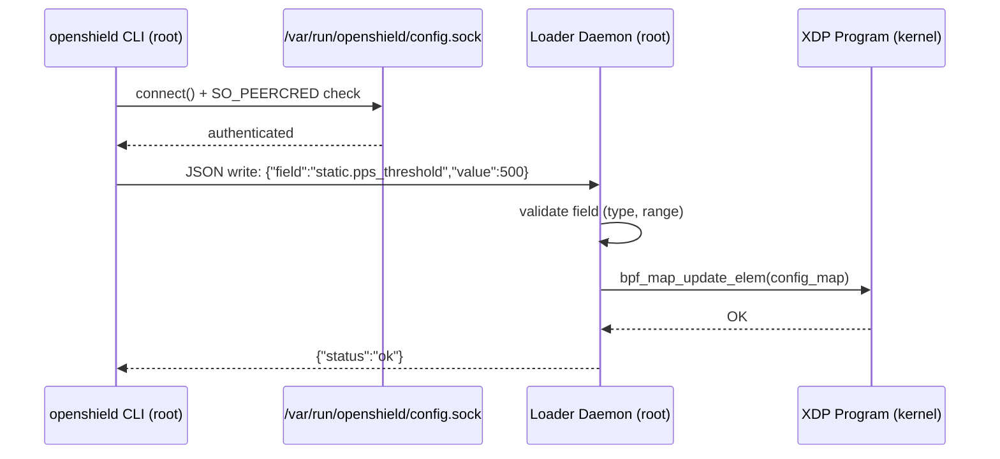

# Configuration Validation & Runtime Updates

## Config File Location

```
/etc/openshield/openshield.yaml
```

OpenShield-XDP reads its YAML configuration from this path on startup. An annotated example ships with the package:

```
/opt/openshield/share/openshield.example.yaml
```

Generate a fresh copy of the defaults:

```bash
openshield config
# Writes /etc/openshield/openshield.yaml with all default values
```

## YAML Validation Rules

The config file is validated using JSON-schema-like rules implemented in Go (`userspace/internal/config/metadata.go`). Each field has:

| Constraint | Description |
|------------|-------------|
| **Type check** | `int`, `float64`, `bool`, or `string` — strictly enforced |
| **Range / enum** | Most fields have min/max bounds (e.g., `pps_threshold` must be `1 – 10,000,000`) |
| **String enum** | `rate_limit_mode` must be `"threshold"` or `"token_bucket"`; `xdp_mode` must be `"auto"`, `"native"`, `"generic"`, or `"offload"` |
| **Array length** | `udp_amp_ports` and `udp_amp_payload_min` are capped at 8 entries; `mac_filter_entries` at 8 |

If validation fails, the loader exits with a descriptive error:

```
invalid config: static.pps_threshold must be 1-10000000 (got 0)
```

## Runtime Configuration Updates

OpenShield supports **live config changes** without restarting the XDP program via a Unix domain socket:

```
/var/run/openshield/config.sock
```

### Security Model

::: danger Root-Only Access
The Unix socket is protected by `SO_PEERCRED` — only the root user can connect. This is not a general-purpose API; it's the internal communication channel between `openshield` CLI commands and the running loader daemon.
:::



### Which Fields Require a Restart?

The config metadata system marks each field as **RuntimeSafe** or not.

**🔄 Runtime-safe fields** (updated instantly via socket):

- All `static.*` thresholds, scores, decays
- All `validation.*` booleans
- All `dynamic.*` detection toggles and thresholds
- `whitelist.enabled`
- `telemetry.event_rate_limit`, `top_offenders_count`, `log_level`, `snapshot_interval`
- `maps.bloom_filter_enabled`, `maps.bloom_filter_size`
- `alerter.*`

**🔒 Fields requiring `openshield fix && openshield load`:**

| Field | Reason |
|-------|--------|
| `interface` | Requires XDP reattach to new netdev |
| `xdp_mode` | Requires XDP reattach in new mode |
| `maps.ip_stats_max` | Requires map recreation (resize) |
| `maps.ban_max` | Requires map recreation |
| `maps.whitelist_max` | Requires map recreation |
| `maps.event_buffer_size` | Requires ring buffer recreation |
| `dynamic.baseline_window` | Affects baseline learner goroutine timing |
| `dynamic.baseline_update_interval` | Affects baseline learner goroutine timing |
| `dynamic.baseline_alpha` | Affects baseline learner calculation |
| `telemetry.poll_interval` | Affects collector goroutine timing |

## Config Generator

The `openshield config` command programmatically generates a config file with all defaults:

```bash
# Generate defaults (overwrites existing file)
openshield config

# Generate to a specific path
openshield config --output /tmp/my-config.yaml
```

It reads the `Defaults()` function from `userspace/internal/config/defaults.go` and serializes all fields with descriptive comments, ensuring the output always matches the latest config schema.

## Per-IP Whitelist Flags

When whitelisting an IP, the userspace loader stores a **flags byte** in the whitelist map controlling what checks are bypassed:

| Flag | Value | Effect |
|------|-------|--------|
| Full bypass | `0x00` | Skip **all** checks (packet passes immediately) |
| Skip ban | `0x01` | Skip ban and subnet ban lookups |
| Skip rate | `0x02` | Skip rate threshold and scoring |
| Skip validation | `0x04` | Skip private/bogon/bogus TCP checks |

Flags are bitwise-OR'd. For example, `0x03` skips both ban and rate checks.

## Empty-Map Fast Paths

To save lookup overhead when maps contain zero entries:

- **`whitelist_empty` flag**: Set to `1` in `config_map` when the whitelist map has 0 entries. The XDP program skips all whitelist lookups.
- **`bans_empty` flag**: Set to `1` when both `ban_map` and `subnet_ban_map` are empty.

Both flags are updated by the userspace loader after every config change (including runtime socket updates). This eliminates ~200-400ns of map lookup latency when these maps are unused.

## Related Pages

- [Configuration Reference](./reference) — Complete field reference with defaults
- [Alerter](./alerter) — Webhook alert configuration
- [Developer Guide](/openshield-xdp/developer-guide/overview) — Adding new config fields
