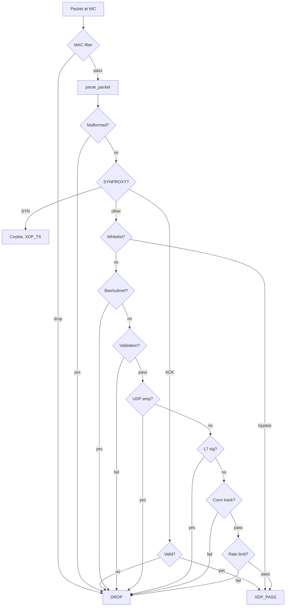

# Packet Processing Pipeline

Packets flow through 12 ordered stages. Order is by cost: cheapest checks run first.

| # | Stage | Cost | Action |
|---|-------|------|--------|
| 0 | MAC filter | ~10 ns | L2 blacklist/whitelist |
| 1 | Packet parse | ~60 ns | Eth, VLAN, IP, ext headers, TCP/UDP |
| 2 | SYNPROXY | ~200 ns | Cookie gen + verify |
| 3 | Panic breaker | ~5 ns | Per-CPU probabilistic drop |
| 4 | Whitelist | ~40 ns | Per-IP bypass flags |
| 5 | Ban / subnet | ~40 ns | Single IP + LPM trie |
| 6 | Validation | ~20 ns | Private/bogon, bogus TCP |
| 7 | UDP amp | ~100 ns | DNS + 8-port reflection |
| 8 | L7 signatures | ~200 ns | 16 pattern rules |
| 9 | Conn track | ~30 ns | Blind SYN-ACK/RST |
| 10 | Rate limit | ~50 ns | Scoring or token bucket |
| 11 | PASS | — | Packet reaches kernel |

## Related pages
[Architecture](/openshield-xdp/architecture/overview) · [Detection Methods](/openshield-xdp/detection-engine/methods)

