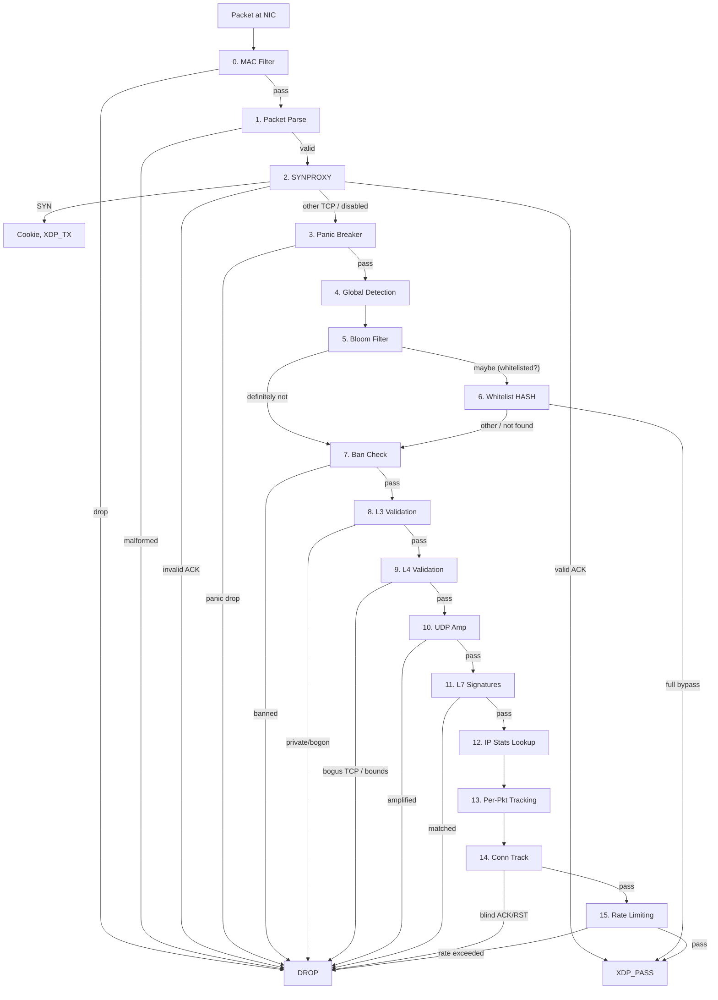

# Packet Processing Pipeline

Packets flow through 16 ordered stages. Order is by cost: cheapest checks run first. Each stage can be independently enabled/disabled via configuration. Five stages support **freplace hot-patching** — alternative implementations can be attached at runtime without unloading the XDP program (kernel ≥ 5.11, `CONFIG_DEBUG_INFO_BTF=y`).

## Stage table

| # | Stage | Cost | Action |
|---|-------|------|--------|
| 0 | MAC filter | ~10 ns | L2 allowlist/blocklist (8 MAC entries) |
| 1 | Packet parse | ~60 ns | Eth, VLAN (802.1Q/802.1ad/QinQ), IP, extension headers, TCP/UDP |
| 2 | SYNPROXY | ~200 ns | Cookie generation (SplitMix64), SYN-ACK rewrite, `XDP_TX` response |
| 3 | Panic circuit breaker | ~5 ns | Per-CPU probabilistic drop under PPS overload |
| 4 | Global detection | ~30 ns | Entropy spoofing (16 buckets) + SYN/FIN ratio, window-based |
| 5 | **Bloom filter** | ~15 ns | 3-hash probabilistic whitelist membership check, skips HASH lookup on miss |
| 6 | Whitelist HASH | ~40 ns | Per-IP bypass flags — full bypass exits pipeline immediately |
| 7 | Ban check | ~40 ns | Single-IP ban + LPM trie subnet ban (v4 + v6) |
| 8 | L3 validation | ~20 ns | IPv4 bogon (7 ranges) + IPv6 bogon (6 ranges) |
| 9 | L4 validation | ~15 ns | TCP flag validation (5 bogus combos) + L4 header bounds |
| 10 | UDP amplification | ~100 ns | DNS QR-bit check + 8-port configurable generic reflection |
| 11 | L7 signatures | ~200 ns | 16-slot pattern matching (port + proto + offset + mask) |
| 12 | IP stats lookup | ~50 ns | LRU_HASH lookup or create (100K entries, auto-eviction) |
| 13 | Per-pkt tracking | ~10 ns | TTL sampling, packet size sampling, entropy bucket increment |
| 14 | Connection tracking | ~30 ns | Blind SYN-ACK / blind RST detection, per-IP SYN timestamp |
| 15 | Rate limiting | ~50 ns | Threshold scoring (additive) or token bucket, ban insertion |

## Kernel feature gates

Some stages require specific kernel features:

| Stage | Requirement | Why |
|-------|-------------|-----|
| SYNPROXY | Kernel ≥ 5.15 | Bounded loops in BPF (`synproxy_timeout_sec` walk) |
| Bloom filter | Kernel ≥ 5.4 | BPF array map as Bloom filter words |
| freplace stages | Kernel ≥ 5.11 + `CONFIG_DEBUG_INFO_BTF=y` | BTF-based function replacement |
| Panic breaker | Kernel ≥ 5.3 | Per-CPU map support |
| LPM trie (subnet ban) | Kernel ≥ 4.20 | Longest-prefix-match map type |

## freplace stages

The following stages are `__attribute__((noinline))` BPF subprograms with BTF type info. A freplace program with `SEC("freplace/stage_<name>")` can replace them at runtime:

| Stage | freplace target | Default location |
|-------|----------------|------------------|
| Ban check | `stage_ban_check` | `openshield.bpf.c` |
| Rate limit | `stage_rate_limit` | `openshield.bpf.c` |
| Connection track | `stage_conn_track` | `openshield.bpf.c` |
| UDP amplification | `stage_amp_check` | `openshield.bpf.c` |
| L7 filter | `stage_l7_filter` | `openshield.bpf.c` |

A working example replacement for `stage_ban_check` is provided in `ebpf/modules/ban_check_freplace.c` — it adds ringbuf event emission on every ban hit while preserving the default drop behavior.

## Related pages

[Architecture](/openshield-xdp/architecture/overview) · [Detection Methods](/openshield-xdp/detection-engine/overview)
