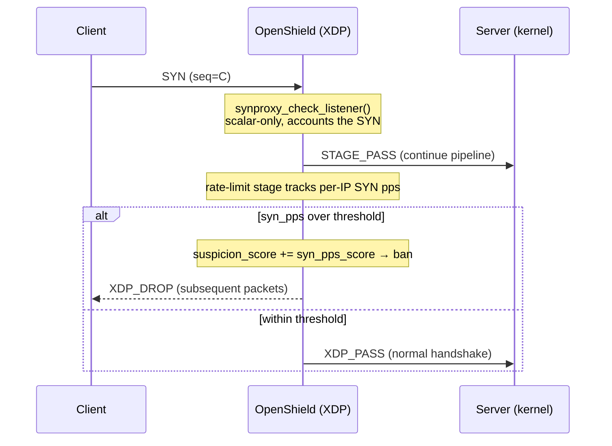

# SYNPROXY (scalar SYN gate)

Scalar, rate-based TCP SYN-flood mitigation that loads on **every** supported kernel (5.15 → latest) with zero user fixes.

::: tip Design note — why rate-based, not cookie-based
Earlier designs generated SYN cookies in XDP and bounced a SYN-ACK with `XDP_TX`. That approach needs packet rewriting, checksum recomputation, and (in richer variants) helpers like `bpf_sk_lookup_tcp` / `bpf_tcp_gen_syncookie` whose verifier behaviour differs across kernels — so it failed to load on some kernels without per-kernel patching. OpenShield instead delivers SYN-flood protection through a **scalar, non-terminal gate plus a per-IP SYN rate limiter**. It touches no packet bytes and calls no version-specific helpers, so it verifies identically everywhere.
:::

## What the gate does

The `OPENSHIELD_SYNPROXY` build flag compiles in `synproxy_check_listener()`, an `__always_inline` hook that runs early in the pipeline:

1. It looks **only** at scalar fields already extracted by `parse_packet` (`protocol`, `is_tcp_syn`) — no packet-pointer access.
2. For a pure TCP SYN it increments a profiling counter (`PROF_SYNPROXY_SYNACK`) and returns `STAGE_PASS`.
3. The baseline gate **never drops** — it is a cheap classification/accounting hook.

The actual mitigation happens downstream in the **rate-limiting stage**: each source IP's SYN rate is tracked, and a source exceeding `syn_pps_threshold` accrues `syn_pps_score` toward the suspicion threshold, after which it is banned like any other abuser.



## Why this is portable

| Property | Behaviour |
|----------|-----------|
| **Packet access** | None. Reads pre-parsed scalars only. |
| **Helpers** | None version-specific. No `bpf_sk_lookup_tcp`, no cookie crypto, no `XDP_TX`. |
| **Verifier** | Identical instruction shape on every kernel ≥ 5.15. |
| **Drops** | Baseline never drops in the gate; bans are issued by the rate limiter. |
| **IPv4 / IPv6** | Both — mitigation rides on `ip_stats_map` / `ip_stats_map_v6` SYN counters. |

## Extending it (opt-in, kernel ≥ 6.10)

The gate is deliberately a hook. On kernels ≥ 6.10, advanced users who build with `make FREPLACE=1` can hot-patch `synproxy_check_listener` via a freplace module to add richer listener verification (e.g. `bpf_sk_lookup_tcp` to confirm a real listening socket) **without** changing the portable baseline or risking load failures on other kernels. See [freplace](/openshield-xdp/architecture/freplace).

## Tuning

The relevant knobs live in the rate-based detection config, not in a cookie store:

| Key | Default | Meaning |
|-----|---------|---------|
| `synproxy_enabled` | `false` | Enables the scalar SYN gate (accounting + freplace hook). |
| `syn_pps_threshold` | `170` | Per-IP SYN packets/sec before scoring begins. |
| `syn_pps_score` | — | Suspicion score added per second a source is over the SYN threshold. |

```yaml
dynamic:
  synproxy_enabled: false     # scalar SYN gate (off by default)
static:
  syn_pps_threshold: 170      # per-IP SYN pps before scoring
  syn_pps_score: 50           # score added per violation
```

::: tip Defense in depth
For an additional, independent layer below XDP, enable the kernel's own SYN cookies:
`sysctl -w net.ipv4.tcp_syncookies=1`. This is the real Linux TCP-stack feature and complements the XDP rate-based gate.
:::

## Common problems

### "SYN floods still reaching the server"

Lower `syn_pps_threshold` toward your legitimate per-IP SYN rate, and ensure rate limiting is enabled. Confirm `xdp_mode` is `native` for line-rate processing. Enable kernel `tcp_syncookies` for defense in depth.

### "Legitimate clients getting banned during traffic spikes"

Raise `syn_pps_threshold` and/or lower `syn_pps_score` so transient bursts don't cross the suspicion threshold. Whitelist known high-volume sources.

## Related pages

[Detection Engine Overview](/openshield-xdp/detection-engine/overview) · [Rate-Based Detection](/openshield-xdp/detection-engine/rate-based) · [Mitigation Overview](/openshield-xdp/mitigation/overview)
