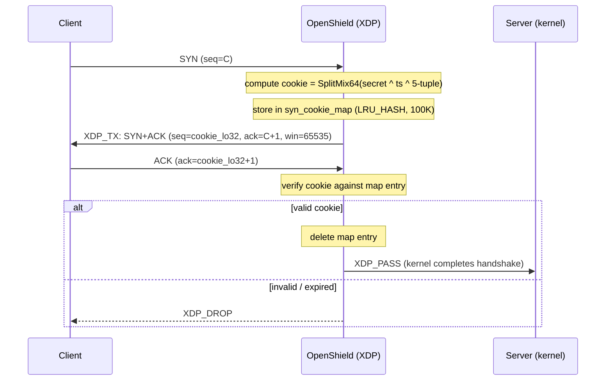

# SYNPROXY

Cookie-based TCP SYN flood mitigation at XDP line rate. When a TCP SYN arrives, OpenShield generates a cookie via a non-cryptographic hash, sends a SYN-ACK back to the client via `XDP_TX`, and only passes the connection to the kernel after the client returns a valid ACK with the cookie.

::: tip When to enable
Enable SYNPROXY when your server is under sustained TCP SYN floods that saturate connection tracking. Disabled by default — test against your traffic profile before enabling in production. Requires **kernel ≥ 5.15** for bounded loop support.
:::

## Packet flow



## Hash function: SplitMix64

OpenShield uses **SplitMix64**, a non-cryptographic 64-bit hash with excellent avalanche properties:

```c
static __always_inline u64 splitmix64(u64 x) {
    x = (x ^ (x >> 30)) * 0xBF58476D1CE4E5B9ULL;
    x = (x ^ (x >> 27)) * 0x94D049BB133111EBULL;
    x = x ^ (x >> 31);
    return x;
}
```

- **Constant-time**: 3 XOR, 3 multiply/shift — ~30 BPF instructions
- **Branchless**: no conditional execution, verifier-friendly
- **Non-cryptographic**: not resistant to intentional cookie forging. An attacker on the same network path could theoretically forge cookies by reading the SYN-ACK sequence number field.

::: warning Honest assessment
SplitMix64 is **not cryptographically secure**. A network-adjacent attacker who can observe SYN-ACK packets can extract the cookie and forge valid ACKs. For production deployments where this threat model is relevant, consider the SYNPROXY as a volumetric filter (it still forces the attacker to complete a full 3-way handshake, doubling the cost of a SYN flood) rather than a cryptographic authentication mechanism.
:::

## Cookie structure

The 64-bit cookie is the concatenation of a timestamp and a hash:

```
cookie = ((u64)timestamp_sec << 32) | (hash & 0xFFFFFFFF)
```

| Field | Size | Purpose |
|-------|------|---------|
| `timestamp_sec` (hi32) | 32 bits | Epoch second when the cookie was generated. Stored in map entry for expiry checks. |
| `hash` (lo32) | 32 bits | Lower 32 bits of `SplitMix64(secret ^ ts_sec ^ saddr ^ daddr ^ sport ^ dport)`. Sent in the SYN-ACK `seq` field. |

On the wire, the client sees only the `hash` (lo32) in the SYN-ACK sequence number. The timestamp is recovered from the `syn_cookie_map` entry during ACK verification.

## Cookie generation

```c
u64 h = secret;
h ^= ((u64)ts_sec << 32) | (u64)saddr;
h ^= ((u64)daddr << 16) | (u64)sport;
h ^= (u64)dport;
h = splitmix64(h);
return (((u64)ts_sec) << 32) | (h & 0xFFFFFFFFULL);
```

5-tuple hashed: `(saddr, daddr, sport, dport, ts_sec)` with the secret mixed in.

## ACK verification: two paths

### Fast path (map hit)

1. Extract `cookie_lo32 = ack_seq - 1` from the ACK
2. Look up the 5-tuple `(saddr, daddr, sport, dport)` in `syn_cookie_map`
3. Compare stored expiry against `now`
4. Recompute expected cookie using the stored timestamp (hi32 of stored cookie)
5. Compare expected `lo32` against extracted `cookie_lo32`
6. Match → `XDP_PASS` and delete map entry
7. Mismatch → `XDP_DROP`

### Slow path (recomputation fallback)

If the map entry was evicted (LRU) or expired, walk back over the timeout window recomputing the cookie for each possible timestamp:

```c
u32 timeout = cfg->synproxy_timeout_sec;
if (timeout > 10) timeout = 10;  // Cap 10 iterations for verifier
for (u32 i = 0; i < timeout; i++) {
    u32 ts = (u32)(now_sec - i);
    u64 expected = synproxy_gen_cookie(saddr, daddr, sport, dport,
                                        secret, ts);
    if ((u32)expected == cookie_lo32)
        return XDP_PASS;
}
```

- Bounded loop (≤10 iterations), verifier-safe on kernel ≥ 5.15
- Cap of 10 seconds regardless of config value (protects BPF verifier complexity)

## Rewrite details (SYN → SYN-ACK)

When a SYN arrives and SYNPROXY is enabled:

1. **MAC**: Swap source and destination (byte-by-byte, 6 swaps)
2. **IP**: Swap addresses, set TTL=64, recompute checksum
3. **TCP**: Swap ports, set `seq = cookie_lo32`, set `ack_seq = client_seq + 1`, set flags `SYN|ACK`, set window=65535, recompute checksum (over actual `doff` bytes including options)
4. Return `XDP_TX`

## IPv6: not supported

```c
if (info->is_ipv6)
    return 0; /* IPv6: skip SYNPROXY, continue normal pipeline */
```

IPv6 SYN floods **bypass SYNPROXY entirely**. The return value `0` tells the caller to continue normal pipeline processing. IPv6 traffic is not dropped — it falls through to standard rate-based detection. This is because IPv6 header layout differs significantly (swap semantics are different, extension headers complicate parsing), and the rewrite code is IPv4-specific.

::: danger IPv6 SYN floods are not mitigated by SYNPROXY
If you need IPv6 SYN flood protection, ensure rate-based detection (SYN threshold: 170) and connection rate limiting are enabled for IPv6 paths. The `ip_stats_map_v6` and `ban_map_v6` cover IPv6 SYN floods through threshold scoring.
:::

## Secret management

- **Storage**: `synproxy_secret` is a `u64` in the `config` struct (in `config_map`)
- **Generation**: The userspace loader generates a new secret from `crypto/rand` at startup if no secret is configured
- **Rotation**: To rotate secrets, update the config and reload. Old cookies become invalid immediately (no grace period)
- **Zero-check**: If `synproxy_secret == 0`, SYNPROXY is effectively disabled (even if `synproxy_enabled` is on)

## Known limitations

| Limitation | Detail |
|-----------|--------|
| **No SYN reinjection** | After a valid ACK passes, OpenShield calls `XDP_PASS` — the kernel sees the ACK but **not the original SYN**. The kernel's TCP stack must reconstruct the connection from the ACK alone. Some kernel versions handle this correctly (they enter `TCP_SYN_RECV` from a valid ACK with correct sequence numbers); others may RST. Test against your kernel version. |
| **IPv4 only** | IPv6 SYN floods bypass SYNPROXY entirely. |
| **No TCP options in SYN-ACK** | MSS, window scaling, SACK, and timestamps from the original SYN are not reflected in the SYN-ACK. The kernel re-sends the original SYN with all options after cookie verification passes. |
| **Non-cryptographic hash** | SplitMix64 is fast but not collision-resistant. Network-adjacent attackers can forge cookies by observation. |
| **No connection-rate limiting within SYNPROXY** | SYNPROXY itself does not limit SYN rate. An attacker sending valid ACKs can still open arbitrary numbers of connections (use `conn_rate_enabled` + `conn_rate_limit` alongside SYNPROXY). |
| **Secret rotation is instant** | No grace period for in-flight connections when the secret changes. All pending SYNPROXY connections are invalidated. |

## Configuration

```yaml
dynamic:
  synproxy_enabled: false              # Master switch (default: off)
  synproxy_secret: ""                  # Hex string or empty (auto-generated from crypto/rand)
  synproxy_timeout_sec: 10            # Cookie validity in seconds (capped at 10 for verifier)
```

## Common problems

### "SYNPROXY enabled but SYN floods still hitting the server"

Check that `xdp_mode` is `native` (not `generic`). Generic/SKB mode may not support `XDP_TX`.

### "Legitimate connections failing after enabling SYNPROXY"

Increase `synproxy_timeout_sec` if clients are on high-latency links (capped at 10). Verify kernel version ≥ 5.15. If the kernel RSTs connections after SYNPROXY passes the ACK, your kernel may not support connection reconstruction from bare ACK — this is the "no SYN reinjection" known issue.

### "IPv6 SYN floods not blocked"

IPv6 is intentionally not supported by SYNPROXY. Use rate-based detection for IPv6 SYN flood mitigation.

## Related pages

[Detection Engine Overview](/openshield-xdp/detection-engine/overview) · [Rate-Based Detection](/openshield-xdp/detection-engine/rate-based) · [Mitigation Overview](/openshield-xdp/mitigation/overview)
