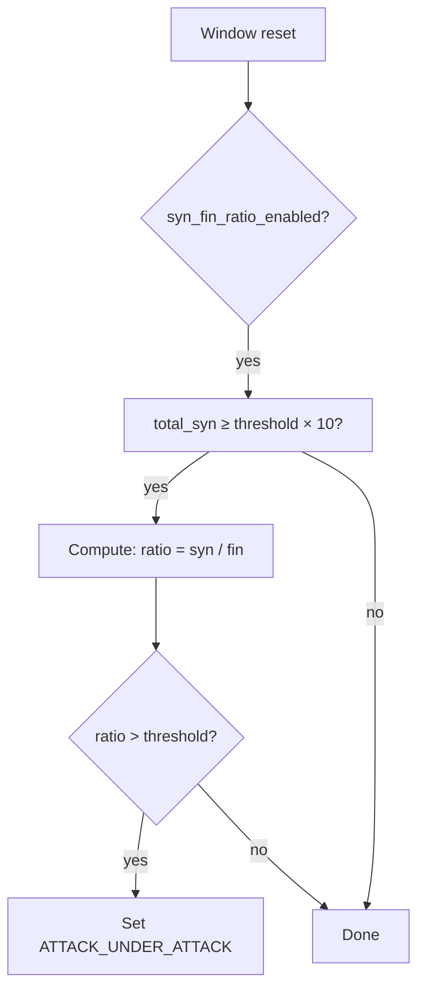

# Statistical Detection

OpenShield's statistical detection analyzes **aggregate traffic patterns** to identify attacks that evade per-IP rate limits. These checks are global (not per-IP) and run on window reset.

## Detection vectors

| Vector | Scope | Trigger | Config field |
|--------|-------|---------|--------------|
| SYN/FIN ratio | Global | SYN:FIN ratio exceeds threshold | `syn_fin_ratio_enabled` / `syn_fin_ratio_threshold` |
| Entropy spoofing | Global | Distinct source IP hash buckets exceed threshold | `entropy_spoof_enabled` / `entropy_spoof_threshold` |
| TTL anomaly | Per-IP | Average TTL deviates from expected | `ttl_anomaly_enabled` |
| Packet size anomaly | Per-IP | Avg packet size too small or too large | `pkt_anomaly_enabled` |
| Connection rate | Per-IP | SYN/s exceeds separate connection rate limit | `conn_rate_enabled` / `conn_rate_limit` |

## SYN/FIN ratio analysis



Normal TCP traffic maintains a balanced SYN:FIN ratio (each connection starts with a SYN and ends with a FIN). During a SYN flood, SYNs dominate:

```c
u64 syn = g->total_syn_packets;    // Cumulative SYN count
u64 fin = g->fin_total;            // Cumulative FIN count

if (syn > (u64)cfg->syn_fin_ratio_threshold * 10) {
    u64 ratio = fin == 0 ? syn : syn / fin;
    if (ratio > (u64)cfg->syn_fin_ratio_threshold) {
        // Set attack state
        bl->attack_state = ATTACK_UNDER_ATTACK;
        bl->attack_type  = ATTACK_MIXED;
        bl->attack_start = now;
    }
}
```

Minimum SYN threshold (`threshold × 10`) prevents false positives during low-traffic periods. Default threshold: **100** (100× more SYNs than FINs = flood).

## Entropy spoofing detection

Detects **source IP spoofing** by measuring the entropy (diversity) of source IPs:

```c
// Hash each source IP into one of 16 buckets
u32 hash = (src_ip * 0x9E3779B9) >> 28;  // 0-15
g->entropy_buckets[hash]++;

// On window reset: count distinct buckets with hits
u32 distinct = 0;
for (u32 i = 0; i < 16; i++) {
    if (g->entropy_buckets[i] > 0)
        distinct++;
}

if (distinct >= cfg->entropy_spoof_threshold) {
    bl->attack_state = ATTACK_UNDER_ATTACK;
    bl->attack_type  = ATTACK_MIXED;
}
```

### How it works

| Scenario | Distinct buckets | Interpretation |
|----------|-----------------|----------------|
| Normal traffic | 2–8 | Real clients hit the same few IPs repeatedly |
| SYN flood with spoofing | 12–16 | Random source IPs spread across all buckets |
| DDoS from many real bots | 8–12 | Many real IPs but each in different buckets |

Default threshold: **>12 of 16 buckets populated** = spoofing detected.

### Hash function

```c
hash = (src_ip * 0x9E3779B9) >> 28
```

- `0x9E3779B9`: Golden ratio constant, good distribution across 16 buckets
- `>> 28`: Extract top 4 bits (0–15)
- IPv6: XOR-folds `src_ip6_hi ^ src_ip6_lo` before hashing

## TTL anomaly detection

Detects **packet source spoofing** by comparing the TTL of incoming packets against the expected TTL for the claimed source:

```c
u32 avg_ttl = stats->ttl_sum / stats->ttl_samples;
u8  expected = cfg->ttl_expected;   // Default: 64 (Linux)
u8  tolerance = cfg->ttl_tolerance; // Default: 5

u32 deviation = abs(avg_ttl - expected);
if (deviation > tolerance) {
    stats->suspicion_score += cfg->pps_score;  // +20
}
```

| Expected TTL | Source | Typical use |
|-------------|--------|-------------|
| 64 | Linux/Android servers | Default for most deployments |
| 128 | Windows | Windows server deployments |
| 255 | Network equipment | Router/switch infrastructure |
| 60 | Some embedded devices | IoT deployments |

TTL is sampled per-packet and averaged per window. The average is compared against `ttl_expected ± ttl_tolerance`. TTL = 0 packets (forged or corrupt) are excluded from sampling.

## Packet size anomaly

Detects two types of packet size anomalies:

### Empty floods (too small)

```c
if (avg_pkt_size <= cfg->pkt_size_min_threshold) {  // Default: 64
    stats->suspicion_score += cfg->pps_score;
}
```

Detects floods of minimum-size packets (SYN floods, empty UDP floods). Normal traffic averages 200–1400 bytes. A stream of all 64-byte packets is suspicious.

### Amplification floods (too large)

```c
if (avg_pkt_size > cfg->pkt_size_max_threshold) {   // Default: 1024
    stats->suspicion_score += cfg->pps_score;
}
```

Detects large-packet floods (DNS amplification, NTP amplification). Packets consistently >1KB are unusual for most protocols.

### Per-packet tracking

```c
stats->pkt_size_sum     += info->pkt_len;
stats->pkt_size_samples++;
if (pkt_len < stats->pkt_size_min || stats->pkt_size_min == 0)
    stats->pkt_size_min = pkt_len;
if (pkt_len > stats->pkt_size_max)
    stats->pkt_size_max = pkt_len;
```

Sum and samples reset each window. Min/max are informational (not used in current scoring).

## Connection rate anomaly

Separate from per-IP PPS thresholding, connection rate limits the **SYN rate specifically**:

```c
if (cfg->conn_rate_enabled && cfg->conn_rate_limit > 0 &&
    stats->syn_pps > cfg->conn_rate_limit) {   // Default: 5000 SYN/s
    stats->suspicion_score += cfg->pps_score;
}
```

This catches SYN floods that stay below the general PPS threshold but have an unusually high SYN proportion. Default limit: **5,000 SYN/s** per IP.

## Global detection combining

The `check_global_detection` function combines entropy spoofing and SYN/FIN ratio into a unified attack state:

```c
if (entropy_detected || syn_fin_ratio_detected) {
    bl->attack_state = ATTACK_UNDER_ATTACK;
    bl->attack_type  = ATTACK_MIXED;
    bl->attack_start = now;
}
```

When `ATTACK_UNDER_ATTACK` is set:
- All per-IP rate thresholds are multiplied by `attack_threshold_multiplier_percent` (default 50%)
- Thresholds return to normal when the attack subsides (userspace-managed recovery)

The attack state is NOT set by per-IP checks (TTL, packet size, connection rate) — those only add to individual `suspicion_score`. Global checks set attack state because they indicate a widespread, coordinated attack rather than individual misbehaving IPs.

## Configuration

```yaml
dynamic:
  syn_fin_ratio_enabled: true
  syn_fin_ratio_threshold: 100          # Max SYN:FIN ratio

  entropy_spoof_enabled: true
  entropy_spoof_threshold: 12           # Distinct buckets threshold (of 16)

  ttl_anomaly_enabled: true
  ttl_expected: 64                      # Expected TTL
  ttl_tolerance: 5                      # Allowed deviation

  pkt_anomaly_enabled: true
  pkt_size_min_threshold: 64            # Flag if avg < 64 bytes
  pkt_size_max_threshold: 1024          # Flag if avg > 1024 bytes

  conn_rate_enabled: true
  conn_rate_limit: 5000                 # Max SYN/s per IP

  attack_threshold_multiplier: 0.5      # 50% thresholds during attack
```

## Related pages

[Rate-Based Detection](/openshield-xdp/detection-engine/rate-based) · [Detection Pipeline](/openshield-xdp/detection-engine/pipeline) · [Mitigation Overview](/openshield-xdp/mitigation/overview)
