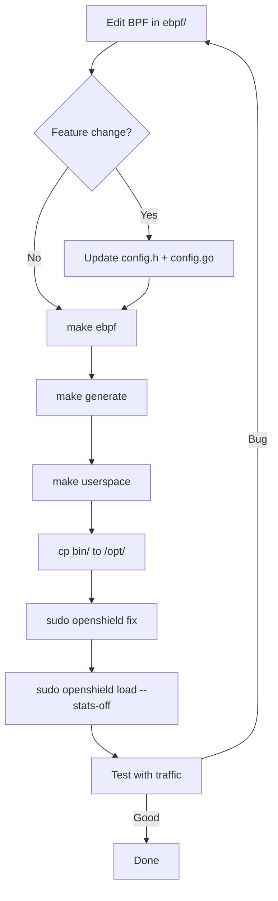

# Development Environment Setup

This guide covers setting up a development environment for building and modifying OpenShield-XDP from source.

## Prerequisites

### Required Tools

| Tool | Version | Purpose | Installation |
|------|---------|---------|-------------|
| **clang** | ≥ 14 | BPF C compiler | `apt install clang` or `dnf install clang` |
| **llvm-strip** | ≥ 14 | Strip ELF sections from BPF objects | Bundled with clang |
| **bpftool** | ≥ 5.15 | BPF program inspection, map management, BTF dumping | `apt install linux-tools-$(uname -r)` or build from [kernel source](https://github.com/torvalds/linux/tree/master/tools/bpf/bpftool) |
| **Go** | ≥ 1.22 | Userspace binaries | [go.dev/dl](https://go.dev/dl/) |
| **bpf2go** | latest | Generate Go BPF bindings | `go install github.com/cilium/ebpf/cmd/bpf2go@latest` |
| **libbpf** | ≥ 1.0 | BPF loader library (C side, for bpftool) | `apt install libbpf-dev` |

### Kernel Requirements

- Linux kernel **≥ 5.15** (minimum for XDP generic)
- `CONFIG_DEBUG_INFO_BTF=y` (required for BTF-based CO-RE, freplace, and `vmlinux.h` generation)
- `CONFIG_XDP_SOCKETS=y`
- Headers matching your kernel: `apt install linux-headers-$(uname -r)`

Check your kernel supports XDP:

```bash
# Verify BTF is available
ls /sys/kernel/btf/vmlinux

# Check XDP support
ip link show | grep xdp
```

## Cloning the Repository

```bash
git clone https://github.com/AnAverageBeing/OpenShield-XDP.git
cd OpenShield-XDP
```

## Building from Source

### First-Time Build

```bash
# Step 1: Generate vmlinux.h from your kernel's BTF (once, or after kernel upgrade)
make vmlinux

# Step 2: Full build (BPF + bpf2go bindings + Go binaries)
make all
```

This produces:

```
bin/
├── openshield-loader      # Long-running daemon
├── openshield-tui          # Terminal UI
├── openshield-config       # Config generator
├── openshield-installer    # One-shot installer
└── openshield              # Unified CLI
```

### Incremental Builds

After editing BPF code:

```bash
make ebpf && make generate && make userspace
```

After editing Go code only:

```bash
make userspace
```

### Build with Feature Flags

Feature flags are auto-detected from your running kernel. To override:

```bash
# Force all features on (requires kernel ≥ 6.10)
BPF_FEATURES="-DOPENSHIELD_L7_MULTISLOT -DOPENSHIELD_GLOBAL_DETECT -DOPENSHIELD_ENTROPY -DOPENSHIELD_SYNPROXY" make all

# Minimum build (no optional features)
BPF_FEATURES="" make all
```

## Installing for Development

```bash
# Install to /opt/openshield
sudo make install

# Verify installation
ls /opt/openshield/bin/
cat /etc/openshield/openshield.example.yaml
```

## Running Locally for Development

### Quick Test (non-persistent)

```bash
# Generate default config
sudo openshield config

# Edit config for your interface
sudo vim /etc/openshield/openshield.yaml
# Set: interface: "lo"  (or your test interface)

# Fix any stale BPF attachments
sudo openshield fix

# Load the XDP program (non-daemon mode, stats on)
sudo ./bin/openshield-loader --config /etc/openshield/openshield.yaml --stats-on
```

### Running as a Daemon

```bash
# Copy binaries
sudo cp bin/openshield-* /opt/openshield/bin/

# Enable and start
sudo systemctl enable openshield-loader
sudo systemctl start openshield-loader

# Check status
sudo openshield status
```

### Unloading

```bash
sudo openshield fix        # Detaches XDP, unpins maps
# Or manually:
sudo bpftool net detach xdp dev <interface>
```

## Development Workflow



## Useful Debugging Commands

```bash
# List all BPF programs on the system
sudo bpftool prog list

# Show specific program info
sudo bpftool prog show id <id> --pretty

# Dump BTF types from BPF object
bpftool btf dump file ebpf/openshield.bpf.o | less

# Inspect BPF maps
sudo bpftool map list
sudo bpftool map dump id <id>

# Dump config_map (map #1 usually)
sudo bpftool map dump name config_map

# View verifier log (if program fails to load)
sudo bpftool prog load ebpf/openshield.bpf.o /sys/fs/bpf/test type xdp 2>&1 | less

# Kernel trace for BPF events
sudo bpftrace -e 'tracepoint:xdp:* { printf("XDP event on %s\n", str(args->dev_name)); }'
```

## Linting and Code Quality

```bash
# Go vet (static analysis)
cd userspace
go vet ./...

# Go formatting check
gofmt -l .

# BPF code check
clang --analyze -target bpf -Iebpf -Iebpf/headers ebpf/openshield.bpf.c
```

## Running Tests

```bash
# Go unit tests
make test

# Verifier load check
bpftool prog load ebpf/openshield.bpf.o /sys/fs/bpf/test_verify type xdp
rm -f /sys/fs/bpf/test_verify
```

::: warning Note
There are currently no `_test.go` files or BPF selftests in the repository. This is a known gap. Contributions of tests are welcome.
:::

## Related Pages

- [Developer Guide Overview](/openshield-xdp/developer-guide/overview) — Architecture and codebase walkthrough
- [BPF Development Patterns](/openshield-xdp/development/bpf-patterns) — Common patterns in the codebase
- [Adding a Detection Module](/openshield-xdp/development/adding-module) — Step-by-step module creation
