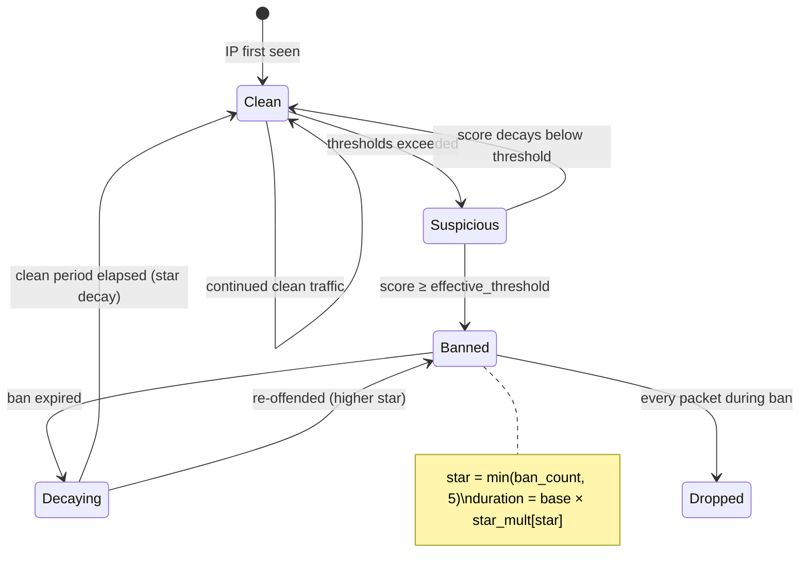

# Ban System

When an IP's suspicion score reaches the effective threshold, a ban entry is inserted into an LRU_HASH map. Ban entries are checked on **every packet** against every source IP, making them the primary mitigation mechanism after rate-based detection triggers.

## Ban lifecycle



## Ban lifecycle detail

```
Suspicion ≥ threshold → insert ban_entry{expiry, reason, score}
                      → increment ban_count (repeat offender tracking)
                      → increment prefix_ban_map counter (/24 or /64)
                      → if prefix counter ≥ escalation_threshold → insert subnet ban
                      → set bans_empty = 0 (re-enable ban lookups)
                      → emit event via ring buffer (rate-limited)
                      → userspace webhook (if configured)

Ban checks (every packet):
  Single IP → ban_map lookup → if entry found and expiry > now → DROP
  Subnet    → LPM trie lookup → longest prefix match → if matched → DROP

Ban expiry (userspace every 5s):
  ban_manager iterates ban maps → deletes entries where expiry ≤ now
                                  → decays star level if clean period elapsed
```

## Ban maps

| Map | Type | Key → Value | Max entries | Memory |
|-----|------|-------------|-------------|--------|
| `ban_map` | LRU_HASH | `u32(ipv4) → ban_entry` | 50,000 | ~2.8 MB |
| `ban_map_v6` | LRU_HASH | `ip6_key → ban_entry` | 50,000 | ~2.8 MB |
| `subnet_ban_map` | LPM_TRIE | `lpm_v4_key → subnet_ban_entry` | 1,024 | ~20 KB |
| `subnet_ban_map_v6` | LPM_TRIE | `lpm_v6_key → subnet_ban_entry` | 512 | ~14 KB |
| `prefix_ban_map` | LRU_HASH | `u32(/24 prefix) → u32(count)` | 1,024 | ~24 KB |
| `prefix_ban_map_v6` | LRU_HASH | `ip6_key(/64 prefix) → u32(count)` | 512 | ~12 KB |

::: info LRU_HASH auto-eviction
Ban maps use **LRU_HASH** (not HASH), meaning if the 50K limit is hit, the least-recently-used entry is evicted. This handles spoofed-source floods where millions of unique IPs might be banned. Ban entries are LRU-ordered by lookup time — actively attacking IPs are constantly looked up and stay "hot"; stale entries are naturally evicted.
:::

## Ban entry structure

```c
struct ban_entry {
    u64 expiry;     // Nanosecond timestamp when ban expires
    u32 reason;     // BAN_REASON_* code (1-13)
    u32 score;      // Suspicion score at time of ban
};  // 16 bytes
```

## Ban reason codes

| Code | Constant | Trigger | Severity |
|------|----------|---------|----------|
| 1 | `BAN_REASON_PPS` | PPS threshold exceeded | Medium |
| 2 | `BAN_REASON_BPS` | BPS threshold exceeded | Medium |
| 3 | `BAN_REASON_TCP_PPS` | TCP PPS exceeded | Medium |
| 4 | `BAN_REASON_UDP_PPS` | UDP PPS exceeded | Medium |
| 5 | `BAN_REASON_ICMP_PPS` | ICMP PPS exceeded | High |
| 6 | `BAN_REASON_SYN_PPS` | SYN PPS exceeded | High |
| 7 | `BAN_REASON_NEW_SOURCE` | New source flood | High |
| 8 | `BAN_REASON_BOGUS_TCP` | Bogus TCP flags | Critical |
| 9 | `BAN_REASON_CONN_RATE` | Connection rate limit | Medium |
| 10 | `BAN_REASON_TTL_ANOMALY` | TTL anomaly | Low |
| 11 | `BAN_REASON_PKT_ANOMALY` | Packet size anomaly | Low |
| 12 | `BAN_REASON_ENTROPY` | Entropy spoofing | High |
| 13 | `BAN_REASON_SYN_FIN` | SYN/FIN ratio | Medium |

The primary reason is determined by highest-weighted violation priority: SYN > ICMP > UDP > TCP > BPS > PPS. The reason code is stored in the ban entry and emitted in ban events.

## Star system: repeat offender escalation

```c
// Determine star level from ban_count
u32 star = stats->ban_count;
if (star > 5) star = 5;

// Apply star duration multiplier
u64 dur = SEC_TO_NS(cfg->ban_duration_sec);
u32 mul = cfg->star_duration_mul[star];
if (mul > 0) dur *= mul;
```

| Star | `ban_count` | Duration multiplier | Effective ban (base 1h) |
|------|-------------|---------------------|--------------------------|
| 0 | 0 (first offense) | ×1 | 1 hour |
| 1 | 1 | ×2 | 2 hours |
| 2 | 2 | ×4 | 4 hours |
| 3 | 3 | ×8 | 8 hours |
| 4 | 4 | ×16 | 16 hours |
| 5 | 5+ (max) | ×32 | 32 hours |

### Star decay mechanism

Stars decay by 1 level after a clean period. The decay period **doubles** for each star level:

```
decay_period = star_decay_seconds * star_level
clean_required = decay_period after ban expiry
```

| Star level | Clean period needed | Base config |
|------------|---------------------|-------------|
| 1 | 1 hour | `star_decay_seconds = 3600` |
| 2 | 2 hours | |
| 3 | 3 hours | |
| 4 | 4 hours | |
| 5 | 5 hours | |

::: tip Star decay is userspace-managed
Star decay is handled by the userspace ban manager (`internal/ban/`), which iterates ban maps every 5 seconds. The kernel only tracks `ban_count` in `ip_stats` — it does not decay it. When userspace detects that `now - ban_expiry > clean_period`, it decrements `ban_count` by 1 via map update.
:::

## Autonomous subnet escalation

### IPv4 /24 auto-escalation

When `auto_escalation_enabled: true`, each single-IP ban in a /24 prefix increments a `prefix_ban_map` counter. When the counter reaches `auto_escalation_threshold` (default 5), a **/24 subnet ban** is automatically inserted into `subnet_ban_map` with `duration = ban_duration * 2`.

```c
u32 network = ntohl(src_ip) & 0xFFFFFF00;  // /24 prefix in host order
u32 *cnt = bpf_map_lookup_elem(&prefix_ban_map, &network);
u32 count = cnt ? *cnt + 1 : 1;
if (count >= cfg->auto_escalation_threshold) {
    // Insert LPM trie entry with prefixlen=24
    struct lpm_v4_key lpm = { .prefixlen = 24, .ip = htonl(network) };
    struct subnet_ban_entry sbe = {
        .expiry = now + SEC_TO_NS(cfg->ban_duration_sec * 2),
        .reason = BAN_REASON_PPS,
    };
    bpf_map_update_elem(&subnet_ban_map, &lpm, &sbe, BPF_ANY);
    bpf_map_delete_elem(&prefix_ban_map, &network);  // Reset counter
}
```

### IPv6 /64 auto-escalation

Same logic for IPv6: the `/64` prefix (low 64 bits zeroed) is used as the key. When a /64 prefix reaches `auto_escalation_threshold` bans, a `/64` subnet ban is inserted into `subnet_ban_map_v6`.

## Effective threshold (repeat offender formula)

```
effective_threshold = suspicion_threshold * 2 / (2 + ban_count)
floor = 10
```

Implemented in `static_mitigation.c`:

```c
u32 effective_threshold = cfg->suspicion_threshold;
if (stats->ban_count > 0) {
    u32 denom = 2 + stats->ban_count;
    effective_threshold = (cfg->suspicion_threshold * 2) / denom;
    if (effective_threshold < 10)
        effective_threshold = 10;
}
```

| `ban_count` | Effective threshold (default 100) |
|-------------|-----------------------------------|
| 0 | 100 |
| 1 | 66 |
| 2 | 50 |
| 3 | 40 |
| 5 | 28 |
| 10+ | 10 (floor) |

## Persistence

- **Ban maps are pinned** (`/sys/fs/bpf/openshield/ban`, etc.) — they survive across loader restarts
- **IP statistics are cleared** on every loader restart (to avoid polluted state)
- **Ban entries persist indefinitely** until expired or evicted by LRU
- **Subnet bans persist** across restarts

## Configuration

```yaml
static:
  ban_duration: 3600                    # Base ban duration in seconds
  star_duration_multiplicators: [1, 2, 4, 8, 16, 32]
  star_decay_seconds: 3600              # Per-star-level clean period
  subnet_ban_duration: 7200             # Subnet ban duration (2× base)

dynamic:
  auto_escalation_enabled: true
  auto_escalation_threshold: 5          # Max single-IP bans per prefix

maps:
  ban_max: 50000                        # Max single-IP ban entries
```

## Related pages

[Rate Limiting](/openshield-xdp/mitigation/rate-limiting) · [Whitelist](/openshield-xdp/mitigation/whitelist) · [Rate-Based Detection](/openshield-xdp/detection-engine/rate-based)
