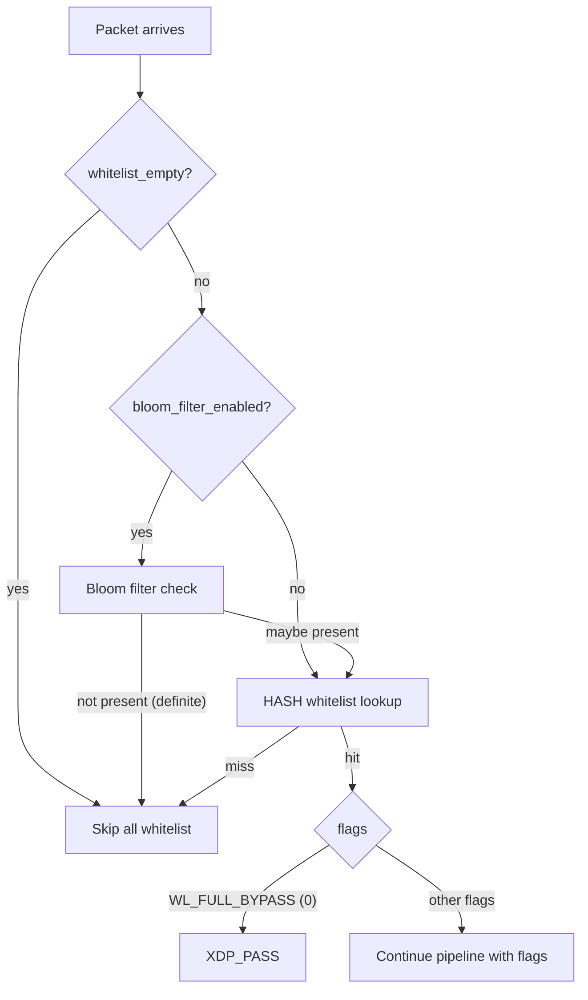

# Whitelist System

OpenShield's whitelist provides **granular per-IP bypass** of specific mitigation stages, with **Bloom filter acceleration** to minimize overhead on the common (non-whitelisted) path.

## Whitelist flags

Each whitelisted IP is assigned a 32-bit flags word. Multiple flags can be combined:

| Flag | Value | Mnemonic | Effect |
|------|-------|----------|--------|
| `WL_FULL_BYPASS` | `0x0000` | Full bypass | Skip **all** checks. Immediate `XDP_PASS` on whitelist hit. |
| `WL_SKIP_BAN` | `0x0001` | Skip ban | Skip single-IP ban + subnet ban lookup |
| `WL_SKIP_RATE` | `0x0002` | Skip rate | Skip rate threshold checks (both threshold scoring and token bucket) |
| `WL_SKIP_VALIDATION` | `0x0004` | Skip validation | Skip L3 validation (private/bogon) + L4 validation (bogus TCP, bounds) |

::: warning FULL_BYPASS = 0x0000
`WL_FULL_BYPASS` is `0x0000`, which is also the zero value. This means a newly inserted whitelist entry defaults to full bypass. To use granular flags, explicitly set a non-zero flag value. The kernel treats `wl_flags == WL_FULL_BYPASS` as an immediate `XDP_PASS` — no further checks are performed.
:::

## Whitelist maps

| Map | Type | Key → Value | Max entries | Memory |
|-----|------|-------------|-------------|--------|
| `whitelist_map` | HASH | `u32(ipv4) → u32(flags)` | 10,000 | ~410 KB |
| `whitelist_map_v6` | HASH | `ip6_key → u32(flags)` | 10,000 | ~410 KB |

::: info HASH, not LRU
Whitelist maps use `BPF_MAP_TYPE_HASH` (not LRU_HASH). Whitelist entries **must never be evicted**. They are written by userspace at startup and on config reload, and read by the kernel on every packet.
:::

## Bloom filter acceleration

A Bloom filter (3 hash functions, 150K u64 entries = 1.2 MB, ~1% FPR at 1M entries) is checked **before** the HASH whitelist lookup:



### Bloom filter properties

| Property | Value |
|----------|-------|
| Hash function | SplitMix64-derived (3 hashes from 1 seed) |
| Hash count (k) | 3 |
| Bits per entry | 64 |
| Total entries | 150,000 |
| Total memory | 1.2 MB |
| False positive rate | ~1% at 1M IPs |
| False negatives | None (guaranteed) |
| Per-check latency | ~15 ns |

If the Bloom filter says "definitely not present", the HASH whitelist lookup is skipped, saving ~60–100ns per packet. If the Bloom filter says "maybe present" (false positive), the HASH lookup is performed — whitelist correctness is preserved. Bloom is purely a fast-path optimization.

### IPv6 Bloom support

IPv6 addresses are XOR-folded from 128 bits to 32 bits before Bloom hashing:

```c
u32 ip32 = (u32)(key->hi ^ key->lo);
// Then hash ip32 with 3 SplitMix64-derived functions
```

This is a lossy fold — different IPv6 addresses may collide in the Bloom filter (increasing FPR). In practice this is acceptable because the Bloom is only a fast-path check; the authoritative HASH lookup always follows on a Bloom "maybe".

## Empty-map fast path

The `whitelist_empty` config flag skips all whitelist lookups when the map has 0 entries:

```c
if (!cfg->whitelist_empty) {
    // Bloom check + HASH lookup
}
```

This flag is set by userspace at startup and updated after every config reload. When no whitelist entries exist, the entire whitelist lookup (Bloom + HASH) is skipped — zero overhead.

## Flag interaction with pipeline stages

```c
// In the XDP entry point:
if (wl_flags == WL_FULL_BYPASS) {
    prof_inc(PROF_WHITELISTED);
    return XDP_PASS;  // Exit immediately
}

// Later stages:
if (!(wl_flags & WL_SKIP_BAN))
    stage_ban_check(...);       // Ban check runs

if (!(wl_flags & WL_SKIP_VALIDATION))
    validate_source_ip(...);     // Validation runs

if (!(wl_flags & WL_SKIP_RATE))
    stage_rate_limit(...);      // Rate limiting runs
```

| Stage | Blocked by |
|-------|-----------|
| Ban check (single + subnet) | `WL_SKIP_BAN` |
| L3 validation (private/bogon) | `WL_SKIP_VALIDATION` |
| L4 validation (bogus TCP, bounds) | `WL_SKIP_VALIDATION` |
| UDP amplification | **Always runs** (even on whitelist — amp is an inbound attack vector) |
| L7 signatures | **Always runs** |
| Connection tracking | **Always runs** |
| Rate limiting | `WL_SKIP_RATE` |

::: info Amplification and L7 checks bypass the bypass
UDP amplification and L7 signature checks are **not** affected by whitelist flags. A whitelisted IP sending amplified DNS responses will still be dropped. Whitelisting is for protecting legitimate source IPs, not for allowing malicious traffic from those IPs.
:::

## Runtime updates

Whitelist entries can be updated at runtime via:

1. **Config reload** — edit `openshield.yaml`, then `openshield config reload`
2. **CLI** — `openshield whitelist add 10.0.0.1 --flag full_bypass`
3. **API** — the userspace gRPC/HTTP server exposes whitelist management endpoints

When entries change, the Bloom filter is **rebuilt** by userspace (all bits are cleared and re-set from the current whitelist entries). This is a userspace operation — zero kernel overhead for Bloom rebuilds.

## Configuration

```yaml
whitelist:
  enabled: true
  ips:                                  # Each entry: IP + optional flags
    - ip: "192.168.1.100"
      flags: "full_bypass"             # or: skip_ban, skip_rate, skip_validation

maps:
  whitelist_max: 10000                  # Max IPv4 + IPv6 entries each
  bloom_filter_enabled: true            # Enable Bloom fast path
  bloom_filter_size: 150000             # Number of u64 Bloom words
```

## Related pages

[Ban System](/openshield-xdp/mitigation/bans) · [Rate Limiting](/openshield-xdp/mitigation/rate-limiting) · [Detection Engine](/openshield-xdp/detection-engine/overview)
