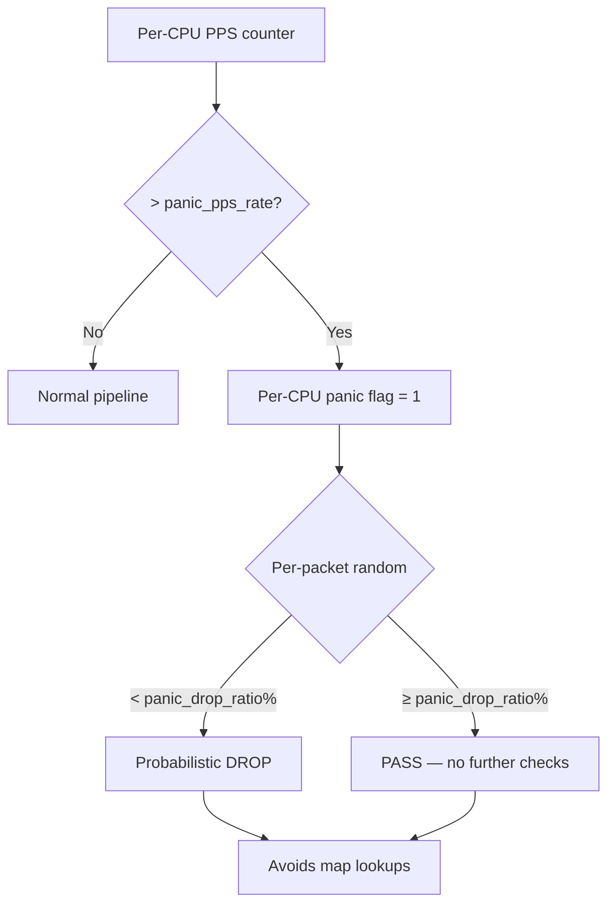

# Performance Optimizations

OpenShield-XDP employs multiple optimization techniques to minimize per-packet overhead while maintaining correct detection behavior. These optimizations are designed into the codebase, not applied as an afterthought.

## Empty-Map Fast Paths

When the whitelist or ban maps contain zero entries, full map lookups are wasteful.

```c
// config_map holds boolean flags
u8 whitelist_empty;  // Set by userspace when whitelist has 0 entries
u8 bans_empty;       // Set by userspace when ban + subnet_ban are empty

// BPF pipeline — skip lookups entirely
if (!cfg->whitelist_empty) {
    // Do full whitelist lookup (~50-80 ns)
}
if (!cfg->bans_empty) {
    // Do full ban + subnet_ban lookup (~80-200 ns)
}
```

**Savings**: ~130–280 ns when both maps are empty. The flags are updated by userspace after every config change (including runtime socket updates).

## Bloom Filter Acceleration

The Bloom filter avoids expensive `LRU_HASH` whitelist lookups for non-whitelisted IPs:

```c
// Bloom filter check (ARRAY map — ~10 ns)
u32 bloom_idx = hash1(ip) % bloom_size;
u32 bloom_bit = hash2(ip) / bloom_size % 64;
u64 *entry = bpf_map_lookup_elem(&bloom_map, &bloom_idx);
if (!entry || !(*entry & (1ULL << bloom_bit))) {
    // Definitely not whitelisted — skip HASH lookup
    goto skip_whitelist;
}
// Possibly whitelisted — fall through to full HASH lookup
```

**Design details**:
- 3 independent hash functions (SplitMix64) → 3 bit positions per IP
- `bloom_filter_size` entries × 64 bits = total filter size in bits
- False positive rate at 150K entries, 10K whitelisted IPs: ~0.01%
- Populated synchronously by `PopulateBloomFilter()` at config load
- Cleared and repopulated on whitelist changes

**Savings**: ~60–100 ns per packet for non-whitelisted IPs.

## PERCPU Counters (Zero Lock Contention)

All per-packet counters use `BPF_MAP_TYPE_PERCPU_ARRAY`:

```c
// Each CPU writes to its own slot — no lock, no contention
struct {
    __uint(type, BPF_MAP_TYPE_PERCPU_ARRAY);
    __type(key, u32);
    __type(value, struct global_stats);
    __uint(max_entries, 1);
} global_stats_map SEC(".maps");
```

**Why this matters**:

| Approach | Per-packet cost |
|----------|----------------|
| `bpf_spin_lock` + shared counter | ~200–500 ns (lock acquire + release) |
| PERCPU_ARRAY | ~15 ns (simple indexed write) |

The cost of `bpf_spin_lock` is ~10–30× higher than a PERCPU write. PERCPU counters are used for:
- `global_stats_map` (total PPS/BPS per CPU)
- `prof_map` (per-stage profiling counters)
- `panic_bucket_map` (per-CPU panic state)
- `prefix_ban_map` (per-CPU attack escalation tracking)

Userspace aggregates by reading all CPU slots and summing.

## LRU Auto-Eviction

`ip_stats_map`, `ban_map`, and `syn_cookie_map` use `BPF_MAP_TYPE_LRU_HASH`:

- **Automatic eviction** of oldest entries under memory pressure — no manual cleanup needed in BPF
- **No userspace iteration** required for eviction (the kernel handles it)
- **Configurable max entries**: `maps.ip_stats_max` (100K), `maps.ban_max` (50K)

This avoids the need for a BPF-side garbage collector, which would consume precious instruction slots and add latency jitter.

## Sampling Optimization

For statistical detection (entropy, packet size anomaly, TTL), computing per-packet is unnecessary overhead:

```c
// Only process every 256th packet for statistical analysis
if ((bpf_get_prandom_u32() & 0xFF) != 0) {
    goto skip_stats;
}
// Statistical analysis code (~100-200 ns)
skip_stats:
// Continue pipeline
```

The statistical detectors use `bpf_get_prandom_u32()` for uniform random sampling:

| Detector | Sampling Rate | Reason |
|----------|--------------|--------|
| Entropy spoofing | 1/256 | Statistical hash bucket analysis |
| Packet size anomaly | 1/256 | Rolling average of packet sizes |
| TTL anomaly | 1/256 | Rate of TTL deviation |
| SYN/FIN ratio | every packet | Needs accurate counts |

**Savings**: ~100–200 ns saved on 99.6% of packets for statistical detectors.

## Panic Circuit Breaker Design

When per-CPU PPS exceeds `panic_pps_rate`, the panic circuit breaker activates to prevent resource exhaustion:



**Key design properties**:

1. **Probabilistic, not deterministic** — `panic_drop_ratio` (default 80) means 80% of packets are dropped randomly, avoiding synchronized drops that could cause bursty behavior
2. **No map lookups during panic** — the breaker fires **before** any map operations (whitelist, ban, stats). This prevents map lookup overhead from compounding the attack
3. **Per-CPU isolation** — each CPU tracks its own PPS independently. Panic on one CPU doesn't affect others
4. **Coordinated panic** (optional) — `panic_coordination_enabled` lets userspace detect when multiple CPUs are panicking simultaneously and broadcast a global panic signal

## Minimizing Branch Mispredictions

The pipeline is ordered by **most-likely-to-drop-first**:

1. MAC filter (L2) — cheapest check, rarely positive
2. SYNPROXY cookie (if SYN) — handshake, hits only on SYNs
3. Panic breaker — only active during attacks
4. Whitelist — most normal traffic passes through here
5. Ban check — progressively more IPs as attacks continue
6. Validation — private/bogon/malformed
7. Amplification detection — sport checks
8. Rate scoring — CPU-intensive, last check

This minimizes branch misprediction penalties by ensuring the common case (clean traffic) takes the straight-line path.

## Compiler Optimizations

### `__always_inline`

All helper functions use `__always_inline` to eliminate function call overhead. The BPF verifier sees the fully inlined code, enabling better bounds tracking.

### `-O2` Optimization

The BPF compiler uses `-O2` (not `-Os` or `-O0`):

```makefile
CLANG -O2 -g -Wall -Werror -target bpf
```

`-O2` balances code size with performance. `-Os` produces smaller but slower code. `-O3` sometimes helps but can cause verifier complexity issues with large programs.

### Dead Code Elimination

Feature flags at compile time (`#ifdef OPENSHIELD_SYNPROXY`) ensure code for unsupported features is never compiled, keeping the BPF program as small as possible for the target kernel.

## Related Pages

- [Performance Overview](./overview) — Design targets and measurement methodology
- [Performance Tuning](./tuning) — System-level tuning guide
- [Architecture: Pipeline](/openshield-xdp/architecture/pipeline) — Stage ordering rationale
