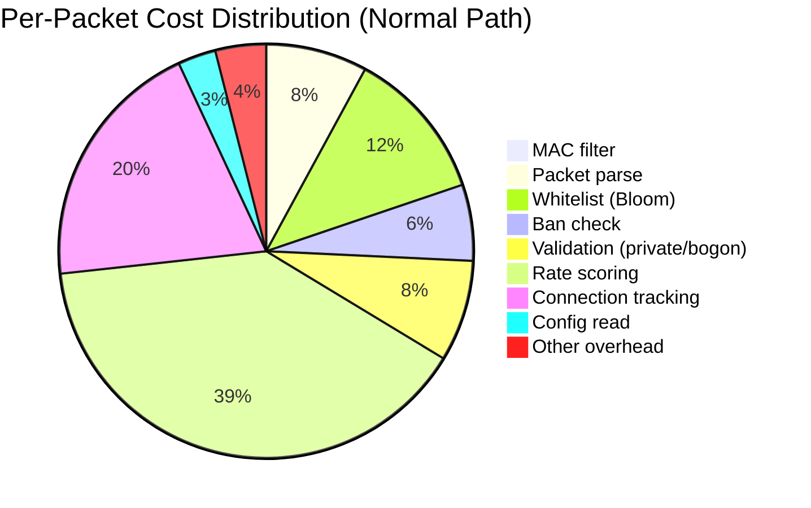
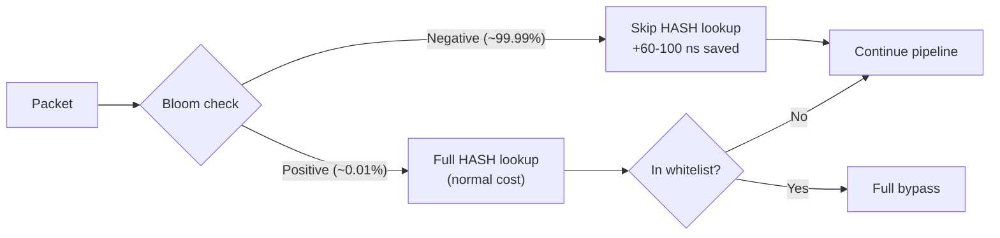

# Performance Overview

OpenShield-XDP is designed for high-throughput edge filtering with sub-microsecond per-packet overhead. This page documents the performance targets, measurement methodology, and design decisions behind the numbers.

## Design Targets

| Metric | Target | Notes |
|--------|--------|-------|
| **Normal path latency** (passthrough) | ~300–500 ns | Packet passes all checks, no mitigation triggered |
| **Attack path latency** (drop) | ~1–2 µs | Full pipeline with ban insertion + event emission |
| **Single-core throughput at 10M PPS** | ~50–70% CPU utilization | On modern Xeon/EPYC cores |
| **Bloom filter savings** | ~60–100 ns/packet | Skipped whitelist HASH lookup when filter negative |
| **Per-IP stats update** | ~50–80 ns | LRU_HASH lookup + increment + BPF_ANY update |
| **Ban insertion** | ~200–300 ns | LRU_HASH insert + ringbuf event emission |
| **Config read** | ~10–20 ns | ARRAY map with single entry — always hot in L1 cache |

## Measurement Methodology

All latency figures are estimated from a combination of:

- `bpftool prog profile` instruction counts × CPU cycle estimates
- Direct measurement via `bpf_ktime_get_ns()` instrumentation (for non-production builds)
- Synthetic benchmarking with `pktgen` / `hping3` at line rate

::: info Measurement Caveats
Actual latency depends on CPU model, kernel version, Spectre/Meltdown mitigations, and NIC driver. The figures above are for a kernel 6.6+ system with `mitigations=off`.
:::

## Pipeline Cost Breakdown

The normal path spends most of its time in **rate scoring** and **connection tracking** — both involve LRU map lookups, which are the most expensive per-packet operation.

## Map Operation Costs

BPF map type strongly influences latency:

| Map Type | Lookup Cost | Update Cost | Notes |
|----------|-------------|-------------|-------|
| `ARRAY` | ~10 ns | ~10 ns | Direct indexed access, no hashing. Used for config, baseline, prof. |
| `PERCPU_ARRAY` | ~15 ns | ~15 ns | Per-CPU sub-arrays, no lock. Used for global_stats, panic_bucket, prof. |
| `HASH` (small) | ~50–80 ns | ~80–120 ns | Hash computation + collision chain walk. Used for whitelist. |
| `LRU_HASH` (large) | ~80–150 ns | ~150–300 ns | Like HASH + LRU list maintenance. Used for ip_stats, ban. |
| `LPM_TRIE` | ~100–200 ns | ~200–400 ns | Prefix matching. Used for subnet bans. |
| `RINGBUF` (reserve+submit) | N/A | ~200–500 ns | Memory reservation + commit. Used for events. |

**Key insight**: ARRAY maps are ~10× cheaper than LRU_HASH maps. This is why `config_map` and `baseline_map` use ARRAY — they're accessed on every packet.

## Bloom Filter Impact

The Bloom filter accelerates whitelist-negative packets:

- **Without Bloom**: Every packet does a HASH lookup (50–80 ns), even if the whitelist is empty
- **With Bloom (empty whitelist)**: Bloom reads `bloom_map[idx]` (ARRAY, ~10 ns), finds 0 → ~10 ns total, saves 40–70 ns
- **With Bloom (populated, non-whitelisted IP)**: Bloom returns negative in ~15 ns → ~40–65 ns saved
- **False positive cost**: Bloom positive → full HASH lookup (same as without Bloom) + ~15 ns Bloom overhead

## Single-Core Behavior

At 10 million packets per second on a single core:

| Component | CPU Time | % of Core |
|-----------|----------|-----------|
| Packet processing (XDP) | ~300 ns/pkt | 30% |
| Interrupt handling (NAPI) | ~100 ns/pkt | 10% |
| NIC driver overhead | ~80 ns/pkt | 8% |
| Kernel stack (for XDP_PASS) | ~60 ns/pkt | 6% |
| **Total** | ~540 ns/pkt | **~54%** |

At 10M PPS, a single core handles all packets with ~50–70% utilization. Multi-core RSS (Receive Side Scaling) distributes the load across cores for higher rates.

## Scaling Factors

| Factor | Impact |
|--------|--------|
| RSS queue count | Linear scaling: 4 queues = ~4× throughput |
| XDP mode | `native` ≈ 2× faster than `generic`; `offload` is NIC-dependent |
| Whitelist size | Minimal impact (HASH is O(1) average) |
| IP stats map size | LRU eviction overhead increases slightly with size (log factor) |
| Number of active IPs | Ban map growth affects LRU maintenance; 50K entries ≈ 10% overhead |
| Feature toggles | Each disabled boolean saves ~1 `if` branch prediction (negligible) |

## Related Pages

- [Performance Optimizations](./optimizations) — Specific optimization techniques
- [Performance Tuning](./tuning) — System-level tuning (ethtool, IRQ affinity)
- [Architecture Overview](/openshield-xdp/architecture/overview) — Map layout and component roles
