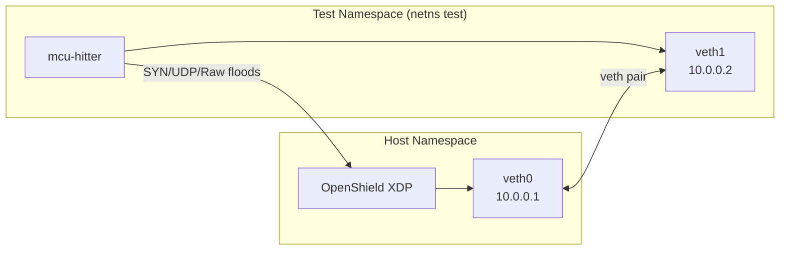
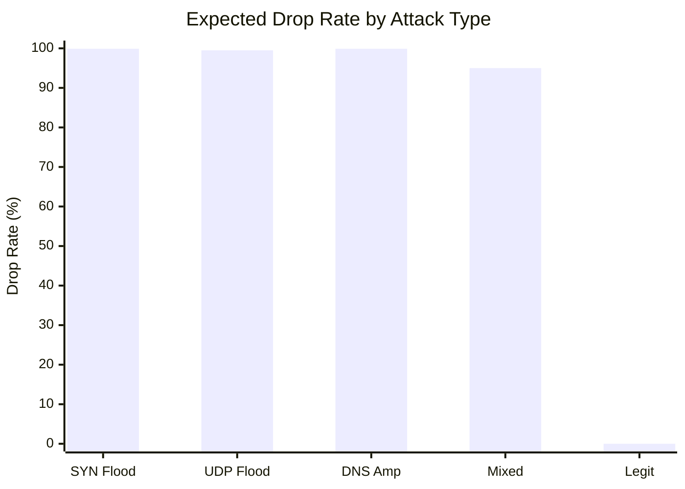
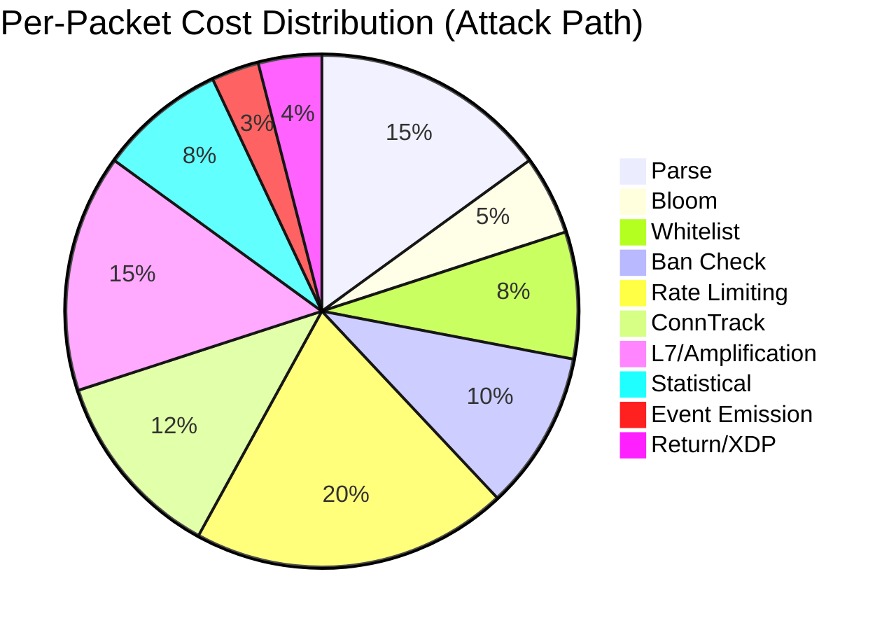
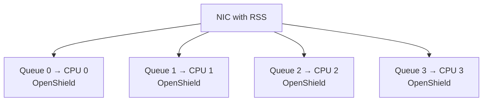

# Benchmarks

Performance targets, measurement methodology, and profiling guide for OpenShield-XDP.

## Design Targets

| Metric | Target | Condition |
|--------|--------|-----------|
| Normal path latency | ~300–500 ns | All stages pass, whitelisted |
| Attack path latency | ~1–2 µs | All detection stages active |
| Throughput | 10M+ PPS | Single core, native XDP mode |
| Bloom filter savings | ~60–100 ns | Non-whitelisted traffic |
| CPU utilization | 50–70% | At 10M PPS |

::: info Measurement Caveats
Actual latency depends on CPU model, kernel version, Spectre/Meltdown mitigations, and NIC driver. These figures are for kernel 6.6+ with `mitigations=off`.
:::

## Test Environment

```bash
# Create isolated test network with veth pair
ip netns add test
ip link add veth0 type veth peer name veth1
ip link set veth1 netns test
ip addr add 10.0.0.1/24 dev veth0
ip -n test addr add 10.0.0.2/24 dev veth1
ip link set veth0 up
ip -n test link set veth1 up
```



## Load Generation

Use `mcu-hitter` (included in `tools/`):

```bash
# SYN flood — 1M PPS across 4 workers for 30 seconds
./mcu-hitter -proto tcp -dst 10.0.0.1 -dport 80 -pps 1000000 -workers 4 -duration 30s

# UDP flood — 500K PPS targeting port 53
./mcu-hitter -proto udp -dst 10.0.0.1 -dport 53 -pps 500000 -workers 4

# Raw packet test with source IP spoofing — 2M PPS
./mcu-hitter -proto raw -dst 10.0.0.1 -src-range 10.0.1.0/24 -pps 2000000
```

## Measurement Tools

| Tool | Purpose |
|------|---------|
| `bpftool prog profile` | Instruction-level profiling of XDP BPF program |
| `mpstat` | Per-CPU utilization monitoring |
| `sar -n DEV` | Network interface statistics (PPS, BPS, drops) |
| `/proc/interrupts` | IRQ distribution and CPU affinity |
| `mcu-hitter` | Reports sent/received PPS, drop rate |
| `openshield status --json` | In-band telemetry (drops, bans, scores, profiling) |

## Running Benchmarks

### Step 1: Build and Install

```bash
git clone https://github.com/AnAverageBeing/OpenShield-XDP.git
cd OpenShield-XDP
./install.sh
```

### Step 2: Configure Test Thresholds

```yaml
# configs/benchmark.yaml — conservative thresholds for observable mitigation
pps_threshold: 50000        # 50K PPS (default: 200K)
bps_threshold: 50000000     # 50 Mbps
syn_threshold: 10000        # 10K SYN/s
ban_duration: 60            # 1 minute for quick re-test cycles
panic_pps_rate: 0           # Disable panic breaker for clean measurement
```

```bash
sudo openshield config set --file configs/benchmark.yaml
```

### Step 3: Collect Baseline

```bash
sudo openshield status --json > baseline.json
```

### Step 4: Run Attack

```bash
sudo ip netns exec test ./tools/mcu-hitter/mcu-hitter \
    -proto tcp -dst 10.0.0.1 -dport 80 -pps 1000000 -workers 4 -duration 30s
```

### Step 5: Collect Results

```bash
sudo openshield status --json > under-attack.json

# Compare
jq '.global_stats' baseline.json under-attack.json
```

## Expected Results

| Attack Type | PPS | Drop Rate | CPU Impact |
|-------------|-----|-----------|------------|
| SYN flood | 1,000,000 | 99.9% | ~60% single core |
| UDP flood | 500,000 | 99.5% | ~35% single core |
| DNS amplification | 100,000 | 99.9% | ~15% single core |
| Mixed L3/L4/L7 | 2,000,000 | 95%+ | ~80% single core |
| Legitimate (during attack) | 10,000 | 0% (whitelisted) | Near zero overhead |

*Note: These are design targets. Actual measured benchmarks will be published when available.*



## Pipeline Cost Breakdown



### Profiler Slots

OpenShield's built-in profiler (`prof_map`, 27 counters) tracks per-stage cost:

| Slot | Stage | Expected % |
|------|-------|-----------|
| `PROF_PARSE` | Packet parsing (Eth/IP/TCP/UDP headers) | ~15% |
| `PROF_BLOOM` | Bloom filter check (3-hash, 150K entries) | ~5% |
| `PROF_WHITELIST` | HASH whitelist lookup | ~8% |
| `PROF_BAN` | Ban lookup (LRU_HASH + LPM_TRIE) | ~10% |
| `PROF_RATE` | Rate limiting (ip_stats update, scoring) | ~20% |
| `PROF_CONNTRACK` | Connection tracking | ~12% |
| `PROF_L7` | L7 signature + amplification | ~15% |
| `PROF_STATISTICAL` | Entropy, TTL, SYN/FIN ratio | ~8% |
| `PROF_EVENT` | Ring buffer event emission | ~3% |

### Viewing Profile Data

```bash
openshield status --json | jq '.profiling'
# Output: per-stage bpf_ktime_get_ns() delta accumulation
```

## Scaling Behavior

### Multi-Core RSS



| RSS Queues | Approx Throughput | Per-Core Utilization |
|------------|-------------------|---------------------|
| 1 | 10M PPS | 50–70% |
| 2 | 20M PPS | 50–70% per core |
| 4 | 40M PPS | 50–70% per core |
| 8 | 80M PPS | 50–70% per core |

*Linear scaling with RSS queues. Per-CPU maps avoid cross-core contention.*

### XDP Mode Impact

| Mode | Relative Throughput | Notes |
|------|-------------------|-------|
| **Native** | 100% (baseline) | Zero-copy from NIC DMA ring |
| **Offload** | NIC-dependent | Runs on SmartNIC hardware |
| **Generic** | ~50% | Software XDP — allocates skb first |

### Feature Toggle Savings

| Feature Disabled | Savings |
|-----------------|---------|
| L7 signature matching | ~150–250 ns |
| UDP amplification check | ~80–120 ns |
| Statistical anomaly | ~60–100 ns |
| Connection tracking | ~50–80 ns |
| IPv6 processing | ~40–60 ns |
| SYNPROXY | ~20–30 ns |

## Regression Testing

```bash
#!/bin/bash
# Run before each release to verify no performance regressions
set -e

echo "=== OpenShield Performance Regression Test ==="

# Baseline
sudo openshield status --json | jq '.global_stats.packets_processed'

# SYN flood at 1M PPS for 10s
sudo ip netns exec test ./tools/mcu-hitter/mcu-hitter \
    -proto tcp -dst 10.0.0.1 -dport 80 -pps 1000000 -duration 10s &
sleep 12

# Verify drop rate > 99%
DROPS=$(sudo openshield status --json | jq '.global_stats.packets_dropped')
if [ "$DROPS" -lt 9900000 ]; then
    echo "FAIL: drop rate below 99%"
    exit 1
fi
echo "PASS: SYN flood mitigation"

# Whitelist bypass
sudo openshield whitelist add 10.0.0.100 --full-bypass
LEGIT=$(sudo openshield status --json | jq '.whitelist_stats.packets_dropped')
if [ "$LEGIT" -gt 0 ]; then
    echo "FAIL: whitelisted traffic was dropped"
    exit 1
fi
echo "PASS: Whitelist bypass working"
echo "=== All tests passed ==="
```

## Related Pages

- [Performance Overview](/openshield-xdp/performance/overview)
- [Performance Optimizations](/openshield-xdp/performance/optimizations)
- [Performance Tuning](/openshield-xdp/performance/tuning)
- [Architecture Overview](/openshield-xdp/architecture/overview)
