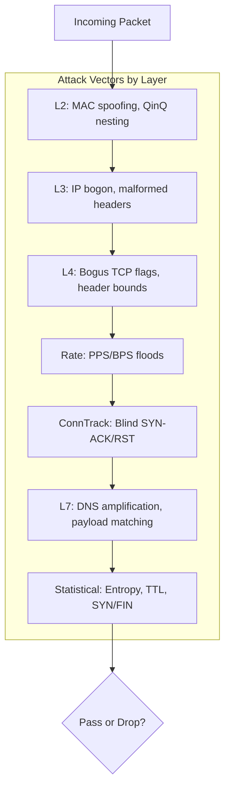
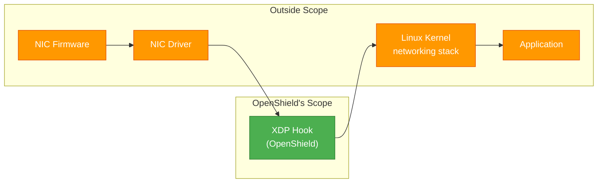
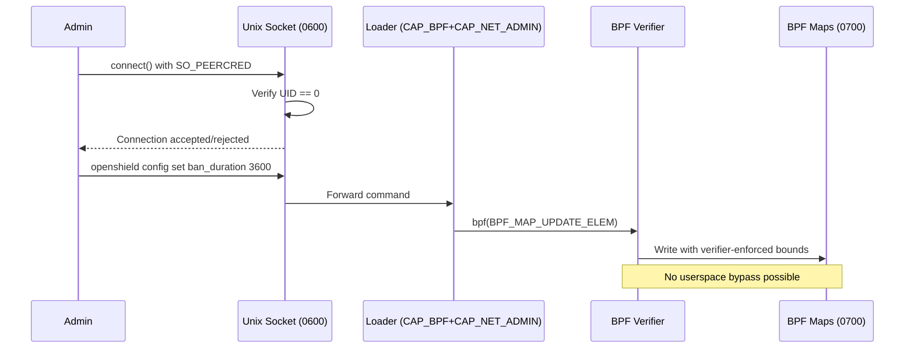

# Threat Model

OpenShield-XDP's security model defines what the system protects against, what it explicitly does NOT protect against, and how each attack surface is isolated.

## What OpenShield Protects Against

OpenShield classifies and mitigates **42 attack vectors** across the L2–L7 stack, all within the XDP hook — before the kernel allocates an `sk_buff`, before iptables runs, before your application sees anything.

### DDoS Attack Vectors

| Layer | Vectors | Mechanisms |
|-------|---------|-----------|
| **L2 — MAC** | 3 | MAC blacklist (8-entry), MAC whitelist, 802.1Q / 802.1ad / QinQ |
| **L3 — IPv4** | 8 | 7 bogon ranges (private/loopback/link-local/reserved/multicast) + malformed header checks |
| **L3 — IPv6** | 7 | 7 bogon ranges + malformed header checks |
| **L4 — TCP flags** | 5 | Bogus flag combos (SYN+FIN, SYN+RST, FIN+RST, NULL, reserved), doff bounds |
| **L4 — UDP/ICMP** | 2 | Header bounds, ICMP type/code filtering |
| **Rate-based per IP** | 6 | PPS, BPS, TCP PPS, UDP PPS, ICMP PPS, SYN PPS — additive scoring |
| **Connection tracking** | 3 | Blind SYN-ACK, blind RST, SYN timestamp validation |
| **Amplification & L7** | 9 | DNS amplification, generic UDP amp (8 ports), L7 signatures (16 rules) |
| **Statistical anomaly** | 5 | SYN/FIN ratio, entropy spoofing, TTL anomaly, packet size anomaly, conn rate |



### Protection Guarantees

| Guarantee | Mechanism |
|-----------|-----------|
| **Legitimate traffic passes during attacks** | `WL_FULL_BYPASS` whitelist flag skips all detection stages |
| **Rate-based bans auto-expire** | `ban_duration` config with LRU eviction + star decay on 5s poll cycle |
| **Panic circuit breaker** | Per-CPU `panic_pps_rate` trigger with probabilistic bulk drop |

::: tip Whitelist bypass
Trusted IPs with `WL_FULL_BYPASS` are never affected by rate thresholds, bans, or any detection stage. Use for monitoring servers, CDN edge nodes, and internal infrastructure.
:::

## What OpenShield Does NOT Protect Against

### Kernel-Level Attacks

| Threat | Why Out of Scope |
|--------|-----------------|
| **Kernel exploits** | OpenShield runs **after** the NIC driver dispatches to XDP. NIC driver, networking stack, and BPF subsystem vulnerabilities are outside scope. |
| **BPF verifier bypass** | Requires a kernel vulnerability (e.g., CVE-2020-8835, CVE-2021-3490). OpenShield passes the verifier with legitimate bytecode. |



### Host Compromise

If an attacker gains **root** on the host, all protections become moot:

| Attack Vector | Impact |
|---------------|--------|
| **Compromised loader** | Can unload XDP, modify config maps, inject arbitrary BPF code |
| **Config map integrity** | No cryptographic verification — `config_version` provides audit trail only |
| **BPF map permissions** | Pinned at `/sys/fs/bpf/openshield/` with `0700`/`0600` — root-only, but root-compromise bypasses |
| **Unix socket** | `/var/run/openshield/openshield.sock` (0600) with `SO_PEERCRED` UID==0 — root-compromise bypasses |

::: warning Defence-in-depth
Run the loader as a **dedicated non-root user** with only `CAP_BPF` + `CAP_NET_ADMIN`. Use the hardened systemd unit. See [Deployment Hardening](#deployment-hardening) below.
:::

### Physical Access

An attacker with physical access to the network port can bypass XDP entirely (XDP operates on packets after NIC DMA, not on the wire). Physical server access (console, USB, DMA) grants full control.

## SYNPROXY Threat Model

OpenShield's SYNPROXY is **rate-based**, not cookie-based:

| Aspect | Details |
|--------|---------|
| **Mechanism** | Counts SYN packets per source IP at XDP. Drops when `syn_packets_per_sec` exceeds threshold. |
| **Legitimate traffic** | SYNs below threshold pass to kernel for normal TCP handshake. No proxy, no splicing. |
| **Attack surface** | **No cryptographic surface.** No SYN cookies, no secrets, no timestamp validation. |
| **Trade-off** | Simpler and faster (~50 ns) than cookie-based SYNPROXY, but less effective against truly distributed SYNs. Use kernel `tcp_syncookies` as defense-in-depth. |

::: tip Kernel SYN cookies
Always enable: `sysctl net.ipv4.tcp_syncookies=1`. This provides an additional layer of SYN flood protection below XDP, within the kernel TCP stack.
:::

## Attack Surface

### 1. Unix Control Socket

```
┌─────────────────────────────────────┐
│     /var/run/openshield/            │
│     openshield.sock (0600)          │
├─────────────────────────────────────┤
│ Auth: SO_PEERCRED → UID == 0       │
│                                     │
│ ✅ Root: full control               │
│ ❌ Non-root: connection refused     │
│ ❌ Remote: not exposed over network │
└─────────────────────────────────────┘
```

| Property | Value |
|----------|-------|
| **Path** | `/var/run/openshield/openshield.sock` |
| **Permissions** | `0600` (owner only) |
| **Authentication** | `SO_PEERCRED` — kernel-verified UID 0 |
| **Operations** | `load`, `unload`, `reload`, `status`, `config set/get`, `fix`, `telemetry subscribe` |

### 2. Pinned BPF Maps

| Property | Value |
|----------|-------|
| **Path** | `/sys/fs/bpf/openshield/` |
| **Permissions** | `0700` directory, `0600` maps |
| **Sensitive data** | Thresholds and settings only — no secrets, keys, or credentials |
| **Attack surface** | Root could enumerate active IPs/banned addresses. No cryptographic secrets exposed. |

### 3. Security Assurance Flow



## Deployment Hardening

### 1. Systemd Service Hardening

```ini
# /etc/systemd/system/openshield-loader.service
[Service]
ProtectSystem=strict
ProtectHome=true
NoNewPrivileges=true
PrivateTmp=true
ProtectKernelTunables=true
ProtectKernelModules=true
ProtectControlGroups=true
RestrictAddressFamilies=AF_UNIX AF_NETLINK
RestrictNamespaces=true
LockPersonality=true
MemoryDenyWriteExecute=true
RestrictRealtime=true
RestrictSUIDSGID=true
RemoveIPC=true
PrivateDevices=true
CapabilityBoundingSet=CAP_BPF CAP_NET_ADMIN
AmbientCapabilities=CAP_BPF CAP_NET_ADMIN
```

### 2. Kernel Hardening

```bash
sysctl -w net.ipv4.tcp_syncookies=1
sysctl -w net.core.bpf_jit_harden=2
sysctl -w kernel.unprivileged_bpf_disabled=1
sysctl -w kernel.randomize_va_space=2
```

### 3. Operational Checklist

| Practice | Detail |
|----------|--------|
| **Dedicated user** | Run loader with `CAP_BPF` + `CAP_NET_ADMIN`, not full root |
| **Log rotation** | Auto-rotated at 10 MB; configure external log shipping |
| **Kernel version** | Minimum 5.15, recommended 6.6+ |
| **Config audit** | Monitor `config_version` changes: `openshield status --json | jq .config_version` |
| **Regular updates** | Track linux-hardening for BPF CVEs (e.g., CVE-2023-2163, CVE-2024-41009) |

## Reporting Vulnerabilities

See [SECURITY.md](https://github.com/AnAverageBeing/OpenShield-XDP/blob/main/SECURITY.md) for full disclosure policy.

- **Private reports**: Discord DM or GitHub private vulnerability reporting
- **Scope**: XDP program logic, userspace loader, control protocol
- **Kernel bugs**: Report to Linux kernel security team
- **Disclosure**: 90-day window; critical fixes within 7 days

## Related Pages

- [Architecture Overview](/openshield-xdp/architecture/overview)
- [Mitigation Overview](/openshield-xdp/mitigation/overview)
- [Configuration Reference](/openshield-xdp/configuration/reference)
