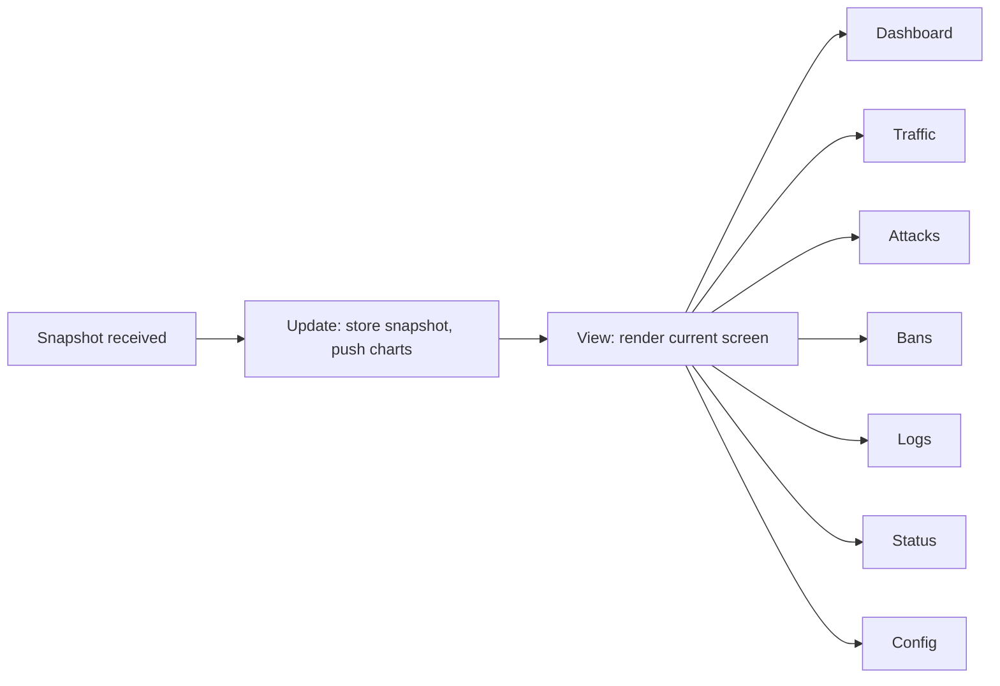
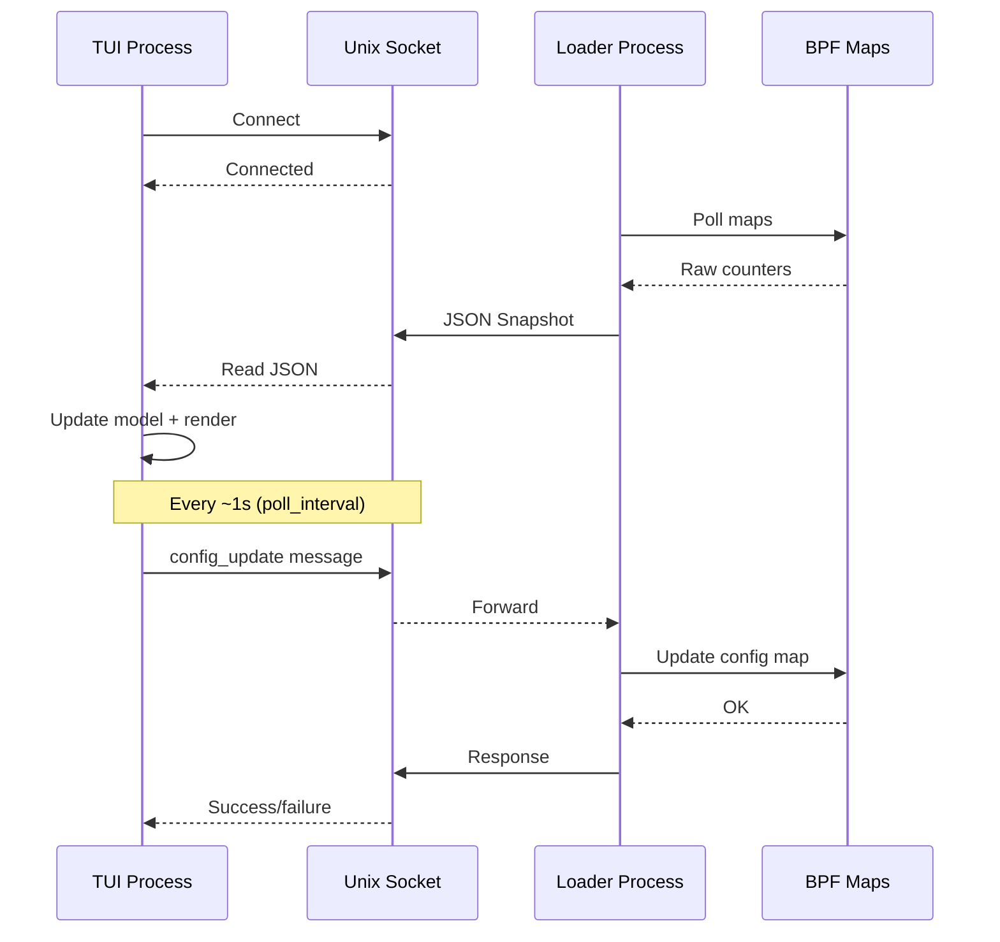

# TUI Architecture

The OpenShield-XDP terminal dashboard renders real-time firewall statistics, attack detection, ban management, and live configuration editing — all through an SSH-friendly terminal interface.

## Technology stack

| Component | Library | Purpose |
|-----------|---------|---------|
| TUI framework | [Bubbletea](https://github.com/charmbracelet/bubbletea) | Elm Architecture: Model, Update, View |
| Styling | [lipgloss](https://github.com/charmbracelet/lipgloss) | Terminal color, borders, layouts |
| Charts | [ntcharts](https://github.com/NimbleMarkets/ntcharts) | Braille-resolution streamline graphs |
| Config parsing | `gopkg.in/yaml.v3` | YAML config reading in the Config screen |

## Architecture

```mermaid
flowchart TD
    subgraph Kernel
        A[BPF Maps] -->|per-CPU counters| B[IP Stats Map]
        B --> C[Global Stats Map]
        B --> D[Ban Map]
        B --> E[Events Ring Buffer]
    end

    subgraph Loader Process
        F[telemetry.Collector] -->|poll every 1s| B
        F --> G[JSON Snapshot]
        G --> H[server.Server]
        H -->|Unix socket| I[/var/run/openshield/telemetry.sock]
    end

    subgraph TUI Process
        J[tui.Model] -->|read JSON| I
        J --> K[Update loop]
        K --> L[View render]
    end

    L -->|terminal| M[User sees dashboard]
    M -->|key/mouse input| K
    K -->|config_update via socket| I
```

## Data flow

1. **BPF maps** are populated by the XDP program attached to the NIC — every packet increments per-IP counters, global stats, and ban entries
2. **`telemetry.Collector`** (runs in the loader process) polls BPF maps every `poll_interval` (default 1s), computes derived metrics (PPS/BPS deltas, top offenders, spike detection), and marshals a `Snapshot` struct to JSON
3. **`server.Server`** pushes each JSON snapshot to connected clients via a Unix domain socket (`/var/run/openshield/telemetry.sock`)
4. **`tui.Model`** (either embedded in the loader or running standalone) reads JSON snapshots from the socket, updates the model state, and re-renders the view
5. **Config changes** flow the reverse direction: TUI → JSON `config_update` message over socket → `config.SetFunc` → `loader.UpdateConfig()` → BPF config map

## Screen rendering

The TUI renders one of 7 screens at a time. Each screen's view function accesses the current `Snapshot` data and produces a styled string using lipgloss:



The **status bar** (top of every screen) shows: title, attack state (green/red), interface name, current PPS, current BPS, uptime — with a gradient color based on attack intensity.

The **navigation bar** shows `[1]Dash [2]Traffic [3]Attacks [4]Bans [5]Logs [6]Status [7]Config` with the active screen highlighted. Mouse clicks on tab labels switch screens.

The **hint bar** (bottom) shows screen-specific keyboard shortcuts.

## Connection lifecycle



## Reconnection

If the socket disconnects (loader crash, restart):
1. The TUI displays "Connecting to OpenShield-XDP..."
2. A `tea.Tick` fires every 3 seconds attempting reconnection
3. When reconnected, the full snapshot loop resumes

## Performance

- **Refresh rate:** configurable via `--refresh` flag (default 1000ms, minimum 40ms)
- **Chart resolution:** braille-dot (8 steps per character cell), 60-point rolling buffer with auto-scaling Y-axis
- **Log rendering:** visible-window optimization — only renders the lines visible on screen, not the entire log buffer
- **Zero allocation in hot path:** JSON decoding happens once per snapshot; lipgloss strings are pre-composed with styles cached at init

## Next steps

[TUI Screens Deep-Dive](/openshield-xdp/tui/screens) · [Keyboard Shortcuts](/openshield-xdp/tui/shortcuts) · [User Guide](/openshield-xdp/user-guide/tui)
