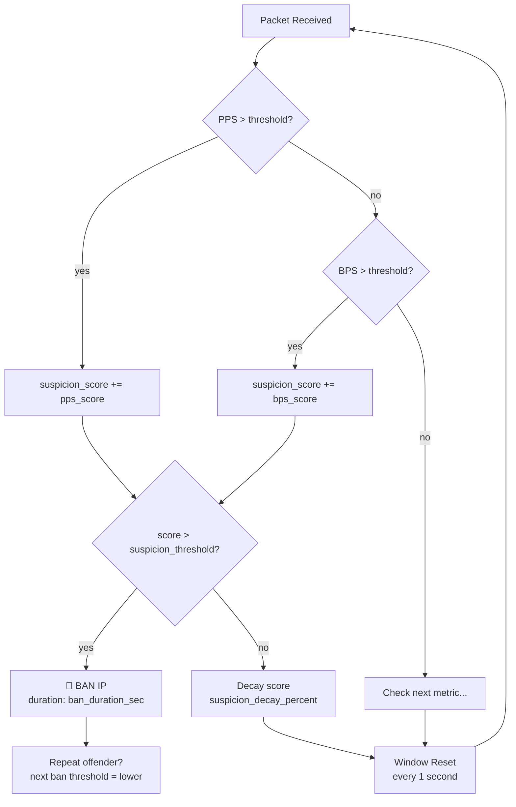
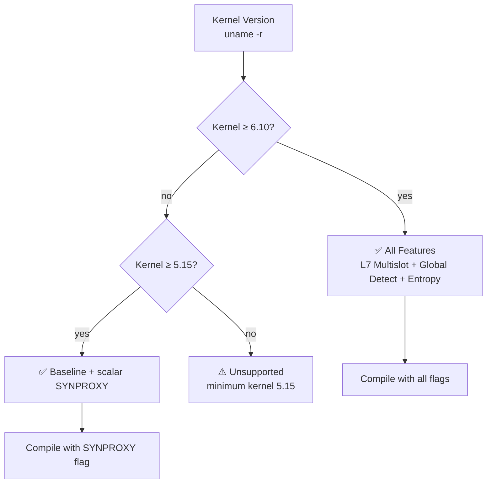

# Configuration Reference

Runtime configuration file: `/etc/openshield/openshield.yaml`

All defaults shown below match the actual code defaults from `userspace/internal/config/defaults.go`. Generate a fresh config with:

```bash
sudo openshield config
```

## Top-level

| Field | Default | Description |
|-------|---------|-------------|
| `interface` | `eno1` | Network interface to attach XDP to |
| `xdp_mode` | `auto` | XDP attachment mode: `auto`, `native`, `generic`, `skb` |

`auto` tries native → generic → skb in fallback order. Set explicitly to force a specific mode.

## `static` — Per-IP rate thresholds & scoring

Controls per-source-IP rate limiting with a suspicion scoring system. Each violation type adds score points; when cumulative score exceeds `suspicion_threshold`, the IP is banned.

| Field | Default | Type | Description |
|-------|---------|------|-------------|
| `enabled` | `true` | bool | Master switch for per-IP static mitigation |
| `pps_threshold` | `850` | int | Max packets/s per IP (all protocols) |
| `bps_threshold` | `8912896` | int | Max bytes/s per IP (~8.5 MB/s) |
| `tcp_pps_threshold` | `680` | int | Max TCP packets/s per IP |
| `udp_pps_threshold` | `425` | int | Max UDP packets/s per IP |
| `icmp_pps_threshold` | `85` | int | Max ICMP packets/s per IP |
| `syn_pps_threshold` | `170` | int | Max SYN packets/s per IP |
| `suspicion_threshold` | `100` | int | Cumulative suspicion score that triggers a ban |
| `ban_duration` | `3600` | int | Ban duration in seconds (1 hour) |
| `pps_score` | `20` | int | Score added for PPS threshold violation |
| `bps_score` | `20` | int | Score added for BPS threshold violation |
| `tcp_pps_score` | `15` | int | Score added for TCP PPS violation |
| `udp_pps_score` | `15` | int | Score added for UDP PPS violation |
| `icmp_pps_score` | `25` | int | Score added for ICMP PPS violation |
| `syn_pps_score` | `30` | int | Score added for SYN PPS violation |
| `suspicion_decay` | `0.5` | float | Score retention per window (0.5 = keep 50%) |
| `rate_limit_mode` | `threshold` | string | `threshold` (scoring) or `token_bucket` |
| `token_rate` | `0` | int | Tokens refilled/s per IP (token_bucket mode) |
| `token_burst` | `0` | int | Max burst tokens per IP (token_bucket mode) |
| `enable_connection_tracking` | `true` | bool | Drop blind SYN-ACK/RST/ACK (no prior SYN) |
| `ct_syn_timeout_sec` | `30` | int | Connection tracking SYN timeout |
| `star_duration_multiplicators` | `[1,2,4,8,16,32]` | []int | Multipliers for repeat-offender escalating bans |
| `star_decay_seconds` | `3600` | int | Clean seconds before star rating drops |
| `ban_subnets` | `[]` | []string | Subnets to ban in CIDR notation |
| `auto_subnet_ban` | `false` | bool | Auto-ban entire subnets when many IPs banned |
| `auto_subnet_prefixes` | `[24]` | []int | Prefix lengths for auto subnet ban |
| `subnet_ban_duration` | `7200` | int | Ban duration for subnet bans (2 hours) |

### Suspicion scoring explained



### Token bucket mode

Set `rate_limit_mode: token_bucket` to use a token-based approach instead of scoring. Each IP gets `token_burst` initial tokens, with `token_rate` tokens refilled per second. Packets consume 1 token each. When tokens are exhausted, the IP is rate-limited (not banned — packets are dropped until tokens refill).

## `validation` — Packet validation filters

| Field | Default | Description |
|-------|---------|-------------|
| `filter_private` | `true` | Drop packets with private/bogon source IPs |
| `filter_bogon` | `true` | Drop packets from bogon address ranges |
| `filter_bogus_tcp` | `true` | Drop packets with impossible TCP flag combinations |
| `filter_malformed` | `true` | Drop packets with malformed headers |

## `dynamic` — Advanced detection engine

Adaptive baseline, attack detection, new-source flood prevention, amplification detection, and panic circuit breaker.

### Baseline learning

| Field | Default | Description |
|-------|---------|-------------|
| `enabled` | `true` | Enable dynamic detection engine |
| `baseline_window` | `60` | Seconds to build initial traffic baseline |
| `baseline_update_interval` | `5` | Seconds between baseline EMA updates |
| `baseline_alpha` | `0.1` | EMA smoothing factor for baseline |
| `baseline_alpha_min` | `0.05` | Minimum EMA alpha (adaptive floor) |
| `baseline_alpha_max` | `0.50` | Maximum EMA alpha (adaptive ceiling) |
| `baseline_alpha_variance_scale` | `0.1` | How much variance adjusts alpha |

### Spike & attack detection

| Field | Default | Description |
|-------|---------|-------------|
| `spike_percentage` | `200` | % above baseline that triggers spike detection (200 = 3× baseline) |
| `spike_recovery_factor` | `1.2` | Multiplier below which spike is considered recovered |
| `spike_recovery_time` | `30` | Seconds below recovery factor before clearing |
| `attack_threshold_multiplier` | `0.5` | Threshold multiplier during attack (0.5 = 50% of normal) |
| `attack_pps_threshold` | `0` | Global PPS to trigger attack state (0 = disabled, uses baseline) |
| `attack_bps_threshold` | `0` | Global BPS to trigger attack state (0 = disabled) |

### New source flood

| Field | Default | Description |
|-------|---------|-------------|
| `new_source_limit` | `100` | New unique IPs/second before flood mode engages |
| `new_source_ban_duration` | `30` | Ban duration for new sources detected during flood |

### Panic circuit breaker

When per-CPU packet rate exceeds `panic_pps_rate`, the panic breaker bulk-drops `panic_drop_ratio`% of packets before any map lookups — protecting the CPU from map contention under extreme load.

| Field | Default | Description |
|-------|---------|-------------|
| `panic_pps_rate` | `200000` | Per-CPU PPS that triggers panic breaker |
| `panic_drop_ratio` | `80` | % of packets to bulk-drop when in panic mode |
| `panic_global_pps_threshold` | `5000000` | Cross-CPU total PPS for coordinated panic |
| `panic_coordination_enabled` | `true` | Enable userspace cross-CPU panic coordination |

### Amplification detection

| Field | Default | Description |
|-------|---------|-------------|
| `dns_amplification_enabled` | `true` | Drop DNS amplification responses (sport=53, QR=1) |
| `dns_amplification_payload_min` | `512` | Minimum UDP payload for DNS amp detection |
| `udp_amplification_enabled` | `true` | Drop UDP amplification on known amp ports |
| `udp_amp_ports` | `[53,123,1900,11211,17,19,520,69]` | Monitored UDP amplification ports |
| `udp_amp_payload_min` | `[512,90,256,50,50,50,50,50]` | Min payload per amp port |

### Behavioral anomaly detection

| Field | Default | Description |
|-------|---------|-------------|
| `syn_fin_ratio_enabled` | `true` | Detect abnormal SYN/FIN ratios |
| `syn_fin_ratio_threshold` | `100` | SYN/FIN ratio that triggers detection |
| `entropy_spoof_enabled` | `true` | Detect spoofed-source floods via entropy analysis |
| `entropy_spoof_threshold` | `12` | Entropy threshold for spoof detection |
| `ttl_anomaly_enabled` | `true` | Per-IP TTL deviation detection |
| `ttl_expected` | `64` | Expected initial TTL |
| `ttl_tolerance` | `5` | TTL deviation tolerance |
| `pkt_anomaly_enabled` | `true` | Detect anomalous packet sizes |
| `pkt_size_min_threshold` | `64` | Minimum expected packet size |
| `pkt_size_max_threshold` | `1024` | Maximum expected packet size |

### Connection rate limiting

| Field | Default | Description |
|-------|---------|-------------|
| `conn_rate_enabled` | `true` | Enable connection rate limiting |
| `conn_rate_limit` | `5000` | Max new connections/s per IP |

### Auto-escalation

| Field | Default | Description |
|-------|---------|-------------|
| `auto_escalation_enabled` | `true` | Enable automatic subnet ban escalation |
| `auto_escalation_threshold` | `5` | Bans per /24 before subnet ban triggered |

### MAC filtering

| Field | Default | Description |
|-------|---------|-------------|
| `mac_filter_enabled` | `false` | MAC address whitelist/blacklist |
| `mac_filter_mode` | `0` | Filter mode (0=disabled, 1=whitelist, 2=blacklist) |
| `mac_filter_entries` | `[]` | List of MAC addresses |

### SYNPROXY

| Field | Default | Description |
|-------|---------|-------------|
| `synproxy_enabled` | `false` | Cookie-based SYN flood mitigation |
| `syn_pps_threshold` | `170` | Per-IP SYN packets/sec before the rate-based SYN gate scores the source |

### L7 signature drops

| Field | Default | Description |
|-------|---------|-------------|
| `l7_drop_signatures` | `null` | List of L7 payload signatures to drop |

## `whitelist` — Trusted IPs

| Field | Default | Description |
|-------|---------|-------------|
| `enabled` | `true` | Enable whitelist bypass |
| `ips` | `[]` | Array of trusted IPs that bypass all mitigation |

Whitelisted IPs skip all rate checks, validation, and detection. Their packets pass directly through.

## `maps` — BPF map sizing

| Field | Default | Description |
|-------|---------|-------------|
| `ip_stats_max` | `100000` | Max entries in per-IP stats LRU hashmap |
| `ban_max` | `50000` | Max entries in ban LRU hashmap |
| `whitelist_max` | `10000` | Max entries in whitelist hashmap |
| `event_buffer_size` | `262144` | Ring buffer size for events (256 KB) |
| `bloom_filter_enabled` | `true` | Use Bloom filter for fast whitelist lookup |
| `bloom_filter_size` | `150000` | Bloom filter entry count |

::: tip Bloom filter
When `bloom_filter_enabled: true`, whitelist lookups first check a Bloom filter — a probabilistic data structure that can definitively say "this IP is NOT in the whitelist" in O(1) with no hashmap lookup. Only IPs that pass the Bloom filter are checked against the full hashmap, drastically reducing map lookup overhead under load.

This is handled inside the BPF fast path: the Bloom filter map is probed before the whitelist hashmap, avoiding unnecessary hashmap lookups for non-whitelisted traffic.
:::

## `telemetry` — Stats & logging

| Field | Default | Description |
|-------|---------|-------------|
| `poll_interval` | `1` | Seconds between BPF map reads |
| `event_rate_limit` | `100` | Max events/s pushed to TUI/socket |
| `top_offenders_count` | `20` | Number of top offenders tracked |
| `log_level` | `info` | Log level: `debug`, `info`, `warn`, `error` |
| `snapshot_interval` | `1` | Seconds between snapshot pushes to TUI |

## `alerter` — Webhook notifications

| Field | Default | Description |
|-------|---------|-------------|
| `enabled` | `false` | Enable webhook alerter |
| `webhook_url` | `""` | Discord/Slack webhook URL |
| `events` | `[]` | Event types to alert on |

## Kernel feature gate behavior

Some configuration fields depend on kernel features. OpenShield-XDP auto-detects available features at load time:



Run `openshield status` after loading to see which features are active. Fields that can't be supported due to kernel limitations are silently disabled with no error — the program degrades gracefully rather than failing to load.

## Runtime-safe vs read-only fields

Fields marked as **runtime-safe** can be changed via `openshield reload` or the TUI Config screen without unloading the XDP program. Read-only fields require a full reload:

**Runtime-safe:** All `static` thresholds, scores, ban duration, rate limit mode, `validation` flags, `dynamic` thresholds, `whitelist.enabled`, `bloom_filter_enabled`

**Read-only:** `interface`, `xdp_mode`, map sizes (`ip_stats_max`, `ban_max`, etc.), `baseline_window`, `baseline_alpha`, `poll_interval`

## Next steps

[CLI Reference](/openshield-xdp/cli/commands) · [Detection Engine](/openshield-xdp/detection-engine/overview) · [TUI Guide](/openshield-xdp/user-guide/tui)
e_alpha`, `poll_interval`

## Next steps

[CLI Reference](/openshield-xdp/cli/commands) · [Detection Engine](/openshield-xdp/detection-engine/overview) · [TUI Guide](/openshield-xdp/user-guide/tui)
