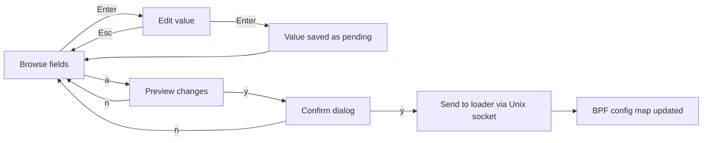

# TUI Guide

The OpenShield-XDP terminal dashboard provides real-time visibility into your firewall state across 7 interactive screens. Built on [Bubbletea](https://github.com/charmbracelet/bubbletea), [ntcharts](https://github.com/NimbleMarkets/ntcharts), and [lipgloss](https://github.com/charmbracelet/lipgloss).

## Launching

```bash
# Option 1: Load and view TUI in one command
sudo openshield load

# Option 2: Daemon + standalone TUI viewer
sudo openshield load --stats-off
sudo openshield tui

# Option 3: Minimal text mode
sudo openshield load --stats-minimal
```

## Screens at a glance

| Key | Screen | What it shows |
|-----|--------|---------------|
| `1` | **Dashboard** | Global PPS/BPS, packets passed/dropped, mitigation stats, protocol distribution, drop path breakdown, panic status |
| `2` | **Traffic** | Live PPS/BPS braille charts, peak/average stats, protocol distribution with bar charts |
| `3` | **Attacks** | Attack state, type, duration, spike intensity, top offender IPs with scores, attack timeline |
| `4` | **Bans** | Paginated ban table with IP, reason, score, remaining time, star rating, search/filter |
| `5` | **Logs** | Scrolling combined event+system log, search/filter, vi-style navigation, line wrapping |
| `6` | **Status** | System info (version, kernel, uptime), health badges, map utilization, drop path breakdown |
| `7` | **Config** | Live configuration browser/editor with pending change tracking, validation, and confirmation dialogs |

## Navigation

| Action | Key(s) |
|--------|--------|
| Switch to screen N | `1`–`7` |
| Cycle screens forward | `Tab` |
| Cycle screens backward | `Shift+Tab` |
| Click nav tab | Mouse left-click |
| Toggle help overlay | `?` |
| Quit | `q` or `Ctrl+C` |

## Screen-specific controls

### Logs screen (5)

| Action | Key |
|--------|-----|
| Scroll down/up | `j` / `k` or `↓` / `↑` |
| Page down/up | `PgDn` / `PgUp` |
| Jump to bottom | `G` |
| Jump to top | `g` |
| Search/filter | `/` (type query, `Esc` to clear, `Enter` to confirm) |
| Toggle wrap mode | `w` |
| Mouse scroll | Scroll wheel |

### Bans screen (4)

| Action | Key |
|--------|-----|
| Next/previous page | `n` / `p` |
| Search by IP or reason | `/` (type query, `Esc` to clear) |
| Mouse scroll | Scroll wheel |

### Attacks screen (3)

| Action | Key |
|--------|-----|
| Next/previous page of offenders | `n` / `p` |

### Config screen (7) — Live editor

| Mode | Action | Key |
|------|--------|-----|
| Browse | Navigate fields | `↑` / `↓` or `j` / `k` or `Tab` |
| Browse | Edit selected field | `Enter` (runtime-safe fields only) |
| Browse | Toggle read-only fields | `r` |
| Browse | Preview pending changes | `a` |
| Browse | Discard all pending changes | `d` |
| Browse | Revert individual field | `x` |
| Edit | Save value | `Enter` |
| Edit | Cancel | `Esc` |
| Edit | Backspace | `Backspace` |
| Confirm | Apply changes | `y` |
| Confirm | Cancel | `n` or `Esc` |

### Config editor workflow



## Charts & visualization

### Braille resolution graphs

PPS and BPS are rendered as streamline charts using ntcharts with braille-dot resolution (8× higher than ASCII). The Y-axis auto-scales with 10% headroom above the rolling max (~60 data points). The X-axis scrolls left over time, showing recent traffic patterns.

### Gradient status bar

The top status bar uses a 10-color gradient (green → yellow → red) based on attack intensity:
- **Green:** Normal operation, all clear
- **Yellow:** Elevated traffic, approaching thresholds
- **Red:** Under attack, spike factor displayed

### Drop paths

The drop path breakdown (shown on Dashboard and Status screens) displays where packets are being dropped:
- **Banned** — matched existing ban entry
- **RateDrop** — exceeded per-IP rate threshold
- **PanicDrop** — panic circuit breaker engaged (bulk drop)
- **DNS Amp** — DNS amplification detected
- **BogusTCP/L7 Drop/PrivSrc/Malform** — validation filters

## Reconnection behavior

The TUI connects to the loader's Unix socket at `/var/run/openshield/telemetry.sock`. If the connection drops (loader crash, socket removed):

1. Display shows "Connecting to OpenShield-XDP..."
2. Automatically retries every 3 seconds
3. Full dashboard resumes when the loader comes back

This works whether you launched via `openshield tui` (standalone) or `openshield load` (embedded).

## Mouse support

| Action | Gesture |
|--------|---------|
| Switch screen | Click nav tab in the navigation bar |
| Scroll logs | Scroll wheel on logs screen |
| Scroll bans | Scroll wheel on bans screen |

## Environment

The TUI uses the alternate screen buffer (`tea.WithAltScreen()`) — your terminal scrollback is preserved when you quit. Terminal dimensions are auto-detected and layout adjusts: wide terminals get side-by-side panels, narrow terminals stack vertically.

## CLI variants

```bash
openshield load                  # Full TUI (embedded in loader)
openshield load --stats-off      # Daemon mode (no display)
openshield load --stats-minimal  # Text snapshots printed to stdout
openshield tui                   # Standalone viewer (connects to running loader)
openshield stats                 # Alias for 'tui'
```

## Next steps

[Configuration](/openshield-xdp/user-guide/configuration) · [CLI Reference](/openshield-xdp/cli/commands) · [TUI Screens Deep-Dive](/openshield-xdp/tui/screens)
