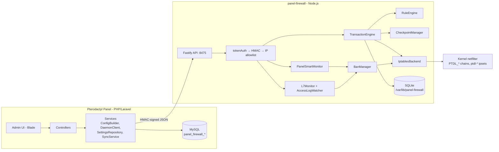
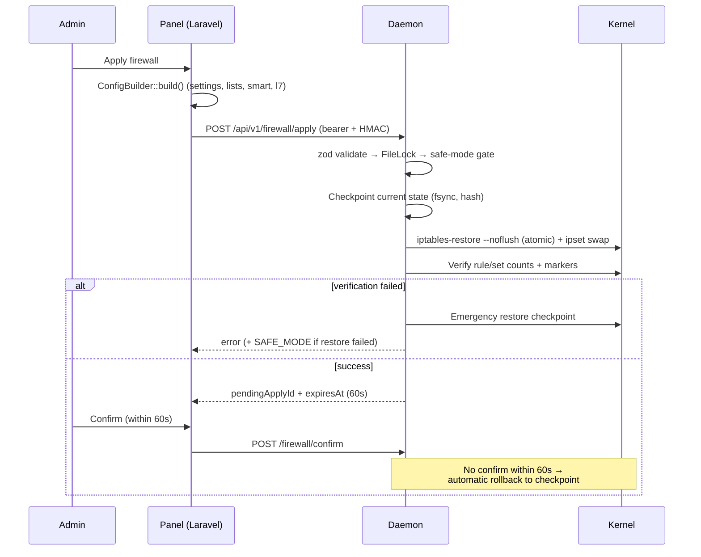

# Architecture Overview

Panel Firewall is split into an unprivileged **panel addon** (the brain) and a privileged **daemon** (the hands). The panel never touches the kernel; the daemon never talks to the panel database. They meet at a small HMAC-authenticated API on loopback.

---

## Components

| Component | Role |
|---|---|
| `PanelFirewallServiceProvider` | Registers admin routes (`/admin/panel-firewall/*`), middleware, migrations, rate limiters |
| `ConfigBuilder` | Turns panel DB settings into the daemon apply payload (preset, lists, `smart`, `l7`) |
| `DaemonClient` | Laravel HTTP client speaking bearer + HMAC to the daemon; the single choke point |
| `TransactionEngine` | The apply pipeline: lock → safe-mode gate → build → checkpoint → atomic apply → verify → pending window |
| `RuleEngine` | Pure function: config → desired state (4 chains, ~19 rules, 3 ipsets) |
| `IptablesBackend` | Executes via `iptables-restore --noflush` + atomic ipset swap; argv-only, no shell |
| `PanelSmartMonitor` | 5s tick: metrics → EWMA → mitigation levels → cooldown/clear |
| `L7Monitor` / `AccessLogWatcher` | Access-log tailer + per-IP sliding-window rate detector feeding `BanManager` |
| `BanManager` | Temp bans, offense scoring, ipset sync, expiry pruning |
| `CheckpointManager` | fsync'd, hash-verified JSON snapshots incl. ownership registry state |
| `ReconciliationScheduler` | Every 60s: compares desired vs kernel, auto-repairs drift |

---

## Apply data flow

The **60-second confirm window** is the core safety guarantee: if an apply breaks your connectivity to the panel, you simply can't confirm, and the daemon rolls itself back.

## Failure handling

- **Apply fails mid-transaction** → checkpoint restored automatically; audit row records the failure
- **Restore also fails** → daemon enters `SAFE_MODE` (HTTP 423 on all mutations) until an admin explicitly calls `/firewall/safe-mode/clear`
- **Daemon restarts** → startup recovery rolls back any expired `pending_apply` before serving
- **Daemon down** → panel health badge goes red; mutation UI is blocked, kernel rules stay as last applied

---

## Security model

1. **IP allowlist** (default loopback only) → 2. **64-hex bearer token** (constant-time compare, 0600 root file, encrypted copy in panel DB) → 3. **HMAC-SHA256** over `METHOD\nPATH\nTIMESTAMP\nsha256(body)` with a 60s timestamp drift window
4. **Ownership registry** — the daemon refuses (at the utility layer, unbypassable by individual modules) to touch any chain/ipset outside `PTDL_*` / `ptdl-*` prefixes. Docker, fail2ban, and Firewall-Plus rules are never modified.
5. **systemd sandbox** — `CAP_NET_ADMIN`/`CAP_NET_RAW` only, `NoNewPrivileges`, `ProtectSystem=strict`, 512 MB / 200% CPU caps. No `MemoryDenyWriteExecute` (V8 JIT).
6. **SSRF-hardened webhooks** — HTTPS-only, all-records public-IP validation, `CURLOPT_RESOLVE` IP pinning.
7. **Strict input validation** — every CIDR/IP/chain-name crossing the API is charset/range-validated before it can reach an `iptables-restore` payload line or a file path.

## On-disk layout

| Path | Contents |
|---|---|
| `/opt/panel-firewall` | Daemon code (`src/`, `node_modules`) |
| `/etc/panel-firewall/config.json` | Daemon config (0600) |
| `/etc/panel-firewall/token` | 64-hex bearer token (0600, root) |
| `/var/lib/panel-firewall` | SQLite state DB, checkpoints, locks |
| `/var/log/panel-firewall` | Daemon logs (also journald) |
| Panel DB `panel_firewall_*` | settings, list entries, audit, sync state, webhooks, confirmations, operations |

See [Protection Layers](./protection-layers) for the ruleset, SMART engine, and L7 sensor internals.
