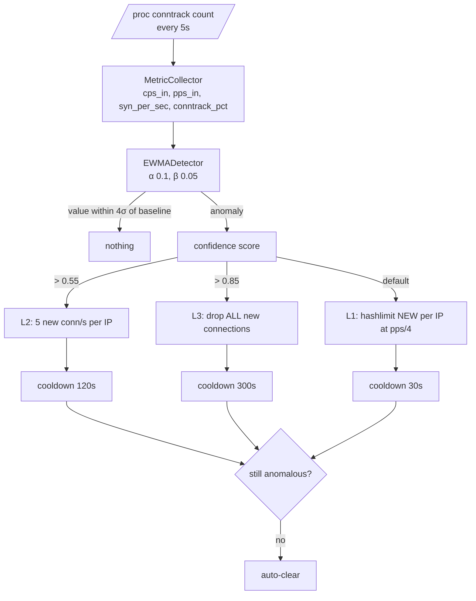
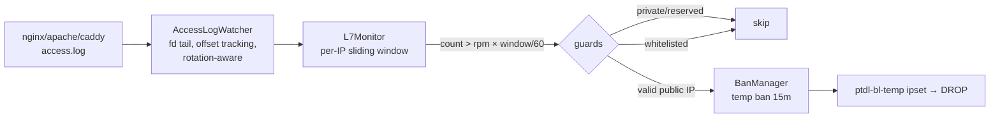

# Protection Layers

Panel Firewall stacks three independent layers in the kernel's `PTDL_*` chains, hooked into INPUT for the panel's HTTP/HTTPS ports. Rule order is deliberate — cheap accepts and known-bad drops happen before any rate accounting.

---

## Layer 1 — Static L3/L4 ruleset

Built by `RuleEngine` as a pure config → desired-state transform, applied atomically. Evaluation order:

1. **Loopback** → ACCEPT
2. **Whitelist ipset** (`ptdl-wl-admin`) → ACCEPT — *before everything else*, so whitelisted IPs can never be locked out
3. **Established/related** → ACCEPT (fast path; existing connections skip all checks)
4. **Permanent blacklist ipset** → DROP
5. **Temp-ban ipset** (`ptdl-bl-temp`) → DROP
6. **Packet hygiene** → DROP: conntrack INVALID, fragments, TCP flags ALL NONE (null scan), SYN+FIN, FIN/URG/PSH (XMAS), non-SYN packets in NEW state
7. **Per-IP NEW-connection hashlimit** → DROP above preset CPS (bursts allowed)
8. **Per-IP SYN hashlimit** → DROP above preset SYN/s
9. **RETURN** — *never* a final DROP: unmatched traffic falls back to your normal INPUT chain, so the addon can't lock out SSH or break a DROP-by-default policy

### Presets

| Preset | PPS/IP | New conn/s | SYN/s | Burst | Concurrent | Use when |
|---|---|---|---|---|---|---|
| `low` | 200 | 20 | 30 | 60 | 100 | Small private panels |
| `medium` *(default)* | 500 | 40 | 60 | 120 | 200 | Typical production panel |
| `high` | 1500 | 80 | 120 | 240 | 500 | Busy public panel |
| `veryHigh` | 4000 | 150 | 250 | 500 | 1500 | Heavy API/websocket usage |
| `underAttack` | 100 | 10 | 15 | 30 | 50 | Active attack — tight until it passes |

---

## Layer 2 — SMART adaptive mitigation

The SMART monitor samples host counters every 5 seconds and decides *for itself* when traffic is abnormal — no static threshold fits every panel.

Key properties:

- **EWMA + variance baseline** (α 0.1 for the mean, β 0.05 for variance) with a warmup period — the detector learns what "normal" looks like on *your* host instead of using a hardcoded rate
- **Anomaly = 4σ above baseline** (tunable); confidence picks the mitigation level
- **L1 → L2 → L3** escalate from "slow the flood" to "drop all new connections" (established sessions always survive)
- **Cooldowns auto-clear** (30s/120s/300s): mitigation turns itself off when traffic normalizes — nobody has to remember
- Every detection and level change is audited, graphed in analytics, and can fire a webhook

## Layer 3 — L7 HTTP-flood sensor

L3/L4 rate limits can't see the difference between 50 requests and 50 *expensive* requests. The L7 sensor reads the one place that knows: the web server's access log.

- **Zero web-server changes** — reads the existing combined-format log; autodetects nginx/apache/httpd/caddy paths
- **Rotation-safe** — follows by fd with byte-offset tracking; logrotate rename/truncate is detected and re-followed without losing lines; first open starts at EOF (never retro-bans history)
- **Fail-open** — missing/unreadable log means no L7 bans, never a crash; retried every poll
- **Abuse-proof** — private/reserved IPs and whitelist entries are never banned; ban actions are budgeted (`maxBansPerMinute`, default 20) so a log flood can't churn the ipset; re-offenses while banned are deduplicated
- **Observable** — `l7_requests_per_min`, tracked IPs, ban totals feed the analytics page; recent bans (with rate evidence) appear in the SMART status and dashboard card

---

## Layer interaction

| Attack | Stopped by |
|---|---|
| SYN flood | Layer 1 SYN hashlimit; SMART L2/L3 if distributed |
| Connection exhaustion | Layer 1 CPS hashlimit + conntrack_pct metric in SMART |
| Null/XMAS/fragment scans | Layer 1 hygiene rules |
| Single-IP HTTP flood | Layer 1 CPS limit first, L7 temp ban as the signal-rich backstop |
| Distributed HTTP flood (botnet) | SMART EWMA → L1/L2/L3 global throttles |
| Slow churn under all rate limits | **Not covered** — see below |

::: warning Honest limitation
A slow, widely-distributed L7 attack that stays under every per-IP rate (thousands of IPs × a few requests/minute each) passes all three layers — that's what upstream WAFs/CDNs (or the sibling XDP projects) are for. Panel Firewall's job is to keep the panel host alive and responsive against the common floods, and to never lock you out while doing it.
:::
