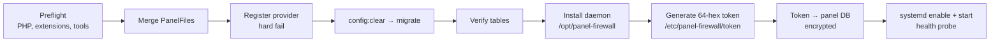

# Installation

One command, everything automatic: the installer merges the panel files, registers the service provider, runs migrations, **auto-installs the daemon** (`/opt/panel-firewall`, systemd `panel-firewall.service`), and **auto-generates the 64-hex bearer token** — written to `/etc/panel-firewall/token` (0600, root) *and* encrypted into the panel DB. No copy-pasting tokens.

---

## Prerequisites

| Requirement | Minimum |
|---|---|
| Pterodactyl Panel | 1.11+ (Laravel 10 or 11 both supported) |
| PHP (CLI) | 8.1+ with `pdo_mysql`, `mbstring`, `openssl` |
| Node.js | 20+ (installed automatically if missing) |
| Kernel tools | `iptables`, `ipset` (installed automatically) |
| Access | root/sudo on the panel host |
| For Blueprint installs | Blueprint framework (`beta-2026-01` through `beta-2026-06` tested) |

::: warning Back up first
```bash
cp -a /var/www/pterodactyl /var/www/pterodactyl.backup.$(date +%Y%m%d)
mysqldump -u root -p panel > panel_backup_$(date +%Y%m%d).sql
```
The standalone installer also takes its own full panel backup to `/var/backups/pterodactyl-panelfirewall-<timestamp>`.
:::

---

## Option A — Blueprint

Download `pterodactylpanelfirewall-v0.3.0.blueprint` from the [GitHub release](https://github.com/AnAverageBeing/pterodactyl-panel-firewall/releases), then:

```bash
cd /var/www/pterodactyl
blueprint -install pterodactylpanelfirewall-v0.3.0.blueprint
```

## Option B — Standalone (no Blueprint)

Download and extract `PanelFirewall-Standalone-v0.3.0.zip` from the [GitHub release](https://github.com/AnAverageBeing/pterodactyl-panel-firewall/releases), then:

```bash
cd panel-firewall-standalone
sudo bash install.sh
```

Set `PTERODACTYL_DIRECTORY` first if your panel is not at `/var/www/pterodactyl`.

---

## What the installer does



Both installers are **idempotent** — re-running (or Blueprint's update process) preserves your daemon config, token, and data. Provider registration is a *hard failure*: if the provider cannot be registered in `config/app.php` (or `bootstrap/providers.php` on Laravel 11), the installer aborts instead of leaving a broken half-install.

---

## Verify

```bash
# Daemon is up
systemctl status panel-firewall
curl -s http://127.0.0.1:8475/api/v1/health
# {"status":"ok","version":"0.2.1",...}

# Panel side
cd /var/www/pterodactyl
php artisan migrate:status | grep panel_firewall   # all three should show Ran
```

Then open **Admin → Panel Firewall** in the sidebar — the daemon health badge should be green. Pick a preset and click **Apply firewall** to activate protection.

---

## Troubleshooting

::: details Health badge is red / dashboard says daemon not ready
```bash
systemctl status panel-firewall
journalctl -u panel-firewall -n 50 --no-pager
```
Common causes: daemon not installed (re-run the installer), port 8475 blocked locally, or the panel DB token out of sync (re-run `install-daemon.sh --sync-only`).
:::

::: details "Missing PHP extensions: pdo_mysql openssl mbstring"
The CLI PHP is missing extensions — `php artisan migrate` runs under CLI, not php-fpm:
```bash
php -v
sudo apt install php8.3-cli php8.3-mysql php8.3-mbstring   # match your version
```
If the extensions ARE installed (check `php -m`), the check is being fooled by a sanitized environment — re-run with `PFW_SKIP_EXT_CHECK=1`.
:::

::: details Install failed with "provider registration failed"
Your panel's `config/app.php` has no recognizable providers array and `bootstrap/providers.php` was not patchable. Add this line manually to `bootstrap/providers.php` (Laravel 11) or the providers array in `config/app.php` (Laravel 10), then re-run:
```php
Pterodactyl\Providers\PanelFirewallServiceProvider::class,
```
:::

::: details Migrations failed with an SQL error
The error is shown verbatim (the installer never hides it). Check `.env` database credentials and that the panel DB user has `CREATE`/`ALTER` rights, then re-run `php artisan migrate --force`.
:::

---

## Uninstall

::: code-group

```bash [Blueprint]
blueprint -remove pterodactylpanelfirewall
```

```bash [Standalone]
sudo bash uninstall.sh              # keeps DB tables + /etc/panel-firewall
sudo bash remove.sh --purge-data    # full wipe incl. token and tables
```

:::

Removal unregisters the provider, removes the sidebar entry, stops and removes the daemon, and deletes the merged files. Database tables and `/etc/panel-firewall` (token/config) are **kept** unless `--purge-data` is passed, so reinstalls re-attach cleanly.
