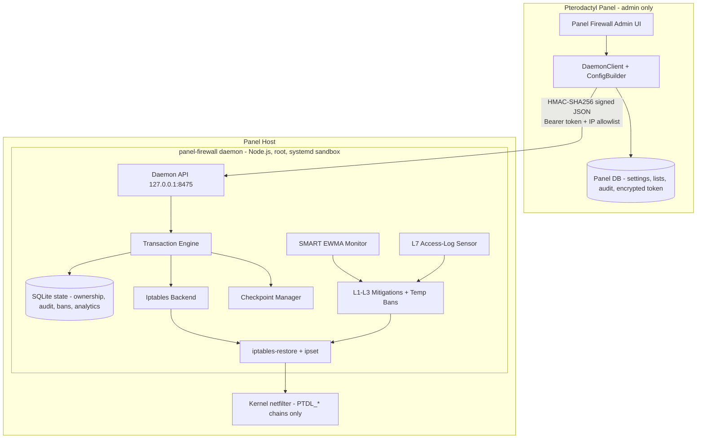

# Panel Firewall

**Host-level firewall & DDoS mitigation for the Pterodactyl Panel host itself** — panel pages, API, websocket, and SFTP traffic terminating on the panel machine — driven by an admin-only panel UI that talks to a privileged, HMAC-authenticated Node.js daemon.

Panel Firewall protects the machine your panel runs on, not the game servers. It programs kernel iptables/ipset rules through atomic `iptables-restore` transactions with checkpoints, a 60-second confirm/auto-rollback window, and an emergency safe mode — so a bad apply can never lock you out. On top of the static L3/L4 ruleset, a SMART engine watches traffic with EWMA anomaly detection and escalates through L1→L3 mitigations automatically, while an L7 sensor tails the web server's access log and temporarily bans HTTP-flood sources — with **no nginx/apache config changes required**.

<div class="tip custom-block" style="margin-top: 1.5rem;">

**Built for PingLess Studios by [AnAverageBeing](https://github.com/AnAverageBeing)**
[GitHub Repo](https://github.com/AnAverageBeing/pterodactyl-panel-firewall) · [Studio](https://studio.pingless.org)

</div>

::: info Panel host vs. per-server protection
Panel Firewall guards the **panel host only**. For per-game-server container firewalling, see the sibling project [Firewall-Plus](/firewall-plus/).
:::

---

## Architecture



The **panel** never calls `iptables` or `ipset`. Every mutation is an HMAC-signed JSON request to the **daemon**, a Fastify + better-sqlite3 service on `127.0.0.1:8475` running as root under a sandboxed systemd unit (`CAP_NET_ADMIN`/`CAP_NET_RAW` only). The daemon is the single privileged component and refuses to touch any chain, rule, or ipset outside its reserved `PTDL_*` / `ptdl-*` ownership prefixes.

---

## Key Features

- **L3/L4 packet hygiene & rate limiting** — invalid/fragment/null-scan/XMAS/NEW-non-SYN drops, per-IP NEW-connection and SYN hashlimits, whitelist-first rule order with a final `RETURN` safety rail. See [Protection Layers](./architecture/protection-layers).
- **5 traffic presets** — `low`, `medium`, `high`, `veryHigh`, `underAttack`, tuning PPS/CPS/SYN/burst/concurrency ceilings per deployment.
- **Whitelist & blacklist ipsets** — `hash:net` sets with strict CIDR validation, O(1) kernel lookup, and temp-ban automation with expiry.
- **SMART adaptive mitigation** — EWMA + variance anomaly detection (default 4σ) driving L1→L3 mitigation levels with cooldowns and repeat-offender scoring.
- **L7 HTTP-flood detection** — tails nginx/apache/caddy access logs (autodetected), counts per-IP request rates in a sliding window, and feeds offenders into the temp-ban ipset with a per-minute ban budget. Private/reserved IPs and whitelist entries are never banned.
- **Transactional, crash-safe applies** — plan → validate → fsync'd checkpoint → atomic `iptables-restore --noflush` → verify → 60s confirm window with automatic rollback, plus startup recovery of expired pending applies.
- **One-command install** — Blueprint `.blueprint` or standalone `install.sh`; the installer auto-installs the daemon and auto-generates the shared bearer token. No manual token step.
- **Analytics & audit** — traffic, mitigation and ban timeseries with Chart.js graphs, dual panel+daemon audit logs, Discord-compatible webhooks with HMAC secrets.

---

## Quick Install

::: code-group

```bash [Blueprint]
cd /var/www/pterodactyl
blueprint -install pterodactylpanelfirewall-v0.3.0.blueprint
```

```bash [Standalone]
cd panel-firewall-standalone
sudo bash install.sh
```

:::

Both paths end the same way: files merged, migrations run, daemon installed to `/opt/panel-firewall`, 64-hex token generated and synced into the panel DB, systemd service running. See [Installation](./getting-started/installation) for the full guide and troubleshooting.

---

## Blueprint vs Standalone

| | Blueprint | Standalone |
|---|---|---|
| Requirement | Blueprint framework installed | Stock Pterodactyl panel, root shell |
| Install command | `blueprint -install <file>.blueprint` | `sudo bash install.sh` |
| Daemon auto-install + auto token | Yes | Yes |
| Provider registration | `data/install.sh` (hard fail) | `data/patch.sh` (hard fail) |
| Laravel 11 `bootstrap/providers.php` | Supported | Supported |
| Uninstall | `blueprint -remove` / `data/remove.sh` | `sudo bash uninstall.sh` |
| Data kept on remove | Yes (unless `--purge-data`) | Yes (unless `--purge-data`) |

---

## Documentation Map

- [Installation](./getting-started/installation) — prerequisites, both install paths, verification, troubleshooting, uninstall
- [Configuration Reference](./configuration/reference) — every panel setting and daemon `config.json` key
- [Daemon API](./user-guide/api) — the HMAC-authenticated REST surface
- [Webhooks & Alerts](./user-guide/webhooks) — Discord-compatible event notifications
- [Architecture](./architecture/overview) — components, apply data flow, security model
- [Protection Layers](./architecture/protection-layers) — L3/L4 ruleset, SMART EWMA, L7 sensor deep dive
