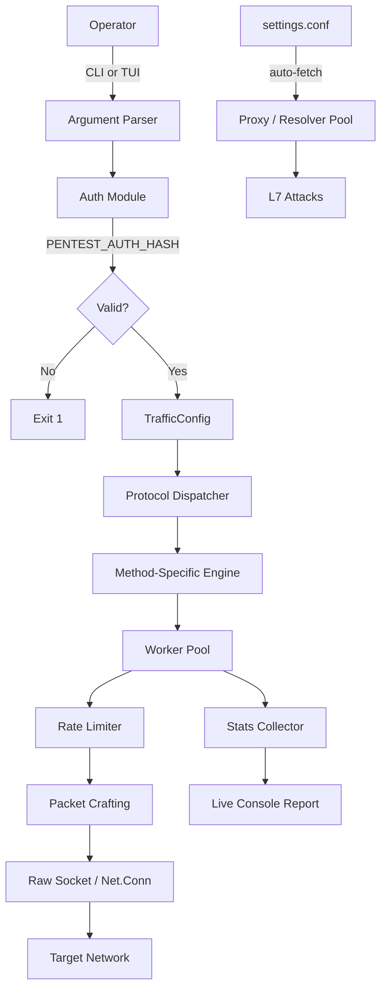
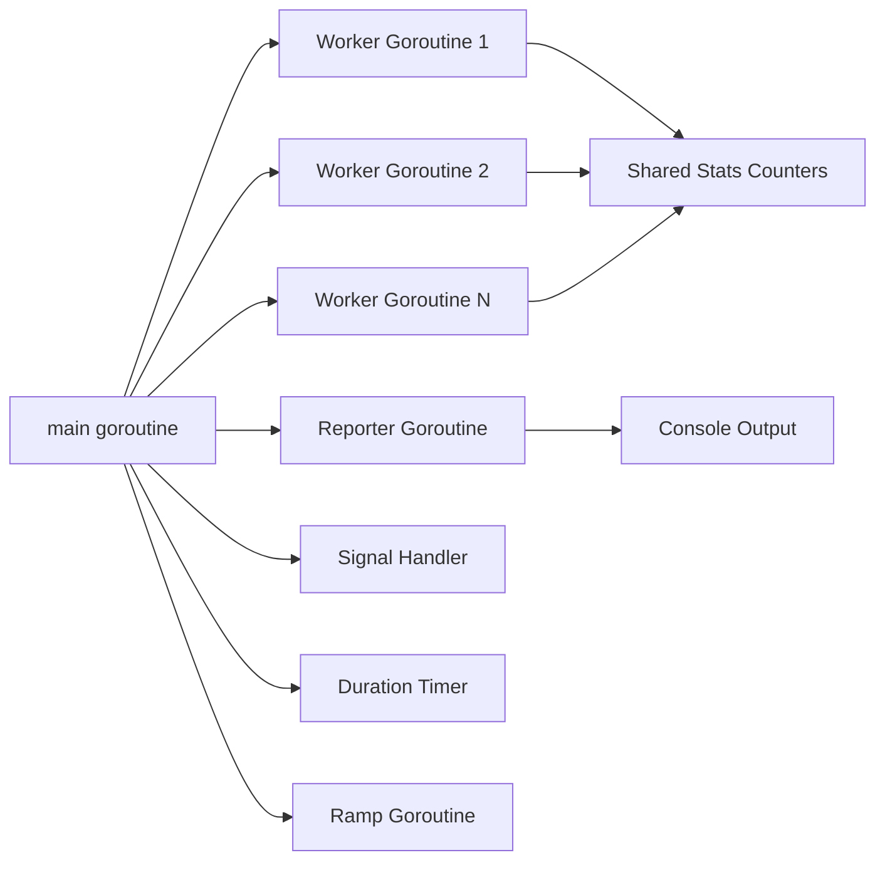
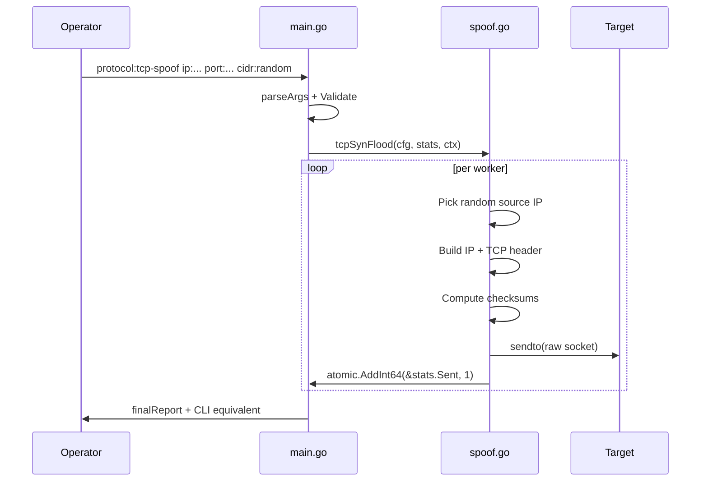
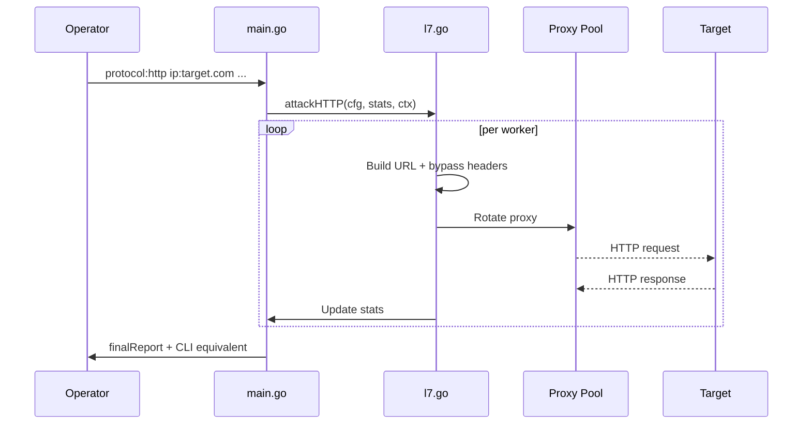

# Architecture Overview

Penetration-v3 is a single Go binary. It reads `settings.conf` from the binary directory, authenticates via a bcrypt hash, then either runs an interactive TUI wizard or executes a CLI `key:value` command.

## High-Level Flow



## File Layout

```text
Penetration-v3/
├── main.go              Entry point, auth, CLI parser, dispatcher, stats
├── panel.go             Interactive TUI wizard and menu system
├── engine.go            Core worker pool, rate limiter, ramp logic
├── settings.go          settings.conf parser + background auto-fetchers
├── spoof.go             Raw socket spoofing, checksums, IPv4/IPv6 crafting
├── scan.go              Amplifier scanner, CIDR probing
├── discover.go          CDN origin discovery
├── l7.go                HTTP/HTTPS, slowloris, xmlrpc, bypass flags
├── h2rapid.go           HTTP/2 Rapid Reset implementation
├── turbo.go             UDP MAX PUSH and high-perf paths
├── bypass.go            WAF/CDN bypass helpers
├── amp_snmp.go          SNMP amplification encoder
├── sendmmsg_linux.go    Linux sendmmsg batching
├── sendmmsg_other.go    Fallback for non-Linux builds
└── integration_test.go  Internal test harness
```

## Component Descriptions

### `main.go` — Entry Point & Dispatcher

- Parses `key:value` CLI arguments through `parseArgs()`.
- Verifies the operator password against `PENTEST_AUTH_HASH` using bcrypt.
- Builds a `TrafficConfig` and dispatches to the correct attack engine via a `switch` on `cfg.Protocol`.
- Handles signals (`SIGINT`, `SIGTERM`) and duration timers.
- Prints the final report and the CLI equivalent command.

### `panel.go` — Interactive Wizard

- Renders the red + white botnet-style ASCII UI.
- Walks the operator through method selection, target, port, rate, workers, and bypass flags.
- Calls `showPanel()` when no CLI args are provided.
- Returns a fully populated `TrafficConfig` that is validated and executed exactly like a CLI run.

### `engine.go` — Worker Pool & Rate Control

- Spawns `cfg.Workers` goroutines.
- Computes per-worker sleep from `targetPPS / workers`.
- Supports optional ramp-up: starts at `ramp%` of target PPS and increases by `rampstep%` every `rampint` seconds.
- Maintains a `sync.Pool` of payload buffers to reduce GC pressure on hot-path floods.

### `settings.go` — Configuration & Auto-Fetchers

- Loads `settings.conf` from the binary directory using `os.Executable()`.
- Refreshes proxy/resolver lists in the background every `proxy_refresh_minutes`.
- Provides HTTP and SOCKS5 proxy pools to L7 attacks.
- Optional `resolver_url`, `target_list_url`, `useragent_url`, `payload_url` for dynamic content.

### `spoof.go` — Raw Socket Crafting

- Implements IPv4 and IPv6 raw socket creation.
- Forges TCP/UDP headers with user-specified source addresses.
- Computes full IP, TCP, and UDP checksums.
- Supports static CIDR, random, subnet, and rotation spoofing strategies.

### `scan.go` — Amplifier Discovery

- Probes a CIDR range for responsive amplification services.
- Tests DNS, NTP, SSDP, CLDAP, SNMP, WS-Discovery, mDNS, and CoAP.
- Prints a comma-separated list of reflectors suitable for `resolvers:`.

### `discover.go` — Origin Discovery

- DNS history heuristics.
- Certificate transparency log hints.
- Direct HTTP/HTTPS probes against candidate IPs.
- Identifies origin servers behind CDNs.

### `l7.go` — Application-Layer Engines

- HTTP/HTTPS flood with bypass flags: random hex paths, dynamic subdomains, Googlebot UA, null UA, random cookies.
- Slowloris, XML-RPC, and connection saturation (`killer`).
- Uses `settings.conf` proxy rotation when available.

### `h2rapid.go` — HTTP/2 Rapid Reset

- Implements CVE-2023-44487 style abuse.
- Opens HTTP/2 streams over TLS and immediately sends `RST_STREAM` frames.
- Designed to stress HTTP/2-aware load balancers and proxies.

### `turbo.go` — High-Performance Paths

- `udp-max` removes the rate limiter and pushes as fast as possible.
- Uses `sendmmsg` batching on Linux where available.
- Tuned socket buffers and batch sizes for high-throughput scenarios.

## Threading Model



- All workers share atomic counters (`stats.Sent`, `stats.Failed`, `stats.Bytes`, `stats.PeakPPS`).
- The reporter reads counters every `500ms` and prints live PPS/Mbps.
- Ramp goroutine updates a shared `rampNanos` value that workers read atomically.
- Signal and duration goroutines set a shared `stopped` atomic flag.

## Data Flow for a Raw-Socket Method



## Data Flow for an L7 Method



## Build & Runtime Security Model

- Authentication hash is **never** embedded in source. The tool fails closed if `PENTEST_AUTH_HASH` is unset.
- Raw-socket methods require root or `CAP_NET_RAW`.
- `settings.conf` is resolved relative to the binary, not `$PWD`, so deployed binaries pick up the correct config.

## Performance Notes

- Payload buffers are pooled via `sync.Pool`.
- Linux builds use `sendmmsg` batch sends.
- Workers scale linearly with CPU cores by default; override with `workers:`.
- L7 attacks benefit from proxy rotation to distribute source addresses.
