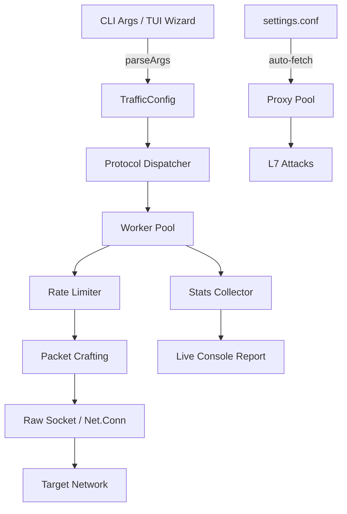

# Penetration-v3

Advanced traffic generation and packet crafting tool for authorized penetration testing, security assessments, and DDoS mitigation validation.

Penetration-v3 supports **30+ attack and reconnaissance methods** across UDP, TCP, ICMP, HTTP/S, DNS, NTP, application-layer protocols, and IPv6. It combines an interactive TUI wizard with a scriptable `key:value` CLI mode, real-time stats, and automatic proxy rotation.

```bash
curl -fsSL https://raw.githubusercontent.com/pingless/pentest-v3/main/install.sh | bash
```

::: warning Authorized Use Only
Penetration-v3 is for authorized security testing on systems you own or have explicit written permission to test. Unauthorized use is illegal.
:::

## What It Does

Send crafted traffic at controlled rates to validate firewalls, DDoS mitigation, rate limits, and network behavior — from simple UDP floods to IPv6 fragment floods, HTTP/2 Rapid Reset, and amplification vectors.

## Key Features

- **30+ methods** — UDP, TCP, ICMP, raw packets, amplification, L7, game servers, reconnaissance
- **Dual interface** — Interactive TUI wizard or CLI `key:value` mode
- **IPv6 ready** — Raw sockets, fragments, amplification, and spoofing all support IPv6
- **Amplification scanning** — Discover vulnerable DNS, NTP, Memcached, SSDP, CLDAP, RDP, SNMP, WS-Discovery, mDNS, CoAP reflectors
- **IP spoofing** — Static, random, subnet, and rotation strategies via raw sockets
- **WAF/CDN bypass** — Random hex paths, dynamic subdomains, Googlebot UA, null UA, random cookies
- **HTTP/2 Rapid Reset** — CVE-2023-44487 style stream abuse
- **Auto proxy rotation** — HTTP and SOCKS5 proxy pools refreshed from remote lists
- **Real-time stats** — Live PPS, Mbps, error rates, peak tracking
- **Single binary** — Compiled Go binary with zero external dependencies

## Architecture Overview



## Method Categories

| Category | Methods |
|----------|---------|
| L3/L4 | `udp`, `tcp`, `icmp`, `raw`, `tcp-ack`, `tcp-rst`, `tcp-synack`, `tcp-mb`, `frag`, `udp-max`, `tcp-spoof`, `udp-spoof` |
| Amplification | `dns`, `ntp`, `mem`, `char`, `ssdp`, `cldap`, `rdp`, `snmp`, `wsdisc`, `mdns`, `coap`, `amp-all`, `amp-scan` |
| L7 | `http`, `https`, `slowloris`, `killer`, `xmlrpc`, `ovh-bypass`, `h2rapid` |
| Game | `minecraft`, `valve`, `teamspeak`, `mcpe` |
| Recon | `discover`, `discover-attack` |

## Quick Start

```bash
# 1. Install
sudo bash install.sh

# 2. Set auth hash
python3 -c "import bcrypt; print(bcrypt.hashpw(b'mysecret', bcrypt.gensalt()).decode())"
export PENTEST_AUTH_HASH='<hash>'

# 3. Run a UDP flood
./pentest-v3 protocol:udp ip:127.0.0.1 port:8080 pps:1000 duration:10
```

## Comparison

| Capability | Penetration-v3 | Typical Stress Tools |
|------------|---------------|----------------------|
| IPv6 raw sockets | ✅ Full | ❌ Rare |
| HTTP/2 Rapid Reset | ✅ Built-in | ❌ Manual |
| Amplification vectors | ✅ 10 | 3-5 |
| Interactive TUI | ✅ Yes | Rare |
| Auto proxy rotation | ✅ Yes | Manual |
| Single binary | ✅ Yes | Often multi-dep |

[Repository](https://github.com/AnAverageBeing/Penetration-v3) · [Discord](https://discord.gg/pingless)
