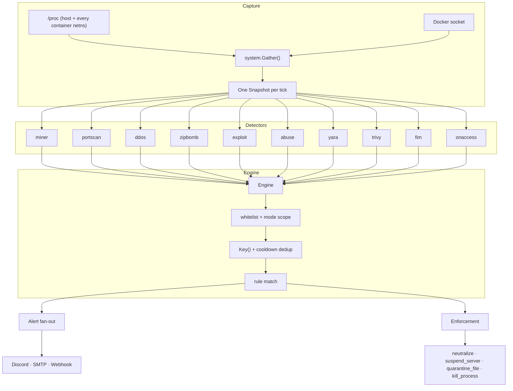
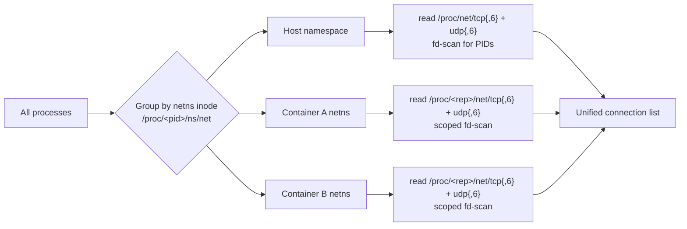
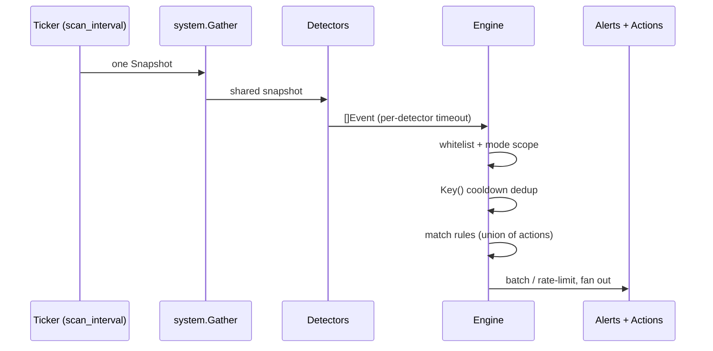

# Architecture Overview

Protection Plus is a single static Go binary (zero cgo) that gathers system state from `/proc` and the Docker socket, runs it through independent detectors, and feeds the resulting events into an engine that alerts and enforces. This page walks through how the pieces fit together in v1.0.0.



---

## The single-snapshot model

The most important design choice: **one capture per tick, shared by every detector.**

On each `scan_interval`, the engine calls `system.Gather()` exactly once to build a `Snapshot` containing:

- **Processes** — full process table with CPU jiffies, disk read/write byte counters, UID, PGRP and container attribution (see below).
- **Connections** — host *and* every container network namespace, TCP and UDP, with owning PIDs resolved.
- **CPU totals** (`CPUTotal`) and **CPU count** (`NumCPU`) for percentage maths.
- A pre-built `byPID` index so detectors do O(1) process lookups instead of rescanning.

Every detector reads from this one snapshot instead of independently walking `/proc`. That cuts the most expensive part of a scan — the `/proc` and socket-table traversals — from roughly four walks per tick to one, a **~4x reduction in syscall cost** (the figure is documented in the `Snapshot` source itself).

---

## Process introspection from /proc

Everything Protection Plus knows about processes comes straight from `/proc`, in pure Go — no cgo, no external tools. For each PID it reads:

- `stat` — comm, state, **PGRP** (process group), user/kernel jiffies, start time. PGRP matters because detectors aggregate by process group for **pipeline-aware rates**: `tar czf - dir | gzip > out.tgz` is measured as one workload, not two innocent-looking halves.
- `cmdline` — the full command line (NUL-joined into spaces).
- `exe` — the resolved binary path (a symlink read).
- `status` — the real UID.
- `cgroup` — parsed for a 64-hex container id; works for cgroup v1 and v2 across docker/containerd/k8s, so every process is attributed to its container for free.
- `io` — cumulative `read_bytes`/`write_bytes` counters (requires root or `CAP_SYS_PTRACE`; degrades to zeros otherwise).

CPU percentages are derived from jiffy deltas between ticks against `/proc/stat` totals. `USER_HZ` is hardcoded to 100 (effectively always true on Linux) to avoid a cgo `sysconf` call. Processes that exit mid-read are skipped quietly — a partially readable `/proc` is a normal Tuesday, not an error.

---

## Container network-namespace visibility

Docker/containerd give each container its **own network namespace**, so container sockets never appear in the host's `/proc/net/tcp`. Protection Plus handles this explicitly:



- Processes are bucketed by their network-namespace inode (read from `/proc/<pid>/ns/net`).
- The host namespace is read from `/proc/net/tcp{,6}` **and** `/proc/net/udp{,6}` — UDP support means amplification-style abuse and QUIC traffic are visible too.
- Each **container** namespace is read through one of its own processes (`/proc/<pid>/net/tcp` and the UDP equivalents), where `<pid>` is the lowest PID in that namespace's bucket.
- Container connections get attribution for free: the socket→PID mapping is scoped to just that container's (few) processes, so there's **no host-wide fd walk** for container traffic, and any unresolved socket falls back to the container's main process.
- Host-network-mode containers are still attributed, via the process table's container ids.

The result: a miner phoning a pool or a scan launched from inside a container is fully visible and correctly attributed. Inspect it live with [`protection debug-conns`](../user-guide/cli.md#protection-debug-conns).

---

## Socket → PID resolution

Mapping a connection to its owning process means matching each socket inode against a `socket:[inode]` symlink in some `/proc/<pid>/fd` directory — one `readlink` per fd, and busy hosts can have hundreds of thousands of fds. Protection Plus keeps this bounded:

- **Worker pool** — the fd walk fans out across `NumCPU × 4` workers (minimum 4, capped at 64).
- **Chunked within processes** — each process's fd list is split into 2048-entry chunks, so a single fd-heavy process (a leak, or an abuser deliberately holding many sockets) is spread across all workers instead of pinning one.
- **1.5 s time budget** — `pidResolveBudget` caps total resolution time per scan. On a healthy node this never triggers (resolution finishes in milliseconds); if it does trip, Protection Plus degrades gracefully: unresolved connections simply have `PID == 0`, are skipped by pid-level checks, and container-level checks are unaffected.

---

## The detector interface

Every detector is an independent unit behind one tiny interface (`internal/detectors/detector.go`):

```go
type Detector interface {
    Name() string
    Run(ctx context.Context, snap *system.Snapshot) ([]core.Event, error)
}
```

`Run` is called once per tick with the shared snapshot and must return within roughly one interval. A detector emits `core.Event` values — severity, category, title, description, target (pid/container/path) and free-form evidence — and the engine does the rest.

**Adding a new detector** is two steps:

1. Implement `Name()` + `Run(ctx, *system.Snapshot)` in `internal/detectors/`.
2. Register it in `buildDetectors()` in `cmd/protection/main.go` (gated on its config section).

Scoping, dedup, rule matching, alerting, batching, rate limiting and enforcement all work unchanged — the new detector just starts emitting events. Detectors that need deltas (CPU%, disk-write rate) keep small per-PID state between ticks; a shared `containerResolver` caches container-id → name/server-uuid lookups for 30 s so every detector can annotate events cheaply.

---

## The engine

The engine orchestrates everything after detection:



1. **Whitelist & scope** — events matching a whitelisted path or container are dropped first; then `general.mode` (`server`, `docker`, `both`) decides whether container-related and host events are in scope at all.
2. **Cooldown dedup** — each event computes a stable `Key()` (`category|detector|target`, where target is the container id, path, or `pid:N`). Repeat findings for the same key inside `general.cooldown` are suppressed, and the key map is garbage-collected opportunistically.
3. **Rule match** — every rule whose category list (`*` or explicit) and `min_severity` match contributes its actions; the engine takes the **union**.
4. **Dispatch** — enforcement actions run sequentially (respecting global `dry_run`); alerts fan out concurrently.

Alert delivery has three layers of control:

- **Per-channel severity gates** — each channel has its own `min_severity`; a channel only receives events at or above it. Each send runs in its own goroutine with a 12 s timeout, so a slow webhook never blocks detection.
- **Optional batching** — when `alerts.batch` is enabled, alerts flow individually until a threshold of events arrives inside a window; Protection Plus then switches to digest mode and delivers one summarised "N security events (batched)" alert per burst instead of a flood.
- **Optional rate limit** — `limits.max_alerts_per_minute` caps total dispatches per minute (disabled by default); when the cap trips, one warning is logged per minute and the rest are dropped.

Detectors themselves get an optional **per-detector timeout** (`limits.detector_timeout`): a detector that overruns its context is aborted with a warning and the tick continues without it.

---

## Enforcement backends

Actions live behind a `Registry` keyed by the names rules reference; every action honours the global dry-run switch. The backends:

- **Docker** (`kill_container`, `stop_container`) — a deliberately tiny Docker Engine API client speaking HTTP over the unix socket (`internal/docker`). The official SDK and its dependency tree are avoided; only a handful of endpoints are needed, with a 5 s dial and 15 s request timeout.
- **Pterodactyl** (`suspend_server`) — resolves the panel's internal server id from the event's server uuid/identifier (derived from Wings container labels/names) via the application API, then suspends. Skips quietly on events with no associated server, so it can sit harmlessly in a shared rule.
- **File quarantine** (`quarantine_file`) — moves the offending file into a locked-down quarantine directory (`0700`) instead of deleting it, preserving evidence. Uses `rename` with a copy-then-remove fallback across filesystems, then `chmod 000` so the payload can't be executed. (`delete_file` exists for when you really mean it.)
- **Smart neutralize** (`neutralize`) — the default-rule action: containerised threat with Docker available → kill the container; otherwise → `SIGKILL` the process. One policy line works on Pterodactyl/Docker nodes and plain VPS hosts alike.

---

## The intel subsystem

`internal/intel` keeps the threat intelligence fresh: the YARA rule set and the SHA-256 malware hash blocklist (MalwareBazaar export).

- **Atomic downloads** — every write is temp-file-then-`rename`, so readers never see a partial file. Temp files live next to the destination (same filesystem for the rename, and inside the daemon's writable state dir, since systemd sandboxes make `/tmp` read-only for the service).
- **Streaming hashlist parse** — the export may arrive as raw text or a zip; either way it's streamed to disk and parsed line-by-line, so even the multi-hundred-MB "full" export never sits in memory at once. Lines are lowercased, validated as SHA-256 hex, deduplicated and stored one hash per line. Zip payloads are extracted by streaming the first regular file to a temp file that deletes itself on close.
- **Independent failure domains** — rules and hashlist update separately; one source failing never blocks the other, and partial success is reported as such.
- The in-memory `HashList` is an RWMutex-guarded set with case-insensitive lookups, loaded from the downloaded blocklist plus an optional operator-supplied custom list.

---

## The on-access subsystem

Periodic sweeps are the backstop; **on-access scanning** is the fast path that catches a malicious upload the moment it lands. `internal/detectors/onaccess.go` combines fsnotify with a bounded worker pool:

- A single **fsnotify watcher** covers every configured upload path recursively (new directories are added to the watch set as they appear). The watcher starts lazily on the first `Run` call so the engine can construct all detectors up front without paying for inotify watches it may never use.
- Writes are **debounced** per path (default 500 ms settle): editors and downloaders write in bursts, and scanning a half-written file wastes I/O and can misfire.
- Settled files go through a **worker pool capped at 2 concurrent scans** — a SHA-256 blocklist lookup and, if the `yara` binary is in PATH, a YARA sweep against the intel-maintained rules.
- Hard bounds everywhere: blocklist hashing skips files over 512 MiB, YARA skips files over 64 MiB with a 30 s per-invocation timeout, and the pending-event queue is capped at 1000 (oldest dropped, with a warning) so a write storm can't grow memory without bound.
- Scanning happens in background workers decoupled from the engine tick; `Run` simply drains whatever the workers found since the last call. Watcher errors (queue overflows and the like) are skipped silently — the periodic sweeps remain the backstop.

---

## Self-protection

A security daemon is itself a target, so Protection Plus watches its own back:

- **FIM** — the `fim` detector watches operator-listed files (the daemon's own binary, config, unit files, …). The first sighting records a SHA-256 baseline (streamed, so multi-gigabyte files never load into memory); any later content change raises a high-severity event and becomes the new baseline, so each change alerts exactly once. Hashing honours its own configured interval rather than running every tick.
- **systemd watchdog** — the engine reports `READY=1` at startup, pets `WATCHDOG=1` after every scan, and sends `STOPPING=1` on shutdown. If the detection loop hangs past `WatchdogSec` (60 s in the shipped unit), systemd kills and restarts the service. The `sd_notify` protocol is implemented in **pure Go** (`internal/system/sdnotify.go`) — a unixgram datagram to `$NOTIFY_SOCKET`, abstract-socket `@` prefix handled — with no cgo and no libsystemd dependency. It's a no-op when not running under systemd.
- **Unit hardening** — the shipped unit runs with `ProtectSystem=strict`, `ProtectHome=read-only`, and only three ambient capabilities (`CAP_SYS_PTRACE`, `CAP_KILL`, `CAP_DAC_READ_SEARCH`). Writes are limited to `ReadWritePaths=/var/lib/protection /var/log -/var/lib/pterodactyl/volumes` — the `-` prefix means the Pterodactyl path is skipped when absent, so the same unit starts cleanly on non-Pterodactyl hosts.

---

## Resource-safety design

The watchdog must never become the problem it's watching for. Resource safety is layered:

- **Config `limits` section** — everything is opt-in: `detector_timeout` caps a single detector per tick, `max_alerts_per_minute` caps alert fan-out. Neither is enabled by default.
- **Worker pools** — socket→PID resolution uses a capped pool (max 64 workers); on-access scanning caps concurrent file scans at 2; alert sends are goroutines with individual timeouts.
- **Time budgets** — 1.5 s for PID resolution, 30 s per YARA invocation, 12 s per alert send, 5 s/15 s on the Docker client, 5 minutes on intel downloads. Nothing in the hot path can block forever.
- **Size caps** — 512 MiB for on-access hashing, 64 MiB for on-access YARA, bounded event queues and digest text.
- **mtime caches** — sweep detectors (zipbomb, exploit) keep a directory-mtime cache and skip walking directories that haven't changed since the last pass (best-effort: some filesystems don't update directory mtime on every change).
- **systemd guardrails** — the unit caps the daemon at `MemoryMax=256M` and `CPUQuota=50%`, so even a pathological host can't let Protection Plus starve the workloads it protects.

---

## Source layout

```text
cmd/protection        CLI entrypoint, embedded starter config, detector wiring
internal/core         Event, Severity, Category (shared leaf package)
internal/config       YAML config + defaults + validation
internal/system       /proc + netns introspection, sd_notify (pure Go)
internal/docker       tiny Docker Engine API client over the unix socket
internal/intel        threat-intel downloads + hash blocklist
internal/detectors    miner, portscan, ddos, zipbomb, exploit, abuse,
                      yara, trivy, fim, onaccess
internal/alerts       discord, smtp, webhook
internal/actions      docker, file, pterodactyl, process, neutralize
internal/engine       scheduler, scope, dedup, rule matching, dispatch,
                      batching, rate limiting
packaging             systemd unit (hardened, watchdog-enabled)
```

---

## Design principles

- **Host-side, agentless** — tenants can't see or evade it.
- **Pure Go, single static binary** — drop it anywhere, no runtime deps (even `sd_notify` is hand-rolled).
- **Safe by default** — dry-run first; destructive actions and all resource limits are opt-in.
- **One snapshot, many detectors** — cheap and consistent.
- **Bounded everything** — worker pools, time budgets, size caps and mtime caches keep the daemon cheap on pathological hosts.
- **Graceful degradation** — missing root, missing Docker, a missing `yara` binary or a socket-leaking neighbour reduces capability rather than breaking the loop.

## Next steps

- **[How Detection Works →](../user-guide/detection.md)** — per-detector logic.
- **[Actions & Rules →](../user-guide/actions-rules.md)** — how findings become enforcement.
- **[Configuration Reference →](../configuration/reference.md)** — tune the model above.
