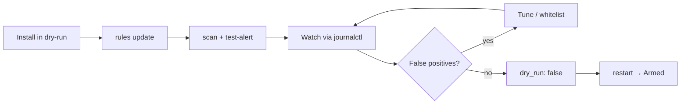

# Quick Start

This is the recommended path from zero to armed protection. The golden rule: **observe first, enforce second.**

## 1. Install

```bash
curl -fsSL https://raw.githubusercontent.com/AnAverageBeing/protection/main/install.sh | sudo bash
```

Answer the prompts. For your first run, keep **`Arm enforcement now?` → N** so you start in dry-run. See [Installation](./installation.md) for what every question does.

## 2. Pull the threat intel

```bash
sudo protection rules update
```

This downloads the curated YARA rule bundle and the MalwareBazaar SHA-256 blocklist. The on-access antivirus needs this **once** for hash checking — until then the blocklist is simply empty. The daemon refreshes both automatically every 24h afterwards.

::: tip OPTIONAL SCANNERS
Two detectors shell out to external CLIs and are no-ops until you install them:

- `sudo apt install yara` — enables YARA scanning in the on-access antivirus (`onaccess.yara_check`) and the periodic `yara` sweep (disabled by default).
- `trivy` — enables container-image vulnerability scanning when you set `detectors.trivy.enabled: true`.
:::

## 3. See what it sees

```bash
protection status          # config + docker connectivity
sudo protection scan       # one-off scan, no enforcement
```

`scan` runs every detector once against a fresh system snapshot and prints a severity-sorted table. On a clean node you'll see `✓ no threats detected`. It never takes action and ignores cooldowns — pure reconnaissance.

## 4. Confirm alerts work

```bash
protection test-alert
```

You should get a synthetic **critical** test alert in every channel you enabled (Discord/email/webhook). If not, see [Alerts](../user-guide/alerts.md).

## 5. Watch it in dry-run

Let the daemon run and watch what it *would* do:

```bash
journalctl -u protection -f
```

In dry-run, enforcement is logged as `[dry-run] would run action "neutralize" on …` instead of actually firing. Leave it for a few hours (ideally a day) on a real workload to catch false positives and tune thresholds.

::: tip TUNE WHILE OBSERVING
If a legitimate workload trips a detector, raise the relevant threshold in `/etc/protection/config.yaml` (e.g. `cpu_threshold`, `distinct_ports`, `ratio_threshold`) or add the target to the `whitelist:` section, then `sudo systemctl restart protection`. See the [Configuration Reference](../configuration/reference.md).
:::

## 6. Arm enforcement

When the alerts look right and false positives are tuned away, flip the switch:

```yaml
# /etc/protection/config.yaml
general:
  dry_run: false
```

## 7. Restart to apply

```bash
sudo systemctl restart protection
```

Protection Plus will now **act** on threats per your [rules](../user-guide/actions-rules.md): kill the offending container or process, suspend the Pterodactyl server, quarantine the bomb — and alert every time.

---

## The 30-second mental model



---

## Next steps

- **[Configuration Reference →](../configuration/reference.md)** — every value, default, and when to change it.
- **[How Detection Works →](../user-guide/detection.md)** — what each detector actually checks.
- **[Actions & Rules →](../user-guide/actions-rules.md)** — map threats to enforcement.
