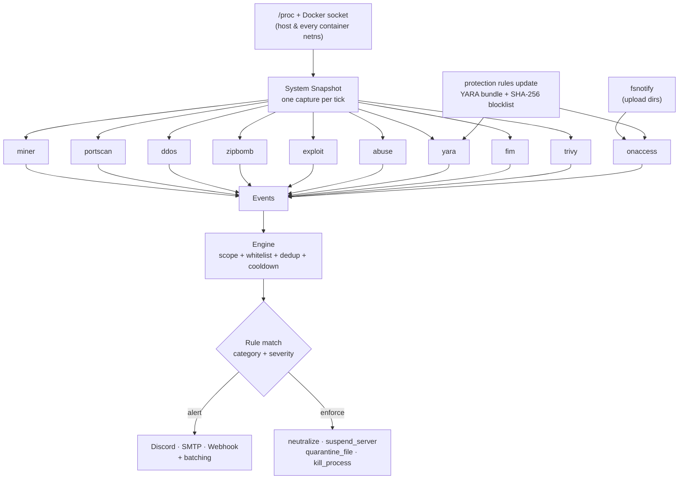

# Protection Plus

**Kernel-level abuse protection & antivirus for container hosts** — a single static Go binary that guards Pterodactyl/Wings nodes, generic Docker hosts and bare VPS boxes against the things that keep hosting operators awake at night.

It watches every process, connection, container, archive and uploaded file on the host, and when it finds a real threat it **alerts** (Discord, email, webhook) and **enforces** (kill container, suspend the Pterodactyl server, quarantine the file, kill the process) — all driven by a simple, overridable rule set.

<div class="tip custom-block" style="margin-top: 1.5rem;">

**🛡️ Built for PingLess Studios by [AnAverageBeing](https://github.com/AnAverageBeing)**  
[GitHub Repo](https://github.com/AnAverageBeing/protection) · `MIT License` · runs as the system command `protection`

</div>

---

## What it protects against

Ten independent detector modules — delete a block from the config (or set `enabled: false`) and that feature disappears completely.

| Threat | What it catches |
| --- | --- |
| ⛏️ **Cryptocurrency miners** | Known miner binaries, miner argument fingerprints (`stratum+tcp`, `--donate-level`…), sustained high CPU (even *unknown* miners), connections to mining-pool ports, and masked (deleted-on-disk) binaries |
| 🌊 **Outbound DDoS / stress tools** | Per-container egress flood rates (pps/bps via docker stats), known tools (hping3, t50, mhddos, LOIC/HOIC…), `java -jar *ddos.jar` flooders, and per-process connection floods |
| 🔭 **Port scans** | Half-open (`SYN_SENT`) connection fan-out across many ports/hosts in a sliding window, plus scanner binaries (nmap, masscan, zmap, rustscan…) |
| 💣 **Decompression bombs** | zip / jar / tar / gzip / xz / bzip2 / 7z / rar bombs detected from archive metadata **without extracting** — caught mid-extraction by an event-driven hot trigger *and* on disk by a periodic sweep |
| 🐚 **Exploits & container escapes** | Privesc/exploit tools (pwnkit, dirtypipe, linpeas…), network-bound reverse shells, privilege escalation, `nsenter` namespace breakout, and setuid payloads dropped in world-writable dirs |
| 🧅 **Tor / proxy / VPN abuse** | Tor exits & relays, proxy/VPN tunnels (OpenVPN, WireGuard, Shadowsocks, v2ray/xray, trojan, hysteria, sing-box, ngrok, frp…), customer mail servers, IRC bots, listeners on Tor/SOCKS/proxy ports, and executables launched from user upload dirs |
| 🦠 **Malware (on-access antivirus)** | fsnotify watches upload dirs and scans every file the moment it is closed after writing — SHA-256 against the MalwareBazaar hash blocklist, then YARA against the curated rule bundle. Hits map to the `malware` rule (quarantine + alert by default) |
| 🧬 **YARA sweeps** | Periodic full-tree YARA scan of your scan paths via the `yara` CLI — the backstop to the on-access hot path (disabled by default) |
| 🩹 **Tampering (FIM)** | File-integrity monitoring: alerts when the daemon's own binary, its config, or any listed path changes on disk — catches attackers tampering with Protection itself |
| 🧪 **Vulnerable images** | Container-image vulnerability scanning via the `trivy` CLI — one alert per image with HIGH/CRITICAL counts and the top CVEs (disabled by default, alert-only) |

---

## Quick install

```bash
curl -fsSL https://raw.githubusercontent.com/AnAverageBeing/protection/main/install.sh | sudo bash
```

The installer downloads the prebuilt static binary for your architecture, installs the systemd service, then **asks a few quick questions** (installation name, what to protect, Discord webhook, Pterodactyl auto-suspend, scan directories) and writes a config in safe **dry-run mode**. No Go toolchain, no dependencies.

After installing, pull the threat intel once so the antivirus layer is fully armed, and take a look at what the daemon sees:

```bash
sudo protection rules update   # YARA rule bundle + SHA-256 malware blocklist
sudo protection scan           # one-shot recon: every detector, no actions taken
```

::: tip START IN DRY-RUN
Protection ships with `dry_run: true`. It detects and alerts but won't take destructive action until *you* arm it. Watch the alerts for a day, tune thresholds, then flip `dry_run: false` and restart. See [Quick Start](./getting-started/quick-start.md).
:::

---

## The antivirus layer

Beyond behavioral abuse detection, Protection Plus v1.0.0 ships a real antivirus pipeline for user uploads:

- **On-access scanning.** A single recursive fsnotify watcher covers your upload trees; every file is scanned the moment it is closed after writing (debounced ~500 ms so editors and downloaders writing in bursts don't misfire).
- **SHA-256 blocklist.** Files are hashed against the MalwareBazaar SHA-256 export held in memory — a hit is **critical**.
- **Curated YARA rules.** Files are then matched against the project's curated rule bundle (webshells, miners, Tor, Mirai, IRC bots, Linux backdoors, privesc exploits, crypto stealers) via the `yara` CLI — a hit is **high**.
- **Intel management.** `protection rules update` downloads the rule bundle and hash blocklist atomically (temp file + rename), merges your `custom_hashlist`, and the daemon auto-refreshes every 24 h. Point `intel.rules_url` at your own URL to self-host.

Matched files land in the `malware` category, which the default policy quarantines (moved aside, `chmod 000` — evidence preserved) and alerts on.

---

## Why Protection Plus?

A Pterodactyl/Docker node hands semi-trusted strangers the ability to run arbitrary code. One bad tenant can mine Monero on your CPUs, launch a DDoS that gets your IP null-routed, run a Tor exit on your bandwidth, upload a webshell through the panel, drop a zip bomb that fills your disk, or attempt a container escape. Protection Plus is the watchdog that sits on the host — **outside** every container — and shuts that down before it becomes your problem.

| Approach | Pain point |
| --- | --- |
| **Manual `htop` + luck** | You find out when the abuse report or the null-route arrives |
| **In-container agents** | Tenants can see, kill, or evade anything inside their own container |
| **Generic host IDS (e.g. fail2ban)** | Log-based, reactive, no container attribution, no miner/zip-bomb/malware concept |
| **Cloud "container security" SaaS** | Expensive, closed-source, heavy, overkill for a game-hosting node |

Protection Plus fills the gap with a **single static binary**, `/proc` + the Docker socket, and a security-first default policy.

---

## Architecture at a glance



Every detector reads from one shared per-tick snapshot, emits `Event`s, and the engine matches them against your rules to decide what to alert and what to enforce. The on-access scanner runs event-driven alongside the tick loop, fed by the same intel the periodic YARA sweep uses.

---

## Key features

- **Single static binary, zero cgo.** Drop it on any Linux amd64/arm64 node — the only build dependency is `gopkg.in/yaml.v3`.
- **No agents inside containers.** Watches from the host, so tenants can't see, disable, or evade it.
- **Full container network visibility.** Reads each container's network namespace directly, so a miner phoning a pool or a scan launched *inside* a container is seen and attributed to that container.
- **Antivirus built in.** fsnotify on-access scanning of uploads, a SHA-256 MalwareBazaar blocklist, and a curated YARA bundle — managed with `protection rules update` and a 24 h auto-refresh.
- **Works on bare VPS too.** The smart `neutralize` action kills the *container* for container threats and the *process* for host threats — one policy, every host type.
- **Event-driven, not just polled.** A CPU + disk-write spike (an active extraction) instantly triggers a targeted zip-bomb check; uploads are scanned the moment they land — no waiting for the next sweep.
- **Pterodactyl-native.** Maps offending containers and volume files back to the owning server UUID and can suspend the server via the Application API.
- **Beautiful alerts, without the flood.** Markdown-formatted Discord embeds, plus SMTP and generic JSON webhooks — each with its own minimum-severity gate, plus optional **alert batching** that collapses a burst into one digest alert.
- **Whitelisting.** Trusted paths are never scanned or flagged; trusted containers (full ID, short ID, or name) are never flagged, killed, or suspended — checked before rules ever see an event.
- **Self-healing under systemd.** The unit runs with `WatchdogSec=60s`; the daemon pets the watchdog after every scan tick via pure-Go `sd_notify`, so a hung detection loop gets killed and restarted automatically.
- **Measured footprint.** ~13 MB RSS and ~1–3% CPU at the default 5 s interval on live nodes — and a synthetic **104K pps** outbound flood from inside a container was detected and attributed to that container.
- **Safe by default & fully tunable.** Ships in dry-run; every threshold, signature list and rule lives in one documented YAML file.

---

## Modes

Set `general.mode` (or pick it in the installer) to scope what Protection Plus acts on:

| Mode | Scope |
| --- | --- |
| `server` | Host/VPS processes only — great for a plain VPS |
| `docker` | Containerised threats only — Pterodactyl/Docker nodes |
| `both` | Everything (default) |

---

## Comparison

| Capability | Protection Plus | fail2ban | In-container agent | Cloud SaaS |
| --- | :---: | :---: | :---: | :---: |
| Miner detection (CPU + pool + signature) | ✅ | ❌ | ⚠️ | ✅ |
| Outbound DDoS detection | ✅ | ❌ | ⚠️ | ✅ |
| Zip-bomb detection (no extract) | ✅ | ❌ | ❌ | ⚠️ |
| Container escape / reverse shell | ✅ | ❌ | ⚠️ | ✅ |
| Tor / proxy / VPN abuse detection | ✅ | ❌ | ⚠️ | ⚠️ |
| On-access malware scanning (hash + YARA) | ✅ | ❌ | ⚠️ | ✅ |
| Self-tamper monitoring (FIM) + watchdog | ✅ | ❌ | ❌ | ⚠️ |
| Container network visibility (per-netns) | ✅ | ❌ | ✅ | ✅ |
| Tenant-evasion resistant (host-side) | ✅ | ✅ | ❌ | ✅ |
| Pterodactyl auto-suspend | ✅ | ❌ | ❌ | ❌ |
| Single static binary, no deps | ✅ | ⚠️ | ❌ | ❌ |
| Open source / self-hosted | ✅ | ✅ | varies | ❌ |

> **Bottom line:** If you run a Pterodactyl/Docker node or a multi-tenant VPS and want miners, floods, scans, bombs, escapes, abuse tunnels and malware caught and stopped automatically, Protection Plus is purpose-built for the job.

---

## Next steps

- **[Installation →](./getting-started/installation.md)** — Get running in under a minute.
- **[Quick Start →](./getting-started/quick-start.md)** — The safe dry-run → arm workflow.
- **[Configuration Reference →](./configuration/reference.md)** — Every config value explained.
- **[CLI Reference →](./user-guide/cli.md)** — Every command and flag.
- **[How Detection Works →](./user-guide/detection.md)** — The industry-standard checks behind each detector.
- **[Architecture →](./architecture/overview.md)** — Snapshot model, engine, netns, performance.

---

<div class="footer-note">

**Developed by [AnAverageBeing](https://github.com/AnAverageBeing) for [PingLess Studios](https://github.com/AnAverageBeing)**

For hosting operators who'd rather sleep at night. · `MIT License`

</div>

<style scoped>
.footer-note {
  margin-top: 3rem;
  padding: 1.5rem;
  border-top: 1px solid var(--vp-c-divider);
  text-align: center;
  font-size: 0.875rem;
  color: var(--vp-c-text-2);
}
.footer-note a {
  font-weight: 600;
}
</style>
