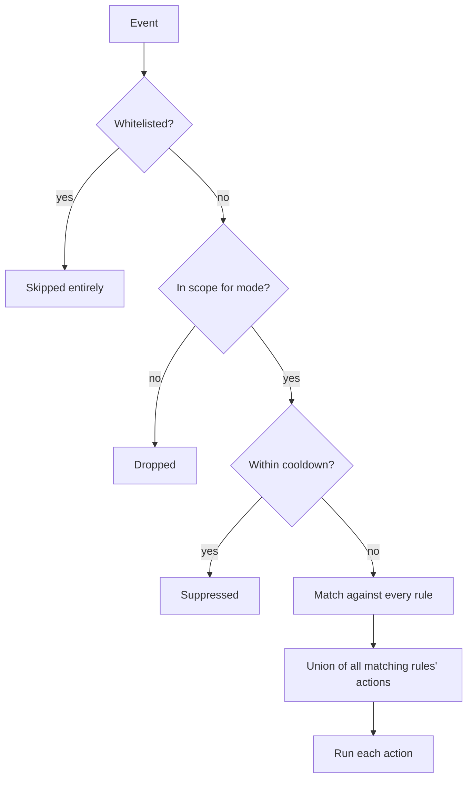

# Actions & Rules

When a detector raises a finding, the **rules** decide what happens: which alert channels fire and which enforcement actions run. This page covers the action catalogue, how rules are evaluated, and the safety rails (cooldown, whitelist, dry-run).

---

## Action catalogue

There are nine actions. `alert` and `log_only` are handled by the engine itself; the other seven are enforcement actions executed by the action registry.

| Action | Effect | Backend required |
| --- | --- | --- |
| `alert` | Notify all alert channels (each gated by its own `min_severity`). | — |
| `neutralize` | **Smart:** kills the container for containerised threats, else `SIGKILL`s the host process. Falls back to process-kill when Docker is unavailable. | none (uses Docker when present) |
| `kill_container` | `SIGKILL` the offending container immediately. Fails if the event has no container ID. | `actions.docker` |
| `stop_container` | Graceful container stop with a **10-second grace period** before Docker forces the kill. | `actions.docker` |
| `suspend_server` | Suspend the server via the **Pterodactyl Application API** (see below). Silently skips host threats with no associated server, so it can sit harmlessly in a shared rule. | `actions.pterodactyl` |
| `quarantine_file` | Move the file into `quarantine_dir` (as `<unix-timestamp>_<name>`) and `chmod 000` it so the payload cannot be executed — evidence preserved. Falls back to copy+remove across filesystems. | `actions.file` |
| `delete_file` | Permanently remove the file. | `actions.file` |
| `kill_process` | `SIGKILL` the offending PID. **Refuses PID ≤ 1**, so it can never take down init. | — |
| `log_only` | Record the finding in the log only — no alert, no enforcement. | — |

::: warning BACKENDS GATE AVAILABILITY
An action is only registered when its backend is enabled (`actions.docker`, `actions.file`, `actions.pterodactyl`). A rule referencing an unregistered action logs `action "…" is not enabled or does not exist` and that action is skipped — other actions in the rule still run.
:::

### How `suspend_server` works

The event carries the Pterodactyl server UUID (derived from the container, which Wings names by UUID). The action pages through `GET /api/application/servers`, matches the UUID or its 8-char short identifier, resolves the internal numeric server ID, then issues `POST /api/application/servers/{id}/suspend`. It needs an **Application API key** with server read + suspend:

```yaml
actions:
  pterodactyl:
    enabled: true
    url: "https://panel.example.com"
    api_key: "ptla_…"   # Application API key, not a client key
```

::: tip WHY `neutralize` EXISTS
On a Pterodactyl/Docker node the abuser is a container; on a bare VPS it's a host process. `neutralize` picks the right tool automatically, so you don't need separate rules per host type. If Docker is unavailable, it falls back to killing the process.
:::

---

## Dry-run behavior

`general.dry_run: true` is the global safety switch. In dry-run:

| Action | Behavior in dry-run |
| --- | --- |
| `alert` | **Still fires** — dry-run is exactly how you tune alerts before arming enforcement. |
| `log_only` | Unchanged (it never does anything but log). |
| `neutralize` | Logged as `[dry-run] would run action "neutralize" on <target>`, not executed. |
| `kill_container` / `stop_container` | Logged as would-run, not executed — no container is touched. |
| `suspend_server` | Logged as would-run — no Pterodactyl API call is made. |
| `quarantine_file` / `delete_file` | Logged as would-run — no file is moved, chmodded, or deleted. |
| `kill_process` | Logged as would-run — no signal is sent. |

Run dry for a few days on a new node, review the alerts, **then** set `dry_run: false`.

---

## How rules are evaluated



1. **Whitelist** — whitelisted paths/containers are skipped before anything else (see [below](#whitelist)).
2. **Scope** — the event must be in scope for `general.mode` (`server` / `docker` / `both`).
3. **Cooldown** — duplicate findings for the same threat+target within `general.cooldown` are suppressed (see [below](#cooldown)).
4. **Match** — the event is checked against **every** rule, top to bottom. A rule matches when the event's category is in `categories` (or `categories` contains `*`) **and** the event's severity ≥ `min_severity`.
5. **Union** — the actions of **all** matching rules are combined into a set and executed. Rules are additive, not first-match-wins: a `high` miner event matches both the `miners` rule *and* the `catch-all`.

A rule:

```yaml
- name: miners
  categories: [miner]
  min_severity: high
  actions: [neutralize, suspend_server, alert]
```

| Field | Meaning |
| --- | --- |
| `name` | Label for logs/readability. |
| `categories` | `miner`, `portscan`, `ddos`, `zipbomb`, `exploit`, `abuse`, `malware`, or `*`. |
| `min_severity` | Minimum severity to match (`info` … `critical`). |
| `actions` | Actions to run (see catalogue above). |

---

## The default policy

Applied whenever your config has no `rules:` section. Aggressive on unambiguous threats, alert-only on the noisier heuristics:

```yaml
rules:
  - name: miners
    categories: [miner]
    min_severity: high
    actions: [neutralize, suspend_server, alert]
  - name: ddos
    categories: [ddos]
    min_severity: high
    actions: [neutralize, suspend_server, alert]
  - name: abuse
    categories: [abuse]
    min_severity: high
    actions: [neutralize, suspend_server, alert]
  - name: malware
    categories: [malware]
    min_severity: high
    actions: [quarantine_file, alert]
  - name: exploits
    categories: [exploit]
    min_severity: high
    actions: [neutralize, alert]
  - name: zipbombs
    categories: [zipbomb]
    min_severity: medium
    actions: [quarantine_file, alert]
  - name: portscans
    categories: [portscan]
    min_severity: medium
    actions: [alert]
  - name: catch-all
    categories: ["*"]
    min_severity: low
    actions: [alert]
```

---

## Cooldown

Before any rule matching, each event is de-duplicated on a stable **event key**:

```text
<category> | <detector> | <target>
```

where `target` is the file path if the event has one, otherwise the container ID, otherwise `pid:<pid>`. If the same key was already handled within `general.cooldown` (default **5 minutes**), the event is suppressed entirely — no alert, no actions. That means a persistent miner pages you once, not every scan tick, while a *different* miner in another container (different key) still alerts immediately.

Raise `general.cooldown` if you get alert fatigue; lower it if you want faster re-alerts when a threat persists after enforcement.

---

## Whitelist

The `whitelist` section excludes trusted targets from **all** checks, before rules ever run:

```yaml
whitelist:
  paths: [/srv/trusted-builds, /home/admin/scripts]
  containers: [grafana, 07ed098c54bc]
```

- **Paths** match by **prefix**: a whitelisted directory exempts everything beneath it — such files are *never scanned or flagged, even if they also fall under a scan/watch path* (zip-bomb scan paths, on-access watch paths, exploit watch paths, …).
- **Containers** match by **full ID, short (12-char) ID, or name** (prefix matches accepted): whitelisted containers are *never flagged, killed, stopped, or suspended* — their Pterodactyl server is never suspended either.

::: warning NO PARTIAL PROTECTION
Whitelisting is all-or-nothing per target: a whitelisted container produces no events at all, so detectors won't alert on it either. Don't whitelist a tenant container just to silence one noisy rule — tune the rule instead.
:::

---

## Recipes

### Alert-only everywhere (observation mode)

```yaml
rules:
  - {name: everything, categories: ["*"], min_severity: low, actions: [alert]}
```

Equivalent to leaving `dry_run: true`, but explicit.

### Suspend the Pterodactyl server instead of killing the container

```yaml
rules:
  - {name: miners, categories: [miner], min_severity: high, actions: [suspend_server, alert]}
```

The tenant's server is suspended (preserving the container/state for investigation) rather than killed.

### Delete zip bombs instead of quarantining

```yaml
rules:
  - {name: zipbombs, categories: [zipbomb], min_severity: medium, actions: [delete_file, alert]}
```

::: danger
`delete_file` is irreversible. `quarantine_file` is preferred — it moves the file to a locked-down directory and `chmod 000`s it so you keep the evidence.
:::

### Graceful stop instead of hard kill

```yaml
rules:
  - {name: ddos, categories: [ddos], min_severity: high, actions: [stop_container, suspend_server, alert]}
```

`stop_container` gives the container a 10-second grace period to shut down cleanly before Docker forces it.

---

## Modes recap

`general.mode` decides which events even reach the rules:

| Mode | Acts on |
| --- | --- |
| `server` | Host/VPS process threats |
| `docker` | Container threats |
| `both` | Everything (default) |

An event is "container-related" when it carries a container ID or a Pterodactyl server; everything else is host scope. A miner on the host in `docker` mode is ignored; a container miner in `server` mode is ignored. Use `both` unless you have a specific reason not to.

## Next steps

- **[Configuration Reference →](../configuration/reference.md#rules)** — the rules schema.
- **[Alerts →](./alerts.md)** — what the `alert` action sends.
