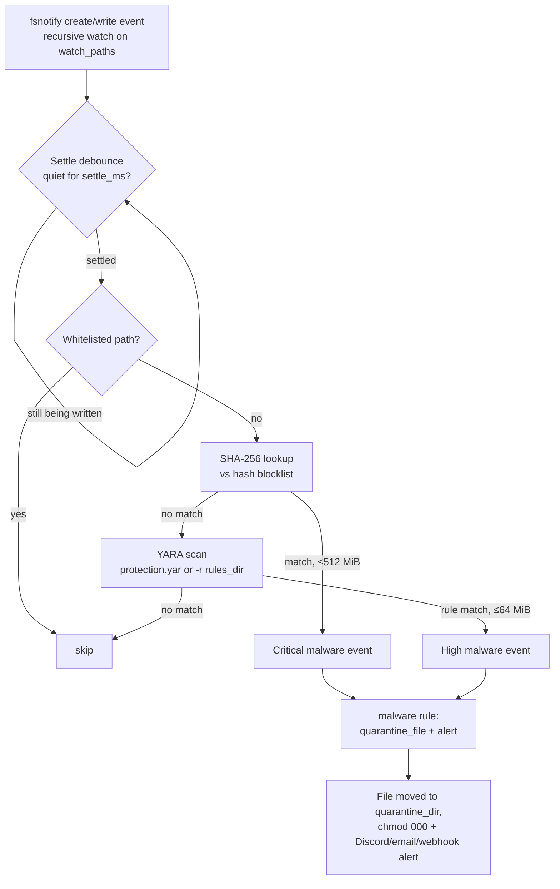

# Antivirus Layer (Protection Plus)

The antivirus layer is Protection's fast path against malicious **files**: the moment a file lands in a watched upload directory, it is hashed and pattern-scanned, and matches hit the default `malware` rule — **quarantine + alert**.

It has three parts working together:

- **Threat intel** — downloads and refreshes the YARA rule bundle and the SHA-256 hash blocklist (`protection rules update`, plus automatic daily refresh).
- **On-access scanning** — an fsnotify watcher that scans every file as it is created or modified.
- **Optional CLI scanners** — periodic full-tree sweeps via the `yara` and `trivy` binaries, when installed.

::: warning DRY RUN FIRST
As with everything in Protection, the global `general.dry_run: true` safety switch applies: matches are detected and alerted, but no file is quarantined until you arm the daemon. See [Actions & Rules](./actions-rules.md).
:::

---

## Setup in 3 steps

1. **Fetch the threat intel:**

   ```bash
   sudo protection rules update
   ```

   This downloads the YARA rule bundle to `intel.rules_dir` (`/etc/protection/yara/protection.yar`) and the MalwareBazaar SHA-256 blocklist to `intel.hashlist_file` (`/var/lib/protection/blocklist.sha256`). The daemon then refreshes both automatically every `intel.update_interval` (default `24h`).

2. **(Optional) install the yara CLI** for pattern scanning beyond hash matching:

   ```bash
   sudo apt install yara
   ```

   Without it, hash-blocklist scanning still works; YARA checks simply no-op (see [Optional CLIs](#optional-clis-yara-and-trivy)).

3. **Watch it work.** Drop a test file and add its hash to your custom blocklist — the EICAR-style way to prove the pipeline end to end without real malware:

   ```bash
   echo "protection antivirus test payload" > /var/lib/pterodactyl/volumes/test.bin
   sha256sum /var/lib/pterodactyl/volumes/test.bin
   ```

   Put the resulting 64-char hash (one per line) into a file, point `intel.custom_hashlist` at it, and restart:

   ```yaml
   intel:
     custom_hashlist: /etc/protection/custom-blocklist.sha256
   ```

   Within ~500 ms of writing the file you should see a **critical** "Known malware (hash blocklist)" event in the log — and, if `dry_run` is off, the file moved to `actions.file.quarantine_dir` with mode `000`.

---

## Threat-intel system

The intel manager owns both downloaded assets — the YARA rules and the hash blocklist.

- **Manual refresh:** `protection rules update` runs one update pass immediately.
- **Automatic refresh:** with `intel.enabled: true`, the daemon re-runs the same pass every `intel.update_interval` (default `24h` — a daily refresh).
- **Atomic writes:** every download lands in a temp file in the destination directory and is `rename(2)`d into place, so readers never see a partial file. Temp files live next to the destination deliberately: the rename must stay on one filesystem, and systemd sandboxes can make `/tmp` read-only for the service.
- **Identified downloads:** all requests carry a real `User-Agent` — `protection/<version> +https://github.com/AnAverageBeing/protection` — so upstream services (abuse.ch etc.) can identify the client.
- **Fault-tolerant:** the rules and the hashlist are fetched **independently**. If one source fails, the other still updates; the command reports a *partial* update instead of failing wholesale, and the daemon logs a warning and keeps the previous copy.

```yaml
intel:
  enabled: true
  rules_dir: /etc/protection/yara
  rules_url: "https://raw.githubusercontent.com/AnAverageBeing/protection/main/rules/protection.yar"
  hashlist_url: "https://bazaar.abuse.ch/export/txt/sha256/recent/"
  hashlist_file: /var/lib/protection/blocklist.sha256
  custom_hashlist: ""
  update_interval: 24h
```

---

## YARA rule bundle

The shipped `protection.yar` is a curated set of **9 rules** aimed at Linux hosting-abuse threats seen on shared/VPS/game nodes:

| Rule | Detects | Severity |
|---|---|---|
| `Webshell_Generic_EvalBase64` | Generic PHP webshells: `eval(gzinflate/str_rot13/base64_decode(...))`, and `system`/`shell_exec`/`passthru`/`popen`/`proc_open`/`assert` fed from `$_GET`/`$_POST`/`$_REQUEST`/`$_COOKIE` | high |
| `Webshell_Known_Families` | Known webshell families: c99, r57, WSO ("Web Shell by oRb"), b374k, FilesMan, pwnshell, minishell | high |
| `Miner_Generic` | Cryptocurrency miners: `stratum+tcp/ssl://` pool URLs, RandomX, cryptonight, xmrig and its config markers | high |
| `Tor_Relay_Binary` | Tor daemon binary markers — catches a **renamed** `tor` binary (needs 2 of 5 embedded strings) | high |
| `Mirai_Variant` | Mirai-family botnet markers (watchdog abuse, `TSource Engine Query`, JS-challenge bypass paths, …) | critical |
| `IRC_Bot` | IRC bot / eggdrop-style command patterns (`PRIVMSG #`, `JOIN #`, `!ddos`, `!scan`; needs 3 of 5) | medium |
| `Linux_Backdoor_Generic` | Reverse-shell one-liners in scripts: `/dev/tcp/`, `nc -e /bin`, `ncat -e /bin`, `socat exec:`, `bash -i >&` | high |
| `Linux_Privesc_Exploit` | Known privesc exploit markers: DirtyPipe (CVE-2022-0847), DirtyCow (CVE-2016-5195), PwnKit (CVE-2021-4034) | high |
| `Crypto_Stealer_Script` | Clipboard/crypto stealer scripts: a BTC-address shape paired with `xclip`/`wl-paste`/`replace_clipboard` | medium |

### Customising the rules

- **Self-host the bundle:** point `intel.rules_url` at your own URL (an internal mirror, a pinned commit, your own fork) and `protection rules update` will pull from there instead.
- **Add your own rules:** drop extra `.yar` files into `intel.rules_dir`. The on-access scanner prefers the single compiled bundle `protection.yar` when it exists, and otherwise scans the whole rules directory recursively; the periodic `yara` sweep always scans the directory recursively, so extra files are picked up there regardless.
- Note: `rules update` overwrites `protection.yar` itself — keep local additions in **separate files**, not edits to the bundle.

---

## SHA-256 hash blocklist

The blocklist is an in-memory set of known-bad SHA-256 hashes, looked up before any YARA work happens — exact, zero-false-positive matching for known malware.

- **Source:** MalwareBazaar exports. The parser accepts the export **raw or zipped** (it sniffs the `PK\x03\x04` zip magic and transparently streams out the first file), lowercases and validates every line, and skips comments and junk.
- **Recent vs full:** the default URL is the `recent` export (last ~48 h — small and fast). For complete coverage, opt in to the full export:

  ```yaml
  intel:
    hashlist_url: "https://bazaar.abuse.ch/export/txt/sha256/full/"
  ```

  Trade-off: the full export is **~1.1M hashes**, and every hash lives in the daemon's in-memory set — expect a few hundred MB of extra RAM.
- **Your own hashes:** `intel.custom_hashlist` points at a second file (one SHA-256 per line, `#` comments allowed). It is **merged** into the set at load time and never overwritten by updates — ideal for internal IOCs and test hashes.
- **Streaming parse:** the download goes straight to a temp file on disk and is parsed line-by-line; even the multi-hundred-MB full export never sits in memory at once. This is what lets the daemon ingest the full list while staying under its systemd memory cap (256 MB `MemoryMax` in the packaged unit) during the update itself — the steady-state RAM cost is only the resulting hash set.

---

## On-access scanning pipeline

The `onaccess` detector is the hot path. Enabled by default, it watches `detectors.onaccess.watch_paths` (your panel volumes / upload dirs) and scans files the moment they are written.



How it works, in order:

1. **Recursive fsnotify watch.** Every directory under each watch path gets an inotify watch; newly created directories (including moved-in trees) are added on the fly, so files inside them never go unseen.
2. **Settle debounce.** Editors and downloaders write in bursts; scanning a half-written file wastes I/O and can misfire. A path is only scanned once it has been quiet for `settle_ms` (default 500 ms).
3. **SHA-256 lookup.** The file is hashed and checked against the blocklist (files over 512 MiB are skipped — hashing them on every write costs more than the lookup is worth). A hit is a **critical** "Known malware (hash blocklist)" event with the hash as evidence.
4. **YARA scan.** Otherwise (and additionally) the file is scanned with the yara CLI against `protection.yar` — falling back to a recursive scan of the whole `rules_dir` when the bundle file is absent. Files over 64 MiB are skipped; a single scan is capped at 30 s so a pathological file can't stall the workers. A match is a **high** "Malware detected by YARA rule" event with the rule name as evidence.
5. **Enforcement.** Both event kinds have category `malware`, so they hit the default `malware` rule (`min_severity: high`, actions `quarantine_file, alert`): the file is moved to the quarantine dir and chmodded `000` (evidence preserved), and an alert goes out. With `dry_run: true`, only the alert fires.

Scanning runs in a bounded worker pool (2 concurrent scans) decoupled from the engine's scan tick, with a 1000-event queue that drops the oldest entries (with a warning) if a write storm ever fills it. Watcher errors are tolerated — the periodic sweeps are the backstop.

::: tip WHITELIST
Paths under `whitelist.paths` are never scanned, even if they sit inside a watch path — use it for trusted build output or anything Protection must never touch.
:::

---

## Optional CLIs: yara and trivy

Protection shells out to external scanners instead of linking their libraries (this keeps the daemon a CGO-free static binary), and both are **strictly optional**:

- **`yara`** — used by both the on-access pipeline and the periodic `detectors.yara` full-tree sweep (`interval`, default 10 min, over `scan_paths`). If the binary is not in `PATH`, the periodic detector reports itself unavailable and never scans, and on-access YARA checks silently disable themselves — hash matching is unaffected.
- **`trivy`** — `detectors.trivy` scans container images for vulnerabilities (one alert-only event per image with HIGH/CRITICAL counts, gated by `min_severity`). Same model: a missing binary means a permanent no-op, not an error.

Nothing in Protection fails to start or spams logs because these binaries are absent; install them when you want the extra coverage.

---

## Next steps

- **[Actions & Rules →](./actions-rules.md)** — what `quarantine_file` does and how to change the `malware` rule.
- **[Detection Engines →](./detection.md)** — where on-access fits among the other detectors.
- **[CLI Reference →](./cli.md)** — `protection rules update` and friends.
