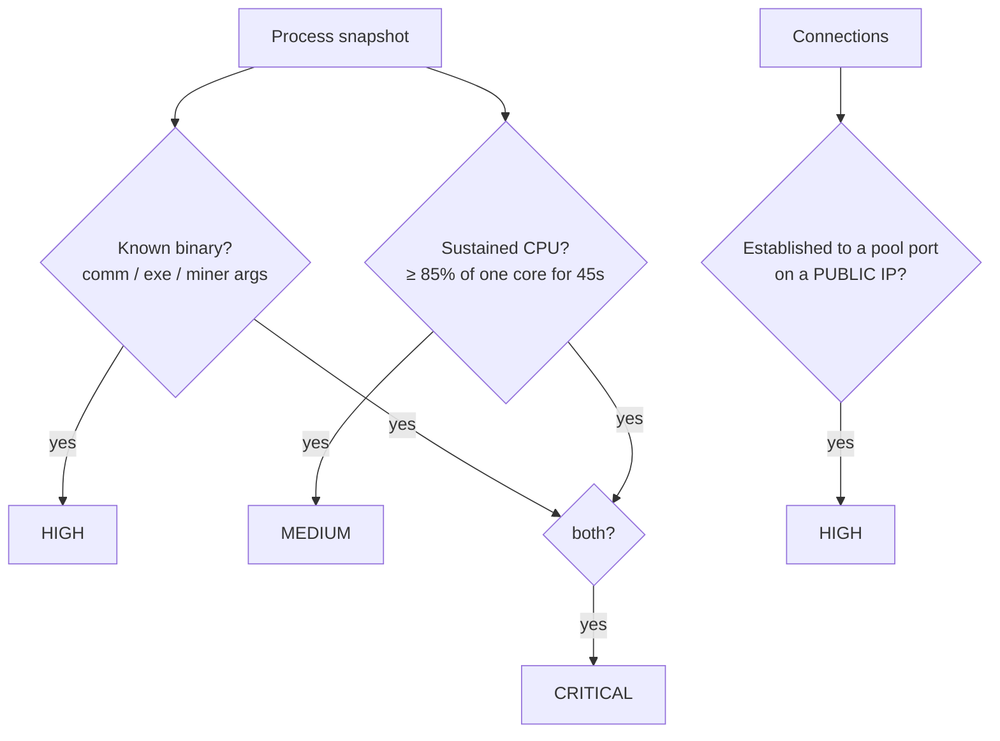
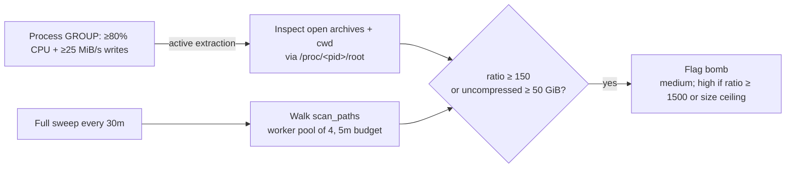
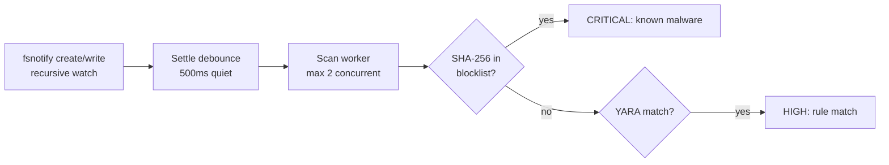

# How Detection Works

Each detector inspects a shared per-tick [system snapshot](../architecture/overview.md) (default tick: `scan_interval: 5s`) and emits `Event`s with a severity. This page explains exactly what each one checks and the real default thresholds, so you can trust — and tune — the results.

## Severity & events

Every finding carries a severity:

| Severity | Meaning |
| --- | --- |
| `info` | Informational only |
| `low` | Weak signal, worth noting |
| `medium` | Suspicious, likely worth a look |
| `high` | Strong signal, very likely malicious |
| `critical` | Multiple strong signals — almost certainly malicious |

Events flow into the [engine](../architecture/overview.md), which de-duplicates them (per `cooldown`, default 5m), filters by [mode](../configuration/reference.md#modes), and matches them against your [rules](./actions-rules.md).

---

## ⛏️ Miner detection

Three independent signals, escalating in severity when combined.

1. **Signature** — the process's `comm` or exe basename matches a known miner (xmrig, minerd, t-rex, nbminer, lolminer, srbminer, …), or its command line carries a miner **argument** fingerprint: `stratum+tcp`, `stratum+ssl`, `--donate-level`, `--coin `, `--randomx`, `-o pool.`, `--algo `, `--cpu-priority`, `--nicehash`. Binary names are matched only against `comm` and the exe basename (the actual process identity), never the raw command line — so a parent shell that merely references the path isn't flagged. Command-line matching is reserved for argument fingerprints a launcher wouldn't legitimately carry.
2. **Sustained CPU** — per-core CPU% is computed from jiffy deltas between snapshots (`delta_jiffies / (elapsed × clock_ticks) × 100`). If it stays at or above `cpu_threshold` (default **85%** of one core) for `sustained_seconds` (default **45s**), that alone is flagged — this catches **unknown/custom** miners. Processes on the game-server whitelist (`java`, `bedrock_server`, `srcds_linux`, `RustDedicated`, `valheim_server`, …) are exempt from this heuristic path, but are still caught by signature matching.
3. **Pool connection** — an *established* connection whose remote port is in `pool_ports` (default `3333, 4444, 5555, 7777, 8888, 9999, 14444, 14433, 45700, 45560, 20580`) **and** whose remote IP is a routable public address. Loopback/private/link-local destinations on those ports are local services (redis, HTTP-alt, …) and are deliberately ignored. Works for host *and* container connections.
4. **Masked binary** — a process running from a **deleted** on-disk executable (exe ends in ` (deleted)`) while sustaining high CPU is a classic miner evasion technique.

**Severity escalation:**

| Signals | Severity | Title |
| --- | --- | --- |
| Signature **and** sustained CPU | `critical` | Cryptocurrency miner running |
| Masked (deleted exe) + sustained CPU | `high` | Masked process burning CPU |
| Signature only | `high` | Known miner binary detected |
| Sustained CPU only | `medium` | Sustained high CPU usage |
| Pool-port connection (public IP) | `high` | Connection to mining pool port |

::: tip TUNING
False positives from a legitimately busy server? Raise `sustained_seconds` first, then `cpu_threshold`, or add the process to the miner's `whitelist_processes`. Signature and pool-connection detection keep working regardless.
:::

---

## 🔭 Port-scan detection

A scanner fans out many half-open (`SYN_SENT`) connections to many ports/hosts quickly. Only `SYN_SENT` sockets count — established or listening sockets never feed this detector.

- Per **pid**, distinct destination **ports** and **hosts** are accumulated in maps, each entry time-stamped, over a sliding `window` (default **15s**). Entries older than the window are pruned; pids whose state empties are dropped.
- Reaching `distinct_ports` (default **100**) **or** `distinct_hosts` (default **50**) within the window flags a scan at `medium` severity.
- A known scanner binary — matched on `comm` only (`nmap`, `masscan`, `zmap`, `unicornscan`, `hping3`, `naabu`, `rustscan`) — is flagged at `high` severity ("Network scanner running") regardless of counts.
- Container scans are attributed to the container (read from the container's own network namespace); if the connection carries no container ID, the pid's cgroup is checked.

The event evidence reports the exact `distinct_ports` and `distinct_hosts` counts and the window, so you can sanity-check a flag at a glance.

---

## 🌊 DDoS detection

Three angles, so both crude and sophisticated outbound floods are caught.

| Signal | How | Default |
| --- | --- | --- |
| **Container egress rate** | Per-container packets/sec and bytes/sec, computed from deltas between two `docker stats` one-shot samples (TxPackets/TxBytes summed across all interfaces). Crossing `pps_threshold` **or** `bps_threshold` ⇒ `high`. | `pps_threshold: 60000`, `bps_threshold: 125000000` (~1 Gbit/s) |
| **Tool signatures** | Known stress tools (`hping3`, `t50`, `mhddos`, `slowloris`, `goldeneye`, `torshammer`, `xerxes`, `loic`/`hoic`/`xoic`, `hulkattack`, …) matched on `comm`/exe basename exactly, and against the command line with **word-boundary** matching so generic fragments never fire (e.g. `byte` inside `-byteswappedclients`). ⇒ `high`. | `known_tools` list |
| **Java flooder heuristic** | If `comm` starts with `java` and the cmdline contains `ddos`, `booter`, `stresser`, `flood` or `doser` (the classic `java -jar ddos.jar` pattern on game nodes) ⇒ `high`. | always on |
| **Connection floods** | A single pid holding ≥ `conn_threshold` simultaneous outbound sockets — TCP counts established + half-open, UDP counts any non-listening socket (remote port > 0), since amplification floods are UDP-heavy. Game-server-whitelisted pids are skipped. ⇒ `high`. | `conn_threshold: 1500` |

Stale containers are dropped from the rate sampler each tick, so a removed container never emits phantom events.

::: info GAME-NODE REALITY
Java-hosted "booter" jars are a common abuse vector on Minecraft nodes — the DDoS detector specifically fingerprints `java -jar` flooders in addition to native tools, while the game-server whitelist keeps real busy servers out of the connection-flood heuristic.
:::

---

## 💣 Zip-bomb detection

Protection reads an archive's **declared** sizes from its metadata and **never extracts** it, so detection is safe and cheap. It catches both classic nested bombs and modern overlapping/quine bombs.

**How each format is measured (metadata first, extraction never):**

| Format | Method |
| --- | --- |
| `zip` / `jar` | Sum of `UncompressedSize64` across the central directory — essentially free. |
| `gzip` / `tgz` | The 4-byte ISIZE trailer (uncompressed size mod 2³²). If the claimed size is *smaller* than the compressed file, the value has wrapped past 2³² — a real gzip stream never shrinks its input — so Protection falls back to a bounded probe. |
| `tar` | Walk headers and sum member sizes (context-cancellable). |
| `7z`, `rar` | Sum declared sizes from the archive headers. |
| `xz`, `bzip2` (and wrapped gzip) | **Bounded probe:** decompress at most `probe_compressed_limit` (default **1 MiB**) of input, stop after `probe_uncompressed_limit` (default **10 MiB**) of output or timeout, then extrapolate the total from the **actual consumed-to-produced ratio** × the file's real size. |

A file is a bomb when `uncompressed ÷ compressed ≥ ratio_threshold` (default **150**) **or** `uncompressed ≥ max_uncompressed` (default **50 GiB**). Severity is `medium`, escalating to `high` when the ratio is ≥ 10× the threshold or the absolute ceiling is hit.

**Two ways archives get inspected:**

- **Hot trigger (event-driven, on by default):** CPU and disk-write rates are aggregated per **process group** — because real extractions are pipelines: `tar xzf` burns CPU in the gzip child while the tar parent does the writes, and neither alone trips a per-pid check. When a group exceeds `hot_cpu_percent` (default **80%**) *and* `hot_write_mbps` (default **25 MiB/s**), Protection immediately inspects every archive the group has open plus the archives in each member's working directory. A bomb is caught **mid-unzip in seconds**, not after a fixed delay.
- **Full sweep (backstop):** every `full_scan_interval` (default **30m**), a walk of `scan_paths` (default `/var/lib/pterodactyl/volumes`) catches bombs uploaded but not yet extracted. The sweep runs a worker pool of `max_concurrent_inspects` (default **4**) under a `full_scan_max_duration` time budget (default **5m**), skips archives smaller than `min_compressed_size` (default **10 KiB**) and any file whose mtime is unchanged since it was last cleared, and caps each archive inspection at `inspect_timeout` (default **5s**).

For container processes, paths are translated from the container's mount namespace via `/proc/<pid>/root`, so the host can stat exactly what the extractor sees. Pterodactyl volume paths (`/var/lib/pterodactyl/volumes/<server-uuid>/…`) are mapped back to the owning server UUID for suspension/quarantine.

---

## 🐚 Exploit & container-escape detection

| Check | How | Severity |
| --- | --- | --- |
| **Known exploit tools** | `comm`/exe basename in `suspicious_processes` (default: `dirtycow`, `dirtypipe`, `pwnkit`, `linpeas`, `linenum`, `les.sh`, `unix-privesc-check`, `exploit`, `nsenter`, `runc`, `deepce`). | `high` |
| **Reverse shells** | Cmdline contains a **network-bound** pattern (`flag_reverse_shell`): `/dev/tcp/`, `/dev/udp/`, `nc -e`, `ncat -e`, `nc.traditional -e`, `pty.spawn`, `socat exec`, `socat tcp`, `exec:'/bin`, `exec 5<>/dev/tcp`, `0<&196`, `sh -i >& /dev`, `bash -i >&`, `-i >& /dev/tcp`. Bare `bash -i`/`sh -i` are deliberately excluded — interactive login shells use them legitimately. | `high` |
| **Privilege escalation** | Cmdline contains a privesc pattern (`flag_privilege_escalation`): `chmod +s`, `chmod u+s`, `chmod 4755`, `chmod 6755`, `setcap cap_`, `>> /etc/sudoers`, `>/etc/sudoers`, `usermod -ag sudo`, `usermod -g 0`, `nsenter --target 1`, `nsenter -t 1`, `--mount=/proc/1/ns`. | `high` |
| **nsenter escape** | The same privesc match, but the process is **inside a container** and the cmdline mentions `nsenter` or a namespace path — a textbook container-escape attempt. | `critical` |
| **Setuid walk** | A periodic walk of `watch_paths` (default `/tmp`, `/dev/shm`, `/var/tmp`) flags any file with the setuid/setgid bit — a privesc payload on disk. Bounded by `limits.max_setuid_walk_files`; whitelisted paths skipped. | `high` |
| **Execution from scratch** | A process whose exe lives under a watch path (world-writable scratch dirs) — a classic dropper/stager pattern. The ` (deleted)` suffix is stripped before matching, so self-deleting droppers still match. | `medium` |

The setuid walk caches directory mtimes (`limits.cache_directory_mtimes`) so unchanged trees are not re-walked every tick.

---

## 🕸️ Abuse detection

Flags hosting-abuse patterns that aren't outright exploits but will get a provider in trouble: Tor exits, proxy/VPN tunnels, customer-installed mail servers (spam), and execution out of upload directories.

- **Known services** — `comm`/exe basename in `known_processes` (default: `tor`, `openvpn`, `wireguard`, `softether`, `shadowsocks`, `ss-server`, `v2ray`, `xray`, `trojan`, `hysteria`, `sing-box`, `cloudflared`, `frpc`/`frps`, `ngrok`, `sendmail`, `postfix`, `exim4`, `dovecot`, `znc`, `eggdrop`, …) ⇒ `high`.
- **Cmdline patterns** — substrings from `known_cmd_patterns` (`--socksport`, `--orport`, `--dirport`, `-c /etc/tor`, `/etc/openvpn`, `--protocol trojan|vmess|vless`, `inbound:`, `outbound:`, `listen=0.0.0.0`, …) ⇒ `high`. The event records which kind of signature hit (`known_abuse_process` vs `cmd_pattern`).
- **Abusive listening ports** — a process with a **listening** TCP socket (remote port 0) on a port in `abusive_ports` (default: Tor `9001/9030/9050/9051/9150/9151`, SOCKS `1080/1081/1090`, proxy `7890/7891/8000/8001/8008/8082`, Shadowsocks `8388/8389`, Trojan/Xray `4433/8443`, hysteria/sing-box `10086/12345/54321`) ⇒ `high`.
- **Execution from upload dirs** — a process whose exe lives under `watch_upload_paths` (default: `/var/lib/pterodactyl/volumes`, `/var/lib/pterodactyl/mounts`, `/home/container`, `/tmp`, `/var/tmp`, `/dev/shm`) — how customers run miners/proxies after a panel upload ⇒ `medium`.

The abuse `whitelist_processes` (default: the game-server list) suppresses all four checks for legitimate servers.

---

## 🧬 YARA sweep

An interval-gated full sweep that shells out to the `yara` CLI (`yara -r -f <rules_dir> <path>`) — no Go bindings, so the daemon stays a CGO-free static binary.

- Runs at most every `interval` (default **10m**; the first pass always runs) over `scan_paths` (default `/var/lib/pterodactyl/volumes`) with rules from `rules_dir` (default `/etc/protection/yara`).
- Each yara invocation is capped at **2 minutes** so a huge tree can't stall the scan loop. Yara's exit code 1 means "no matches" and is treated as the normal case; any other failure is logged so a broken ruleset never goes silently blind.
- Each match line (`RULE_NAME FILE_PATH`) becomes a `high`-severity event (category `abuse`). If the matched file is currently executing, the event is annotated with the pid, process and container so actions can target it directly.
- **Graceful no-op:** if the `yara` binary isn't in `PATH`, the detector disables itself permanently and `Run` returns nothing.

---

## 🧷 File-integrity monitoring (FIM)

SHA-256 baselines of the files an attacker most wants to tamper with.

- Default watch set: **the daemon's own binary and its config file** (plus anything you add to `paths`).
- Hashing happens at most every `interval` (default **5m**); the first pass always runs. Files are streamed through SHA-256, so multi-gigabyte files never load into memory.
- The first sighting of a path **records the baseline silently** — no alert for pre-existing state. A later content change raises a `high`-severity event ("Protected file modified", with old/new hash prefixes as evidence) and the new hash **becomes the baseline**, so each change alerts exactly once instead of re-alerting every interval.
- Missing or unreadable files are skipped silently.

---

## 🛡️ Image vulnerability scanning (Trivy)

Per-image CVE counts via the `trivy` CLI.

- Runs at most every `interval` (default **1h**) against the distinct images of running containers (via the Docker API), falling back to `docker image ls` when no API client is available. Dangling `<none>` images are skipped.
- Each image is scanned with `trivy image --quiet --format json --severity HIGH,CRITICAL`, capped at **2 minutes** per image.
- An image with any HIGH/CRITICAL findings raises an event with the counts and the top 5 CVE IDs as evidence: `medium` when only HIGHs exist, `high` when at least one CRITICAL exists.
- **Graceful no-op:** if the `trivy` binary isn't in `PATH`, the detector logs once at startup and never scans.

---

## ⚡ On-access scanning

The fast path: files are scanned the moment they're created or modified in the watched upload paths, long before any periodic sweep would see them.

- **Recursive watch** — every `watch_paths` root (default: the upload paths) and all existing subdirectories get inotify watches; newly created directories are added on the fly, so a tree moved into place can't hide.
- **Settle debounce** — editors and downloaders write in bursts; a path is only scanned once it has been quiet for `settle_ms` (default **500ms**), so Protection never scans a half-written file.
- **Bounded workers** — scans run in a pool capped at **2 concurrent** scans, decoupled from the engine tick; `Run` just drains whatever the workers found. The event queue holds at most **1000** events; beyond that the oldest are dropped (with a warning) so a write storm can't grow memory.
- **Hash blocklist first** — files up to **512 MiB** are streamed through SHA-256 and looked up in the threat-intel blocklist (MalwareBazaar recent export by default). A match is `critical` — a known-bad payload.
- **Then YARA** — files up to **64 MiB** are scanned (30s timeout) against the compiled `protection.yar` bundle the intel updater maintains, falling back to a recursive scan of the whole rules directory. A match is `high`.
- Both checks are independently toggleable (`hash_check`, `yara_check`, both default on); the YARA half silently disables when the binary or rules dir is absent. Whitelisted paths are skipped.

---

## False-positive design

Protection Plus is built for game-hosting nodes, where the loudest legitimate workloads look a lot like abuse. Every heuristic that could fire on a busy server has a deliberate guard:

- **Game-server whitelists.** The miner's sustained-CPU path, the DDoS connection-flood path and all abuse checks skip `java`, `bedrock_server`, `srcds_linux`, `RustDedicated`, `valheim_server`, and ~25 other known server binaries by default (`whitelist_processes`, extendable per detector).
- **Public-IP-only pool checks.** Miner pool-port detection ignores loopback/private/link-local destinations, so local redis or HTTP-alt services on ports like 3333/8888 never flag.
- **Word-boundary matching.** DDoS tool names match the command line only as whole words — `byte` can't fire on `-byteswappedclients`, and the default list deliberately excludes short/generic tokens (`hammer`, `loris`, `hulk`).
- **Network-bound-only reverse-shell signatures.** `bash -i` alone is never flagged; a shell must redirect to a socket (`/dev/tcp`, `nc -e`, `socat exec`, …) to match.
- **comm/exe-only binary matching.** Known-binary lists (miners, scanners, stress tools, exploit tools, abuse services) match the process identity — `comm` and the exe basename — never arbitrary command lines, so referencing a path in a script or grep is harmless.
- **Baseline-first FIM.** Existing files are baselined silently; only *changes* alert, and each change alerts exactly once.
- **Physical bounds.** Zip-bomb sweeps ignore archives under 10 KiB and cap each inspection at 5s; on-access scanning debounces half-written files and caps file sizes; port-scan state expires with its window.
- **Global whitelist.** `whitelist.paths` exempts whole trees from every scanner; `whitelist.containers` exempts containers by name or ID from being flagged, killed, or suspended.

## Severity → action mapping

Detection decides *what* fired; [rules](./actions-rules.md) decide *what happens*. The built-in default policy (`DefaultRules`) is aggressive on unambiguous threats and alert-only on noisier heuristics:

| Category | Min severity | Default actions |
| --- | --- | --- |
| `miner` | `high` | `neutralize`, `suspend_server`, `alert` |
| `ddos` | `high` | `neutralize`, `suspend_server`, `alert` |
| `abuse` (incl. YARA sweep matches) | `high` | `neutralize`, `suspend_server`, `alert` |
| `malware` (on-access hash/YARA hits) | `high` | `quarantine_file`, `alert` |
| `exploit` | `high` | `neutralize`, `alert` |
| `zipbomb` | `medium` | `quarantine_file`, `alert` |
| `portscan` | `medium` | `alert` |
| `*` (catch-all: FIM, Trivy, everything else) | `low` | `alert` |

Rules are evaluated top to bottom and every matching rule contributes its actions, so the catch-all always alerts even when a more specific rule also fired. `neutralize` auto-selects container-kill or process-kill based on the threat, so one rule works on both Pterodactyl/Docker nodes and bare VPS hosts. See [Actions & Rules](./actions-rules.md) to customize.

## Container vs host attribution

Containers have their own network namespace, so their sockets never appear in the host's `/proc/net/tcp`. Protection reads each container's namespace directly, so connection-based signals (pool connections, port scans, connection floods) work for containers **and** are attributed to the right container — verifiable with [`protection debug-conns`](./cli.md#protection-debug-conns).

## Next steps

- **[Actions & Rules →](./actions-rules.md)** — turn findings into enforcement.
- **[Configuration reference →](../configuration/reference.md)** — every threshold named on this page.
- **[Architecture →](../architecture/overview.md)** — the snapshot and engine internals.
