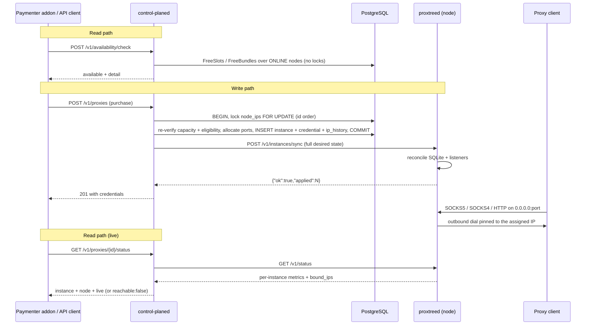
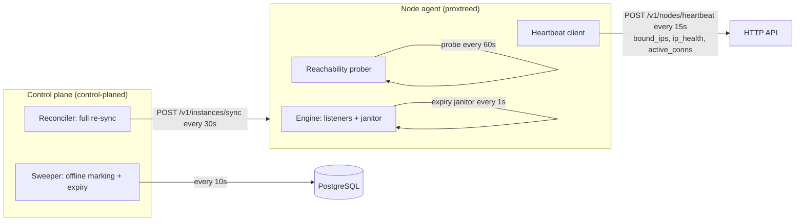
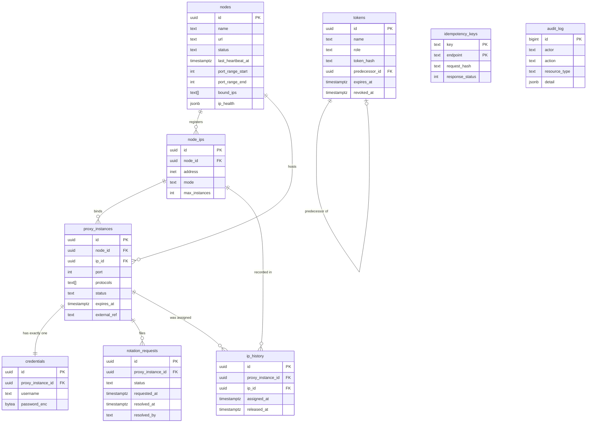

# Architecture Overview

ProxTree splits into two Go programs plus a billing integration. `control-planed`
is the control plane: a PostgreSQL-backed API that owns the inventory and the
money-facing state. `proxtreed` is the node agent: it runs the actual proxy
listeners on each proxy server and enforces credentials, ports, limits and
expiry locally. A Paymenter addon drives the control-plane API to sell and
manage instances.

The split is deliberate: the control plane never carries customer traffic, and
the agent never depends on it to keep serving. Desired state flows down (control
plane → agent); liveness and health flow up.

## Component map

| Component | Artifact | Language | Owns |
| --- | --- | --- | --- |
| Control plane | `control-planed` | Go + PostgreSQL | Single source of truth: nodes, IPs, proxy instances, credentials, rotation requests, availability, audit log, API tokens. Every allocation decision, every lock, every compensation. |
| Database | PostgreSQL | — | Durable state, row locks, and the constraints that backstop the application logic (unique indexes on `(ip_id, port)`, `(node_id, port)` and one pending rotation per instance). |
| Node agents | `proxtreed`, one per node | Go | The listeners themselves: protocol engines, credentials, source-IP pinning, per-instance limits, local expiry, boot restore, status and metrics. Holds a local SQLite credential DB. |
| Paymenter addon | `ProxTree-Paymenter-Addon-<v>.zip` | PHP (Paymenter v1.5.7 Servers extension) | Product configuration, stock gating, purchase and lifecycle hooks, admin pages, client dashboard. |

The addon is not architecturally special: it authenticates with a `billing`
token and calls the same endpoints any client would. Its only extra privileges
come from the admin pages, which use an `admin` token.

## Data flow

The write path — a purchase or lifecycle change — and the read path both fan out
from the control plane, but only the write path touches the agents.



The write path is always **reserve → commit → push → compensate**: the control
plane commits the change, then pushes the full desired state to the agent, and
rolls back if the push fails. The payload is the complete desired set, so it is
idempotent and self-healing — there is no partial remote application to undo.

The heartbeat loop and the two background loops run continuously:



## Trust boundaries

### What the control plane may assume about a node: nothing

The control plane treats every statement from a node as a claim to be verified,
and trusts no node to have applied anything until the agent says so.

- The agent is the only party that knows what is actually bound on a host's
  interfaces. It self-reports that in `bound_ips` on every heartbeat, and the
  control plane **refuses to allocate any IP the node has not reported**.
- Being present on an interface is still not enough. A provider may not route an
  address to the server, so a listener bound to it accepts connections while every
  outbound dial dies. The agent's reachability prober opens a TCP connection bound
  to each candidate IP against `PROXTREE_PROBE_TARGET` (default `1.1.1.1:53`), and
  the control plane excludes any address reported unreachable.
- Both gates **fail open** when a node has never reported, so a fresh install
  keeps working; once a node has reported, they are strict.
- Every mutation is confirmed against the agent. A 200/201 means the change is
  live on the node.

So an operator who registers an address the server does not own, or one the
provider does not route, does not get a sold-but-dead proxy — they get an
exclusion in `ip_drift`/`unreachable_ips` and a hint in availability.

### Why the agent is the resilience layer

The agent does not need the control plane to serve traffic or enforce the rules:

- **Credentials, ports and limits** are enforced from the agent's local record;
  the control plane is not in the data path.
- **Expiry** is enforced by a node-local janitor (every second), which tears the
  listener down, closes connections and deletes the credential with no round
  trip.
- **Boot restore** re-binds every non-expired instance from the local SQLite DB,
  so a node reboot works even if the control plane is down.
- **Heartbeat failure is non-fatal**: the agent logs it and retries with
  exponential backoff capped at two minutes, then logs recovery.

The control plane is therefore a coordination and billing brain, not a
dependency for the bytes already sold.

### During a control-plane outage

| Effect | Behaviour |
| --- | --- |
| Proxies already sold | Keep serving. Listeners, credentials, limits and expiry enforcement continue locally. |
| Node liveness | Heartbeats fail. After `PROXTREE_HEARTBEAT_TIMEOUT` (default `90s`) the sweeper marks the node `offline` **in the database** — the agent itself is unaffected. |
| New provisioning | Nodes are only offered while `online`, so an outage removes capacity from the sellable pool rather than allocating onto nodes it cannot confirm. |
| Rotation | Accepting a rotation requires an `online` node; otherwise the call returns `503 node_offline` and the request stays pending. |
| Paymenter checkout | Fails **closed**. The add-to-cart gate fails open on a control-plane error, but the checkout gate (`Order\Creating`, inside the order transaction) blocks the sale — an unreachable control plane must not complete a purchase. |

## Data model

Nine tables carry the state; `schema_migrations` is embedded-migration bookkeeping
and is not part of the domain model.



- **`nodes`** — one row per proxy server: the agent control-channel `url` (port
  reserved from allocation), the port range (default 10000–60000), `status`, the
  last heartbeat, the agent's `bound_ips`/`ip_health`, and the agent token (hashed
  and encrypted, plus the previous one for zero-downtime rotation).
- **`node_ips`** — the sellable inventory. `mode` is `dedicated` or `oversell`;
  `max_instances` caps an oversell address (null = port-space limited) and is
  meaningless for dedicated IPs. `UNIQUE (node_id, address)` stops double
  registration.
- **`proxy_instances`** — one row per sold proxy: the `(ip_id, port)` binding,
  `protocols`, `status`, billing `external_ref`, limits and `expires_at`. The unit
  of sale.
- **`credentials`** — exactly one per instance. The username is `u_` + 16 hex
  characters and globally unique; the password is AES-256-GCM encrypted. Resetting
  replaces the row's values atomically, so the old pair dies immediately.
- **`rotation_requests`** — the rotation queue; a partial unique index
  (`WHERE status = 'pending'`) enforces at most one pending request per instance.
- **`ip_history`** — every IP an instance has ever held, with `assigned_at` and
  `released_at`; rotation prefers never-used addresses and excludes addresses
  released inside the cooldown.
- **`idempotency_keys`** — `PRIMARY KEY (key, endpoint)` plus the request hash and
  stored response; winning the insert is what makes concurrent duplicates safe.
- **`audit_log`** — append-only `actor`, `action`, `resource_type`, `resource_id`,
  JSON `detail` and the caller's IP, written in the same transaction as the change.
- **`tokens`** — admin/billing tokens; stores only the SHA-256 `token_hash`, and
  `predecessor_id` links a rotated token to the one it replaced.

### Two columns worth knowing

- **`nodes.bound_ips`** (`text[]`) — the agent's self-report of addresses it
  found on local interfaces, refreshed on every heartbeat. Allocation skips any
  registered address absent from this set. Added in migration
  `0003_node_bound_ips.sql` after an incident where an unregistered address
  produced a sold-but-dead proxy.
- **`nodes.ip_health`** (`jsonb`) — per-address reachability from the agent's
  prober, shaped
  `{"1.2.3.4": {"reachable": true, "checked_at": "RFC3339", "error": "..."}}`.
  An address reported `reachable: false` is excluded exactly like an unreported
  one. Added in `0004_node_ip_health.sql`.

## State machines

### Node status (`nodes.status`)

| Status | Meaning | Set by |
| --- | --- | --- |
| `offline` | Not heartbeatting, or never has. Not offered for provisioning. | Initial value; the sweeper after `PROXTREE_HEARTBEAT_TIMEOUT` |
| `online` | Heartbeat received within the timeout. Eligible for allocation. | `POST /v1/nodes/heartbeat` |
| `degraded` | Present in the schema `CHECK` constraint but **not currently set by any code path**. | — |

### Instance status (`proxy_instances.status`)

| Status | Meaning | Holds capacity? | Transitions in |
| --- | --- | --- | --- |
| `active` | Serving. | Yes | Provision; `resume`; `extend` of an expired instance |
| `suspended` | Record and capacity kept, listener stopped. | Yes | `suspend` from `active` |
| `expired` | Expiry passed or deletion started. Port/IP freed for allocation. | No | Sweeper when `expires_at` passes; phase 1 of `DELETE` |

Only `active`/`suspended` count as usage, and the partial port index covers
exactly those statuses — an `expired` row frees its slot and port immediately.

### Rotation request status (`rotation_requests.status`)

| Status | Meaning |
| --- | --- |
| `pending` | Awaiting an admin. At most one per instance. |
| `accepted` | Instance moved to a new `(IP, port)`. |
| `denied` | Admin declined; no change to the instance. |
| `ignored` | Admin set it aside; no change to the instance. |
| `no_slots` | Accepted, but no eligible replacement IP existed — add IPs or wait out the cooldown. |

## Concurrency and locking

Provisioning and rotation both target a single node and must never pick the same
port twice or exceed an IP's capacity, so they share one locking strategy.

1. **Lock all of the node's IP rows, in a deterministic order.** `LockNodeIPs`
   selects every `node_ips` row of the node `ORDER BY id FOR UPDATE`. Id order
   means two concurrent transactions acquire the same rows in the same sequence,
   so they serialize without deadlocking. Holding these locks serializes
   provisioning **and** rotation on that node.
2. **Read usage counts in a separate statement, after the lock.** The port and
   usage snapshot (`SELECT ip_id, port FROM proxy_instances WHERE node_id=$1 AND
   status IN ('active','suspended')`) is deliberately a second statement issued
   only after the `FOR UPDATE` is granted. Under READ COMMITTED each statement
   takes a fresh snapshot, so this read observes every transaction that committed
   before the lock was acquired; folding the count into the locking `SELECT` would
   use the statement-start snapshot, stale after blocking.
3. **Re-verify capacity under the lock.** Candidate IPs are filtered by mode and
   per-IP free slots; if fewer than `ip_count` qualify, or the free ports cannot
   cover `ip_count × instances_per_ip`, the call fails with `422
   insufficient_capacity` — closing the race with the availability snapshot.
4. **Constraints are the last line of defence.** Even if application logic were
   wrong, the database refuses duplicates:
   - `UNIQUE (ip_id, port)` on `proxy_instances` covers the per-IP pair.
   - A partial unique index on `(node_id, port) WHERE status IN
     ('active','suspended')` guarantees no two live instances on a node share a
     port — necessary because listeners bind `0.0.0.0`, making a port a
     **node-wide** resource, not per-IP.
   - A partial unique index on `rotation_requests(proxy_instance_id) WHERE
     status = 'pending'` enforces at most one pending rotation per instance,
     mapped to `409 rotation_pending`. Because this is an index rather than an
     application check-then-insert, it holds under concurrency.

If a constraint ever fires, the whole transaction rolls back rather than
creating a double binding — the caller sees an error, never a silent duplicate.

## Background work

All intervals are configurable.

| Loop | Runs in | Default | What it does |
| --- | --- | --- | --- |
| Sweeper | control plane | `PROXTREE_SWEEP_INTERVAL` = `10s` | Marks nodes with no heartbeat within `PROXTREE_HEARTBEAT_TIMEOUT` (`90s`) as `offline`, and expires instances whose `expires_at` has passed (freeing ports/IPs for resale). |
| Reconciler | control plane | `PROXTREE_RECONCILE_INTERVAL` = `30s` | Re-pushes the full desired state to every `online` node — convergent repair of DB↔agent drift. |
| Heartbeat client | agent | `PROXTREE_HEARTBEAT_INTERVAL` = `15s` | POSTs `bound_ips`, `active_conns`, `instance_count` and `ip_health`. On failure, retries with exponential backoff capped at `2m`; logs recovery. |
| Expiry janitor | agent | `1s` (engine default) | Checks each instance's `expires_at`; on expiry tears down the listener, closes connections and deletes the credential — no control-plane round trip. |
| Reachability prober | agent | `PROXTREE_PROBE_INTERVAL` = `60s` | Opens a TCP connection bound to each candidate IP against `PROXTREE_PROBE_TARGET` (default `1.1.1.1:53`) to prove the provider routes it. Results feed every heartbeat and `/v1/status`. |

The agent's control channel (`GET /v1/health`, `POST /v1/instances/sync`,
`GET /v1/status`, `GET /v1/metrics`) is how the control plane and operators read
and drive a node; the addon adds `SyncStockJob` (5 min) and `ReconcileJob` (10 min).

## File layout

```text
proxtree/
├── controlplane/                  # control-planed: the PostgreSQL-backed control plane
│   ├── cmd/control-planed/        #   entry point: run or `migrate`; starts API + sweeper + reconciler
│   ├── internal/agentclient/      #   HTTP client for the node agent contract (health, sync, status)
│   ├── internal/config/           #   PROXTREE_* environment configuration and defaults
│   ├── internal/crypt/            #   AES-256-GCM sealing, token hashing, secret generation
│   ├── internal/httpapi/          #   REST handlers, routing, auth, roles, idempotency middleware
│   ├── internal/store/            #   hand-written pgx access layer: locks, capacity, instances, audit
│   └── migrations/                #   embedded SQL migrations, applied at startup in filename order
├── agent/                         # proxtreed: one binary per proxy node
│   ├── cmd/proxtreed/             #   entry point; wires engine, control server, prober, heartbeat
│   └── internal/
│       ├── config/                #   agent env/flags and defaults
│       ├── control/               #   agent control channel server (health, sync, status, metrics) + mTLS
│       ├── engine/                #   the proxy core: listeners, reconcile, relay, limits, janitor
│       ├── heartbeat/             #   agent -> control-plane heartbeat client with backoff
│       ├── health/                #   per-IP reachability prober
│       ├── metrics/               #   Prometheus / JSON / InfluxDB renderers
│       ├── proto/                 #   SOCKS5, SOCKS4/4a and HTTP proxy protocol implementations
│       ├── store/                 #   local SQLite credential/instance store (boot restore)
│       └── version/               #   version string reported by /v1/health
├── paymenter-addon/               # Paymenter v1.5.7 Servers extension (one API client among others)
│   ├── Admin/                     #   admin pages: ProxTree Nodes, ProxTree Rotations
│   ├── Jobs/                      #   SyncExpiryJob, SyncStockJob, ReconcileJob
│   ├── Listeners/                 #   cart/checkout gating, invoice-paid extension
│   ├── Livewire/                  #   client dashboard component
│   ├── Services/                  #   control-plane client, provisioner, logging/caching wrappers
│   ├── resources/                 #   Blade views for admin pages and the client dashboard
│   └── routes/                    #   addon web routes
├── api/                           # openapi.yaml: the control-plane contract (+ agent channel for reference)
├── docs/                          # design notes: allocation, rotation, atomicity, IP drift
├── packaging/                     # POSIX installer (Linux/macOS) and release assembly scripts
└── dist/                          # release artifacts: backend zip and Paymenter addon zip
```

## See also

- [Proxy Engine](/proxtree/architecture/proxy-engine) — protocol dispatch, IP pinning, limits and the expiry janitor.
- [Provisioning](/proxtree/architecture/provisioning) — reservation, agent sync and compensation in depth.
- [HTTP API](/proxtree/user-guide/api) — every endpoint, role, error code and the agent channel.
- [Operations](/proxtree/user-guide/operations) — the rotation queue, node health and capacity work.
- [Configuration Reference](/proxtree/configuration/reference) — every variable and interval.
