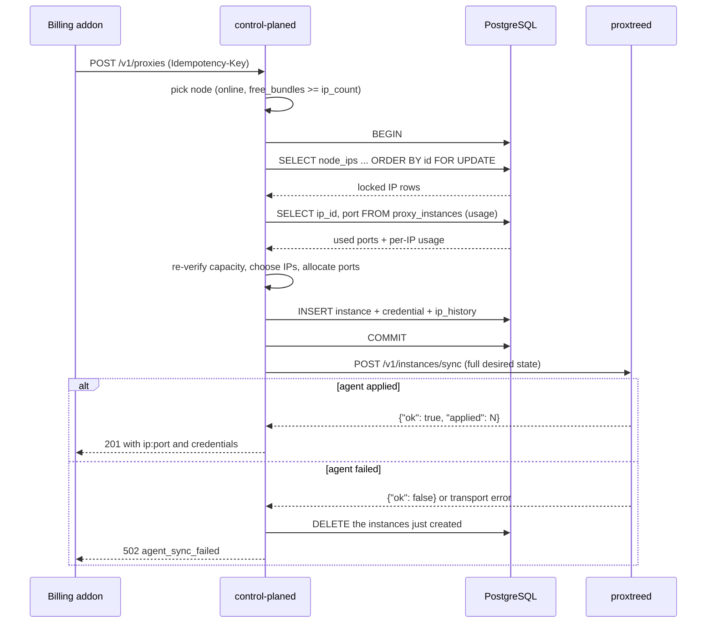

# Provisioning

Provisioning is the moment inventory becomes a product. A buyer asks for a
shape, the control plane has to find free capacity on a single node, hold it
durably, tell the node to serve it, and only then hand back credentials. Any of
those steps can fail, and a failure must never leave a sold-but-dead proxy —
neither in the database nor on a node.

This page is the mechanics of that contract. For the agent side, see
[Proxy Engine](./proxy-engine) and the [Architecture overview](./overview).

## The shape of a request

A plan is defined by two numbers and a pool selector:

| Field | Meaning |
|---|---|
| `ip_count` | Number of **distinct** IP addresses required (1–1000) |
| `instances_per_ip` | Proxy instances (ports) bound on **each** of those IPs (default 1, 1–100) |
| `ip_mode` | Which pool to draw from: `any` (default), `dedicated` or `oversell` |

Total instances = `ip_count × instances_per_ip`. Everything else in this page
exists to answer one question honestly: can one node provide that shape *right
now*?

`ip_mode` selects the pool:

- **`any`** (the default, also spelled `""` or `"all"`) — shared (oversell) IPs
  first, dedicated only when shared is full, so exclusive IPs stay available for
  plans that require them.
- **`dedicated`** — an exclusive IP, exactly one instance per IP, never shared.
- **`oversell`** — shared IPs only; never consumes a dedicated IP.

The five shapes an operator actually sells:

| `ip_count` | `instances_per_ip` | `ip_mode` | Total instances | What the customer gets |
|---|---|---|---|---|
| 1 | 1 | `dedicated` | 1 | One proxy on its own exclusive IP |
| 1 | 1 | `any` / `oversell` | 1 | One proxy on a shared IP |
| 1 | N | `any` / `oversell` | N | N ports on one IP — a pool behind a single address |
| N | 1 | `any` | N | One proxy per IP — a rotating pool of N addresses |
| N | M | `oversell` | N × M | M ports on each of N shared IPs |

`dedicated` combined with `instances_per_ip > 1` is impossible — one exclusive IP
hosts exactly one instance — and is rejected up front as `422
unsatisfiable_plan`, not reported as out of stock. An unknown `ip_mode`, or an
`instances_per_ip` above 100, is a `400 bad_request` rather than a silent
fallback, so a typo cannot quietly sell a shared IP to a customer who paid for a
dedicated one.

## Reservation, commit, compensation

The control plane and the node agent share no transaction, so every mutating
endpoint follows the same three-phase pattern: **reserve in the database, commit,
push the desired state, and compensate if the push fails.**



**Why success is never reported before the agent confirms.** The database is the
system of record, but a proxy that exists only in the database is not a product:
it has a row, a credential and a port, and no listener. Returning credentials at
that moment would sell a `502` — the customer would have a working-looking
`ip:port` that refuses every connection.

So the plaintext credential pair is returned only after
`POST <node url>/v1/instances/sync` reports success (the code calls this
"backend-verified": a 2xx always means *live on the node*). The sync payload is
the node's **entire** desired state, which is what makes the rollback clean: the
agent only ever applies complete sets, so there is no partial remote application
to undo. The worst case after a failure is that the agent briefly held a listener
that the next successful sync removes, while the database — the record — never
acknowledged it.

The compensation is exact and narrow: `compensateProvision` deletes precisely the
instance rows created by this call, in a fresh transaction, and writes a
`proxy.provision_compensated` audit entry with the reason `agent_sync_failed`. If
the compensation itself fails, the agent logs `CRITICAL` — that case needs an
operator, not a silent retry.

## Locking strategy

Provisioning opens one transaction and starts by taking a lock over the node's
addresses:

```sql
SELECT id, node_id, address, label, mode, max_instances, created_at
FROM node_ips ni
WHERE ni.node_id = $1
  AND <ip_eligible>
ORDER BY ni.id
FOR UPDATE;
```

Locking **every** eligible `node_ips` row of the node in deterministic `id` order
serializes provisioning *and* rotation on that node without deadlocks: whoever
gets the rows first is the only one modifying them. The eligibility predicate is
the same one the capacity queries use, so the locked set and the advertised
capacity can never disagree about which IPs exist.

Then, **as a separate statement**, the transaction snapshots current usage:

```sql
SELECT ip_id, port FROM proxy_instances
WHERE node_id = $1 AND status IN ('active','suspended');
```

The split is deliberate and is the subtlest correctness detail in the system.
The transaction runs at PostgreSQL's default **READ COMMITTED** isolation, where
every statement gets a *fresh* snapshot taken when that statement begins. If the
usage count were a subquery inside the locking `SELECT`, that subquery would
evaluate against the snapshot from **statement start** — taken *before* the
`FOR UPDATE` blocked on another provisioner — and would miss every row that
transaction committed while we waited for the lock. Two concurrent provisions
would then each believe the last slot was free.

Issuing the usage read as its own statement, *after* the lock has been granted,
gives it a snapshot that includes everything committed before the lock was
acquired. The counts are therefore accurate exactly when they need to be. The
`FOR UPDATE` is the mutual exclusion; the separate snapshot is what makes the
counts under it correct.

## Port allocation

Listeners bind `0.0.0.0:<port>`, so a port is unique **per node**, not per IP: two
instances on the same node can never share a port even on different addresses.
That is why allocation works over a node-wide free set rather than a per-IP one.

Each node has `port_range_start` / `port_range_end` (default `10000`–`60000`,
validated `1 <= start < end <= 65535`). Allocation walks that range lowest-first:

```go
// internal/httpapi/sync.go
for p := node.PortRangeStart; p <= node.PortRangeEnd; p++ {
    if used[p] || reserved[p] { continue }
    for _, e := range exclude { if p == e { skipped = true; break } }
    if skipped { continue }
    used[p] = true
    return p, nil
}
```

Three properties follow:

- **Lowest free port**, so a node's ports are consumed densely and the range is
  easy to reason about from the outside.
- **The agent's own control port is reserved.** `reservedPorts` parses the port
  from the node's `url` — the `proxtreed` control channel, default `9090` — and it
  is never allocated. It sits outside the default range, but the exclusion still
  applies if an operator overlaps the ranges.
- **Marked used in memory inside the transaction**, so two allocations in the
  same provision can never choose the same port: `allocPort` adds it to the
  `used` map before returning.

`used` starts as the node-wide set returned by the usage snapshot. `exclude`
exists for rotation, which passes the instance's current port explicitly even
though it is already in `used`: the invariant "rotation always produces a new
binding" is then local to the call.

Co-located agents on one host must use disjoint ranges — the database cannot see
a port another process holds outside ProxTree.

## IP selection

From the locked rows, candidates are filtered and ordered:

1. **Eligibility.** An address is allocatable only when both gates hold: the agent
   reported it in `bound_ips` (it exists on an interface) *and* the prober did not
   report it unreachable. Both fail open when a node has never reported, so a
   fresh install keeps working. The predicate lives in one place
   (`ipEligibleSQL`) and every capacity query uses it — it is the single source of
   truth for "can this IP be handed to a customer".
2. **Mode.** With `ip_mode` set, only matching IPs are considered. With `any`,
   both kinds are.
3. **Per-IP room.** A candidate must satisfy `FreeSlots() >= instances_per_ip`;
   an IP that can take two more instances is no use to a plan that needs three on
   one address.
4. **Deterministic order, shared first.** Candidates keep their `id` order, then a
   stable sort ranks oversell (0) before dedicated (1). Filling shared IPs first
   means exclusive IPs stay free for the plans that specifically require them — a
   customer then sees the IP they paid for, and an operator keeps the flexibility
   to sell it.

The transaction then walks the candidates and assigns one bundle per IP: the
first `ip_count` eligible IPs, each getting `instances_per_ip` instances on
distinct ports. Per allocation it inserts the instance row, a credential pair and
an `ip_history` row, and increments the in-memory usage of that IP so a later
allocation in the same transaction sees it.

## Capacity arithmetic

Two numbers describe free capacity, and both exist because they answer different
questions.

`free_slots` — how many instances a node can host at all:

```text
free_slots = LEAST(
    SUM(per-IP free slots),
    node port range size - used ports node-wide
)
```

Per-IP free slots depend on mode: `dedicated` contributes 1 while unused;
`oversell` with `max_instances` contributes `max_instances - used`; `oversell`
without a cap contributes the whole port range (the cap only ever binds at the
node level). The `LEAST` with free ports is what stops a node from advertising
more instances than it has ports.

`free_bundles(instances_per_ip)` — how many IPs can carry the plan's ports:

```text
free_bundles = LEAST(
    count of IPs whose free slots >= instances_per_ip,
    (port range size - used ports node-wide) / instances_per_ip
)
```

With `instances_per_ip = 1` it is simply the number of allocatable IPs with a free
slot. Availability is answered per node as `free_bundles >= ip_count`, because
provisioning targets a *single* node.

**Why both.** `free_slots` is the honest answer to "how much room is left";
`free_bundles` is the honest answer to "does this shape fit". Reporting only
slots overstates a plan that binds several ports to one IP, and the storefront
would take an order it cannot fill. This is why the billing addon drives product
stock from `best_node_free_bundles / ip_count`: a plan needing three ports on one
IP is not counted against a node whose three free slots are spread over three
different IPs.

**Worked example.** A node with `port_range_start = 10000`,
`port_range_end = 10002` (three ports) and three oversell IPs, each with exactly
one free slot:

| Plan | `free_slots` | `free_bundles` | Available? |
|---|---|---|---|
| `ip_count: 1, instances_per_ip: 1` | 3 | 3 | Yes |
| `ip_count: 3, instances_per_ip: 1` | 3 | 3 | Yes |
| `ip_count: 1, instances_per_ip: 3` | 3 | 0 | **No** |

The third row is the case this whole section exists for: three free slots, but no
single IP can take three instances, so no count of slots will ever fit. The
availability response returns `best_node_free_slots: 3` and
`best_node_free_bundles: 0` side by side so the operator sees both numbers.

## Backstop constraints

The row locks and the usage snapshot are the correctness mechanism. The database
also carries two constraints as the second line of defence:

```sql
-- per-IP pair, all statuses
UNIQUE (ip_id, port)

-- node-wide, live instances only
CREATE UNIQUE INDEX proxy_instances_node_port_active
    ON proxy_instances (node_id, port)
    WHERE status IN ('active', 'suspended');
```

The partial index is the one that encodes the node-wide rule: no two live
instances on a node may share a port, even on different IPs. The earlier
`UNIQUE (ip_id, port)` covers the per-IP pair across every status.

If a bug ever let two transactions choose the same port, the second `INSERT`
violates a constraint and the **whole provisioning transaction rolls back** — the
caller gets a 500, never a duplicate binding and never a half-created plan. That
is the point: the database is the last thing standing between a race and two
listeners fighting over one socket.

One edge case worth knowing: only `active`/`suspended` instances count as usage,
and the node-wide index is partial over the same two statuses, so an `expired`
instance that has not been deleted frees its port for both allocation and the
index. The older `UNIQUE (ip_id, port)` covers *all* rows, so an expired row can
still block the identical `(ip_id, port)` pair for `INSERT`. Ports are consumed
lowest-first and expired rows are deleted at termination, so this is rare — and if
it happens, the insert fails, the transaction rolls back, and no double
allocation occurs.

## Idempotency

Every mutating route is wrapped in the same middleware and accepts an
`Idempotency-Key` header. The key is `(key, endpoint)` where the endpoint is
`METHOD + path`, so one key can safely be reused across different routes, and a
retry of a timed-out purchase cannot become a second purchase.

| Situation | Response |
|---|---|
| First request with this key | Claimed; the handler runs |
| Replay after a stored 2xx | Stored status and body, header `Idempotency-Replayed: true` |
| Same key, different request body | `422 idempotency_key_mismatch` |
| Concurrent duplicate, original still running | `409 idempotency_in_progress` |
| Original returned non-2xx | Claim released; a retry re-executes |

The mechanism is claim-before-work. The request body is buffered (8 MiB cap) and
SHA-256 hashed; `INSERT ... ON CONFLICT (key, endpoint) DO NOTHING` on the
`idempotency_keys` primary key decides the winner. Winning the insert means this
request executes the mutation — the unique constraint, not an application-level
check, is what makes concurrent duplicates safe.

A loser compares the stored `request_hash` with its own: a mismatch is a client
bug (same key, different payload) and returns `422`. Otherwise it polls the row
for up to 30 seconds (every 25 ms) waiting for the original to store its
response, then replays the stored status and body verbatim with
`Idempotency-Replayed: true`. If the original has still not finished, the loser
gets `409 idempotency_in_progress`.

**Only 2xx responses are stored.** A non-2xx outcome releases the claim
(deleting the row) so a retry after a failure actually re-executes instead of
replaying an error. The stored body is the handler's real response, so a replayed
201 carries the same credentials the original returned.

For the billing addon this is the whole point: any provisioning or lifecycle call
can be retried after a timeout or a 5xx with the same key and either the original
result comes back or the operation safely re-runs — no duplicate proxies, no
double charges.

## Reconciliation

Idempotency protects a retry. The reconciler protects against everything else.
Every `PROXTREE_RECONCILE_INTERVAL` (default **30 s**) the control plane lists the
online nodes and pushes each one's full desired state
(`POST /v1/instances/sync`), rebuilt from the database: every `active`,
non-expired instance with its decrypted credential, plus the node's registered
addresses as `probe_ips`.

Because the payload is the complete desired set, this is a convergent operation
rather than a command: the agent reconciles its SQLite store and listeners to
exactly that set, and applying it twice is the same as applying it once. It fixes:

- **Drift after an agent restart** — listeners come back from local disk, and any
  instance the control plane no longer wants is removed on the next sync.
- **A missed sync** — a lifecycle change whose push failed (or whose control
  plane process died mid-call) is re-sent within half a minute.
- **A partially applied change** — the agent reports per-instance errors and
  flips `ok` to false; the next full push retries the whole set.

It cannot fix:

- **An offline node.** The reconciler only iterates online nodes, so a node that
  is not heartbeating is untouched until it comes back.
- **A wrong desired state.** It pushes the database faithfully; if the database is
  wrong, the agent is told to be wrong in the same way. Configuration errors
  surface through `ip_drift` and `unreachable_ips`, not through reconciliation.
- **A local bind failure.** If a listener cannot bind (another process holds the
  port), the agent reports the error and the reconciler logs it; the fix is
  operator action on the host.

## Rotation internals

Rotation moves one instance to a new IP on the same node. It is a two-party flow:
a billing or admin caller files the request, and an admin resolves it.

**One pending request per instance, enforced by an index.** `rotation_requests`
carries `rotation_requests_pending_uniq ON rotation_requests(proxy_instance_id)
WHERE status = 'pending'`. The insert maps PostgreSQL error 23505 to
`ErrRotationPending` → `409 rotation_pending`. This works under concurrency
precisely because it is an index rather than a check-then-insert. Only `active`
instances may request rotation; anything else is `422 invalid_state`.

**Accept.** The node must be `online` — otherwise the call is `503 node_offline`
and the request deliberately **stays pending**, so it can be resolved after
recovery rather than failing silently. Inside one transaction the resolve path:

1. locks the rotation row `FOR UPDATE` and re-checks it is still `pending` (two
   concurrent resolves cannot both move the instance; the loser gets `409
   rotation_not_pending`),
2. takes the same per-node `LockNodeIPs` lock provisioning uses, so rotation and
   provisioning cannot interleave on a node,
3. loads the instance's `ip_history` and classifies every locked IP:

   | Class | Rule |
   |---|---|
   | Excluded | The instance's current IP; any IP released within `PROXTREE_ROTATION_COOLDOWN` (default **10m**); any IP with no spare capacity |
   | Fresh (preferred) | Has capacity and appears nowhere in the instance's history |
   | Reused (fallback) | Used before, but released longer ago than the cooldown |

4. selects `append(fresh, reused...)` — a never-used IP always wins; a
   previously used IP is only considered when nothing fresh exists. The cooldown
   stops a request → resolve → request cycle from bouncing the customer straight
   back onto the address they asked to leave;
5. allocates a port with the instance's current port explicitly excluded, so
   rotation always produces a genuinely new binding, never `newIP:samePort`;
6. moves the instance (`MoveInstance`), closes the old history row, opens a new
   one, and resolves the request as `accepted` — all in the same transaction, so
   the database never shows a half-moved instance;
7. pushes the desired state. If the agent cannot apply it, `compensateRotation`
   moves the instance back, re-opens the old history row, deletes the new one,
   and **re-opens the request to pending** so it can be resolved again — then the
   caller gets `502 agent_sync_failed`.

**No slots.** If the eligible list is empty the request does not fail: it
resolves to status `no_slots` with HTTP 200 and an audit entry
`rotation.no_slots`. The distinction matters operationally — `no_slots` means
"add IPs or wait out the cooldown", not "retry the call".

`deny` and `ignore` are bookkeeping-only resolutions (`denied` / `ignored`) under
the same row lock, with `409 rotation_not_pending` guarding double resolution.

## Suspend, delete and expiry paths

What each path does, and what it does to capacity. Only `active` and `suspended`
instances hold capacity; `expired` frees its slot and port for reallocation even
though the row still exists.

| Path | Status change | Holds capacity? | Agent sync failure |
|---|---|---|---|
| Suspend | `active` → `suspended` | Yes — the slot and port stay reserved | Status reverts to `active`, `502 agent_sync_failed` |
| Resume | `suspended` → `active` | Yes (unchanged) | Status reverts to `suspended` |
| Extend | Sets `expires_at`; an `expired` instance is revived to `active` | Regained when revived | Expiry and status revert |
| Delete | Two phases, below | Released when expired | Phase 1 reverts; nothing is deleted |
| Expiry (sweeper) | `active` → `expired` once `expires_at` passes | Released | Not applicable — no agent call |

Resume refuses an expired instance with `422 instance_expired` ("extend it
first"); extending it is the way back.

**The two-phase delete.** `DELETE /v1/proxies/{id}` first marks the instance
`expired` — which removes it from the desired state — and confirms the agent
applied that, and only then deletes the rows. If the agent cannot be reached, the
status reverts and the caller gets `502 agent_sync_failed`; nothing was deleted.
The order is the point: the agent must stop enforcing an instance *before* the
control plane forgets it ever existed. A crash between the phases leaves an
`expired` row, which holds no capacity — so the visible failure is a stale record
for an operator to clean, not a live proxy nobody is accounting for.

**Expiry** is enforced twice, independently. The control plane's sweeper
(`ExpireInstances`, every `PROXTREE_SWEEP_INTERVAL`, default 10 s) flips
`active`-but-past-expiry rows to `expired` to keep capacity accounting truthful.
The agent does not wait for that: its own janitor reaps `expires_at` every second
and closes the listener, the connections and the credential row without any
control-plane round trip. A customer's plan ends on time even if the control
plane is unreachable, and the next sync simply no longer mentions the instance.

## Failure catalogue

| Failure mode | Detection | Behaviour |
|---|---|---|
| Agent unreachable mid-provision | `SyncNode` returns a transport error after the reservation committed | Compensating transaction deletes exactly the rows created, audited as `proxy.provision_compensated`; caller gets `502 agent_sync_failed`. Capacity is released; nothing half-exists |
| Agent rejects a sync | Agent returns `ok: false` (any per-instance error flips `ok`, e.g. a port that will not bind) | Same compensation and `502`. The full desired state is re-pushed by the reconciler on the next tick |
| Control plane dies mid-transaction | Process loss during the reservation | PostgreSQL rolls the transaction back; nothing is created. If it dies *after* commit but before the sync, the instances exist and hold capacity, the caller never got a success, and the reconciler pushes them to the agent within ~30 s (they go live). The idempotency claim row is left uncompleted, so a retry waits out the 30-second window and then sees `409 idempotency_in_progress` — no stale-claim reaper exists, so resolve it by inspecting `GET /v1/proxies?external_ref=...` |
| Node goes offline between the availability check and the purchase | Node status is re-read at provisioning time | With `node_id` the call fails `422 node_offline`; without it the node is absent from the online list, so the request fails `422 insufficient_capacity` with an explanation. Going offline after the pick means the sync fails → `502` plus compensation |
| Two concurrent purchases race for the last slot | Node-wide `FOR UPDATE` serializes them | The loser's post-lock usage snapshot includes the winner's committed rows, so re-verification fails and it gets a clean `422 insufficient_capacity`. No lost update, no double allocation |
| Port collision backstop fires | A unique-constraint violation (23505) on `proxy_instances` | The whole transaction rolls back and the caller gets a 500. A bug is surfaced loudly rather than becoming two listeners on one socket — the constraints are the correctness layer, the snapshot is the efficiency layer |

[Quick start →](../getting-started/quick-start) · [API reference](../user-guide/api) · [Operations](../user-guide/operations)
