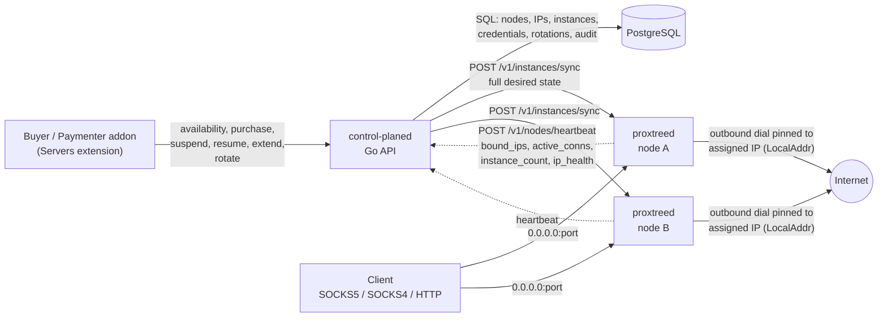

# ProxTree

ProxTree is a multi-tenant proxy hosting platform for operators who resell proxy
access: buyers get a credential pair bound to one specific `(IP, port)` on one
specific proxy server, and the platform takes care of the rest — IP pools
(dedicated or oversold), per-instance connection limits, expiry, IP rotation,
per-user accounting and an audit trail. It is aimed at hosts and resellers who
want to sell SOCKS5, SOCKS4 and HTTP proxies without hand-editing proxy config
per customer, and it is built to be driven by the Paymenter billing panel. The
system splits into two Go components: `control-planed`, the PostgreSQL-backed
control plane that is the source of truth for nodes, IPs, instances,
credentials, rotations and availability, and `proxtreed`, the node agent that
runs the actual proxy listeners and enforces credentials, port bindings and
expiry locally on each proxy server.

## Architecture

The control plane never carries customer traffic. It owns the inventory and the
money-facing state; the agents own the listeners and the bytes. Desired state
flows down (control plane to agent) and liveness flows up (agent to control
plane). The agent does not depend on the control plane to keep serving.



| Component | Binary | Role |
| --- | --- | --- |
| Control plane | `control-planed` | Go + PostgreSQL. Nodes, IPs, proxy instances, credentials, rotations, availability, audit, tokens. |
| Node agent | `proxtreed` | Go. One listener per proxy instance, credentials and limits enforced locally, status and metrics reporting. |
| Billing addon | Paymenter extension | Paymenter v1.5.7 Servers extension that drives the control-plane API. |

The control plane pushes the **full desired state** to an agent on every sync
(`POST /v1/instances/sync`), so recovery is always "replace what is running with
what is recorded". After each sync the agent picks up its credential DB, binds
one listener per instance on `0.0.0.0:<port>`, and reports back through a
heartbeat every `PROXTREE_HEARTBEAT_INTERVAL` (default `15s`). If the control
plane is unreachable the agent keeps enforcing credentials, ports and expiry on
its own and retries the heartbeat with exponential backoff capped at two
minutes.

## What a customer actually buys

A proxy instance is exactly **one credential pair on one (IP, port)**. That is
the whole unit of sale, and it determines everything else:

- **Inbound is open.** The listener binds `0.0.0.0:<port>`, so anyone who can
  reach the node can open a connection to that port. Credentials are the access
  control — not a firewall rule, not an allow-list.
- **Outbound is pinned.** Every connection the instance relays out is dialled
  with `net.Dialer{LocalAddr: &net.TCPAddr{IP: assignedIP}}`, so the target
  always sees the IP the customer was sold. This source-IP isolation is what
  buyers are paying for; it is enforced per instance, not per node.
- **The credential is the identity.** Resetting credentials issues a new
  username and password and kills the old pair immediately (there is no overlap
  window).

An IP in the pool is either **dedicated** or **oversell**:

| IP mode | Meaning |
| --- | --- |
| `dedicated` | Exclusive to one customer. Exactly one active instance per IP, never shared. |
| `oversell` | Shared. Up to `max_instances` instances on distinct ports on the same address. |
| `any` (default) | Prefer shared IPs; consume a dedicated IP only when shared capacity is exhausted, so exclusive IPs stay available for plans that require them. |

A plan shape is `ip_count × instances_per_ip`, where `ip_count` is the number
of **distinct IPs** and `instances_per_ip` is how many instances are bound on
**each** of them (1..100). Total instances = `ip_count × instances_per_ip`:

| Shape | `ip_count` | `instances_per_ip` | What the buyer gets |
| --- | --- | --- | --- |
| Single proxy | `1` | `1` | One credential on one (IP, port). |
| Three ports, one IP | `1` | `3` | Three credentials sharing one IP on three different ports. |
| Three IPs, one each | `3` | `1` | Three credentials, three distinct IPs. |
| Three IPs, three each | `3` | `3` | Nine credentials across three IPs. |

`ip_count: 1, instances_per_ip: 3` is the most common "rotating-ish" shape:
three proxies on one IP on three ports. Note the deliberate constraint:
`dedicated` combined with `instances_per_ip > 1` is impossible, and the API
rejects it as `422 unsatisfiable_plan` rather than reporting it as out of stock
— an exclusive IP cannot host two customers.

## Features

- **Hand-written protocol engine.** SOCKS5 (RFC 1928) with username/password
  auth (RFC 1929), SOCKS4/4a, and HTTP CONNECT plus forward proxy with Basic
  auth, all implemented directly in Go. No 3proxy, no proxy library.
- **First-byte protocol dispatch on one core.** All three protocols share a
  single listener core and converge on one bidirectional relay with half-close
  support, so accounting, limits and IP binding are identical regardless of
  protocol. A protocol not enabled on an instance is closed immediately.
- **Per-IP egress pinning.** Outbound connections are bound to the instance's
  assigned IP, not the node's primary address.
- **Node-local enforcement and autonomy.** A janitor checks `expires_at` every
  second and tears down the listener, closes connections and deletes the
  credential locally — no control-plane round trip. Non-expired instances are
  re-bound from the agent's local SQLite at boot, so a node reboot does not need
  the control plane.
- **Atomic provisioning with compensation.** One transaction locks the node's
  IP rows `FOR UPDATE`, re-verifies capacity and IP eligibility under the lock,
  allocates ports and inserts rows; then the desired state is pushed to the
  agent. If the agent cannot apply it, a compensating transaction deletes
  everything created and the caller gets `502 agent_sync_failed`. Nothing
  half-exists.
- **Idempotency everywhere it matters.** Mutating endpoints accept an
  `Idempotency-Key`; a byte-identical replay returns the stored response with
  `Idempotency-Replayed: true`, a concurrent duplicate returns
  `409 idempotency_in_progress`, and reusing a key with a different body returns
  `422 idempotency_key_mismatch`.
- **Rotation with reuse avoidance.** At most one pending request per instance is
  guaranteed at the database level. On accept, the control plane picks a
  replacement IP on the same node, preferring addresses the instance has never
  used (tracked in `ip_history`) and excluding IPs released within
  `PROXTREE_ROTATION_COOLDOWN` (default `10m`). The instance gets a new IP
  **and** a new port.
- **Capacity that accounts for IP shape and reachability.** Free-slot math is
  shaped (`ip_count × instances_per_ip`), and an IP is only sellable when two
  independent gates pass: the agent reported the address in `bound_ips`, and its
  reachability prober did not mark it unreachable.
- **Audit trail.** Node, IP, provision, compensation, rotation and token actions
  are written to `audit_log` with actor, action, resource and client IP, readable
  through `GET /v1/audit`.
- **Paymenter integration.** Three bearer-token roles — `admin`, `billing`
  (the addon) and `node` (the agent) — with the billing role scoped to exactly
  the lifecycle calls the addon needs. The addon provides node/IP admin pages,
  a rotation queue, stock gating, lifecycle hooks and a client dashboard.
- **Metrics in three formats.** The agent exposes per-instance bytes in/out,
  active and total connections and uptime as Prometheus text (default),
  `?format=json` or `?format=influx`.
- **Optional mTLS on the agent control channel.** Every request already carries
  a node bearer token (constant-time compare, with the previous token accepted
  during rotation); setting `PROXTREE_MTLS_CA` additionally requires a verified
  client certificate from the control plane.

::: warning SOCKS4 carries no credentials
SOCKS4 has no authentication mechanism — the `USERID` field is informational.
An instance that enables `socks4` accepts any SOCKS4 `CONNECT`; access control
then rests entirely on the unguessable `(IP, port)` allocation and the instance
limits. Enable `socks5` and/or `http` when per-user authentication matters.
:::

## How it compares

| Capability | ProxTree | 3proxy / squid by hand | SSH tunnel or static proxy file |
| --- | --- | --- | --- |
| Credential management | Per-instance credentials generated at provision, reset on demand, old pair dies immediately | Hand-edited config files and a reload per customer | One tunnel or one static entry per user, edited by hand |
| Per-user accounting | Per-instance bytes in/out, active and total connections, uptime, in three metric formats | Squid access logs parsed manually; 3proxy counters with no multi-tenant view | None — no per-user view at all |
| IP rotation | Request queue, one pending per instance, reuse avoidance, cooldown, new IP and port | Manual config edit and service restart | Re-issue the tunnel/entry by hand |
| Expiry enforcement | Node-local janitor tears the listener down at `expires_at` with no control-plane round trip | External cron scripts that edit config at the right time | None |
| Billing integration | Paymenter Servers extension plus an idempotent REST API | None | None |
| Audit | `audit_log` with actor, action, resource and client IP, via `GET /v1/audit` | Shell history and grep | Shell history |
| Multi-node | Registers nodes with tokens, tracks heartbeats, allocates ports node-wide, marks nodes offline | SSH into each box and keep configs in sync | One tunnel or file per host |

## Deployment shapes

Two topologies are realistic. Both use the same binaries; only the URLs differ.

| Shape | Control plane | Agent(s) | Typical use |
| --- | --- | --- | --- |
| Single host | `control-planed` on the proxy server | `proxtreed` on the same server | Getting started, a small reseller, or a lab. The installer's default (`--only all`). |
| Split | `control-planed` on a management host | `proxtreed` on each proxy server | Production. The control plane is a single small API box; proxies scale out as separate nodes. |

::: warning The two URLs are not interchangeable
There are two distinct endpoints and mixing them up is the most common setup
mistake.

- The **control plane API** (default `:8080`) is what the admin, the billing
  addon and API clients call.
- The **agent control channel** (default `:9090`) is what the control plane
  calls to push state; this is the address you register as a node's `url` in
  `POST /v1/nodes`.

An agent's `PROXTREE_CONTROL_PLANE_URL` must point at the control plane, never
at its own listen port — the agent never serves `/v1/nodes/heartbeat`, so a
self-referential URL can only produce `connection refused`. The installer
detects that case and refuses to configure it. In the split shape the node `url`
must be reachable **from the control plane**, and `PROXTREE_CONTROL_PLANE_URL`
must be reachable **from the agent**.
:::

Co-located agents on one host must use disjoint port ranges, because listener
allocation is node-wide (a port is unique per node, not per IP). The agent's own
control port is reserved and never allocated.

## Quick install

The backend release zip ships static binaries for Linux, macOS and Windows
(amd64 and arm64) plus the installer. From the unpacked zip:

```bash
sudo sh install.sh
```

That installs the binaries, PostgreSQL, the embedded migrations and the systemd
units, then verifies health. [Quick Start](/proxtree/getting-started/quick-start)
walks the same path in six steps, from install to a working proxy.

## Documentation map

- [Installation](/proxtree/getting-started/installation) — full installer reference and flags.
- [Quick Start](/proxtree/getting-started/quick-start) — install to a working proxy in six steps.
- [FAQ](/proxtree/getting-started/faq) — common questions and pitfalls.
- [Configuration Reference](/proxtree/configuration/reference) — every control-plane and agent variable, and every installer flag.
- [HTTP API](/proxtree/user-guide/api) — endpoints, roles, idempotency and error codes.
- [CLI Reference](/proxtree/user-guide/cli) — `control-planed` and `proxtreed` commands and flags.
- [Paymenter Addon](/proxtree/user-guide/paymenter) — wiring ProxTree to billing.
- [Operations](/proxtree/user-guide/operations) — day-two tasks: rotation queue, node health, capacity.
- [Architecture Overview](/proxtree/architecture/overview) — components, trust boundaries and data flow.
- [Proxy Engine](/proxtree/architecture/proxy-engine) — the hand-written protocol engine.
- [Provisioning](/proxtree/architecture/provisioning) — reservation, sync and compensation.
