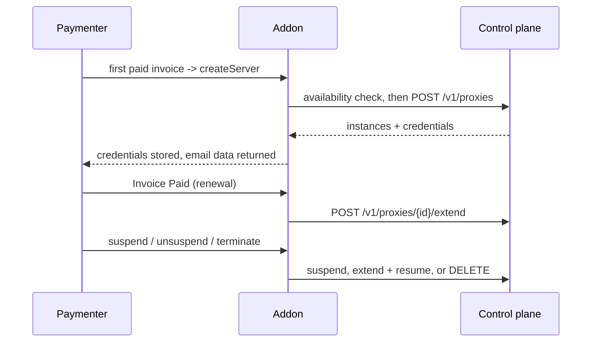

# Paymenter Addon

The ProxTree addon is a Paymenter **Servers** extension. It connects your storefront to a
[control plane](/proxtree/architecture/overview) so a purchase becomes a real proxy: the plan
is sold as a normal Paymenter product, gated by live capacity, provisioned on the first paid
invoice, extended on renewal, and managed by the buyer from a self-service dashboard.

This page covers installing and configuring the addon, the product fields, stock and lifecycle
mapping, the admin pages and the client dashboard. For the platform underneath see
[Operations](/proxtree/user-guide/operations) and the [HTTP API](/proxtree/user-guide/api).

## What the addon does

- **Sells proxy plans on the storefront.** A product's `stock` column is driven by the control
  plane's shaped capacity, so the storefront badge, the add-to-cart button and the checkout
  check all reflect what can actually be provisioned right now.
- **Gates purchases server-side.** A plan that cannot be fulfilled is refused at add-to-cart
  and again inside the checkout transaction, so capacity is never oversold by a race.
- **Provisions on the first paid invoice.** `createServer` reserves instances on a node, returns
  credentials, and stores the full instance array on the service.
- **Extends on renewal.** Paymenter core does not call the server extension on renewal, so the
  addon listens for `Invoice\Paid` and pushes the new `expires_at` to every instance.
- **Suspends and resumes.** Suspension stops the listeners; resumption re-extends expiry first,
  so a service suspended across a renewal does not come back expired.
- **Terminates and frees capacity.** Termination deletes the instances, releasing their IP and
  port allocations back to the node.
- **Gives the buyer a dashboard.** `/proxtree/services/{id}` shows one card per instance with
  the binding, credentials, live statistics, expiry, credential reset and IP rotation.

## Requirements

| Requirement | Version / detail |
|---|---|
| Paymenter | v1.5.7 (built and tested against commit `f8a884e`) |
| Laravel | 12 (12.63) |
| Filament | 5 (5.6.8) — the admin pages use Filament 5 APIs only |
| Livewire | 4 (4.3.3) — the dashboard component uses Livewire 4 |
| PHP | 8.3 or newer |
| Control plane | `control-planed` reachable from the Paymenter host over HTTP(S) |
| API token | an **admin-role** API token (`ptx_…`) from that control plane |
| Queue worker | a Paymenter queue worker on the `default` queue |
| Scheduler | Paymenter's `schedule:run` cron entry |

::: warning Target version
Built for Paymenter v1.5.7 (Filament 5 / Livewire 4 APIs). On an older release the admin pages do not render and some events may not exist — upgrade Paymenter first.
:::

## Installation

Both install paths end in the same place: the extension living at `extensions/Servers/ProxTree/`
with `ProxTree.php` as its main class, and Paymenter's autoloader aware of it.

### Path A — upload the addon zip (recommended, Docker and plain installs)

1. Download `ProxTree-Paymenter-Addon-<version>.zip` from the ProxTree release you deployed.
2. In Paymenter admin go to **Extensions** and upload the zip.
3. Paymenter extracts it into `extensions/Servers/ProxTree` and registers the extension.

On a Docker install the `extensions` directory is bind-mounted to the host, so the upload lands
in the mounted directory and survives a container rebuild exactly as it does on a plain install.
You can also unzip the release on the host into that same directory — the result is identical.

### Path B — manual copy

```bash
# from the Paymenter root
unzip ProxTree-Paymenter-Addon-<version>.zip -d extensions/Servers/
# the main class must end up here:
ls extensions/Servers/ProxTree/ProxTree.php
composer dump-autoload
```

The layout must be `extensions/Servers/ProxTree/ProxTree.php`. A zip extracted one level too
deep (`extensions/Servers/ProxTree/ProxTree/ProxTree.php`) is not discovered.

### The writable-directory trap

Paymenter's extension uploader writes the archive to a temporary path and then moves the
extracted directory into `extensions/`. That move fails if the web user cannot write to the
target. This bites hardest when the directory was created as `root` (for example with
`sudo unzip`, or by copying files over SSH as root) on a Docker or plain install where the web
server runs as `www-data`.

- **Symptom:** the zip upload in **Extensions** fails with a rename error, or the extension
  appears in the list but its files are never updated.
- **Cause:** `extensions/Servers/ProxTree` (or a directory above it) is owned by `root`, so the
  PHP process cannot rename into it.
- **Fix:** hand ownership to the user the web server runs as, then re-upload.

```bash
# adjust the user/group to match your install (www-data, nginx, apache, or your Docker user)
sudo chown -R www-data:www-data extensions/Servers/ProxTree
sudo chmod -R u+rwX extensions/Servers/ProxTree
```

After any upload or manual copy, run `composer dump-autoload` from the Paymenter root if your
install does not do it automatically, then clear Paymenter's caches.

### First-run setup

1. Go to **Admin → Servers → Add Server** and choose the **ProxTree** extension.
2. Fill in the settings (below) and save.
3. **Save the row once more.** Paymenter persists secret settings without the encrypted flag until the first edit; the addon re-persists the API token encrypted when the row is enabled or updated, so saving twice guarantees encryption at rest.
4. Point your products at this server (product → **Server** tab) and configure the plan fields.

## Configure the server

A **Server** row is a connection to one control plane, with exactly two settings.

| Setting | Type | Notes |
|---|---|---|
| **Control Plane URL** | text, required, must be a URL | Base URL of the control plane API, e.g. `http://10.0.0.1:8080`. This is `control-planed`, **not** the node agent. |
| **API Token** | password, required, encrypted at rest | An **admin-role** API token (`ptx_…`): the bootstrap token printed on the first control-plane start, or one created with `POST /v1/tokens` using `role: "admin"`. |

One admin token covers everything: node/IP management and rotation resolution are admin-only,
and the admin role can also perform every billing action. The token is stored encrypted at rest
and is never rendered back into the UI.

**"Test Connection"** performs one authenticated `GET /v1/nodes` and reports what it found. That
single call distinguishes the two classic mistakes, because the control plane and the agent
answer different paths.

::: warning The two mistakes Test Connection detects
**1. Pointing at the agent's port instead of the control plane.** The control plane listens on
`8080`, the node agent on `9090`. The agent serves `/v1/health` but has no `/v1/nodes`, so the
test gets a 404 and probes both markers:

```text
That URL answers like a proxtreed NODE AGENT, not the control plane. Set the Control Plane URL to the control-planed API (default port 8080), not the agent control channel (default port 9090).
The token you entered is a node token for this agent — the Server row needs an admin-role API token instead.
```
The second line is appended only when the agent accepted the entered token on `/v1/health`.

**2. Using a node token instead of an API token.** A node token authenticates the agent to the
heartbeat endpoint; it is not an API token. The control plane answers 401 (or 403):

```text
Token rejected. Use an admin-role API token from the control plane (the bootstrap token from the first control-planed start, or POST /v1/tokens with role "admin") — a node token only authenticates the agent, not this API.
```

If nothing ProxTree answers at the URL at all:

```text
Nothing ProxTree answers at that URL (no control plane on /healthz, no agent on /v1/health). Check host and port.
```
:::

## Product configuration

Plan fields are defined by the extension and stored per product. There are no secrets here.

| Field | Type | Default | Meaning |
|---|---|---|---|
| `location` | select (live) | empty = any | Proxy node location. Options are the distinct locations of this server's nodes, cached 60 s. |
| `ip_count` | number, min 1 | `1` | Number of **distinct IPs** the plan provisions. |
| `instances_per_ip` | number, 1–100 | `1` | Proxy instances (**ports**) bound on **each** of those IPs. |
| `ip_mode` | select | `any` | IP pool: `any`, `dedicated` or `oversell`. |
| `protocol_socks5` | checkbox | on | Enable SOCKS5 on every instance. |
| `protocol_socks4` | checkbox | off | Enable SOCKS4/4a on every instance. |
| `protocol_http` | checkbox | on | Enable HTTP CONNECT + forward proxy on every instance. |
| `max_conns` | number, min 0 | `0` | Simultaneous connections per instance. `0` = unlimited. |
| `new_conn_rate` | number, min 0 | `0` | New connections per second per instance. `0` = unlimited. |

Total instances = `ip_count × instances_per_ip`. Each instance gets its own credential pair and
its own port. `instances_per_ip` and `ip_mode` are only sent to the control plane when they
differ from the defaults (`1` and `any`), so a plain plan produces the smallest possible request.

If the control plane cannot be reached while the product form renders, the location list is
unavailable and a placeholder says so; the field reuses the last known list (kept 30 days)
rather than failing the page. You can still save and provision with the stored values.

### Worked example: "3 separate IPs"

```text
ip_count:          3
instances_per_ip:  1
ip_mode:           any
```

Three instances, each on its own IP. The control plane must find three distinct eligible IPs on
one node, each with at least one free slot. This is what you sell when the plan promises three
different source addresses.

### Worked example: "3 ports on one IP"

```text
ip_count:          1
instances_per_ip:  3
ip_mode:           any
```

Three instances sharing one IP on three distinct ports. The control plane needs one eligible IP
with at least three free slots and three free ports node-wide (ports are a node-wide resource —
every listener binds `0.0.0.0:<port>`). This is the usual shape for a "rotating ports on one
IP" product; note that all three instances share the source address.

### `ip_mode` behaviour

| Value | UI label | Behaviour |
|---|---|---|
| `any` | Any (shared first, dedicated as fallback) | Uses shared (oversell) IPs first and takes a dedicated IP only when shared capacity is full, so exclusive IPs stay available for plans that require them. |
| `dedicated` | Dedicated IP only (exclusive) | Every customer gets an exclusive IP, exactly one instance per IP, never shared. |
| `oversell` | Shared IP only (oversell) | Uses shared IPs only and never consumes a dedicated IP. |

Per-IP capacity follows the mode: a `dedicated` IP contributes 1 while unused; an `oversell` IP
contributes `max_instances - used`, or the node's port-range size when `max_instances` is null
(unlimited).

### Why `dedicated` plus `instances_per_ip > 1` cannot work

A dedicated IP hosts exactly **one** instance, so several instances on an exclusive IP is a shape
that can never be satisfied. The control plane rejects it explicitly instead of reporting it as
out of stock:

```json
{ "error": { "code": "unsatisfiable_plan", "message": "a dedicated IP hosts exactly one instance, so ip_mode=dedicated cannot be combined with instances_per_ip > 1" } }
```

How that surfaces in Paymenter depends on where the request is made:

- **Add to cart** fails **open** on control-plane errors, so a customer may still add the item.
- **Checkout** re-checks and fails **closed**: *"Proxy service temporarily unavailable, try
  again shortly."*
- **`SyncStockJob`** cannot compute stock and logs a warning; the stored `stock` stops updating.
- **`createServer`** would throw `ProxTree control plane error (422 unsatisfiable_plan)`, landing
  in Admin → Failed Jobs.

Because this is a configuration error rather than a shortage, the fix is the product: set
`instances_per_ip` back to `1` for a `dedicated` plan, or switch `ip_mode` to `any`/`oversell`.
Validate every new plan with an availability check before publishing it.

## Stock and purchase gating

The addon reads capacity from the control plane, writes it back to `product->stock`, then gates
purchases twice.

`SyncStockJob` runs every five minutes for every product on a ProxTree server and computes
`floor(best_node_free_bundles / ip_count)`. `best_node_free_bundles` is the control plane's
**shaped** capacity: how many complete plans the best node can still host, where one unit is one
IP able to take `instances_per_ip` instances. This is why a plan needing three ports on one IP
is not counted against a node whose three free slots are spread over three different IPs. If the
field is absent the job falls back to the raw slot count (`best_node_free_slots`); only drift is
logged. `product->stock` drives the storefront badge, hides add-to-cart at zero, and arms
Paymenter's native `lockForUpdate` checkout check.

### The add-to-cart gate — fails open

`CartItem\Creating` checks availability for the plan (result cached 30 s). If the plan is not
available the customer gets an error and the item is blocked. If the control plane cannot be
reached, the gate **fails open** (a warning is logged, the item is allowed): this check is a
courtesy, and the authoritative gate is at checkout.

### The checkout gate — fails closed

`Order\Creating` runs **inside the checkout database transaction** and repeats the check. Here
the behaviour is deliberately the opposite:

- Plan unavailable → `DisplayException` with the out-of-stock message, transaction rolled back.
- Control plane unreachable → `DisplayException` *"Proxy service temporarily unavailable, try
  again shortly."*, transaction rolled back.

An unreachable control plane must never complete a sale that cannot be provisioned, so this gate
fails closed. This is the intended trade-off: sales stop rather than half-completing.

### What the customer sees when a plan is out of stock

The message is assembled from the control plane's own explanation, so it names the hidden cause
instead of saying "insufficient capacity". The base sentence is *"This proxy plan is currently
out of stock"*, plus *" in `<location>`"* when the product pins a location, then:

| Condition | Message appended |
|---|---|
| Registered IPs not present on the server | ` (N registered IP(s) are not present on the server and cannot be sold.)` |
| IPs bound but unreachable | ` (N IP(s) are not reachable from the server and cannot be sold.)` |
| `ip_mode: dedicated` | ` No dedicated (exclusive) IP is free right now.` |
| `ip_mode: oversell` | ` No shared-IP capacity is free right now.` |

The IP-related reasons take precedence over the mode reasons, because an excluded IP is the
usual reason capacity looks larger than it is.

## Lifecycle mapping



| Paymenter event | Control-plane action |
|---|---|
| First paid invoice or free checkout (`createServer`) | Availability pre-check, then `POST /v1/proxies` with `external_ref: paymenter-service-<id>` and expiry from `service.expires_at` (or `duration_seconds` = 30 days when unset). |
| Renewal (`Invoice\Paid`) | `ExtendOnInvoicePaid` dispatches `SyncExpiryJob`, which `POST /v1/proxies/{id}/extend`s every instance to the new `expires_at`. |
| Suspend | `POST /v1/proxies/{id}/suspend` for every instance (409 and 404 are tolerated as already done). |
| Unsuspend | `POST …/extend` to the current `expires_at` first, then `POST …/resume` (resume past expiry is refused by the control plane). |
| Terminate | `DELETE /v1/proxies/{id}` for every instance (404 = success), then all `proxtree_*` service properties are deleted so a re-create works. |

Provisioning details worth knowing:

- **Idempotency nonce.** Each attempt sends `Idempotency-Key: service-<id>-create-<nonce>`,
  where the nonce is a ULID stored on the service the first time. Retries of the same attempt (a
  queue retry, or an admin "Trigger Extension Action") reuse the nonce and are deduplicated by
  the control plane. After a termination wipes the properties, the next attempt gets a fresh
  nonce, so it can never collide with a stored key from the previous attempt.
- **Orphan adoption.** If a previous attempt committed on the control plane but died before
  persisting the properties, `createServer` lists instances by `external_ref`, adopts them, and
  **resets their credentials** — list responses never carry credentials, so a reset is the only
  way to obtain a working pair.
- **Refusal to double-provision.** If the service already has stored instances, `createServer`
  throws `Server already exists` rather than provisioning again.

### Renewal and background jobs

Core only bumps `expires_at` on renewal, so the addon listens for `Invoice\Paid` and dispatches
`SyncExpiryJob` for each invoice line referencing a ProxTree service (unique per service, 5
tries, backoff 30 s / 2 m / 10 m / 30 m). It skips services with no instances (the first payment
is handled by `createServer`) and services already past expiry (the sweeper owns those).

| Job | Cadence | What it does |
|---|---|---|
| `SyncStockJob` | every 5 minutes | Recomputes `product->stock` from shaped capacity. |
| `ReconcileJob` | every 10 minutes | Drift detection for active services. |
| `SyncExpiryJob` | on renewal | Extends instance expiry to match the service. |

`ReconcileJob` is time-budgeted (60 s, chunks of 50 services) so a slow control plane cannot
push it past the queue's `retry_after`. It detects two kinds of drift: an active service whose
stored instance returns 404 from the control plane is logged as an error and **never**
auto-reprovisioned (an operator investigates); a remote expiry more than 5 minutes (300 s) away
from `service.expires_at` is re-extended inline.

## Admin pages

Both pages are discovered automatically under **Extensions**, and share two permissions (also
registered on the API permission hook): `admin.proxtree.view` shows both pages;
`admin.proxtree.manage` allows registering/deleting nodes, adding/editing/deleting IPs and
resolving rotations. Permission denials render as 404 by design. When several ProxTree servers
exist, both pages show a server selector.

### ProxTree Nodes

- **Register a node** — name, Agent URL (the node's `proxtreed` URL, e.g.
  `http://10.0.0.5:9090`), location and optional port range (default 10000–60000). The token is
  shown **once** in a dismissible banner: copy it, set `PROXTREE_NODE_TOKEN` on the agent, and
  the node turns online on its first heartbeat.
- **Live health** — each node card shows status, last heartbeat, URL and port range; expanding a
  node shows active instances, free slots and its IP list.
- **IP manager** — add a single address or a CIDR block with `dedicated` or `oversell` mode (a
  max-instances cap applies to oversell IPs), flip a row between modes, or delete it. Deleting an
  IP is refused while instances are bound to it (the 409 surfaces as a notification). Every
  mutation re-fetches from the control plane.

The page warns about two classes of IP that can never be sold, and marks the offending rows.

::: warning "not on server" — registered IPs the agent has not reported
Each heartbeat the agent reports which addresses exist on its interfaces. A registered IP missing
from that report is excluded from stock, because a proxy bound to an address the host does not own
can never send traffic. The warning lists the addresses and tells you to configure them on the
host or remove them here. This is the usual reason capacity looks larger than it is: the IP is in
the database but not on the machine.
:::

::: danger "unreachable" — IPs that exist but cannot reach the network
An address can be assigned to an interface and still not be routed by your provider. A listener
bound to it accepts connections while every outbound dial fails — a proxy that looks alive and
passes nothing. The agent's prober dials a known target from each candidate IP, so these are
detected rather than assumed. They are excluded from stock and flagged in red; ask your provider
to route the addresses, or remove them here.
:::

### ProxTree Rotations

- **Pending queue** — every pending request with the node, the current instance binding, the
  linked Paymenter service (resolved from the stored properties) and the customer's reason.
- **Accept / Deny / Ignore** — Accept moves the instance to a new IP **and port** on the same
  node; Deny and Ignore leave it where it is. All three require `admin.proxtree.manage` and a
  confirmation dialog.
- **Outcome banner** — on accept, the new binding is shown; if no replacement IP exists the
  request resolves as `no_slots` and the banner says so.
- **Recently resolved** — the last 50 resolved requests with status and resolver.

## Client dashboard

The buyer reaches the dashboard at `/proxtree/services/{id}` (route `proxtree.services.index`,
behind `web` + `auth`; ownership is re-checked on mount, so another user's service renders 404).
Paymenter's native service page links to it with a **Manage Proxy** button while the service is
active. Each instance gets one card:

- **`ip:port`** with a copy button, and **protocol badges** that copy a ready-to-use URI such as
  `socks5://user:pass@ip:port`.
- **Credentials** — username and password with copy buttons; the password is masked until
  revealed.
- **Live statistics** — uptime, active connections, bandwidth in and bandwidth out, polled every
  15 seconds. The per-instance status is cached 15 s and the component skips re-rendering when
  nothing changed. When the agent cannot be reached the card shows a neutral **Status
  unavailable** chip rather than stale numbers.
- **Expiry** — the instance's `expires_at`.
- **Reset credentials** — confirmation dialog, then a new username and password; the old pair
  dies the moment the control plane returns success.
- **Request IP rotation** — an optional reason, then a pending chip until an operator resolves
  it. Only one request can be pending per instance (a second is refused with *"A rotation request
  is already pending for this proxy."*).

Two behaviours worth knowing:

- **The dashboard reconciles with the control plane on every mount.** Without this, an
  admin-accepted rotation would only appear if the customer's browser happened to observe the
  request go pending; a reload or a different device would show the old binding indefinitely. On
  mount the stored instances are refreshed from the control plane (credentials are preserved — a
  rotation keeps the same username and password and only moves `ip:port`), so an accepted
  rotation shows up on the next page load. While the page is open, the 15-second poll detects a
  resolved request and tells the customer either *"Your proxy was rotated to `<ip>:<port>`."* or
  *"A rotation request for `<ip>:<port>` was closed without an IP change."*
- **The confirmation dialog is self-contained.** Some Paymenter themes define the Alpine
  `confirmation` store but never render its modal markup, which left customers with no visible
  dialog and no way to confirm. The dashboard ships its own dialog markup, so it works on every
  theme. For the same reason each action's outcome is also stated inline, not only as a toast:
  some themes do not render Livewire notifications.

Actions reflect only confirmed control-plane responses — there are no optimistic updates, and
buttons are disabled while a request is in flight.

## Email delivery

`createServer` returns an array that Paymenter merges into the `new_server_created` template. All
keys are `proxtree_`-prefixed so they cannot collide with another extension's template data:

| Key | Content |
|---|---|
| `proxtree_ip` / `proxtree_port` | First instance's IP and port. |
| `proxtree_ports` | All ports, comma-separated. |
| `proxtree_username` / `proxtree_password` | First instance's credentials (plaintext — the control plane only returns them at creation or reset). |
| `proxtree_protocols` | For example `socks5, http`. |
| `proxtree_expires_at` | First instance's expiry (RFC 3339). |
| `proxtree_instances` | The full instance array, with per-instance `ip`, `port`, `username`, `password` and limits. |
| `proxtree_dashboard_url` | URL of the client dashboard. |

The stock `new_server_created` template only prints the service name, so the returned credentials
would never render. On server-row creation and on every save, the addon appends a one-time,
marker-guarded **"Proxy connection details"** block to that template, listing every instance's
binding and credentials, the protocols, and the dashboard link. If you customized the template
and removed the block, re-save the ProxTree server row (which re-appends it) or add the keys
yourself.

::: tip A customer says they did not receive credentials
Check the **rendered email**, not the template. `createServer` only returns the keys on the first
successful provisioning — a service adopted as an orphan, or provisioned later by the reconciler,
never re-sends an email. In that case reset the credentials from the dashboard and send the new
pair, or read the stored `proxtree_*` service properties (admin-visible, never client-visible)
and give the customer those.
:::

## Operations

The addon needs two Paymenter background processes, in addition to the control plane and its
agents:

```bash
php artisan queue:work --queue=default   # queue worker: provisioning, lifecycle, both sync jobs
php artisan schedule:work                # scheduler; or cron: * * * * * php artisan schedule:run
```

Without the queue worker, purchases stay pending and renewals never extend. Without the scheduler,
stock stops tracking reality and drift is not detected. Both sync jobs use `withoutOverlapping`,
so a slow run cannot pile up.

All of the addon's own logging goes through a failure-tolerant wrapper: a log write can never
fail a job. This matters on container installs where the scheduler may run as `root` and create a
log file the queue worker (running as another user) cannot append to. A missing log line is
acceptable; a failed provisioning is not. Stock drift, orphan adoption, failed availability
checks, missing instances on suspend/resume/extend, permanent expiry-sync failures and
reconciliation drift all go to Paymenter's normal log — check there before assuming a silent
failure.

## Troubleshooting

| Symptom | Cause | Fix |
|---|---|---|
| Zip upload fails with a rename error in **Extensions** | The target extension directory is not writable by the web user (often `root`-owned). | `chown -R www-data:www-data extensions/Servers/ProxTree`, then re-upload. |
| **Test Connection** reports a 404 / "answers like a proxtreed NODE AGENT" | The Control Plane URL points at the agent (9090) instead of the control plane (8080). | Correct the URL to the `control-planed` API. |
| **Test Connection** reports 401 / "Token rejected" | The token is a node token, or an API token that was revoked. | Use the bootstrap admin token or create one with `POST /v1/tokens` (`role: "admin"`); confirm it was not revoked. |
| Out of stock even though the node has capacity | Some IPs are excluded (not on the server, or unreachable), the dedicated pool is used up, or the node is offline. | Open **ProxTree Nodes**, read the two warnings, and either configure/route the addresses or remove them. Check the node is online. |
| Purchases stuck in pending | No queue worker is running. | Start `php artisan queue:work --queue=default` and clear the backlog in Admin → Failed Jobs. |
| Credentials not emailed | Sending depends on `new_server_created` rendering the appended block; adopted or reconciler-provisioned services never email. | Re-save the ProxTree server row to re-append the block; reset credentials from the dashboard and send the new pair for the affected service. |
| Rotation button appears to do nothing | Historically two causes: themes that did not render Livewire toasts, and themes that defined the Alpine `confirmation` store without rendering its modal markup, leaving no visible dialog. | Update the addon. The current version shows its own dialog and states the outcome inline, so a request always produces a pending chip or a notice. If it still looks inert, check the customer has a request and that an operator resolves it in **ProxTree Rotations**. |

See also: [Operations](/proxtree/user-guide/operations), [HTTP API](/proxtree/user-guide/api), [Provisioning](/proxtree/architecture/provisioning), [Installation](/proxtree/getting-started/installation).
