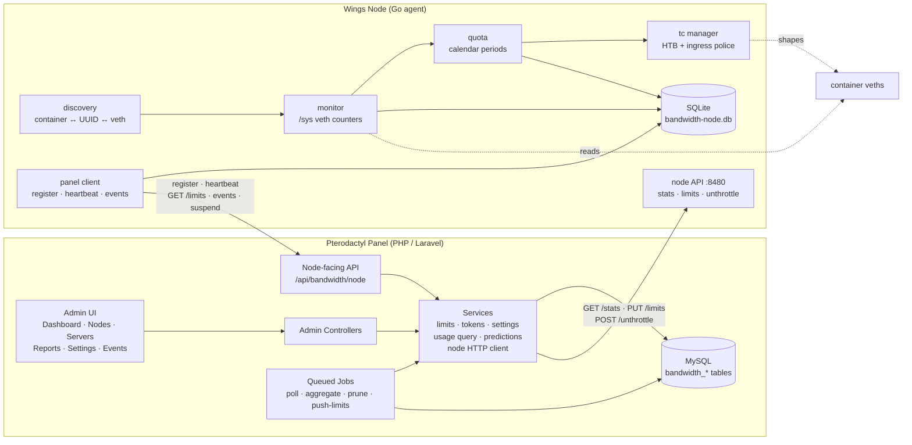
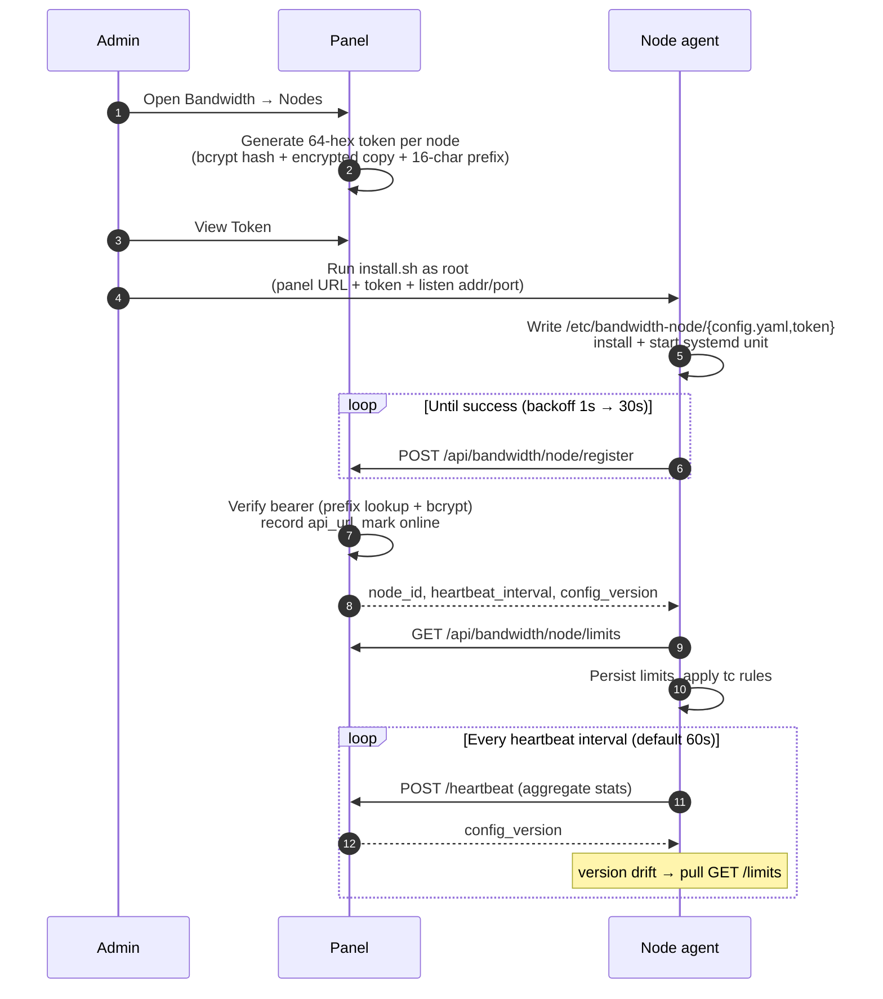
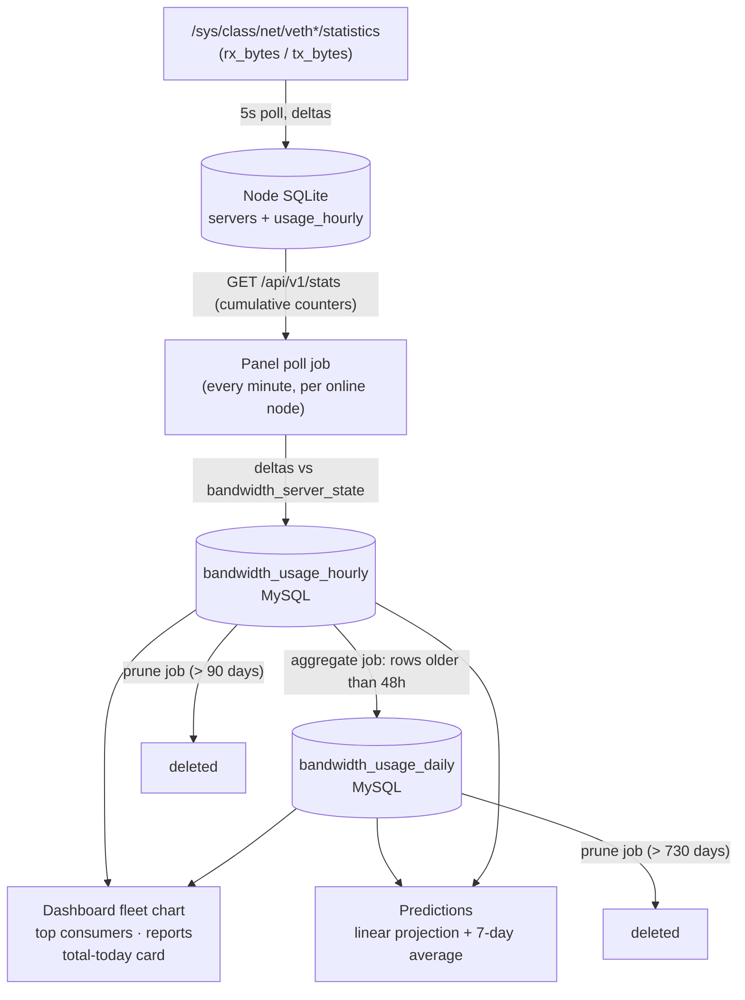

# Architecture Overview

Bandwidth Monitor is two cooperating halves with a strict wire contract between them:

- **Panel addon** (`pterodactylbandwidth`) — a Blueprint extension inside the Pterodactyl panel (PHP/Laravel). Owns the admin UI, pairing tokens, per-server limits, usage rollups, reports, predictions, and settings. State lives in the panel's MySQL database in seven `bandwidth_*` tables.
- **Node agent** (`bandwidth-noded`) — a Go daemon on every Wings node. Discovers server containers, counts bytes on their veth interfaces, enforces speed caps and quotas with `tc`, and syncs with the panel. State lives in a local SQLite database.

The halves never share a database. Everything crosses the wire through the documented [API contract](../user-guide/api.md): the node calls the panel (register, heartbeat, limits pull, events, suspend), and the panel calls the node (stats, history, limits push, unthrottle).

---

## Component diagram

---

## Pairing sequence

If a heartbeat gets a 401 (e.g. after a panel-side token reset) or fails 5 times in a row, the agent re-runs registration instead of dead-ending until restart.

---

## Data flow: veth counters to charts

Key properties of the pipeline:

- **Node side (5s cycle).** Each poll reads the veth counters, computes per-direction deltas and byte/sec rates, accumulates them into the persisted day/week/month quota counters, and appends the delta to the current hourly bucket in SQLite — including zero-delta buckets, so history shows zeros instead of gaps.
- **Panel side (1m cycle).** The poll job reads cumulative `rx_bytes_total` / `tx_bytes_total` per server and stores the *delta since the last poll* in `bandwidth_usage_hourly`. The last-seen counters are persisted in `bandwidth_server_state`, so deltas survive queue-worker restarts and cache flushes. A server seen for the first time only stores its baseline — booking its lifetime counters into one hour would fabricate usage. Counter resets (container restarts) fall back to the raw value.
- **Peak rates** are kept per bucket (`GREATEST` on upsert), so the reports page can show the fastest a server ever ran.

### The 48-hour aggregation boundary

Hourly rows older than **48 hours** (`aggregate_after_hours` in `config/bandwidthmonitor.php`) are rolled into daily rows by the aggregate job: each hourly row's bytes are added to its calendar-day row (in the configured timezone), peaks are max-merged, and the hourly row is deleted — all in a transaction per row, so a crash can never double-count. The job processes 1000-row chunks with a 240-second runtime budget per run.

Every query stitches the two tables at the same moving boundary (`now - 48h`, truncated to the hour): daily rows cover `period_start < boundary`, hourly rows cover `period_start >= boundary`. Since each hour lives in exactly one table, ranges that cross the boundary never double-count and never show gaps.

---

## Components

### Node agent (Go, `node-module/`)

| Package | Role |
| --- | --- |
| `daemon` | Orchestrates everything: boot restore, discovery merge, the 5s enforcement cycle, panel sync loops, the API backend, and the CLI Unix socket |
| `docker` (discovery) | Maps containers to servers. Wings names each game-server container with the server UUID; non-UUID containers are ignored. Resolves each container's host-side veth via peer ifindex matching (`eth0` `iflink` → host `ifindex`) — never by guessing, since a wrong mapping would shape and count the wrong server's traffic |
| `monitor` | Reads `/sys/class/net/<veth>/statistics/{rx,tx}_bytes`, computes deltas and bytes/sec rates. A counter reset (container restart, veth recreation) yields a zero delta for that poll |
| `tc` | Shells out to `tc` to build/remove HTB + ingress rules per veth. See [Enforcement](./enforcement.md) |
| `quota` | Calendar period math (day/week/month boundaries in the effective timezone), rollover of persisted counters, and the exceeded-combo evaluation |
| `panel` | HTTP client for the node-facing panel API (register, heartbeat, limits, events, suspend) |
| `api` | The panel-facing REST API on `:8480` — bearer auth with constant-time compare, contract envelope |
| `database` | SQLite persistence (WAL mode): servers, counters, hourly history, event queue, key/value config |
| `scheduler` | Periodic jobs on a 30s tick: event flush, suspend retry (1m), cleanup (1h), health check (5m) |
| `cleanup` | Forgets servers unseen for 72h (configurable), prunes local history beyond retention, compacts the DB |
| `health` | Internal diagnostics behind the `doctor` CLI command |
| `cli` / `cmd` | `bandwidth-node` CLI (status, list, limits, unthrottle, reapply, doctor, service controls) talking to the daemon over the Unix socket; `bandwidth-noded` is the daemon binary |

Two binaries are installed: `bandwidth-noded` (the systemd service) and `bandwidth-node` (the CLI, which speaks JSON to `/var/run/bandwidth-node.sock`).

### Panel addon (PHP/Laravel, `panel-addon/`)

| Piece | Role |
| --- | --- |
| **Models** | `BandwidthNodeToken`, `BandwidthServerLimit`, `BandwidthSetting`, `BandwidthUsageHourly`, `BandwidthUsageDaily`, `BandwidthEvent` — Eloquent wrappers over the `bandwidth_*` tables |
| **Services** | `BandwidthLimitsService` (effective limits, contract payload, pushes), `BandwidthNodeTokenService` (token generate/verify/view/reset), `BandwidthSettingsService` (key/value settings, atomic `config_version` bumps), `BandwidthUsageQueryService` (stitched hourly/daily queries), `BandwidthPredictionService` (linear + 7-day-average projections), `BandwidthNodeHttpClient` (panel→node calls with retry on 502/503/504 and a per-node circuit breaker: opens after 5 failures in 60s, half-opens after 30s) |
| **Jobs** | `BandwidthPollJob` (minute stats pull → hourly rollups), `BandwidthAggregateJob` (48h rollup), `BandwidthPruneJob` (retention), `BandwidthPushLimitsJob` (limits push to one node) |
| **Controllers** | Six admin controllers (dashboard, nodes, servers, reports, settings, events) plus the node-facing `BandwidthNodeApiController` behind token-auth middleware |
| **Listeners** | `HandleServerCreated` / `HandleServerUpdated` — prefill the bandwidth fields on the server build configuration so new servers get the defaults from day one |
| **Console commands** | `AggregateUsageCommand`, `PollNodesCommand`, `PruneUsageCommand` — manual/scheduled wrappers around the jobs |

---

## Database schemas

### Node side — SQLite (`/var/lib/bandwidth-node/bandwidth-node.db`, WAL mode)

| Table | Purpose | Notable columns |
| --- | --- | --- |
| `servers` | One row per known server: identity, live counters, per-period quota usage, enforcement state | `uuid` (PK), `container_id`, `veth_iface`, `state`, `limits_json`, `first_seen`/`last_seen`, `rx/tx_bytes_total`, `rx/tx_rate_bps`, `rx/tx_used_{day,week,month}`, `throttled`, `exceeded_json`, `suspended`, `overrides_json` |
| `usage_hourly` | Local hourly history for the history API | `(uuid, bucket_start)` PK, `rx_bytes`, `tx_bytes` |
| `events_queue` | Outbound panel events awaiting delivery | `id`, `payload` (JSON), `attempts`, `created_at` |
| `config` | Key/value agent state | `key` (PK) — stores `config_version` and the persisted `period_start_{day,week,month}` boundaries |
| `schema_version` | Migration marker | `version` |

Unparseable ("poison") event payloads are dropped on read so a single bad row can never block the queue.

### Panel side — MySQL (seven `bandwidth_*` tables)

| Table | Purpose | Notable columns |
| --- | --- | --- |
| `bandwidth_node_tokens` | Pairing + node reachability | `node_id` (unique), `token_hash` (bcrypt), `token_encrypted`, `token_prefix` (16 hex, indexed), `api_url`, `version`, `is_online`, `last_seen_at`, `health_fail_count`, `cached_stats` (JSON) |
| `bandwidth_server_limits` | Per-server override rows (absent = use defaults) | `server_id` (unique), `enabled`, `rx/tx_speed_mbps`, six `*_quota_*_gb`, `exceed_action`, `throttle_rx/tx_mbps` |
| `bandwidth_settings` | Key/value settings | `key` (unique), `value` — includes defaults, timezone, poll interval, retention, and the monotonic `config_version` |
| `bandwidth_usage_hourly` | Hourly rollups | `(server_id, period_start)` unique, `rx/tx_bytes`, `rx/tx_rate_peak_bps` |
| `bandwidth_usage_daily` | Daily rollups (from the 48h aggregation) | same shape as hourly |
| `bandwidth_events` | Enforcement audit log | `server_id`, `node_id` (nullable), `type`, `period`, `direction`, `message`, `created_at` |
| `bandwidth_server_state` | Last-seen cumulative counters per server | `server_id` (unique), `last_rx_total`, `last_tx_total`, `last_polled_at` |

All usage/events tables cascade (or null) on server/node deletion, so deleting a Pterodactyl server cleans up its rows.

---

## Concurrency & locking model (node agent)

The agent is a single multi-goroutine process; shared state is coordinated, not shared-nothing:

- **Server map** — one `sync.RWMutex` on the daemon guards the in-memory server map and every server's mutable fields. Blocking sysfs reads happen on a detached copy *outside* the lock; results are merged back under it.
- **SQLite** — a single connection (`max_open_conns: 1`) with its own RWMutex around every operation, plus WAL mode, `synchronous=NORMAL`, and a 5s busy timeout. Single-writer by construction.
- **tc manager** — one mutex serializes all `tc` invocations, so rules can never be half-applied by racing goroutines.
- **Monitor** — its own mutex protects the previous-reading snapshots.
- **Background goroutines** — registration, heartbeat, Docker event watch, suspend callbacks, and the Unix-socket listener are tracked in a `WaitGroup`. Shutdown signals them first, closes the socket listener, stops the scheduler and API, drains the WaitGroup, and only then removes tc rules and closes the database and logger — nothing touches closed state.
- **Suspend callbacks** are deduplicated (one in flight per server) and retried: 5 attempts with exponential backoff immediately, then a scheduler job every minute until the panel confirms. The agent never permanently gives up on a suspend.

---

## Direction mapping (read this before trusting any chart)

Counters are always presented **from the server's perspective**: RX = inbound to the server, TX = outbound from it. The host-side veth sees the mirror image — the kernel counts veth `rx_bytes` for traffic the container **sent** (server TX) and veth `tx_bytes` for traffic delivered **to** the container (server RX). The monitor swaps the two at collection time, which also matches enforcement: an RX cap is policed on ingress into the veth, a TX cap is shaped on egress from it.

Every number in the panel — stat cards, charts, quotas, reports — uses this server-perspective mapping consistently.

---

## Next steps

- **[Enforcement →](./enforcement.md)** — the `tc` rule anatomy and the quota engine state machine.
- **[API Reference →](../user-guide/api.md)** — the wire protocol between the halves.
- **[Admin Panel Guide →](../user-guide/admin-panel.md)** — what the panel does with all this data.
