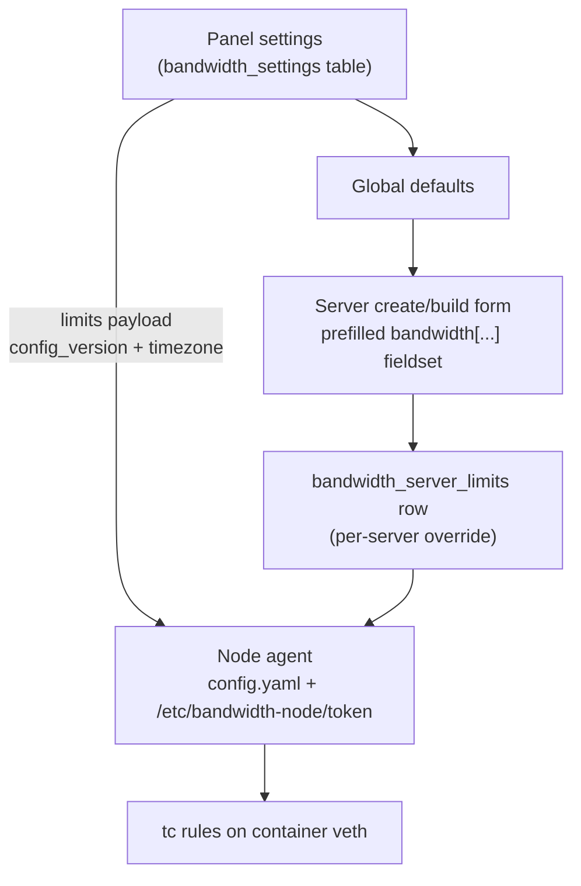
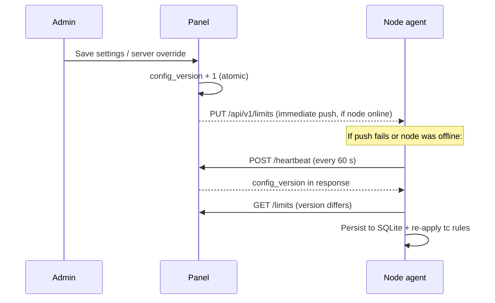

# Configuration Reference

Bandwidth Monitor is configured at **three layers**, each documented in full below:

| Layer | Where | Scope |
| --- | --- | --- |
| **Node config** | `/etc/bandwidth-node/config.yaml` on each Wings node | How the agent runs: polling, logging, API bind, panel connection |
| **Panel settings** | Admin → Bandwidth → **Settings** tab | Global default speeds, quotas, exceed action, timezone, retention |
| **Per-server overrides** | Admin → server → **Build** tab → Bandwidth Limits | Limits for one server, overriding the global defaults |



::: info ZERO MEANS UNLIMITED — EVERYWHERE
A speed or quota of `0` means *no limit and no tc rule* — on the node, in the panel settings, and in per-server overrides. Fresh installs ship all-zero defaults, so nothing is throttled until you set values.
:::

---

## Node config: `/etc/bandwidth-node/config.yaml`

The installer (`install.sh`) writes this file during pairing. Any key you omit keeps its built-in default — a nearly empty file still runs. The daemon loads it on start:

```bash
bandwidth-noded --config /etc/bandwidth-node/config.yaml   # as run by systemd
```

The config path can also be set with the `BANDWIDTH_NODE_CONFIG` environment variable. Durations use Go syntax (`5s`, `1m`, `1h`). After any change, restart the agent:

```bash
systemctl restart bandwidth-node.service
```

### `general`

| Path | Type | Default | Description |
| --- | --- | --- | --- |
| `general.socket_path` | string | `/var/run/bandwidth-node.sock` | Unix socket the `bandwidth-node` CLI uses to talk to the daemon. The CLI overrides this with `BANDWIDTH_NODE_SOCKET` if set. |

::: details Common mistake — moving the socket without telling the CLI
If you change `socket_path`, `bandwidth-node status` fails with "cannot connect to daemon" until you export `BANDWIDTH_NODE_SOCKET` to the new path. There is rarely a reason to move it.
:::

### `logging`

```yaml
logging:
  level: info
  console: true
  file: /var/log/bandwidth-node/bandwidth-node.log
  max_size_mb: 100
  max_age_days: 30
  max_backups: 10
  compress: true
  format: json
```

| Path | Type | Default | Description |
| --- | --- | --- | --- |
| `logging.level` | enum | `info` | `debug`, `info`, `warn`, or `error`. Use `debug` only when diagnosing — it is noisy at a 5-second poll cadence. |
| `logging.console` | bool | `true` | Also log to stdout, which systemd captures into the journal (`journalctl -u bandwidth-node.service`). |
| `logging.file` | string | `/var/log/bandwidth-node/bandwidth-node.log` | Log file path. Rotated automatically using the keys below. |
| `logging.max_size_mb` | int | `100` | Rotate the log file once it reaches this size. |
| `logging.max_age_days` | int | `30` | Delete rotated logs older than this. |
| `logging.max_backups` | int | `10` | Maximum number of rotated files kept. |
| `logging.compress` | bool | `true` | Gzip rotated log files. |
| `logging.format` | enum | `json` | `json` (machine-parsable, default) or `text`. |

### `database`

The agent persists counters, limits, enforcement flags, and the outbound event queue in a local SQLite database, so enforcement **survives restarts and panel outages**.

```yaml
database:
  path: /var/lib/bandwidth-node/bandwidth-node.db
  max_open_conns: 1
  max_idle_conns: 1
  journal_mode: WAL
  synchronous: NORMAL
  cache_size_kb: 32000
  auto_migrate: true
```

| Path | Type | Default | Description |
| --- | --- | --- | --- |
| `database.path` | string | `/var/lib/bandwidth-node/bandwidth-node.db` | SQLite file location. Required. |
| `database.max_open_conns` | int | `1` | Max open SQLite connections. SQLite is single-writer — leave this at `1`. |
| `database.max_idle_conns` | int | `1` | Max idle connections kept in the pool. |
| `database.journal_mode` | enum | `WAL` | `WAL`, `DELETE`, or `TRUNCATE`. WAL gives concurrent reads during writes; do not change without a reason. |
| `database.synchronous` | enum | `NORMAL` | `OFF`, `NORMAL`, or `FULL`. `NORMAL` is the safe performance/crash-safety balance with WAL. |
| `database.cache_size_kb` | int | `32000` | SQLite page cache size in KiB (~31 MiB). |
| `database.auto_migrate` | bool | `true` | Apply schema migrations on startup. Keep enabled so upgrades work. |

::: warning
Setting `synchronous: OFF` trades durability for speed: a power cut can lose recent counters and queued events. `NORMAL` already survived production testing — don't tune this unless you know why.
:::

### `docker`

The agent talks to the **local Docker CLI** only — there are no endpoint or TLS knobs.

| Path | Type | Default | Description |
| --- | --- | --- | --- |
| `docker.discovery_interval` | duration | `10s` | How often the agent rescans running containers. Only containers whose name (or a UUID-shaped label value) is a server UUID are managed — node system containers are ignored. |
| `docker.watch_events` | bool | `true` | Subscribe to the Docker event stream so new/removed containers are picked up immediately instead of waiting for the next rescan. |

### `bandwidth`

| Path | Type | Default | Description |
| --- | --- | --- | --- |
| `bandwidth.poll_interval` | duration | `5s` | Stats collection **and** quota-enforcement cycle. Must be positive. |

::: details When to change
`5s` was verified in production — a 10 Mbps cap held at ~9.5 Mbps and a 1 GiB quota tripped promptly. Raising the interval (e.g. `15s`) reduces CPU but delays quota enforcement; lowering it below `2s` is pointless churn.
:::

### `scheduler`

| Path | Type | Default | Description |
| --- | --- | --- | --- |
| `scheduler.enabled` | bool | `true` | Run the internal job scheduler (quota period resets, event queue delivery). Keep enabled. |
| `scheduler.check_interval` | duration | `30s` | How often scheduled jobs are evaluated. |

### `cleanup`

```yaml
cleanup:
  enabled: true
  interval: 1h
  stale_server_hours: 72
  compact_db: true
```

| Path | Type | Default | Description |
| --- | --- | --- | --- |
| `cleanup.enabled` | bool | `true` | Run periodic housekeeping. |
| `cleanup.interval` | duration | `1h` | How often the cleanup pass runs. |
| `cleanup.stale_server_hours` | int | `72` | Forget servers not seen for this many hours (deleted Pterodactyl servers). `0` = never forget. |
| `cleanup.compact_db` | bool | `true` | Compact the SQLite database during cleanup. |

::: details Common mistake — stale entries after deleting a server
If you delete a server in the panel, its container disappears and the agent drops it from active management, but the record lingers for `stale_server_hours`. That's intentional: it protects quota counters if a container briefly vanishes during a Wings rebuild. Lower the value (e.g. `24`) only on very churny nodes.
:::

### `api`

The REST API the **panel** calls into. This is the panel's management interface to the node — keep it enabled and reachable.

| Path | Type | Default | Description |
| --- | --- | --- | --- |
| `api.enabled` | bool | `true` | Serve the node REST API (`/api/v1/...`). Disabling it breaks panel stats, limit pushes, and unthrottle. |
| `api.listen` | string | `0.0.0.0` | Bind address. Required when the API is enabled. Bind to a private interface if your panel and nodes share one. |
| `api.port` | int | `8480` | Listen port (1–65535). This is what you entered during install. |

::: warning FIREWALL
The panel must be able to reach `http(s)://<node>:8480`. All endpoints require the bearer token **except** `GET /api/v1/health`, which is public and cheap — ideal for uptime probes.
:::

### `panel`

```yaml
panel:
  url: "https://panel.example.com"
  token_file: /etc/bandwidth-node/token
  heartbeat_interval: 60s
```

| Path | Type | Default | Description |
| --- | --- | --- | --- |
| `panel.url` | string | *(required — no default)* | Panel base URL, e.g. `https://panel.example.com`. The daemon **refuses to start** without it. |
| `panel.token_file` | string | `/etc/bandwidth-node/token` | Path to the pairing token file (see below). Used for node → panel auth **and** to verify panel → node requests. |
| `panel.heartbeat_interval` | duration | `60s` | How often the agent posts a heartbeat (aggregate rates, throttled/exceeded counts) to the panel. Must be positive. |

::: tip HEARTBEAT DRIVES CONFIG SYNC
Every heartbeat response carries the panel's `config_version`. If it differs from the node's stored version, the agent immediately pulls `GET /limits` and re-applies rules — so panel changes land on the node within one heartbeat even if the direct push failed.
:::

### `traffic_control`

| Path | Type | Default | Description |
| --- | --- | --- | --- |
| `traffic_control.enabled` | bool | `true` | Master switch for `tc` enforcement. When `false`, the agent still collects stats and reports to the panel but applies no shaping. |

### `timezone`

| Path | Type | Default | Description |
| --- | --- | --- | --- |
| `timezone` | string | `UTC` | Calendar quota-reset timezone: day = midnight, week = Monday 00:00, month = 1st 00:00. Must be a valid IANA name — the daemon fails validation otherwise. |

::: info PANEL WINS
The panel sends its own configured timezone inside the limits payload, and that value overrides this key on the node. Set the timezone in the panel Settings tab; leave the node at `UTC`.
:::

---

## The token file: `/etc/bandwidth-node/token`

| Property | Value |
| --- | --- |
| Created by | `install.sh` during pairing (you paste the token from the panel's Nodes page) |
| Format | 64 lowercase hex characters (256-bit random) |
| Permissions | `0600`, root-owned |
| Used for | Node → panel `Authorization: Bearer` header, and constant-time verification of panel → node API calls |

The panel stores only a **bcrypt hash** plus an encrypted copy (so you can re-view it in the panel). Resetting the token in the panel kills the old one immediately — after a reset you must write the new token into `/etc/bandwidth-node/token` and `systemctl restart bandwidth-node.service`, or the node goes offline.

::: danger NEVER COMMIT OR SHARE THE TOKEN
Anyone with the token can read per-server traffic stats and push arbitrary limits to the node. Rotate it from the panel's Nodes page if it leaks.
:::

---

## Panel settings

Admin → **Bandwidth** → **Settings** tab. These live in the `bandwidth_settings` table and are seeded by migration with the defaults below. Saving the form bumps `config_version` and pushes the new defaults to every online node.

### Default limits

Applied to every server that has **no** per-server override row.

| Setting key | Type | Default | Range | Description |
| --- | --- | --- | --- | --- |
| `default_rx_speed_mbps` | int | `0` | 0–1,000,000 | Download speed cap (Mbps) applied per server. `0` = unlimited. |
| `default_tx_speed_mbps` | int | `0` | 0–1,000,000 | Upload speed cap (Mbps) applied per server. `0` = unlimited. |
| `default_exceed_action` | enum | `throttle` | `throttle` / `suspend` / `none` | What happens when any quota is exceeded: `throttle` re-applies tc at the throttle speeds; `suspend` suspends the Pterodactyl server via the panel, then throttles to 1 Mbps; `none` records an event only. |
| `default_throttle_rx_mbps` | int | `5` | 1–1,000,000 | RX speed while throttled after a quota exceed. |
| `default_throttle_tx_mbps` | int | `5` | 1–1,000,000 | TX speed while throttled after a quota exceed. |

### Default quotas

Six independent quotas — one per direction (RX/TX) per period (day/week/month). Values are in **GiB** (1024³ bytes) on both panel and node. `0` = unlimited.

| Setting key | Type | Default | Description |
| --- | --- | --- | --- |
| `default_rx_quota_day_gb` | int | `0` | Daily download allowance per server (GiB). Resets at midnight in the configured timezone. |
| `default_rx_quota_week_gb` | int | `0` | Weekly download allowance (GiB). Resets Monday 00:00. |
| `default_rx_quota_month_gb` | int | `0` | Monthly download allowance (GiB). Resets on the 1st at 00:00. |
| `default_tx_quota_day_gb` | int | `0` | Daily upload allowance per server (GiB). |
| `default_tx_quota_week_gb` | int | `0` | Weekly upload allowance (GiB). |
| `default_tx_quota_month_gb` | int | `0` | Monthly upload allowance (GiB). |

::: tip TESTED BEHAVIOR
On a live panel + Wings node: a 1 GiB quota exceeded throttled the server to 5 Mbps with `quota_exceeded` / `throttled` events visible in the panel, and a weekly quota exceed with `suspend` action produced a real server suspension. When a period resets, normal speeds are restored automatically and a `restored` event is emitted.
:::

### Collection & retention

| Setting key | Type | Default | Range | Description |
| --- | --- | --- | --- | --- |
| `timezone` | string | `UTC` | any IANA timezone | Timezone in which day/week/month quota boundaries are evaluated. Sent to nodes in the limits payload, overriding the node's local `timezone` key. |
| `poll_interval_seconds` | int | `60` | 15–3600 | How often node agents heartbeat; also used as the panel-side stats poll interval (the panel polls each online node and stores rollups). |
| `retention_days_hourly` | int | `90` | 1–3650 | Days that hourly usage rollups (`bandwidth_usage_hourly`) are kept before pruning. |
| `retention_days_daily` | int | `730` | 1–7300 | Days that daily usage rollups (`bandwidth_usage_daily`) are kept. Two years covers most billing disputes. |
| `events_retention_days` | int | `180` | 1+ | Days that enforcement events (`bandwidth_events`) are kept by the daily prune job. |
| `rename_on_quota_suspend` | bool | `0` | 0/1 | When `1`, a server suspended for a quota violation is renamed to `(Bandwidth Quota Exceeded) <name>` (and its description prefixed) until it is unsuspended. See Admin Panel → Quota Suspension Tagging. |

### `config_version` — how changes propagate

| Setting key | Type | Default | Description |
| --- | --- | --- | --- |
| `config_version` | int | `0` | Monotonic counter, **managed by the panel — never edit by hand**. Bumped atomically on every limits change (settings save, per-server override create/update/delete). |



This is why a node that was offline during a change still converges within one heartbeat of coming back — verified in production alongside pairing, stats flow, and admin unthrottle.

---

## How defaults reach a server — and how to override them

**The create/build forms.** The installer injects a *Bandwidth Limits* fieldset into the admin **New Server** and **Build** forms. On *New Server* the fields are prefilled from the global defaults; on *Build* they show the server's effective limits. Saving either form writes (or updates) a row in `bandwidth_server_limits`. Servers created over the API send no `bandwidth[...]` input and simply follow the live global defaults.

**The override row.** Each field maps one-to-one onto the settings above:

| Column | Type | Default | Description |
| --- | --- | --- | --- |
| `server_id` | int | — | The Pterodactyl server this row belongs to (unique; cascades on server deletion). |
| `enabled` | bool | `true` | Master switch for this server. `false` = agent collects stats but enforces nothing for this server. |
| `rx_speed_mbps` / `tx_speed_mbps` | int | `0` | Per-server speed caps. `0` = unlimited. |
| `rx_quota_day_gb` / `rx_quota_week_gb` / `rx_quota_month_gb` | int | `0` | Per-server RX quotas (GiB). |
| `tx_quota_day_gb` / `tx_quota_week_gb` / `tx_quota_month_gb` | int | `0` | Per-server TX quotas (GiB). |
| `exceed_action` | enum | `throttle` | `throttle` / `suspend` / `none` for this server. |
| `throttle_rx_mbps` / `throttle_tx_mbps` | int | `5` | Speeds while this server is throttled. |

**Precedence is all-or-nothing per row:** if a server has an override row, the **entire** effective limit set comes from that row — individual fields do **not** fall back to the global defaults. If the row is absent, the live global defaults apply, and deleting the row returns the server to defaults.

::: warning ALL-OR-NOTHING OVERRIDES
Setting only `rx_speed_mbps: 100` on a server leaves its quotas at the row's own `0` (unlimited) — not at the global default quotas. Fill in every field you care about when creating an override.
:::

**Change propagation.** Any override write or delete bumps `config_version` and queues a limits push to the owning node when it's online; no-op writes (nothing actually changed) skip both. Changes land on the node within seconds — or at worst within one heartbeat.
