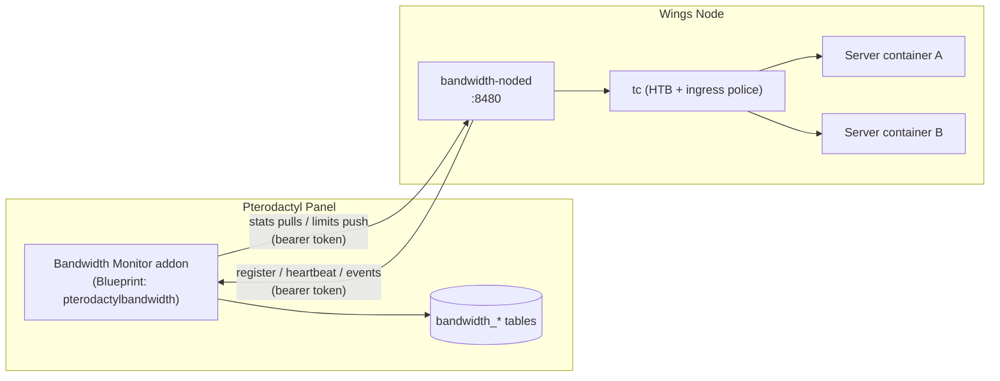

# Installation

Bandwidth Monitor has two components, installed in this order:

1. **Panel addon** (`pterodactylbandwidth`) — a Blueprint extension on your Pterodactyl panel. Admin pages, per-node pairing tokens, per-server limits, usage rollups, reports and settings.
2. **Node agent** (`bandwidth-noded`) — a Go daemon on every Wings node. Discovers server containers, counts rx/tx bytes, enforces limits with `tc`, and syncs with the panel.



::: info VERIFIED ON A LIVE PANEL
The full flow described here — pairing, stats reporting, a 10 Mbps speed cap holding at ~9.5 Mbps, a 1 GiB quota triggering a 5 Mbps throttle with panel events, a weekly quota suspending a real server, and admin unthrottle — was tested end-to-end on a production panel and Wings node.
:::

---

## Requirements

### Panel server

| Requirement | Notes |
| --- | --- |
| **Pterodactyl Panel** | v1.12.x or higher |
| **PHP** | 8.2+ (the installer checks and refuses older versions) |
| **Blueprint** | `beta-2026-05` or newer — only for the Blueprint install path |
| **Python 3** | Only for the standalone path (the blade patchers are Python) |
| **Root access** | The installer writes into the panel tree and runs migrations |

### Each Wings node

| Requirement | Notes |
| --- | --- |
| **Linux with systemd** | The agent runs as a systemd service, as root (`tc` needs `CAP_NET_ADMIN`) |
| **Docker** | Wings already requires it; the agent discovers server containers through it |
| **`tc` (iproute2)** | Required — the installer aborts if `tc` is not found |
| **Go 1.23+** | Only if building from source. If Go is present the installer builds automatically; otherwise it uses the prebuilt `./bandwidth-noded` shipped next to `install.sh` |
| **Network** | The node must reach the panel over HTTP(S), and the panel must reach the node's API port (default `8480`) |

::: warning USE HTTPS FOR THE PANEL URL
The 64-hex bearer token and all bandwidth data cross the wire on every heartbeat. The installer warns if you enter a plain `http://` panel URL — use `https://` in production.
:::

---

## Part 1 — Install the panel addon

### Option A: Blueprint (recommended)

Copy the `.blueprint` archive into your panel directory and install:

```bash
cd /var/www/pterodactyl   # adjust if your panel lives elsewhere
# place pterodactylbandwidth-v1.0.0.blueprint in this directory, then:
blueprint -i pterodactylbandwidth-v1.0.0
```

The installer is idempotent — re-running it on the same panel will not corrupt anything. It:

1. **Merges `PanelFiles/`** into the panel tree (controllers, services, jobs, migrations, routes, views) and records every installed file so the uninstaller removes exactly what was shipped.
2. **Registers the service provider** — inserts `Pterodactyl\Providers\BandwidthMonitorServiceProvider::class` into `config/app.php`, with a timestamped backup and a `php -l` syntax check that rolls back on failure.
3. **Patches the views** — injects the **Bandwidth** entry into the admin sidebar and the bandwidth fields into the server build configuration (`new.blade.php` / `build.blade.php`). All patches are marker-delimited and fully reversible.
4. **Runs the migrations** — `php artisan migrate --force`, creating the 7 `bandwidth_*` tables (`bandwidth_node_tokens`, `bandwidth_server_limits`, `bandwidth_settings`, `bandwidth_usage_hourly`, `bandwidth_usage_daily`, `bandwidth_events`, `bandwidth_server_state`) plus an idempotent settings seed — 8 migrations in total.
5. **Clears the panel caches** — `config:clear`, `route:clear`, `view:clear`, `cache:clear`, plus a best-effort `composer dump-autoload`.

Existing node tokens are preserved on reinstall — no re-pairing is required.

### Option B: Standalone (no Blueprint)

The same installer ships as plain scripts under `standalone/`:

```bash
PANEL=/var/www/pterodactyl   # adjust if your panel lives elsewhere
cp -a PanelFiles/. "$PANEL/"

export PTERODACTYL_DIRECTORY="$PANEL"
bash install.sh
```

This performs the same steps as the Blueprint path: provider registration, sidebar and build-view patching, migrations, cache clears. Python 3 must be installed for the view patchers.

::: danger BACK UP FIRST
Both paths modify `config/app.php` and patch core blade views. Back up your panel files and database before installing. The installer creates its own backup of `config/app.php`, but that is no substitute for a real snapshot.
:::

### Post-install verification

```bash
cd /var/www/pterodactyl

# All 8 bandwidth migrations should show "Ran"
php artisan migrate:status | grep -i bandwidth

# Admin routes and the node API routes should be registered
php artisan route:list | grep bandwidth
```

Then open **Admin → Bandwidth** (`/admin/bandwidth`) — the dashboard should load without errors.

::: tip STALE ROUTES OR 500s AFTER INSTALL? RELOAD PHP-FPM
The installer clears Laravel's caches, but PHP opcache lives in the php-fpm process and can keep serving the old classmap. If `/admin/bandwidth` 404s or throws after a successful install, reload php-fpm:

```bash
sudo systemctl reload php8.2-fpm   # adjust for your PHP version
```
:::

---

## Part 2 — Install the node agent (per Wings node)

Repeat this on **every** Wings node you want monitored.

### 1. Get the node's pairing token

In the panel, open **Admin → Bandwidth → Nodes**. Every Pterodactyl node gets a row with a generated 64-character hex token. Click **View Token** to reveal it.

The token can be **reset** from the same page at any time — a new token is generated and the old one dies immediately. The panel stores only a bcrypt hash plus an encrypted copy (so you can re-view it); the plaintext token is never stored.

### 2. Run the installer

Copy the `node-module/` directory to the Wings node, then as root:

```bash
sudo bash install.sh
```

The installer prompts (via `/dev/tty`, so it also works through `curl | bash`):

```text
Panel URL (e.g. https://panel.example.com): https://panel.example.com
Node token (64 hex characters, from the panel Nodes page): 9f3a...c41d
Listen address [0.0.0.0]:
Listen port [8480]:
```

The panel URL and token are validated (the token must be exactly 64 hex characters, with retry on bad input). It then:

1. Installs the binaries to `/usr/local/bin` — built from source if Go is available, otherwise the prebuilt `bandwidth-noded` next to the script.
2. Writes `/etc/bandwidth-node/config.yaml` and `/etc/bandwidth-node/token` (both `0600`).
3. Installs and starts the `bandwidth-node.service` systemd unit.
4. Waits up to 90 seconds for the agent to register with the panel, and exits non-zero if registration is not confirmed.

On start the agent calls `POST /api/bandwidth/node/register` on the panel (retrying with backoff until it succeeds). The panel records the node's reachable API URL and marks it online.

### 3. Verify

In the panel, **Admin → Bandwidth → Nodes** should show the node as **online** within a minute (the agent heartbeats every 60 seconds).

On the node itself:

```bash
# Public health endpoint (no auth required)
curl -s http://127.0.0.1:8480/api/v1/health
```

```json
{ "success": true, "data": { "status": "ok", "version": "1.0.0", "containers": 12, "uptime_seconds": 3600 }, "error": null, "meta": { "version": "1.0.0" } }
```

```bash
# Daemon + panel sync status
bandwidth-node status

# Live logs
journalctl -u bandwidth-node.service -f
```

::: tip FIREWALL
The panel pulls stats and pushes limits over the node's API port. If you run `ufw` (or another firewall) on the node, allow it from the panel:

```bash
sudo ufw allow from <panel-ip> to any port 8480
```
:::

---

## Troubleshooting

| Symptom | Likely cause | Fix |
| --- | --- | --- |
| Node shows **offline** in the panel | Wrong panel URL or token during install | Check `journalctl -u bandwidth-node.service -f` for registration errors; re-run `install.sh` with the correct values |
| Node offline, logs show connection refused/timeouts | Panel unreachable from the node | Verify the panel URL resolves and is reachable: `curl -s https://panel.example.com/api/bandwidth/node/limits` should return `401`, not a network error |
| Panel can't pull stats from an online node | Firewall blocking port `8480` | `sudo ufw allow from <panel-ip> to any port 8480`; confirm with `curl http://<node-ip>:8480/api/v1/health` from the panel host |
| Installer exits with "not confirmed panel registration" | Registration didn't complete within 90 s | `journalctl -u bandwidth-node.service -f` — common causes are a wrong panel URL, wrong token, or the panel being unreachable |
| **500 error** on Admin → Bandwidth | Migrations not run, provider not registered, or stale opcache | `php artisan migrate --force`; confirm `BandwidthMonitorServiceProvider` is in `config/app.php`; `php artisan config:clear && php artisan route:clear`, then `sudo systemctl reload php8.2-fpm` |
| **404** on `/admin/bandwidth` after install | Stale route cache or opcache | `php artisan route:clear` and reload php-fpm |
| `tc not found` during node install | iproute2 missing | Install it (`apt install iproute2` / `dnf install iproute2`) and re-run |
| Node API returns **401** to the panel | Token was reset in the panel | Nothing to do — the agent detects the 401 and re-registers automatically with its configured token. If you rotated the token intentionally, update `/etc/bandwidth-node/token` and `sudo systemctl restart bandwidth-node` |

---

## Uninstall

### Panel addon

Blueprint path:

```bash
cd /var/www/pterodactyl
blueprint -remove pterodactylbandwidth
```

Standalone path:

```bash
export PTERODACTYL_DIRECTORY=/var/www/pterodactyl
bash remove.sh                # keeps bandwidth_* table data
bash remove.sh --purge-data   # also drops the bandwidth_* tables
```

Both paths remove the provider from `config/app.php`, revert the sidebar and build-view patches, delete exactly the files the installer shipped, and clear the panel caches. By default your historical usage data, events and settings in the `bandwidth_*` tables are kept — pass `--purge-data` (standalone) only if you want them gone.

::: warning ASSET PATH NOTE
The bundled Chart.js lives at `public/ext/bandwidth/chart.min.js` — deliberately **outside** `public/assets/`, which the panel's `yarn build:production` wipes on every frontend rebuild. If you ever see blank charts after a frontend rebuild, check that file still exists; everything else in the addon is build-proof.
:::

### Node agent

On each Wings node, as root:

```bash
sudo bash uninstall.sh                # full removal
sudo bash uninstall.sh --keep-config  # keep /etc/bandwidth-node (config + token)
```

This stops and disables the service, removes the `tc` rules the agent created from every container veth, and deletes the binaries, state (`/var/lib/bandwidth-node`), and logs (`/var/log/bandwidth-node`).

---

## Upgrading

**Panel:** install the new `.blueprint` release over the old one (`blueprint -i <new-version>`), or re-run the standalone `install.sh`. The installer is idempotent, migrations are re-run safely, and existing node tokens and all historical data are preserved — no re-pairing required.

**Node agent:** copy the new `node-module/` to the node and re-run `sudo bash install.sh`. The binaries are rebuilt/replaced and the service restarted. Byte counters, limits and the event queue live in SQLite at `/var/lib/bandwidth-node/bandwidth-node.db` and survive the upgrade; `tc` rules are re-applied on boot.

---

## Next steps

- Open **Admin → Bandwidth → Settings** to set default speeds and day/week/month quotas — these prefill the bandwidth fields on every new server's build configuration.
- Per-server overrides live under **Admin → Bandwidth → Servers**.
- Questions or issues: [xdp.network](https://xdp.network).
