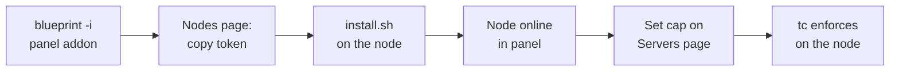

# Quick Start

This is the fastest path from zero to a live, enforced bandwidth limit: panel addon in, one node paired, one speed cap set. Total time is about **ten minutes** on a single machine that hosts both the panel and a Wings node (the same steps apply when they're separate).

**You'll need:**

- A Pterodactyl v1.12.x panel with Blueprint (`beta-2026-05`) installed and root shell access
- A Wings node with Docker, `tc` (iproute2) and systemd
- The `pterodactylbandwidth-v1.0.0.blueprint` archive and the `node-module/` directory

## 1. Install the panel addon

Copy the Blueprint archive into your panel directory and install it:

```bash
cp pterodactylbandwidth-v1.0.0.blueprint /var/www/pterodactyl/
cd /var/www/pterodactyl
blueprint -i pterodactylbandwidth-v1.0.0
```

Blueprint runs the addon's installer: it copies the controllers, services, jobs and migrations into the panel, runs the migrations (creating the `bandwidth_*` tables), patches the server build configuration with bandwidth fields, and adds a **Bandwidth** section to the admin sidebar.

Open your panel's admin area — you should see **Bandwidth** in the sidebar with Dashboard, Nodes, Servers, Reports, Events and Settings.

## 2. Copy the node pairing token

Go to **Admin → Bandwidth → Nodes**. Every Pterodactyl node already has a row with a generated pairing token. Click **view** on your node's row and copy the 64-hex token.

::: info TOKENS ARE PER NODE
Each node has its own token. If one leaks, hit **reset** on that row — the old token dies immediately and only that node needs re-pairing.
:::

## 3. Install the node agent

On the Wings node, as root, from the `node-module/` directory:

```bash
sudo bash install.sh
```

The installer prompts (answers in **bold** below are examples):

```text
[install] bandwidth-node installer

Panel URL (e.g. https://panel.example.com): https://panel.example.com
Node token (64 hex characters, from the panel Nodes page): a1b2c3…(64 hex chars)
Listen address [0.0.0.0]:
Listen port [8480]:

[install] Panel URL:     https://panel.example.com
[install] Listen:        0.0.0.0:8480
[install] Go toolchain found — building from source
[install] binaries installed to /usr/local/bin
[install] wrote /etc/bandwidth-node/config.yaml and /etc/bandwidth-node/token (0600)
[install] systemd unit installed and started
[install] waiting for the agent to register with the panel (up to 90s)...
[install] SUCCESS — node registered with the panel.
[install] Agent API: http://0.0.0.0:8480/api/v1/health
```

The installer validates both inputs (URL format, exactly 64 hex characters), writes the config and token files, installs the `bandwidth-node.service` systemd unit, and waits for the agent to confirm registration with the panel.

Back in the panel, the **Nodes** page now shows the node as **online**.

::: warning USE HTTPS FOR THE PANEL URL
The bearer token and bandwidth data travel over this connection. The installer warns if you enter a plain `http://` URL — use `https://` in production.
:::

If registration doesn't confirm, check the agent logs:

```bash
journalctl -u bandwidth-node.service -f
```

The usual causes are a wrong panel URL, a wrong token, or the panel being unreachable from the node. The agent retries registration with backoff, so fixing the cause is enough — no reinstall needed.

## 4. Set a speed cap

Pick any running server on that node:

1. Open **Admin → Bandwidth → Servers**.
2. Find the server and set **RX speed** and **TX speed** (Mbps). Try `10` for TX. Make sure **enabled** is on, and save.

The panel pushes the new limits to the node (`PUT /limits`) — and on its next 60-second heartbeat the node also sees the bumped config version and re-pulls to be sure. The agent applies the cap with `tc`: an HTB class on the container's veth for TX (egress), an ingress qdisc with policing for RX.

## 5. Watch it enforce

On the node:

```bash
bandwidth-node list      # live per-server counters and rates
bandwidth-node status    # daemon + panel sync status
```

Generate traffic from the server (a download, a speed test, players joining). `bandwidth-node list` shows the server's `tx_rate_bps` pinned just under the cap — in our live verification a **10 Mbps cap held a server at ~9.5 Mbps**.

In the panel, the **Dashboard** chart picks the server up within a minute (the panel polls each online node for stats every 60 seconds), and the **Events** page records a `speed_applied` event.

::: tip QUOTAS WORK THE SAME WAY
Set a small quota — e.g. a 1 GiB daily TX quota with exceed action **throttle** — and push traffic past it. The node throttles the server to the configured throttle speeds (default 5 Mbps) and logs `quota_exceeded` + `throttled` events to the panel. With action **suspend**, the server is actually suspended via the panel. Both were verified live.
:::

## 6. Set your fleet defaults

Open **Admin → Bandwidth → Settings** and set the default speed caps, quotas and exceed action. These prefill the bandwidth fields on the server build configuration, so every *new* server is born with sane limits — per-server overrides stay on the **Servers** page.

---

## The 60-second mental model



---

## Next steps

- **[Overview →](../index.md)** — Architecture, full feature list, and the comparison with standalone Bandwidth Manager.
- Set quotas with the **suspend** action for abusive tiers, and check **Reports** (CSV export included) for billing-ready usage data.
- `bandwidth-node --help` on the node for the full CLI (`limits`, `unthrottle`, `doctor`, `reapply`).
