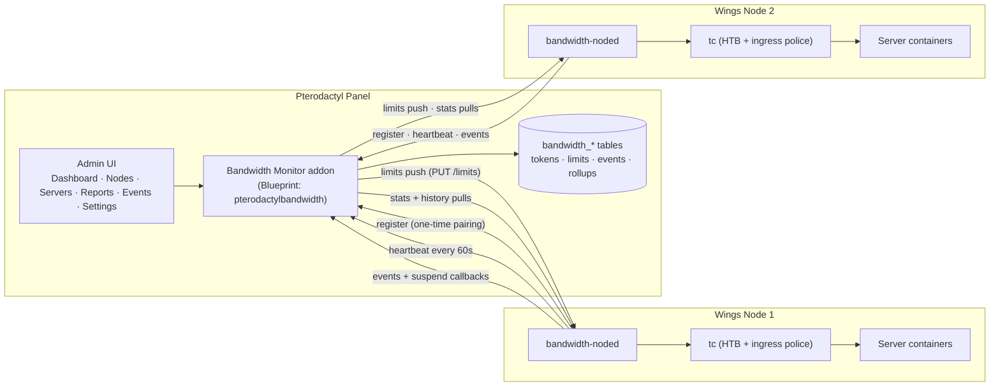

# Bandwidth Monitor for Pterodactyl

**Panel-native bandwidth monitoring and enforcement for Pterodactyl** — a Blueprint addon on the panel plus a Go agent (`bandwidth-noded`) on every Wings node. It counts inbound/outbound traffic per game server, enforces per-server speed caps and day/week/month quotas with Linux `tc`, and surfaces dashboards, reports and usage predictions directly in your admin area.

<div class="tip custom-block" style="margin-top: 1.5rem;">

**📡 Built for PingLess Studios**  
[studio.pingless.org](https://studio.pingless.org) · Panel addon + node agent, installed separately

</div>

---

## Architecture



The node agent authenticates to the panel with a per-node 64-hex bearer token; the panel uses the same token when calling back into the node. The wire protocol on both sides is a single documented API contract with a `{success, data, error, meta}` envelope everywhere.

---

## Key Features

- **🚦 Per-server speed caps (RX and TX).** Set inbound and outbound Mbps limits per server. Enforced on each container's veth with `tc` HTB for egress and an ingress qdisc with policing for RX — kernel-level, no userspace throttling.
- **📅 Day / week / month quotas, per direction.** Independent RX and TX quotas for each period, in GiB. Periods reset at calendar boundaries (midnight, Monday 00:00, 1st 00:00) in a configurable timezone.
- **⚖️ Configurable exceed actions.** When a quota trips, the node applies the server's action: **throttle** (re-apply `tc` at low throttle speeds), **suspend** (panel callback suspends the Pterodactyl server, then throttle to 1 Mbps), or **log-only** (event recorded, no enforcement).
- **🔑 Per-node pairing tokens.** Every Pterodactyl node gets a 64-hex pairing token on the Nodes page — viewable and resettable from the UI. Resetting a token kills the old one immediately.
- **🖥️ Native admin UI.** Six AdminLTE pages inside your panel — Dashboard, Nodes, Servers, Reports, Events, Settings — with bundled Chart.js dashboards (fleet bandwidth over time, top consumers).
- **📈 Hourly + daily rollups.** The panel polls each online node for counters every minute and stores per-server hourly and daily usage buckets for fast charting and reporting.
- **🔮 Usage predictions.** Linear projection per server (current usage + average rate × remaining time, cross-checked against the 7-day daily average) surfaces "projected to exceed quota on \<date\>" before it happens.
- **📄 Reports with CSV export.** Date-ranged per-server usage reports, downloadable as CSV for billing or finance tooling.
- **🧩 Server build-config integration.** Bandwidth fields (enabled, speed caps, six quota fields, exceed action, throttle speeds) are added directly to the server build configuration, with admin defaults from **Settings** prefilling every new server.
- **💾 Crash-safe enforcement.** Counters, limits and the outbound event queue persist in SQLite on the node; `tc` rules are re-applied on boot, so enforcement survives agent restarts.

---

## Quick Install

Both halves are installed separately. Panel first, then each node.

**Panel (Blueprint):**

```bash
# place pterodactylbandwidth-v1.0.0.blueprint in /var/www/pterodactyl, then:
blueprint -i pterodactylbandwidth-v1.0.0
```

**Each Wings node (as root):**

```bash
sudo bash install.sh   # from the node-module directory — prompts for panel URL + node token
```

Head to the [Quick Start](./getting-started/quick-start.md) for the full ten-minute walkthrough with expected output.

---

## How Pairing Works

1. **Token issued.** Open **Admin → Bandwidth → Nodes**. Every Pterodactyl node gets a row with a generated 64-hex token. The panel stores a bcrypt hash for verification plus an encrypted copy so you can re-view (or reset) it later.
2. **Node installed.** Run `node-module/install.sh` as root on the Wings node. It prompts for the panel URL and token, writes `/etc/bandwidth-node/config.yaml` and `/etc/bandwidth-node/token` (both `0600`), and starts the `bandwidth-node` systemd service.
3. **Node registers.** The agent calls `POST /api/bandwidth/node/register` (retrying with backoff). The panel verifies the bearer token, records the node's reachable API URL, and flips the node to **online** in the UI.
4. **Steady state.** The node heartbeats every 60 s with aggregate stats. When limits change in the panel, the heartbeat response carries a bumped `config_version` and the node pulls and re-applies them; the panel pushes full limit sets and pulls per-server stats and history in return.

---

## Comparison with Bandwidth Manager

Bandwidth Monitor builds on the same `tc`-enforcement philosophy as our standalone [Bandwidth Manager](/bandwidth-manager/) project, but is purpose-built for Pterodactyl panels.

| Capability | Bandwidth Monitor for Pterodactyl | Bandwidth Manager (standalone) |
| --- | :---: | :---: |
| Pterodactyl server ↔ container mapping | ✅ native (UUID containers) | ❌ generic Docker labels |
| Central multi-node admin UI | ✅ panel pages + dashboards | ❌ per-host CLI/TUI |
| Quota periods | ✅ day / week / month | ✅ daily |
| Quotas per direction (RX + TX separately) | ✅ | ❌ |
| Usage predictions | ✅ | ❌ |
| Suspend server on exceed | ✅ via panel API | ❌ (throttle only) |
| Reports + CSV export | ✅ | ✅ CSV export |
| Multi-node from one screen | ✅ | ❌ |

> **Bottom line:** running a Pterodactyl fleet? Use Bandwidth Monitor — the panel is your single control plane. Running standalone Docker hosts? Bandwidth Manager is the lighter fit.

---

::: tip VERIFIED LIVE
Both halves were verified end-to-end on a real Pterodactyl panel and Wings node: pairing and registration, live stats flow into the dashboard, a 10 Mbps cap holding a live server at ~9.5 Mbps, a 1 GiB quota exceed triggering a throttle to 5 Mbps with panel events, a weekly quota exceed suspending the server for real, and an admin unthrottle restoring full speed.
:::

---

## Next Steps

- **[Quick Start →](./getting-started/quick-start.md)** — From archive to enforced speed cap in ten minutes.

---

<div class="footer-note">

**Developed for [PingLess Studios](https://studio.pingless.org)**

Questions or licensing — reach us at [studio.pingless.org](https://studio.pingless.org).

</div>

<style scoped>
.footer-note {
  margin-top: 3rem;
  padding: 1.5rem;
  border-top: 1px solid var(--vp-c-divider);
  text-align: center;
  font-size: 0.875rem;
  color: var(--vp-c-text-2);
}
.footer-note a {
  font-weight: 600;
}
</style>
