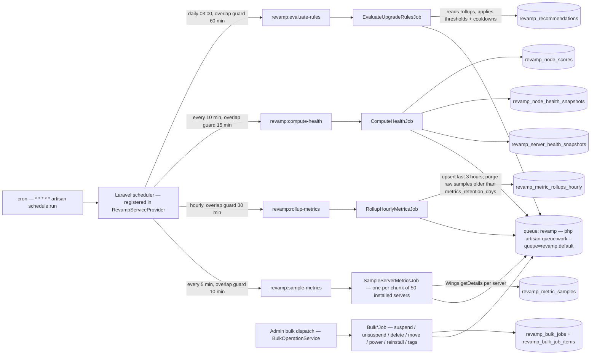
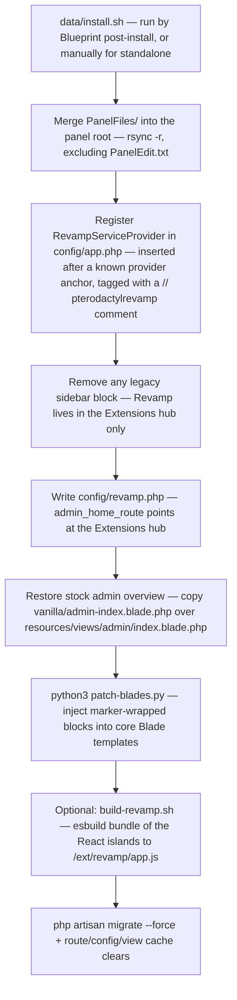

# Architecture Overview

Pterodactyl Revamp is an **admin-side operations layer** that lives inside the Pterodactyl Panel (1.12.x–1.14.x). It is not a standalone app and it has no node-side component: everything runs inside the panel's Laravel process, talks to Wings through the same `Daemon*Repository` classes the core panel uses, and stores its state in a set of `revamp_*` MySQL tables alongside the core schema.

The codebase is organized as a classic Laravel add-on: a service provider (`RevampServiceProvider`) registers routes, migrations, views, view composers, and the scheduler; controllers stay thin and delegate to `app/Services/Revamp/*`; queued work runs on a dedicated `revamp` queue. The admin UI is plain Blade enhanced by jQuery "islands" served from `public/ext/revamp/`, with an optional React bundle layered on top.

---

## Component Overview

```mermaid
graph TD
    subgraph Browser[Admin Browser]
        BLADE[Blade views - revamp::admin.*]
        JQ[jQuery islands - /ext/revamp/*.js]
        REACT[Optional React bundle - /ext/revamp/app.js]
        BLADE --> JQ
        BLADE --> REACT
    end

    subgraph Panel[Pterodactyl Panel - Laravel]
        subgraph Routes[Routes]
            R1["routes/admin-revamp.php — /admin/revamp (web + 2FA + AdminAuthenticate)"]
            R2["routes/api-revamp.php — /api/application/revamp (application-api + RequireRevampRootAdmin)"]
            R3["Blueprint client route — GET /api/client/servers/{server}/tags"]
        end

        subgraph Controllers[Controllers]
            C1[Admin\\Revamp\\* — 14 controllers]
            C2[Api\\Client\\RevampServerTagsController]
        end

        subgraph Services[app/Services/Revamp]
            S1[Settings / RevampSettingsRepository — 5 min cache]
            S2[BulkOps — BulkOperationService / BulkMoveService / BulkPreflightValidator]
            S3[Metrics — MetricSamplingService / RollupService / UpgradeRuleEngine]
            S4[Health — NodeHealthService / ServerHealthService]
            S5[Tags / Templates / Allocations / Search / Audit / Recommendations]
        end

        subgraph Models[app/Models/Revamp]
            M1[Revamp* Eloquent models]
        end

        subgraph Core[Core Pterodactyl services]
            P1[Servers — ServerDeletionService / SuspensionService / ReinstallServerService]
            P2[Models — Server / Node / Allocation / User]
        end

        DB[(revamp_* tables + core tables)]
    end

    subgraph Wings[Wings Node]
        W1[Wings DaemonServerRepository — getDetails stats]
        W2[Wings DaemonPowerRepository — power actions]
    end

    Browser --> R1
    REACT --> R2
    R1 --> C1
    R2 --> C1
    R3 --> C2
    C1 --> Services
    C2 --> S5
    Services --> Models
    Models --> DB
    S2 --> P1
    Services --> P2
    S3 --> W1
    S2 --> W2
```



Three route surfaces exist, all registered by `RevampServiceProvider::registerRoutes()` except the client route, which ships as a Blueprint client router:

| Surface | Prefix | Middleware | File |
|---|---|---|---|
| Admin web UI | `/admin/revamp` | `web`, `auth.session`, 2FA, `AdminAuthenticate` | `routes/admin-revamp.php` |
| Application API | `/api/application/revamp` | `api`, `application-api`, `throttle:api.application`, `RequireRevampRootAdmin` | `routes/api-revamp.php` |
| Client API | `/api/client/servers/{server}/tags` | `ServerSubject`, `AuthenticateServerAccess` | `routes/blueprint/client/revamp.php` (Blueprint install only) |

::: info Application API keys are not enough
Every `/api/application/revamp` route additionally passes through `RequireRevampRootAdmin`, so an API key only grants Revamp access if its owner is a root admin. This surface exists for external integrations (WHMCS and similar billing systems) and mirrors the admin controllers.
:::

The admin UI itself is reachable at `/admin/revamp` and, on Blueprint installs, through the Extensions hub (`admin.extensions.pterodactylrevamp.index`), which renders the same `revamp::admin.revamp._overview` partial. No core sidebar link is injected by default.

### Frontend layers

- **Blade views** — the Revamp dashboard, tags, templates, health, audit log, activity, settings, and multi-create pages under `resources/views/admin/`, loaded through the `revamp::` namespace by `loadViewsFrom()`.
- **jQuery islands** — static assets in `public/ext/revamp/` (server-create helpers, allocation port picker, multi-server create, server-list bulk/filters/tags, template admin). They are pulled in by `partials/revamp-admin-assets.blade.php`, which is injected into `layouts/admin.blade.php` and only loads the scripts relevant to the current route.
- **Optional React bundle** — `resources/scripts/blueprint/revamp/index.tsx` (AllocationPicker, ServerMetricsChart, BulkJobProgress, MultiServerCreate, GlobalSearch) is bundled by `data/build-revamp.sh` with esbuild into `public/ext/revamp/app.js`. The assets partial only includes `app.js` when the file exists, so the addon works fully without it.
- **View composers** — `RevampServiceProvider` composes tag data into the stock `admin.servers.new`, `admin.servers.view.details`, and `admin.servers.index` views, so the patched core forms render tag pickers with live data.

---

## Queue & Scheduler

All heavy work is queued. The scheduler only runs thin command entrypoints; each command dispatches one or more jobs onto the dedicated **`revamp`** queue, and a queue worker picks them up. Schedules are registered at service-provider boot time — no `Kernel.php` edit is needed, only the stock Pterodactyl cron entry running `schedule:run` every minute.



| Command | Cadence | Job(s) | Writes |
|---|---|---|---|
| `revamp:sample-metrics` | Every 5 minutes | `SampleServerMetricsJob` (per 50-server chunk) | `revamp_metric_samples` |
| `revamp:rollup-metrics` | Hourly | `RollupHourlyMetricsJob` | `revamp_metric_rollups_hourly` (also purges raw samples) |
| `revamp:compute-health` | Every 10 minutes | `ComputeHealthJob` | `revamp_server_health_snapshots`, `revamp_node_health_snapshots`, `revamp_node_scores` (also purges old snapshots) |
| `revamp:evaluate-rules` | Daily at 03:00 | `EvaluateUpgradeRulesJob` | `revamp_recommendations` |

Behavior worth knowing:

- **Rate-limited sampling** — `MetricSamplingService` skips a server if a sample already exists within the last 4 minutes, so overlapping schedule runs never double-sample. One unresponsive server is logged and skipped, never aborts the batch.
- **Health retention** — `ComputeHealthJob` purges health snapshots older than the `health_retention_days` setting (default 30) on every run; raw metric samples are purged by the rollup job past `metrics_retention_days` (default 90). Hourly rollups are kept indefinitely.
- **Sync fallback** — bulk operations are dispatched to the `revamp` queue by default; setting `REVAMP_BULK_SYNC=true` runs them synchronously instead, which is useful on panels without a worker during testing.
- **Wings touchpoints** — metric sampling reads utilization through `DaemonServerRepository::getDetails()`; bulk power actions go through `DaemonPowerRepository`. Bulk suspend/unsuspend/delete/reinstall reuse the core `SuspensionService`, `ServerDeletionService`, and `ReinstallServerService`, so core behavior (including Wings-side cleanup) is preserved.

::: tip Queue worker is mandatory
Without `php artisan queue:work --queue=revamp,default`, no metrics, health snapshots, recommendations, or bulk operations will ever process. See [Installation](/pterodactyl-revamp/getting-started/installation) for the supervisor setup.
:::

::: danger Bulk move is opt-in
`BulkMoveService` only re-points panel database records to another node — **no Wings data transfer happens**. The entire path throws a `DisplayException` unless the `bulk_move_enabled` setting is explicitly turned on (default off).
:::

---

## Database Schema

Ten migrations create the `revamp_*` schema. Foreign keys point into the core `servers`, `nodes`, `users`, and `allocations` tables; most cascade on delete so Revamp rows disappear with their core subjects. A later migration makes `revamp_admin_audit_logs.actor_id` nullable via a raw `ALTER`, because audit entries can originate from queued/CLI contexts with no authenticated user.

```mermaid
erDiagram
    SERVERS ||--o{ REVAMP_SERVER_TAG : "server_id"
    REVAMP_TAGS ||--o{ REVAMP_SERVER_TAG : "tag_id"
    SERVERS ||--o{ REVAMP_SERVER_GROUP_MEMBER : "server_id"
    REVAMP_SERVER_GROUPS ||--o{ REVAMP_SERVER_GROUP_MEMBER : "group_id"
    REVAMP_TEMPLATES ||--o{ REVAMP_TEMPLATE_REVISIONS : "template_id"
    REVAMP_TEMPLATES ||--o{ REVAMP_TEMPLATE_FAVORITES : "template_id"
    USERS ||--o{ REVAMP_TEMPLATES : "created_by"
    USERS ||--o{ REVAMP_TEMPLATE_FAVORITES : "user_id"
    SERVERS ||--o{ REVAMP_METRIC_SAMPLES : "server_id"
    SERVERS ||--o{ REVAMP_METRIC_ROLLUPS_HOURLY : "server_id"
    NODES ||--o{ REVAMP_NODE_HEALTH_SNAPSHOTS : "node_id"
    NODES ||--|| REVAMP_NODE_SCORES : "node_id"
    SERVERS ||--o{ REVAMP_SERVER_HEALTH_SNAPSHOTS : "server_id"
    USERS ||--o{ REVAMP_BULK_JOBS : "actor_id"
    REVAMP_BULK_JOBS ||--o{ REVAMP_BULK_JOB_ITEMS : "job_id"
    SERVERS ||--o{ REVAMP_BULK_JOB_ITEMS : "server_id"
    SERVERS ||--o{ REVAMP_RECOMMENDATIONS : "server_id"
    ALLOCATIONS ||--o{ REVAMP_USER_ALLOCATION_RECENTS : "allocation_id"

    REVAMP_SETTINGS {
        string key PK "100 — primary key"
        json value
        timestamp updated_at
    }
    REVAMP_ADMIN_AUDIT_LOGS {
        bigint id PK
        int actor_id "nullable, indexed"
        string action "100, indexed"
        string subject_type "60, nullable"
        bigint subject_id "nullable"
        json diff
        uuid correlation_id "indexed"
        string ip "45"
        string user_agent "300"
        timestamp created_at
    }
    REVAMP_TAGS {
        bigint id PK
        string name "60"
        string slug UK "60"
        string color "7, default #6366f1"
        string icon "40, nullable"
        boolean is_default
    }
    REVAMP_SERVER_TAG {
        int server_id PK "FK servers"
        bigint tag_id PK "FK revamp_tags"
    }
    REVAMP_SERVER_GROUPS {
        bigint id PK
        string name "100"
        string slug UK "100"
        text description
        string color "7"
    }
    REVAMP_SERVER_GROUP_MEMBER {
        int server_id PK "FK servers"
        bigint group_id PK "FK revamp_server_groups"
    }
    REVAMP_TEMPLATES {
        bigint id PK
        string name "100"
        string category "60, default general"
        text description
        boolean is_default
        int created_by "FK users"
    }
    REVAMP_TEMPLATE_REVISIONS {
        bigint id PK
        bigint template_id FK
        int revision "unique per template"
        json config "full deploy config"
        int created_by
        timestamp created_at
    }
    REVAMP_TEMPLATE_FAVORITES {
        int user_id PK
        bigint template_id PK
    }
    REVAMP_METRIC_SAMPLES {
        bigint id PK
        int server_id FK
        timestamp sampled_at "indexed"
        bigint cpu_absolute "scaled x100"
        bigint memory_bytes
        bigint memory_limit_bytes
        bigint disk_bytes
        bigint disk_limit_bytes
        bigint network_rx_bytes
        bigint network_tx_bytes
        bigint uptime_seconds
        string status "20"
    }
    REVAMP_METRIC_ROLLUPS_HOURLY {
        bigint id PK
        int server_id FK "unique with bucket_ts"
        timestamp bucket_ts "truncated to hour"
        bigint cpu_avg
        bigint cpu_max
        bigint memory_avg_bytes
        bigint memory_max_bytes
        bigint disk_avg_bytes
        bigint disk_max_bytes
        tinyint sample_count
    }
    REVAMP_NODE_HEALTH_SNAPSHOTS {
        bigint id PK
        int node_id FK
        timestamp snapshot_at
        tinyint health_score "0-100, lower is worse"
        string status "healthy | warn | critical"
        json reasons
        smallint server_count
        smallint offline_count
        smallint crash_loop_count
        smallint oom_count
        tinyint allocation_used_pct
        tinyint memory_used_pct
    }
    REVAMP_SERVER_HEALTH_SNAPSHOTS {
        bigint id PK
        int server_id FK
        timestamp snapshot_at
        string status "healthy | warn | unstable"
        json reasons
        smallint restart_count_24h
        boolean suspected_crash_loop
        boolean suspected_oom
        boolean startup_failure
    }
    REVAMP_NODE_SCORES {
        bigint id PK
        int node_id UK FK
        tinyint pressure_score "0 = none, 100 = max"
        json score_factors
        timestamp computed_at
    }
    REVAMP_BULK_JOBS {
        bigint id PK
        uuid uuid UK
        int actor_id FK
        string type "suspend | unsuspend | delete | move"
        string status "pending | running | done | failed"
        smallint total
        smallint processed
        smallint failed
        json options "e.g. target_node_id"
        timestamp started_at
        timestamp finished_at
    }
    REVAMP_BULK_JOB_ITEMS {
        bigint id PK
        bigint job_id FK
        int server_id FK
        string status "pending | success | failed"
        text error
        timestamp processed_at
    }
    REVAMP_RECOMMENDATIONS {
        bigint id PK
        int server_id FK
        string type "upgrade | downgrade | review"
        string rule_key "60"
        text message
        json evidence "triggering metric values"
        boolean dismissed
        timestamp cooldown_until
        timestamp created_at
    }
    REVAMP_USER_ALLOCATION_RECENTS {
        int user_id PK
        int allocation_id PK "FK allocations"
        timestamp used_at
    }
    REVAMP_EVENTS {
        bigint id PK
        int server_id "nullable, indexed"
        int node_id "nullable, indexed"
        int actor_id "nullable"
        string event "80, indexed"
        json payload
        timestamp created_at
    }
```

Notes on the schema:

- **`revamp_settings`** is a key/value table seeded with 14 defaults at migration time (naming pattern, allocation page size, retention windows, upgrade thresholds, health thresholds, tag visibility). All reads go through `RevampSettingsRepository`'s 5-minute cache, with typed fallbacks for keys missing from the table (including `health_retention_days` = 30 and `bulk_move_enabled` = false).
- **`revamp_tags`** is seeded with seven default tags (Premium, Suspended, Unstable, Abusive, Trial, Enterprise, Migrated); `revamp_server_tag` is the server pivot with a composite primary key.
- **`revamp_server_groups` + `revamp_server_group_member`** are created by the migrations but are **currently unused** — no controller, service, or model references them. They are scaffolding for a future grouping feature.
- **`revamp_template_revisions.config`** stores the full deploy configuration as JSON in the same shape as the core `ServerController@store` payload, which is what makes one-click deploy-from-template possible.
- **`revamp_events`** is Revamp's own event stream, supplemental to the core `activity_logs`. `BulkMoveService` writes move events here, `ServerHealthService` reads it to count restarts over the health window, and `ActivityController` merges it with core activity logs into a unified feed.
- **`revamp_user_allocation_recents`** powers the allocation picker's per-admin "recently used ports" list; the composite key is `(user_id, allocation_id)` and `used_at` bumps on every reuse.

---

## Blade Patching Mechanism

Revamp ships UI for *stock* core pages (server create, server details, server list), which means it must modify core Blade templates. It does this with a **marker-guarded Python patcher** that is fully reversible.



Every injected block is wrapped in HTML comments:

```html
<!-- pterodactylrevamp-server-list-filters-start -->
<div class="revamp-server-filters-host clearfix" id="revamp-server-filters-blade"></div>
<!-- pterodactylrevamp-server-list-filters-end -->
```

**Patched core templates and what goes in:**

| Template | Injections |
|---|---|
| `layouts/admin.blade.php` | `assets` (`@include('partials.revamp-admin-assets')`) and `nav-search` (global search mount point in the navbar) |
| `admin/servers/new.blade.php` | Auto-naming checkbox + preview, inline tag picker, allocation port buttons (previous/next/random/favorites), additional-allocation picker, Multi Create button + modal, favorite-ports and field-help modals, script/style includes |
| `admin/servers/view/details.blade.php` | Tag picker pre-seeded with the server's current tags |
| `admin/servers/index.blade.php` | Filter bar host, bulk-select checkbox column, per-row tag labels, pagination simplification |

**Idempotency by design:**

- If a block's start marker already exists, the patcher prints `already present` and skips it — reinstalling is a no-op.
- Before injecting, `strip_revamp_blocks()` removes *orphaned* markers (a start without an end, or vice versa) left by an interrupted run, while leaving well-formed blocks untouched.
- `inject_replace()` keeps the original line as a Blade comment (<code v-pre>{{-- pterodactylrevamp-original: ... --}}</code>) so the unpatcher can restore it byte-for-byte.
- Missing anchor strings produce a warning, never a hard failure — the patcher degrades gracefully across minor panel version differences.

**Removal** (`data/remove.sh`): deletes the provider line from `config/app.php` by matching the `// pterodactylrevamp` comment, removes any sidebar block, then clears config/view caches. The Blueprint copy additionally restores the stock admin overview from `vanilla/admin-index.blade.php` and runs `unpatch-blades.py`, which strips every marker-wrapped block and restores anchor-preserved originals byte-for-byte — on a standalone removal, run `unpatch-blades.py` yourself with `PTERODACTYL_DIRECTORY` set. The `revamp_*` tables are left in place either way (drop them manually if you want a clean slate).

::: warning Stale bytecode guard
`install.sh` deletes the patcher's `__pycache__` before running it — without that, Python can execute an old cached `patch-blades` even when the `.py` file was updated, producing confusing "already present" output on a fresh install.
:::

---

## Repository Layout

The repo ships the same panel payload twice: once inside the Blueprint extension wrapper, once standalone. `blueprint/pterodactylrevamp/data/` and `standalone/data/` are kept identical (install scripts, patchers, vanilla template).

```text
pterodactyl-revamp/
├── README.md                          # install-path overview, requirements
├── blueprint/                         # Blueprint extension (recommended path)
│   ├── pterodactylrevamp.blueprint    # packaged extension archive
│   └── pterodactylrevamp/             # extension source (identifier: pterodactylrevamp)
│       ├── conf.yml                   # Blueprint manifest — version 1.2.0, target beta-2026-06
│       ├── controller.php             # Extensions hub controller (renders the overview)
│       ├── view.blade.php             # Extensions hub view (includes revamp::admin.revamp._overview)
│       ├── components/                # Blueprint dashboard components (Components.yml, TSX)
│       ├── routes/
│       │   ├── web.php                # empty shell — real routes come from the provider
│       │   └── blueprint/client/revamp.php  # client API: GET /servers/{server}/tags
│       └── data/                      # install/remove scripts + PanelFiles payload
│           ├── install.sh             # merge, provider registration, patching, migrate
│           ├── remove.sh              # full uninstall of core-file edits
│           ├── patch-blades.py        # marker-guarded Blade injector
│           ├── unpatch-blades.py      # strips injected blocks, restores originals
│           ├── build-revamp.sh        # optional esbuild bundle → /ext/revamp/app.js
│           ├── vanilla/admin-index.blade.php  # stock admin overview for restore
│           └── PanelFiles/            # full panel tree (see below)
└── standalone/                        # manual merge path (no Blueprint)
    ├── README.standalone.txt
    ├── data/                          # same scripts as blueprint/.../data
    └── PanelFiles/                    # same payload as blueprint/.../data/PanelFiles
```

`PanelFiles/` mirrors the panel root and merges directly over it:

```text
PanelFiles/
├── app/
│   ├── Console/Commands/Revamp/       # 4 scheduled command entrypoints
│   ├── Http/
│   │   ├── Controllers/Admin/Revamp/  # 14 admin controllers
│   │   ├── Controllers/Api/Client/Servers/RevampServerTagsController.php
│   │   ├── Middleware/RequireRevampRootAdmin.php
│   │   └── Requests/Admin/Revamp/     # StoreTagRequest, UpdateSettingsRequest
│   ├── Jobs/Revamp/                   # 11 queued jobs (7 bulk + 4 scheduled)
│   ├── Models/Revamp/                 # 13 Eloquent models over revamp_* tables
│   ├── Providers/RevampServiceProvider.php  # routes, views, composers, migrations, schedules
│   └── Services/Revamp/               # Settings, BulkOps, Metrics, Health, Tags,
│                                      # Templates, Allocations, Search, Audit,
│                                      # Recommendations, Admin stats, RevampNav
├── config/revamp.php                  # admin_home_route (overwritten by install.sh on Blueprint)
├── database/migrations/               # 10 migrations → the revamp_* schema
├── public/ext/revamp/                 # jQuery islands + CSS (allocation, server create,
│                                      # multi-create, server list, tags, templates)
├── resources/
│   ├── scripts/blueprint/revamp/      # optional React islands source (TSX + API clients)
│   └── views/                         # revamp:: Blade views + partials/revamp-admin-assets
└── routes/
    ├── admin-revamp.php               # /admin/revamp web routes
    └── api-revamp.php                 # /api/application/revamp routes
```

::: info Keeping the copies in sync
`blueprint/pterodactylrevamp/data/PanelFiles/` and `standalone/PanelFiles/` are byte-identical payloads. When contributing, change one and sync the other — drifting copies are the most common source of "works on Blueprint, broken standalone" bugs.
:::
