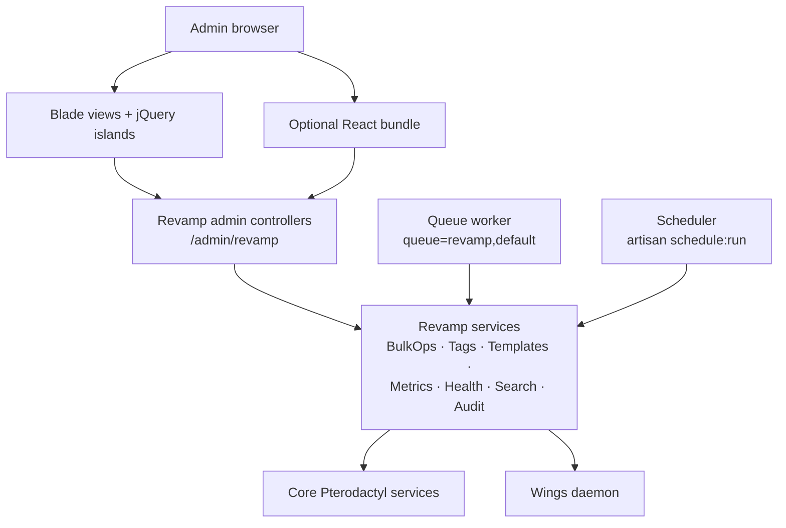

# Pterodactyl Revamp

Pterodactyl Revamp is an enterprise operations layer for **Pterodactyl Panel 1.12.x – 1.14.x** that adds bulk server operations, multi-server creation, tagging, templates, metrics, health scoring, global search, and audit logging on top of the stock admin panel.

::: info Version
Current release: **1.2.0** · Blueprint target: `beta-2026-06` · [GitHub repository](https://github.com/PingLess/pterodactyl-revamp)
:::

## Key features

- **Bulk operations** — run power actions, rebuilds, suspensions, and moves across many servers at once, with preflight validation and per-item status tracking
- **Multi-server create** — provision batches of servers from one form, with naming-pattern previews
- **Server tagging** — organize servers with tags and filter the admin server list by them
- **Server templates** — reusable creation templates with revision history
- **Allocation port picker** — an improved allocation UX for choosing ports during server creation
- **Metrics and analytics** — scheduled metric sampling with hourly rollups and dashboard charts
- **Health scoring** — node and server health snapshots with computed scores and recommendations
- **Global search** — search across servers, nodes, and users from the admin area
- **Audit log** — an admin audit trail of every action Revamp performs
- **Admin dashboard** — a dedicated operations dashboard at `/admin/revamp`

## Architecture

Revamp runs entirely inside the panel: Blade views with jQuery islands (plus an optional React bundle) talk to Revamp's own admin controllers, which delegate to service classes that wrap core Pterodactyl services and Wings. Metrics sampling, health scoring, and bulk jobs run through the queue and scheduler.



## Quick install

With Blueprint installed on your panel:

```bash
blueprint -i pterodactylrevamp
```

::: warning Background workers required
Revamp expects a queue worker and the scheduler to be running, or metrics, health scoring, and bulk jobs will never execute:

```bash
php artisan queue:work --queue=revamp,default
```

```bash
* * * * * php /var/www/pterodactyl/artisan schedule:run >> /dev/null 2>&1
```
:::

## Install paths

Revamp ships in two flavors. Pick the one that matches how you manage your panel.

| | Blueprint extension | Standalone merge |
|---|---|---|
| **How it installs** | `blueprint -i pterodactylrevamp` runs `data/install.sh`, which merges PanelFiles and patches admin blades automatically | Copy `standalone/PanelFiles/` into the panel manually (or via ainx, etc.) |
| **Best for** | Panels already managed by Blueprint | Panels without Blueprint, or fully manual control |
| **Removal** | `blueprint -remove pterodactylrevamp` restores the vanilla blades | Manual — restore from the included `data/vanilla/` copies |
| **Updates** | Reinstall through Blueprint | Re-merge PanelFiles on top of the panel |

See [Installation](/pterodactyl-revamp/getting-started/installation) for the full walkthrough of both paths.

::: tip Requirements
PHP **8.2 / 8.3**, MySQL/MariaDB **10.4+**, and a Pterodactyl panel on **1.12.x – 1.14.x**.
:::

::: danger Bulk move is opt-in
Bulk move only re-points panel database records — it does **not** transfer server data through Wings, which would leave servers broken. It is gated behind the `bulk_move_enabled` setting (default **off**). Enable it only if you understand the consequences. See [Configuration](/pterodactyl-revamp/getting-started/configuration).
:::

## Documentation

| Page | What it covers |
|---|---|
| [Installation](/pterodactyl-revamp/getting-started/installation) | Both install paths, requirements, queue worker, and cron setup |
| [Configuration](/pterodactyl-revamp/getting-started/configuration) | Every Revamp setting, including `bulk_move_enabled` |
| [CLI](/pterodactyl-revamp/reference/cli) | Artisan commands for metrics sampling, rollups, health, and rule evaluation |
| [API](/pterodactyl-revamp/reference/api) | Application API endpoints exposed by Revamp |
| [Architecture](/pterodactyl-revamp/reference/architecture) | Controllers, services, jobs, and database tables in depth |
