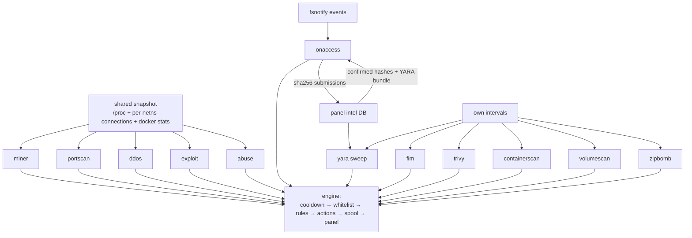

# Detectors

Twelve detectors run in every node agent. The fast ones consume a single shared system snapshot per tick (every `general.scan_interval_seconds`, default 5 s); the heavy ones run on their own intervals. Each section below covers what the detector watches, where the data comes from, the thresholds that matter, how severity escalates, and a representative event. Configuration keys for all of them: [Configuration Reference](../configuration/reference.md#detectors).

Events carry both a `category` (what kind of threat) and a `detector` (what caught it) — the rules engine matches on category, so e.g. one `malware` rule covers both `onaccess` and `yara` hits.

---

## miner

**Watches for** cryptominers running on the host or inside containers.

**Data source:** the shared `/proc` snapshot (process names, cmdlines, CPU deltas) plus the per-netns connection table for pool-port connections.

**Key thresholds:** `cpu_threshold: 85`% sustained for `sustained_seconds: 45`; 23 known miner binaries (`xmrig`, `minerd`, `t-rex`, …); 11 pool ports (`3333`, `4444`, `5555`, `7777`, …); mining argument flags (`stratum+tcp`, `--donate-level`, `--randomx`, …). Game-server binaries are whitelisted from the heuristics (signatures still apply).

**Severity escalation:** sustained high CPU → **medium**; known miner binary or a masked process running a deleted binary → **high**; mining arg flags in the cmdline, or pool-port connection → **high** (connection event) / **critical** (active miner confirmed).

```json
{
  "category": "miner", "detector": "miner", "severity": "critical",
  "title": "cryptocurrency miner active",
  "server_uuid": "d8321c4e-…", "process": "/tmp/.x/xmrig -o pool.minexmr.com:4444",
  "pid": 23841, "evidence": { "cpu_percent": "387.2", "match": "stratum+tcp" }
}
```

Default rules: high → kill process; critical → stop container + panel-side suspend.

## portscan

**Watches for** outbound network scanning — a host or container touching many ports/hosts in a short window.

**Data source:** the per-netns connection table, aggregated per container over a sliding window.

**Key thresholds:** `distinct_ports: 100` or `distinct_hosts: 50` within `window_seconds: 15`; known scanner binaries (`nmap`, `masscan`, `zmap`, `rustscan`, …) flagged immediately.

**Severity escalation:** medium at threshold → **high** when counts run well past it.

```json
{
  "category": "portscan", "detector": "portscan", "severity": "high",
  "title": "outbound port scan detected",
  "evidence": { "distinct_ports": "412", "distinct_hosts": "38", "window_seconds": "15" }
}
```

Default rule: alert only — reconnaissance, not damage.

## ddos

**Watches for** outbound floods and stress tooling — a customer attacking third parties from your node.

**Data source:** per-container traffic counters (packets/bytes/connections) from the shared docker stats + `/proc` snapshot, and process names.

**Key thresholds:** `pps_threshold: 60000`, `bps_threshold: 125000000` (~1 Gbit/s), `conn_threshold: 1500` concurrent outbound connections; 15 stress-tool names (`hping3`, `slowloris`, `mhddos`, `xerxes`, …) matched on word boundaries. Game servers are whitelisted from rate heuristics.

**Severity escalation:** all flood detections are **high**.

```json
{
  "category": "ddos", "detector": "ddos", "severity": "high",
  "title": "outbound flood from container",
  "evidence": { "pps": "184203", "dst": "203.0.113.9:80" }
}
```

Default rule: alert + pause container + panel-side suspend.

## zipbomb

**Watches for** archive bombs uploaded into server volumes — tiny archives that decompress to tens of gigabytes and fill the disk.

**Data source:** scheduled volume sweeps plus a reactive **hot trigger**: a container writing hot (`hot_cpu_percent: 80`, `hot_write_mbps: 25`) gets its fresh archives inspected immediately.

**Key thresholds:** `ratio_threshold: 150` (uncompressed:compressed), `max_uncompressed_mb: 51200` (50 GiB absolute), full sweep every `full_scan_interval_minutes: 30` with a `sweep_max_seconds: 300` budget, `workers: 4`, per-archive timeout `inspect_timeout_seconds: 5`.

**Severity escalation:** **medium** at the ratio threshold → **high** for extreme ratios or absolute sizes.

```json
{
  "category": "zipbomb", "detector": "zipbomb", "severity": "high",
  "title": "zip bomb detected",
  "path": "/var/lib/pterodactyl/volumes/d8321c4e-…/plugins/update.zip",
  "evidence": { "ratio": "1840", "uncompressed_mb": "51200" }
}
```

Default rule: quarantine the file from medium up.

## exploit

**Watches for** privilege escalation, container escapes and reverse shells.

**Data source:** the process snapshot (names, cmdlines, uid/capability transitions, socket-attached shells) and walks of the world-writable scratch dirs (`/tmp`, `/dev/shm`, `/var/tmp`).

**Key thresholds:** privesc/escape tool names (`dirtycow`, `dirtypipe`, `pwnkit`, `linpeas`, `nsenter`, `deepce`, …); `flag_reverse_shell` and `flag_privesc` both on; `max_setuid_walk_size: 200000`. `runc` is deliberately not listed — it spawns every container; escape attempts are caught by the `nsenter --target 1` cmdline pattern instead.

**Severity escalation:** execution from a scratch dir → **medium**; privesc tools, reverse shells → **high**; container-escape patterns → **critical**.

```json
{
  "category": "exploit", "detector": "exploit", "severity": "critical",
  "title": "container escape attempt",
  "process": "nsenter --target 1 --mount --uts --ipc --net --pid",
  "evidence": { "pattern": "nsenter-target-1" }
}
```

Default rules: high → kill process; critical → stop container + suspend.

## abuse

**Watches for** hosting-abuse services: tor relays/exits, proxies, VPNs, tunnels, mail spammers, IRC bots.

**Data source:** process names and cmdlines from the snapshot, plus the listening-socket table.

**Key thresholds:** 31 known process names (`tor`, `shadowsocks`, `v2ray`, `xray`, `hysteria2`, `cloudflared`, `frps`, `ngrok`, `postfix`, `znc`, …); 16 cmdline fragments (`--socksport`, `--protocol vmess`, `/etc/wireguard`, …); 24 abusive listening ports (tor `9050/9051`, socks `1080`, proxy panels `7890/8082`, shadowsocks `8388`, IRC `6667/6697`, …). Executing anything from customer upload roots is itself a signal.

**Severity escalation:** execution from an upload directory → **medium**; known abuse service or listener on an abusive port → **high**.

```json
{
  "category": "abuse", "detector": "abuse", "severity": "high",
  "title": "hosting abuse service detected",
  "process": "/usr/bin/tor -f /etc/tor/torrc",
  "evidence": { "listening": "9050" }
}
```

Default rules: high → kill process; critical → stop container + suspend.

## onaccess

**Watches for** malware the moment it lands in a server volume.

**Data source:** fsnotify events under `/var/lib/pterodactyl/volumes` (creates, writes, moves), settled for `settle_ms: 500` so in-flight uploads are scanned complete.

**Key thresholds:** `hash_check` (SHA-256 against the local + panel-distributed confirmed blocklist) and `yara_check` (active YARA bundle) both on by default. Interesting files are hashed and submitted to the panel intel DB — this detector is what feeds the fleet-wide intel loop.

**Severity escalation:** YARA match → **high**; blocklist hash hit → **critical**.

```json
{
  "category": "malware", "detector": "onaccess", "severity": "critical",
  "title": "blocklisted file detected on write",
  "path": "/var/lib/pterodactyl/volumes/d8321c4e-…/start.sh",
  "evidence": { "sha256": "9f2b…", "blocklist": "confirmed" }
}
```

Default rule: quarantine the file.

## yara

**Watches for** malware already sitting in volumes — the scheduled complement to on-access, which only sees new writes. **Disabled by default**; enable it to sweep files written before deployment.

**Data source:** filesystem walk of `scan_paths` every `interval_minutes: 10`, scanned with the panel-distributed YARA bundle (hot-reloaded on every config sync).

**Severity escalation:** every rule match → **high**, category `malware` — identical handling to on-access, so one rule covers both.

```json
{
  "category": "malware", "detector": "yara", "severity": "high",
  "title": "YARA rule match",
  "path": "/var/lib/pterodactyl/volumes/d8321c4e-…/plugins/loader.jar",
  "evidence": { "rule": "Miner_XMRig_Strings" }
}
```

## fim

**Watches for** changes to files that should never change. **Disabled by default**; the shipped baseline watches the agent's own `/etc/sentinel/config.yaml`.

**Data source:** SHA-256 baselines of configured `paths`, re-hashed every `interval_minutes: 5`.

**Severity escalation:** any modification → one **high** event per change.

```json
{
  "category": "fim", "detector": "fim", "severity": "high",
  "title": "protected file modified",
  "path": "/etc/sentinel/config.yaml",
  "evidence": { "old_sha256": "…", "new_sha256": "…" }
}
```

Good candidates: Wings config, host SSH keys, panel mounts. Do not point it at game volumes — they change constantly (that is on-access's job).

## trivy

**Watches for** known vulnerabilities in the container images running on the node. **Disabled by default**; requires the external `trivy` binary on the node.

**Data source:** `trivy image --severity HIGH,CRITICAL --format json` against each running container's image, every `interval_minutes: 60`.

**Severity escalation:** HIGH CVEs → **medium**; CRITICAL CVEs → **high**, category `vuln`.

```json
{
  "category": "vuln", "detector": "trivy", "severity": "high",
  "title": "critical CVE in container image",
  "evidence": { "image": "ghcr.io/…:latest", "cve": "CVE-2024-3094", "package": "xz" }
}
```

## containerscan

**Watches for** abuse visible from inside containers: suspicious processes, tell-tale log lines, WhatsApp-bot npm dependencies, undersized `server.jar` droppers, miner cache artifacts, and the "high CPU on a near-empty volume" mining pattern.

**Data source:** docker `top`/`logs` per container (last `log_tail_lines: 1000` log lines), `package.json` inspection, cache-dir checks, and per-container stats — every `interval_minutes: 3`, `concurrency: 5` containers at a time.

**Key thresholds:** labeled log indicators (whatsapp / nezha / miner substring sets); 11 suspicious log words (`new job from`, `Stratum - Connected`, `FAILED TO APPLY MSR MOD`, …); suspicious processes (`xmrig`, `proot`, `mcstorm.jar`, …); `min_server_jar_bytes: 5242880` (a real Minecraft jar is never under 5 MiB); `small_volume_mb: 3.5` + `high_cpu_percent: 96`; `high_network_mb: 4096`.

**Severity escalation:** suspicious log content / high network → **medium**; labeled indicators → medium or **high** by label; suspicious process or high-CPU-tiny-volume → **high**; hash-confirmed malware found during the scan → **critical** (category `malware`).

```json
{
  "category": "scan", "detector": "containerscan", "severity": "high",
  "title": "suspicious process in container",
  "server_uuid": "d8321c4e-…",
  "evidence": { "process": "xmrig", "source": "docker top" }
}
```

## volumescan

**Watches for** suspicious files anywhere in server volumes — the sonar-style pattern scanner. Runs on a schedule and on demand from the Scans tab.

**Data source:** a full filesystem walk of each server's volume every `interval_minutes: 15` (budget `max_scan_seconds: 600`), applying name, extension and content-pattern lists.

**Key thresholds:** suspicious names (`mine.sh`, `proxies.txt`, `wa_bot.js`, …); suspicious extensions (`.sh`); 10 content mining patterns (`stratum`, `cryptonight`, `minexmr.com`, …); generous ignore lists (known-benign files, plugin/world paths, and 19 skipped extensions like `.jar`, `.log`, `.mca`) keep false positives down; files over `max_file_size_mb: 64` are name-checked only; jars over `max_jar_size_mb: 5` skip the undersized-jar check.

**Severity escalation:** per-finding severity from the scan (`medium` for pattern hits, **critical** for blocklist-confirmed hashes), category `scan`.

```json
{
  "category": "scan", "detector": "volumescan", "severity": "medium",
  "title": "suspicious file content",
  "path": "/var/lib/pterodactyl/volumes/d8321c4e-…/boot/mine.sh",
  "evidence": { "pattern": "stratum", "scan": "scheduled" }
}
```

---

## How the detectors fit together



Fast detectors share one snapshot so a 5-second tick stays cheap on a full node; heavy filesystem work is interval-bound, time-boxed, and parallelized, so sweeps cannot stall detection.
