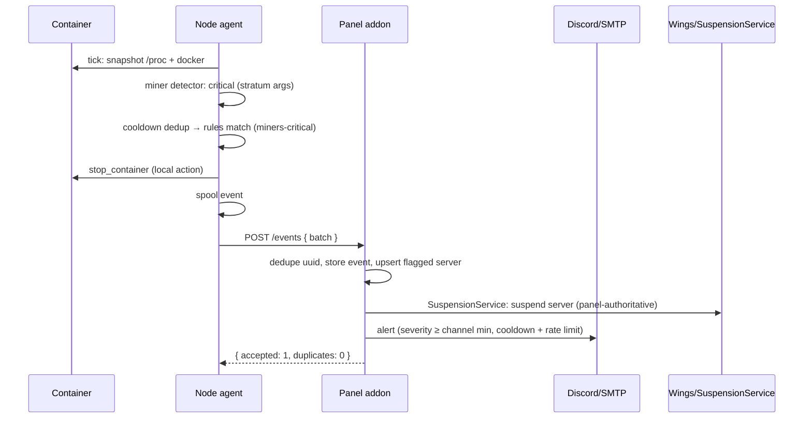
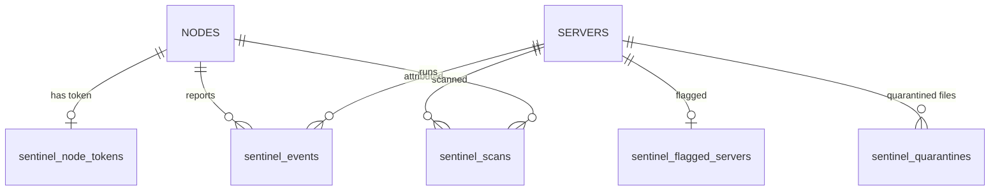

# Architecture Overview

Sentinel is two components speaking one contract:

- **Panel addon** (PHP 8.2+/Laravel, Blueprint id `pterodactylsentinel`) — the brain. Owns all state, all secrets, the admin UI, enforcement policy, threat intel, and the versioned config.
- **Node agent** (Go 1.22+, single static CGO-free binary `sentinel`) — the sensor/enforcer. One per Wings node. Detects, executes local containment, and reports. Holds exactly one secret: its pairing token.

The binding design rule: **the panel is the brain, the node is the sensor/enforcer.** No panel Application API key exists on any node — the old generation of node daemons embedded one, and that was explicitly rejected.

---

## Components

### Panel addon

| Piece | Role |
| --- | --- |
| Admin UI (8 tabs) | Dashboard, Detections, Nodes, Servers, Scans, Intel, Quarantine, Settings — AdminLTE, admin-only |
| `routes/api-sentinel.php` | Node-facing API with token auth, JSON validation, 120/min throttle |
| `SentinelConfigService` | Global config tree, per-node overrides, deep-merge, `config_version`, alert channels, YARA bundle |
| Intel service | Hash upserts, confirm-threshold tracking, distribution payload (`hashes` + `yara_rules` with versions) |
| Enforcement | Panel-side `suspend_server` via `SuspensionService` when a matching rule fires on an incoming event |
| Alert dispatcher | Discord / webhook / SMTP with per-channel severity, cooldown, rate limit + batching |
| `sentinel:housekeeping` | Offline sweep (stale heartbeats) + event retention pruning |

### Node agent packages (`node-module/internal/`)

| Package | Role |
| --- | --- |
| `config` | Schema, defaults, validation, atomic write (temp + rename), versioned panel overlay |
| `system` | `/proc` snapshot: process walk, per-netns connection table, container ID from cgroup, socket→pid resolution with a worker pool and time budget |
| `docker` | Minimal unix-socket client (list/inspect/stats/top/logs/pause/stop/kill); one shared instance; 30 s container cache; container→server-UUID resolver |
| `detectors` | The 12 detectors — see [Detectors](./detectors.md). One shared snapshot per tick |
| `engine` | Tick loop, cooldown dedup, rule matching, action execution, event spool |
| `actions` | quarantine/delete/kill-process/pause/stop container; suspend is report-only node-side |
| `panel` | Pairing, 30 s heartbeat, event batch flush, scan result POST, intel submit, config pull/reconcile; bounded on-disk spool |
| `api` | HTTP API on `:8481` (bearer): status, stats, events, config push, scan trigger/poll, health |
| `intel` | YARA rules + hash blocklist management (panel-distributed + optional external feed), hot reload on sync |

### Server attribution

Every event is server-attributed. Wings names each server container with the server UUID; the agent resolves the UUID once per container via (1) docker labels, (2) container name, (3) volume-bind path (`/var/lib/pterodactyl/volumes/<uuid>`), using the shared docker client/cache. Even file-path-only events (from on-access or volume scans) get stamped with a server UUID via the volume path. Non-matching containers are ignored for per-server features but still covered by host-level detectors.

---

## Event pipeline

```text
/proc + docker snapshot (one per tick)
        │
        ▼
   detectors (12) ── enabled? ──► skip
        │
        ▼
 cooldown dedup (same detector+target suppressed
 for general.cooldown_seconds)
        │
        ▼
 whitelist check (path prefix / muted server)
        │
        ▼
 rules engine: first (category, min_severity) match
        │
        ▼
 local actions (unless dry_run):
 alert · quarantine_file · delete_file · kill_process
 · pause_container · stop_container
        │
        ▼
 event spool (bounded on-disk WAL, ~10k cap)
        │
        ▼
 batch flush → POST /api/sentinel/node/events (≤200/call)
        │
        ▼
 panel: dedupe on uuid → store → flagged-server upsert
 → panel-side enforcement (suspend_server) → alerts
```

### Detection to suspension



Key semantics:

- **Local actions are immediate** and recorded in `actions_taken`; the event is shipped regardless of action outcome.
- **`suspend_server` is panel-side.** The node never suspends; the panel does, idempotently, when the event arrives. Suspension is panel-authoritative and survives node restarts and node action failures.
- **`dry_run: true`** → no local actions, no panel suspension; the event carries `dry_run: true` and empty `actions_taken`.
- **Muted servers** suppress local actions AND alerts, but events are still recorded with `evidence.muted: true`.
- **Idempotency everywhere.** Events carry a node-generated UUID; the panel dedupes on a unique index, so retries and spool replays are safe.

---

## Database schema

All tables are `sentinel_`-prefixed; FK columns are `unsignedInteger` to match Pterodactyl core tables.



- **`sentinel_node_tokens`** — `node_id` (FK cascade), token hash (bcrypt) + encrypted copy + indexed 16-char `token_prefix`, `api_url`, `last_seen_at`, `agent_version`, `config_version`, `config_pushed_at`, status fields (`is_online`).
- **`sentinel_events`** — `uuid` (unique), `node_id`, `server_id` (nullable FK, nullOnDelete), `container_id`, `category`, `detector`, `severity`, `title`, `evidence` (json), `actions_taken` (json), `created_at`.
- **`sentinel_hashes`** — `hash` (unique), `file_name`, `detection_type`, `reports`, `node_ids` (json), `confirmed`, `source_server`, `first_seen_at`, `last_seen_at`.
- **`sentinel_flagged_servers`** — `server_id` (FK cascade), `times_flagged`, `detection_types` (json), `last_flagged_at`, `muted_until` (nullable).
- **`sentinel_scans`** — `node_id`, `server_id` (nullable), `type`, `status`, `stats` (json), `findings` (json), `triggered_by` (user id), started/finished timestamps.
- **`sentinel_quarantines`** — `node_id`, `server_id` (nullable), `original_path`, `quarantine_path`, `file_hash`, `status` (`quarantined|restored|deleted`), `event_uuid`, timestamps.
- **`sentinel_settings`** — `key` (unique), `value` (json). Holds the global config tree (`config`), `config_version`, per-node overrides (`node_config_override_<id>`), alert channels (`alerts`), and the YARA bundle (`yara_rules`).

Events for deleted servers keep `server_id = null` rather than vanishing — the audit trail outlives the server.

---

## Config versioning, push and reconcile

1. Admin saves anything in Settings → `SentinelConfigService` validates and normalizes the tree (whitelisted keys, cast scalars, validated enums, one-per-line lists) and persists it, then **bumps `config_version`** (monotonic).
2. The panel builds each node's **effective config** — per-node override deep-merged over the global tree (scalars/lists replace, maps recurse) — and pushes it to every online node: `POST /api/v1/config` with `{config_version, config, intel}`.
3. The node **validates the whole tree** (ranges, log levels, rule actions, categories) and rejects bad pushes outright. Valid configs are written to a temp file, atomically renamed, reloaded, and persisted as last-known-good.
4. Offline nodes are not lost: every heartbeat returns the panel's current `config_version`, and a stale node immediately does `GET /config` and applies. The heartbeat can also carry one-shot `commands` (`rescan_intel`, `push_config`) which the node executes and acks.
5. Re-applying the same version is a no-op success — pushes are safe to repeat.

The intel payload rides the same channel: confirmed `hashes` (with `hashes_version`) and the `yara_rules` bundle (with `yara_version`), hot-reloaded by the agent's intel manager.

---

## Failure modes

| Failure | Behavior |
| --- | --- |
| **Panel unreachable** | Node keeps detecting and enforcing with its last-known config. Events queue in the bounded on-disk spool (WAL, ~10k cap, oldest dropped past it) and flush in batches when the panel returns. Heartbeat/registration retry with backoff forever. |
| **Node unreachable** | Housekeeping marks it offline after `sentinel.offline_after_seconds` (default 120 s) without a heartbeat. The panel keeps its last data; config pushes resume on return. |
| **Bad config pushed** | Node-side validation rejects the entire tree before apply; the last-known-good config keeps running. A bad push can never take effect. |
| **Token reset / compromised** | Old token dies instantly (bcrypt verify fails on the next call). The node retries and stays offline until re-paired. No other credential exists on the node to leak. |
| **Detection storm** | `limits.max_events_per_minute` (default 60) caps per-node event throughput; alert dispatch is rate-limited and batched panel-side. |
| **Agent crash** | systemd restarts it (`Restart=always`, max 5/60 s); persisted config, spool and quarantine state survive in `/var/lib/sentinel`. |
| **Cross-node event injection** | Events whose `server_uuid` does not belong to the authenticated node are stored with `server_id = null` — never silently dropped, never cross-attributed. |
