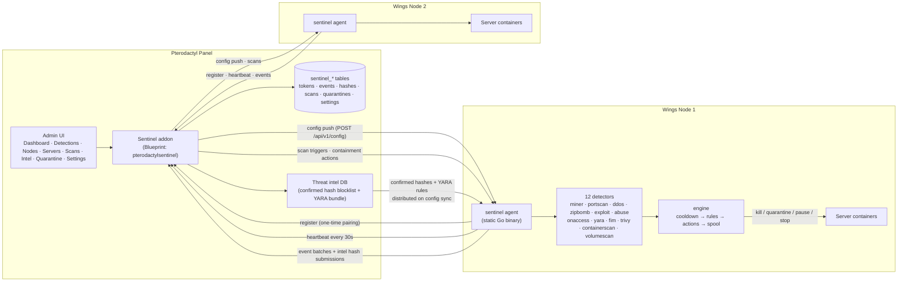

# Sentinel for Pterodactyl

**Fleet-wide security monitoring and enforcement for Pterodactyl panels** — a Laravel panel addon (the brain) plus a static Go agent on each Wings node (the sensor/enforcer). Sentinel watches every container on every node for cryptominers, port scans, outbound DDoS, zip bombs, privilege escalation, abuse tooling and malware, then contains what it finds with a graduated rules engine — all configured once in your admin panel and pushed, versioned, to the whole fleet.

<div class="tip custom-block" style="margin-top: 1.5rem;">

**Built for ALTIS TECH SOLUTIONS**
[xdp.network](https://xdp.network) · Panel addon + node agent, installed separately

</div>

---

## Architecture



The node agent authenticates to the panel with a per-node 64-hex bearer token; the panel uses the same token when calling back into the node. Both directions use a single documented API contract with a `{success, data, error, meta}` envelope everywhere. The node holds exactly one secret (its pairing token) — Discord webhooks, SMTP credentials and intel feed URLs live only in the panel database.

### The intel loop

1. A node's detectors hash a suspicious file (SHA-256) and submit it to the panel.
2. The panel upserts the hash into `sentinel_hashes`, tracking which distinct nodes reported it.
3. When a hash reaches the confirm threshold (default: 3 distinct nodes), or an admin confirms it manually, or it arrives via bulk import, it becomes **confirmed**.
4. The confirmed set (plus the YARA rule bundle) is distributed back to every node on the next config sync, where the on-access scanner and volume scans block it fleet-wide.

---

## Key Features

- **12 detectors on every node.** Cryptominers (CPU heuristics, known binaries, pool-port connections), port scans, outbound DDoS/stress tools, zip bombs (ratio + hot-write triggers), privilege escalation / container escapes / reverse shells, abuse tooling (tor, proxies, VPNs, tunnels, mailers, IRC), on-access malware scanning (fsnotify + hash blocklist + YARA), scheduled YARA sweeps, file-integrity monitoring, image CVE scans (trivy), container scans (processes, log indicators, npm/WhatsApp bots, undersized `server.jar`, cache artifacts), and full volume pattern scans.
- **Graduated enforcement.** A rules engine maps (category, minimum severity) to actions: alert, quarantine file, delete file, kill process, pause container, stop container, suspend server. Local actions run on the node instantly; `suspend_server` is executed panel-side via Pterodactyl's `SuspensionService`, so it is panel-authoritative and survives node restarts.
- **Global dry-run mode.** Every detection is logged and reported, but no containment action is taken — the safe way to roll out and tune before going live.
- **Central threat intel.** Nodes submit SHA-256 hashes; a hash reported by enough distinct nodes (or confirmed by an admin, or bulk-imported from a file/URL) is distributed back to every node's blocklist.
- **Panel-managed, versioned config.** Every detector knob, rule, whitelist entry and limit is edited once in the admin UI. On save, `config_version` increments and the panel pushes to every online node; offline nodes reconcile on their next heartbeat. Apply is atomic (validate, write temp, rename, reload) and a bad push can never take effect.
- **Graceful degradation.** Panel down? Nodes keep enforcing with their last-known config and spool events to a bounded on-disk queue (cap ~10k), flushing when the panel returns. Node down? The panel marks it offline and keeps its last data.
- **Per-server attribution.** Every event — including file-path-only detections — is resolved to the exact Pterodactyl server UUID via docker labels, container name, or volume path, and muted servers suppress actions and alerts while still recording events.
- **Native admin UI.** Eight AdminLTE tabs inside your panel: Dashboard, Detections, Nodes, Servers, Scans, Intel, Quarantine, and a tabbed Settings editor with per-node overrides.
- **Quarantine ledger.** Quarantined files across all nodes are tracked in one table with admin-initiated restore and delete.

---

## Quick Install

Both halves are installed separately. Panel first, then each node.

**Panel (Blueprint):**

```bash
# place pterodactylsentinel-v1.0.0.blueprint in /var/www/pterodactyl, then:
blueprint -i pterodactylsentinel-v1.0.0
```

**Panel (standalone, no Blueprint):**

```bash
sudo bash standalone/install.sh
```

**Each Wings node (as root):**

```bash
sudo bash node-module/install.sh   # prompts for panel URL + the per-node token from Sentinel > Nodes
```

Head to the [Installation guide](./getting-started/installation.md) for prerequisites, verification and troubleshooting, or the [Quick Start](./getting-started/quick-start.md) for the five-minute path.

---

## How Pairing Works

1. **Token issued.** Open **Admin → Sentinel → Nodes**. Every Pterodactyl node gets a row with a generated 64-hex token. The panel stores a bcrypt hash for verification plus an encrypted copy so you can re-view (or reset) it later.
2. **Node installed.** Run `node-module/install.sh` as root on the Wings node. It prompts for the panel URL and token, writes `/etc/sentinel/config.yaml` and `/etc/sentinel/token` (both `0600`), and starts the `sentinel-node` systemd service.
3. **Node registers.** The agent calls `POST /api/sentinel/node/register` (retrying with backoff). The panel verifies the bearer token, records the node's reachable API URL, flips the node to **online**, and pushes the current config.
4. **Steady state.** The node heartbeats every 30 s. When the config changes in the panel, the panel pushes it directly and the heartbeat response carries the new `config_version`; a stale node pulls and re-applies. Resetting a token kills the old one instantly — the node goes offline until re-paired.

---

## Comparison with Standalone Node Scanners

Sentinel shares DNA with sonar/radar-style standalone node scanners (single-host daemons that detect miners and abuse), but is purpose-built for multi-node Pterodactyl fleets.

| Capability | Sentinel for Pterodactyl | Standalone node scanners |
| --- | :---: | :---: |
| Pterodactyl server attribution | Every event mapped to a server UUID | Container-level or none |
| Central threat intel | Confirmed hashes distributed to every node | Local-only blocklists |
| Configuration | Edited once in the panel, versioned, pushed to all nodes | Hand-edited file per host |
| Enforcement | Graduated rules; panel-authoritative suspension | Local kill/stop only |
| Panel downtime | Nodes keep enforcing, spool events to disk | Usually hard-fails or stops reporting |
| Secrets on nodes | One revocable pairing token | Often a panel API key |
| Admin UI | Dashboard, detections, intel DB, quarantine ledger | CLI/log files |

---

## Where Next

- [Installation](./getting-started/installation.md) — panel addon (Blueprint or standalone) plus the node agent, with verification and troubleshooting.
- [Quick Start](./getting-started/quick-start.md) — the five-minute path to your first detection.
- [Configuration Reference](./configuration/reference.md) — every node config value and panel setting.
- [Admin Panel](./user-guide/admin-panel.md) — a tour of all eight tabs.
- [Architecture](./architecture/overview.md) — event pipeline, database schema, config versioning, failure modes.
- [Detectors](./architecture/detectors.md) — what each of the 12 detectors watches and how it escalates.
