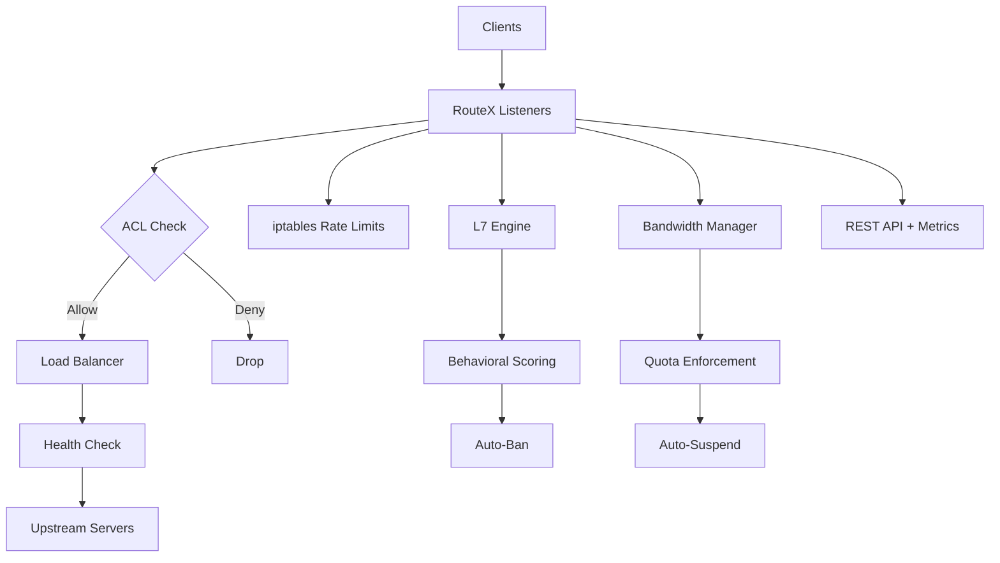

# RouteX

Fast reverse proxy for game server infrastructure with DDoS protection.

## What is RouteX?

RouteX is a production-grade L3/L4/L7 reverse proxy built in Go. It proxies TCP and UDP traffic with iptables-backed rate limiting, a custom L7 application-layer protection engine, load balancing, health checking, bandwidth management, and a universal metrics API.

## Key Features

- **Multi-Layer DDoS Protection**: L3/L4 iptables rules + L7 protocol inspection + behavioral scoring
- **Game Protocol Detection**: Built-in validators for Minecraft Java/Bedrock, FiveM, Garry's Mod
- **Bandwidth Management**: Per-proxy quotas (hourly/daily/weekly/monthly) with auto-suspension
- **ACL System**: Global + per-proxy IP whitelist/blacklist with live API management
- **5 Load Balancing Algorithms**: Round-robin, least-conn, ip-hash, weighted, random
- **Universal Metrics**: Prometheus, InfluxDB, CSV, JSON — all from one endpoint
- **36 REST API Endpoints**: Full programmatic control
- **Zero-Downtime Reload**: Per-proxy config hot-reload via file watcher

## Quick Links

- [Getting Started](/routex/getting-started/overview)
- [Installation](/routex/getting-started/installation)
- [Configuration Reference](/routex/reference/global-config)
- [API Reference](/routex/api/endpoints)
- [GitHub Repository](https://github.com/AnAverageBeing/RouteX-Reverse-Proxy)

## Architecture

