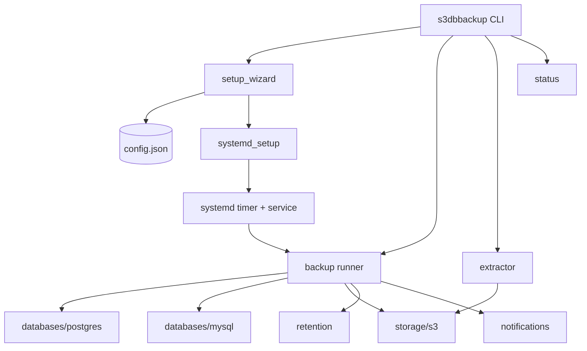
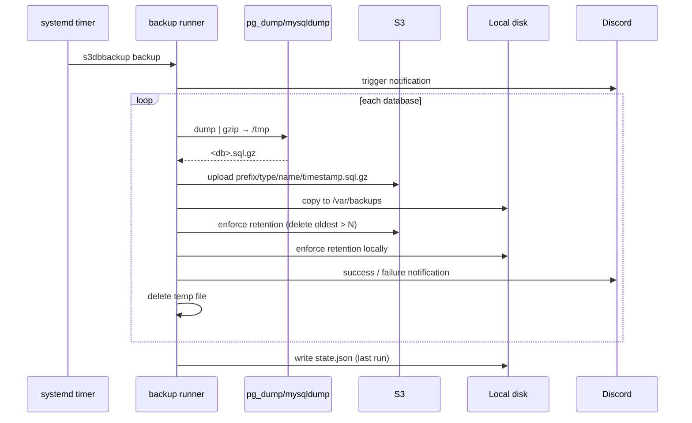

# Architecture Overview

S3 Database Storage for VPS is a small, dependency-light Python program driven by
a single command (`s3dbbackup`) and scheduled by a systemd timer.

## Components



| Module | Responsibility |
|---|---|
| `s3dbbackup.py` | Entry point + command dispatch. |
| `src/setup_wizard.py` | Interactive setup; writes config and the systemd timer. |
| `src/backup.py` | The backup lifecycle for each database. |
| `src/extract.py` | Interactive browse + download from S3. |
| `src/databases/postgres.py` | Discover + `pg_dump`. |
| `src/databases/mysql.py` | Discover + `mysqldump`. |
| `src/storage/s3.py` | boto3 wrapper: test, upload, list, delete, download, retention. |
| `src/retention.py` | Local-copy pruning. |
| `src/notifications.py` | Discord webhook embeds. |
| `src/systemd_setup.py` | Writes/enables the service + timer. |
| `src/config.py` | Read/write `/etc/s3dbbackup/config.json`. |

## Backup lifecycle



## S3 object layout

Everything is namespaced under your chosen folder so it never collides with
other data in the bucket:

```
<bucket>/
└── <prefix>/                         # e.g. s3dbbackup
    ├── postgresql/
    │   └── app_production/
    │       ├── 2026-06-30_18-00-01.sql.gz
    │       └── 2026-06-29_18-00-01.sql.gz
    └── mysql/
        └── wordpress/
            ├── 2026-06-30_18-00-02.sql.gz
            └── 2026-06-29_18-00-02.sql.gz
```

Retention operates **per `type/name` folder**: when the object count exceeds
`max_copies`, the oldest objects are deleted. The same rule is applied to the
on-node copies.

## Data flow & safety

- Dumps are **streamed** through gzip into a temp file in `/tmp/s3dbbackup`, then
  uploaded and copied locally, then the temp file is removed.
- Each database is handled independently — one failing database does not stop the
  others, and only the failing one raises a `failure` notification.
- Credentials live only in `/etc/s3dbbackup/config.json` (mode `600`) and are
  used solely to talk to your database and your S3 endpoint.

## File layout on disk

```
/opt/s3dbbackup/            # program + venv
  s3dbbackup.py
  src/...
  venv/
/usr/local/bin/s3dbbackup   # command wrapper
/etc/s3dbbackup/
  config.json               # configuration (600)
  state.json                # last-run info
/etc/systemd/system/
  s3dbbackup.service        # one-shot runner
  s3dbbackup.timer          # schedule
/var/backups/s3dbbackup/    # on-node copies (configurable)
```
