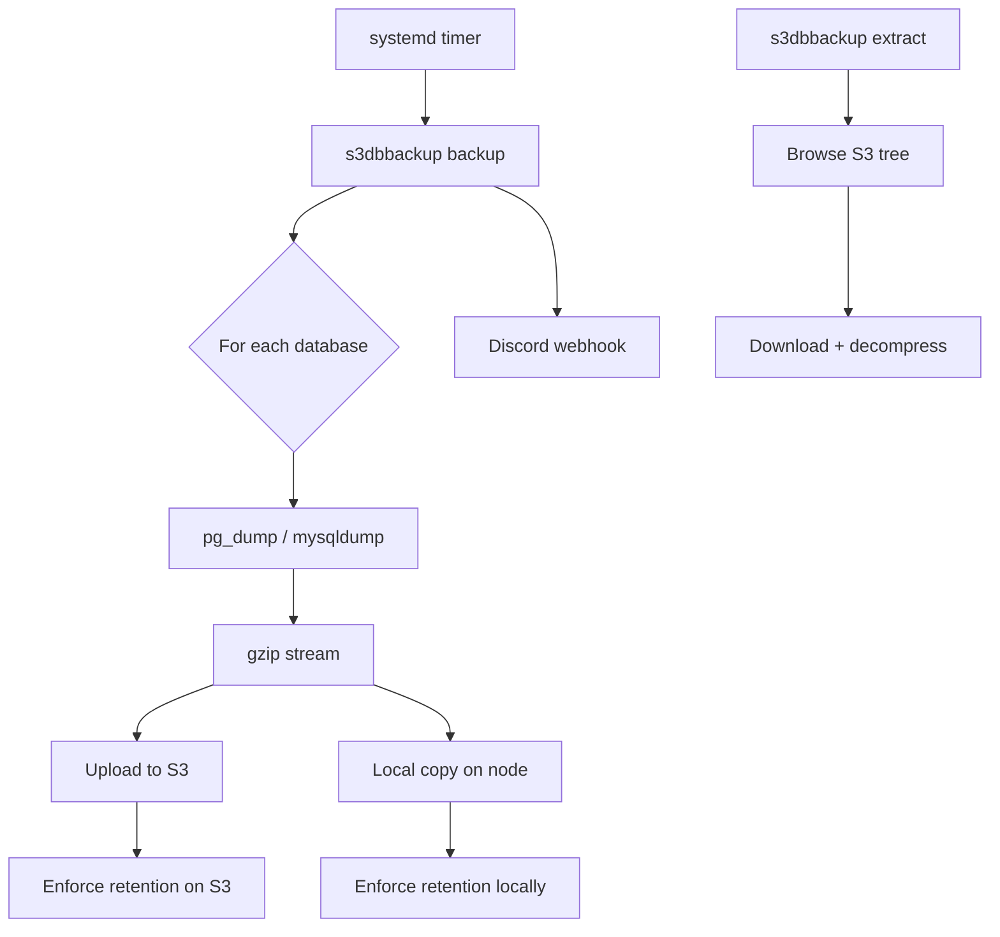

# S3 Database Storage for VPS

Back up your VPS databases to **any S3-compatible storage** — automatically, on a schedule, with retention and off-site copies.

## What is it?

A single interactive tool that auto-discovers the **PostgreSQL** and **MySQL/MariaDB** databases on your server, lets you pick which ones to protect, dumps them, uploads them to S3 (and keeps a copy on the node), prunes old copies, and can notify a **Discord webhook** on every event. A built-in **extractor** lets you browse and pull any backup back down.

No hand-written cron jobs, no `pg_dump | gzip | aws s3 cp` one-liners, no rotation scripts — one wizard sets up everything and systemd runs it.

## Key Features

- **One-command interactive setup** — a friendly wizard, nothing to hand-edit.
- **Auto-discovers databases** — lists every PostgreSQL and MySQL/MariaDB database; pick by number.
- **Any S3-compatible storage** — AWS S3, Cloudflare R2, Backblaze B2, Wasabi, MinIO, DigitalOcean Spaces, and more.
- **Tidy, isolated layout** — everything under a folder you name: `bucket/<folder>/<db-type>/<db-name>/<timestamp>.sql.gz`.
- **Scheduled with systemd** — hourly, every 6/12 hours, daily, weekly, or a custom expression.
- **Retention** — keep the newest *N* copies per database; the oldest is deleted automatically on S3 **and** locally.
- **Off-site + on-node** — uploads to S3 and also keeps a local copy.
- **Connection test** — verifies S3 before committing anything.
- **Discord alerts (optional)** — `trigger`, `success`, `failure`, and/or `error`.
- **Interactive extractor** — browse a tree of all backups, type which one you want, download it (with optional decompress).

## Quick Install

```bash
git clone https://github.com/AnAverageBeing/s3-database-storage-for-vps.git
cd s3-database-storage-for-vps
sudo bash install.sh
sudo s3dbbackup setup
```

## Quick Links

- [Installation](/s3-database-storage-for-vps/getting-started/installation)
- [Configuration Reference](/s3-database-storage-for-vps/configuration/reference)
- [CLI Reference](/s3-database-storage-for-vps/user-guide/cli)
- [The Extractor](/s3-database-storage-for-vps/user-guide/extractor)
- [Discord Webhooks](/s3-database-storage-for-vps/user-guide/webhooks)
- [Architecture](/s3-database-storage-for-vps/architecture/overview)
- [GitHub Repository](https://github.com/AnAverageBeing/s3-database-storage-for-vps)

## Architecture



## How it compares

| | Hand-rolled cron scripts | **S3 Database Storage for VPS** |
|---|---|---|
| Setup | Write scripts per database | One interactive wizard |
| Database discovery | Manual | Automatic (Postgres + MySQL/MariaDB) |
| Scheduling | crontab editing | systemd timer (chosen in the wizard) |
| Retention | Custom rotation logic | Keep newest N, auto-prune |
| Off-site + local | Two separate scripts | Both, built-in |
| Restore | Manual S3 CLI + gunzip | Interactive browse + download |
| Alerts | None | Discord webhook (trigger/success/failure/error) |

::: tip
Use a dedicated, least-privilege S3 key scoped to the backup bucket. Credentials are stored only in `/etc/s3dbbackup/config.json` (mode `600`) and never leave your server.
:::
