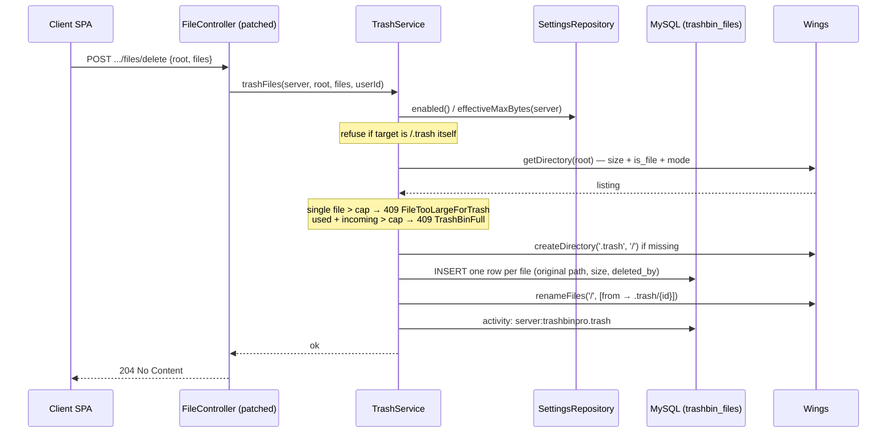
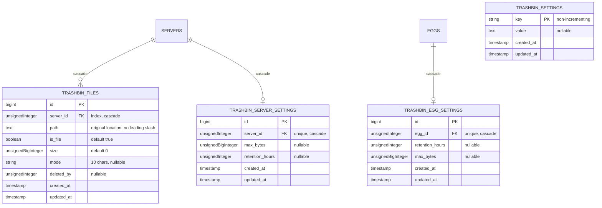

# Architecture Overview

Trash Bin Pro is a panel-only extension: all logic lives inside the Pterodactyl panel (Laravel 11, PHP 8.2+) and talks to game servers through the stock Wings `DaemonFileRepository`. There is no node-side daemon, no extra ports, and no cron configuration beyond the standard Pterodactyl scheduler entry.

---

## Component Diagram

```mermaid
graph TD
    subgraph Client[Client SPA]
        FM[File Manager UI] -->|directory listing / delete / restore| FC
    end
    subgraph Panel[Pterodactyl Panel]
        FC[FileController - patched] --> TS[TrashService]
        FC --> TFT[TrashBinFileTransformer]
        RFR[RestoreFilesRequest] -->|trashbinpro.access| FC
        TS --> DFR[DaemonFileRepository]
        TS --> SREP[TrashBinSettingsRepository - 5 min cache]
        TS --> LOG[TrashActivityLogger]
        SREP --> DB[(MySQL trashbin_*)]
        TS --> DB
        LOG --> ACT[(activity log)]
        SP[TrashBinProServiceProvider] -->|hourly withoutOverlapping| PTC[PurgeTrashCommand]
        PTC --> DB
        PTC --> DFR
        ACP[TrashBinSettingsController - /admin/trashbinpro] --> SREP
    end
    subgraph Wings[Wings Node]
        DFR -->|HTTPS + bearer token| WD[Wings API]
        WD --> TRASH[/.trash inside container volume]
    end
```

---

## Delete Operation — Sequence



Restore is the mirror image: rows are scoped to the server (IDOR-safe), ghost rows pointing inside `.trash` are dropped, name collisions resolve to `name (restored)` / `name (restored N)`, and Wings renames `.trash/{id}` back to the resolved target before the rows are deleted.

---

## Database Schema

Four tables, all prefixed `trashbin_`, migrated by the service provider via `loadMigrationsFrom`:



Two design notes:

- `trashbin_files.id` doubles as the on-disk name inside `/.trash`, so the trash bin can never have an internal filename collision — the original path is only metadata for restore.
- All three override/settings columns are **nullable**: `NULL` means "no override, fall through to the next level".

---

## Components

| Component | Namespace / Path | Role |
|---|---|---|
| `TrashBinFile`, `TrashBinSetting`, `TrashBinEggSetting`, `TrashBinServerSetting` | `Pterodactyl\Models\TrashBinPro` | Eloquent models for the four tables. `TrashBinSetting` is string-keyed, non-incrementing. |
| `TrashBinSettingsRepository` | `Pterodactyl\Services\TrashBinPro` | Cached key/value reads (prefix `trashbin_setting:`, **5-minute TTL**), typed getters, `resetToDefaults()`, and the `effectiveMaxBytes()` / `effectiveRetentionHours()` resolvers. |
| `TrashService` | `Pterodactyl\Services\TrashBinPro` | Core domain logic: `quota()`, `usedBytes()`, `listTrash()`, `trashFiles()`, `restoreFiles()`, `deleteFromTrash()`, `emptyTrash()`. Wires Wings, settings, and activity logging together. |
| `TrashActivityLogger` | `Pterodactyl\Services\TrashBinPro` | Thin wrapper over `Activity::event`; a no-op when `logging_enabled` is false. |
| `PurgeTrashCommand` | `Pterodactyl\Console\Commands\TrashBinPro` (`p:trashbin:purge`) | Hourly retention purge. See the data flow below. |
| `TrashBinProServiceProvider` | `Pterodactyl\Providers` | Registers the three service singletons, translations, admin routes (with `web` + `auth.session` + 2FA + `AdminAuthenticate` middleware), migrations, the console command, and the hourly schedule (`withoutOverlapping`). |
| `RestoreFilesRequest` | `Pterodactyl\Http\Requests\Api\Client\Servers\Files` | `ClientPermissionsRequest` requiring `trashbinpro.access`; validates `files` as an array of trash row ids. |
| `TrashBinFileTransformer` | `Pterodactyl\Transformers\Api\Client` | Presents a trash row as a file object: `is_trash=true`, `trash_id`, real size, `octet-stream` mimetype — resource name `trash_bin_file_object`. |
| `TrashBinSettingsController` | `Pterodactyl\Http\Controllers\Admin\TrashBinPro` | Admin panel: index/update/reset settings, per-egg upsert/delete, and `purge-now`. Routes live in `routes/admin-trashbinpro.php` under `/admin/trashbinpro`. |
| Exceptions | `Pterodactyl\Exceptions\TrashBinPro` | `TrashBinDisabledException`, `FileTooLargeForTrashException`, `TrashBinFullException` — all `DisplayException`s; the last two map to HTTP 409 with structured error codes. |

### Global settings (`trashbin_settings`)

| Key | Default | Meaning |
|---|---|---|
| `enabled` | `true` | Master switch. When off, deletes fall through to stock hard delete. |
| `retention_hours` | `24` | Global retention window (1–8760). |
| `default_max_bytes_per_server` | `0` | Global trash capacity per server in bytes; `0` = unlimited. Admin UI edits this in MB. |
| `max_files_per_delete` | `100` | Cap on files per delete operation. |
| `purge_batch_size` | `200` | `chunkById` batch size for the hourly purge (floor of 50). |
| `logging_enabled` | `true` | Write `server:trashbinpro.*` events to the activity log. |
| `protect_trash_dir` | `true` | Hide/guard the `.trash` directory in the file manager. |

`config/trashbinpro.php` mirrors these defaults for non-DB access.

### Effective setting resolution

Both capacity and retention resolve per server with the same precedence:

```text
server override (trashbin_server_settings)
    ?? egg override (trashbin_egg_settings)
    ?? global default (trashbin_settings)
```

`effectiveMaxBytes()` returns bytes (`0` = unlimited); `effectiveRetentionHours()` returns hours, clamped to a minimum of 1. `enabled` is global only — there are no per-server or per-egg enable flags.

---

## Hourly Purge Data Flow

`p:trashbin:purge` is scheduled by `TrashBinProServiceProvider` (hourly, `withoutOverlapping`) — no `app/Console/Kernel.php` edit and no extra cron entry beyond the stock panel scheduler.

1. **Preflight** — if `trashbin_files` is not migrated yet, exit cleanly.
2. **Chunked scan** — `TrashBinFile::with('server')->chunkById(purge_batch_size)` walks the table in batches so large installs never load the whole trash index into memory.
3. **Per-row expiry** — for each row, resolve that server's effective retention and compute `created_at + retention` against a single frozen `CarbonImmutable::now()` (non-mutating). Rows whose server was deleted go to an orphan list and are dropped from the DB directly.
4. **Group per server** — expired ids are grouped by `server_id`, producing exactly **one Wings `deleteFiles('/.trash', ids)` call per server**.
5. **Fault isolation** — each server's delete is wrapped in its own try/catch. A Wings failure is logged as a warning and counted; the rows stay in place and are retried on the next hourly run. One dead node never blocks the purge of every other server.
6. **Commit** — rows are deleted from MySQL only after their Wings delete succeeds; the command prints purged and failed counts.

---

## The Python Patch System

Trash Bin Pro modifies stock panel files (`FileController.php`, `Server.php`, `FileObjectTransformer.php`, `Permission.php`, `routes/api-client.php`, and the React/TypeScript SPA) with Python patchers under `standalone/data/patch-*.py`. The design goals are reinstall safety and loud failure:

- **Marker-guarded** — every injected block carries the `pterodactyltrashbinpro` marker; in PHP files, guards are code *signatures* (e.g. `listTrash(`, `trashFiles(`) rather than comments, because Blueprint's install pipeline strips comment lines.
- **Per-patch idempotent** — each block is guarded and reported individually (`applied` / `skipped: already present` / `failed`), never by a global "already patched" short-circuit. A previously applied block can never mask a failed or missing one, and a re-run is a zero-diff no-op.
- **Anchor-free imports** — `use` statements are inserted without depending on a specific neighboring import line, so panel updates that reorder imports don't break the patcher.
- **Fail-loud validation** — if any anchor is missing, that block reports `failed` and the file is **not written**; nothing is half-applied silently.

The same patchers run from the Blueprint extension and the standalone installer, so both install flavors produce identical panel code.

---

## Addon File Layout

Everything under `standalone/PanelFiles/` merges directly into the panel tree:

```text
PanelFiles/
├── app/
│   ├── Console/Commands/TrashBinPro/PurgeTrashCommand.php
│   ├── Exceptions/TrashBinPro/
│   │   ├── FileTooLargeForTrashException.php
│   │   ├── TrashBinDisabledException.php
│   │   └── TrashBinFullException.php
│   ├── Http/
│   │   ├── Controllers/Admin/TrashBinPro/TrashBinSettingsController.php
│   │   └── Requests/Api/Client/Servers/Files/RestoreFilesRequest.php
│   ├── Models/TrashBinPro/
│   │   ├── TrashBinEggSetting.php
│   │   ├── TrashBinFile.php
│   │   ├── TrashBinServerSetting.php
│   │   └── TrashBinSetting.php
│   ├── Providers/TrashBinProServiceProvider.php
│   ├── Services/TrashBinPro/
│   │   ├── TrashActivityLogger.php
│   │   ├── TrashBinSettingsRepository.php
│   │   └── TrashService.php
│   └── Transformers/Api/Client/TrashBinFileTransformer.php
├── config/trashbinpro.php
├── database/migrations/2026_06_01_10000{0..3}_create_trashbin_*_table.php
├── lang/en/trashbinpro.php
├── resources/
│   ├── scripts/api/server/files/        # restoreFiles.ts, emptyTrash.ts, getTrashQuota.ts
│   └── views/admin/trashbinpro/settings.blade.php
└── routes/admin-trashbinpro.php
```

Alongside it, `standalone/data/` holds the install/remove scripts and the six patchers (`install.sh`, `remove.sh`, `patch-file-controller.py`, `patch-server-model.py`, `patch-file-object-transformer.py`, `patch-permission-model.py`, `patch-api-client-routes.py`, `patch-frontend.py`). The Blueprint package (`blueprint/pterodactyltrashbinpro`) ships the same payload, with client routes loaded from Blueprint's extension route directory instead of being appended to `routes/api-client.php`.

::: info Client API surface
The patched client routes are `POST /restore` (throttled 10/min), `GET /trash-quota`, and `POST /trash/empty` (throttled 10/min) on the existing `/api/client/servers/{server}/files` group. All trash operations except restore are additionally guarded by `$this->authorize('trashbinpro.access', $server)` in the controller; restore is enforced by `RestoreFilesRequest`.
:::
