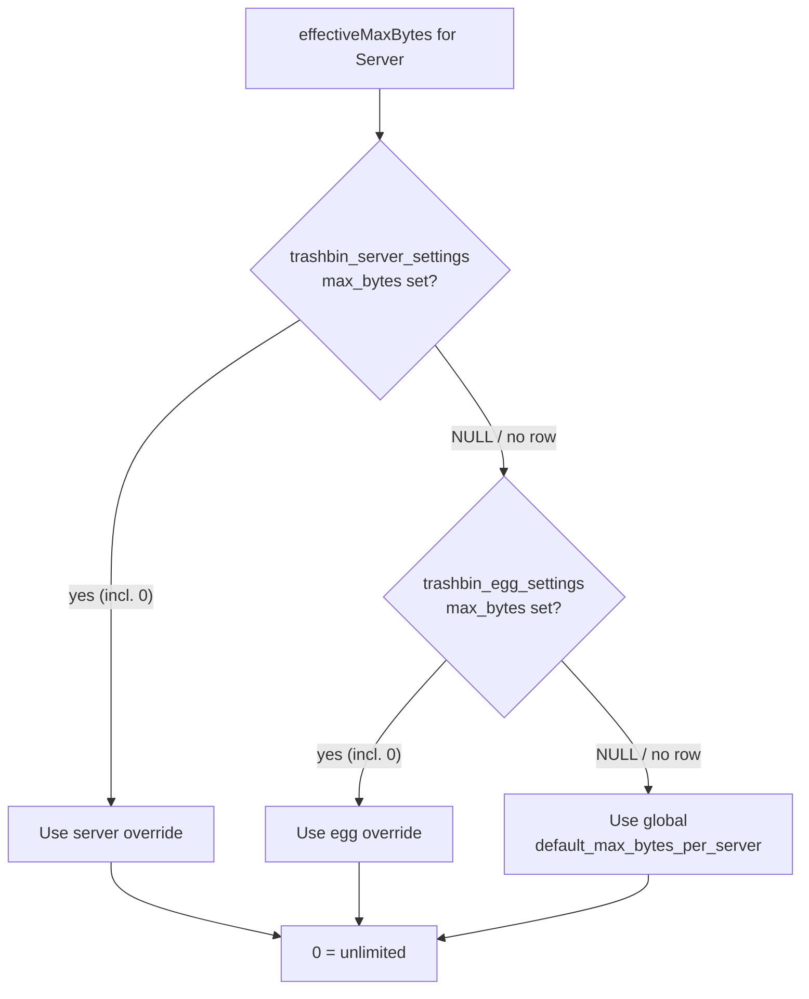
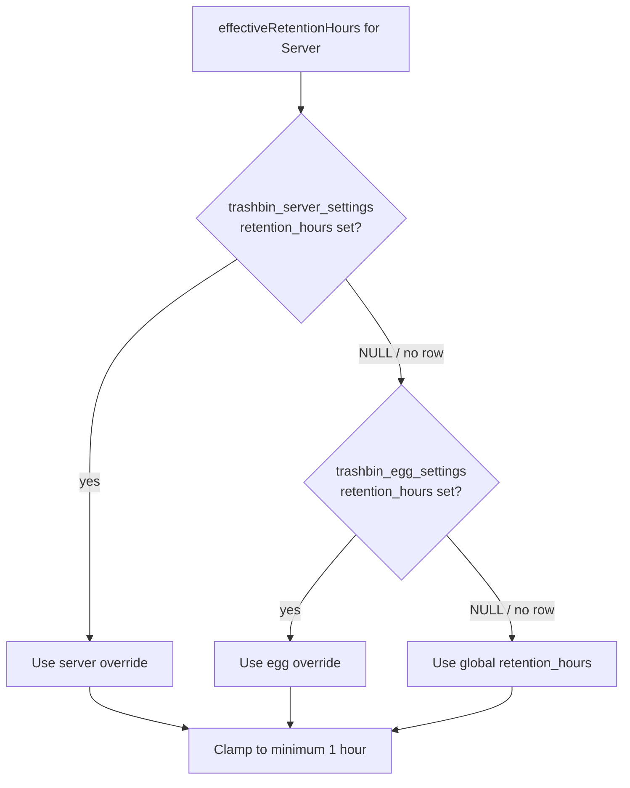

# Configuration Reference

Trash Bin Pro is configured in two places:

- **Panel admin settings** — **Admin → Trash Bin Pro** (`/admin/trashbinpro`), stored in the `trashbin_settings` database table
- **`config/trashbinpro.php`** — fallback defaults used only when the table is unavailable (for example, before migrations have run)

Runtime configuration is managed from the admin panel and stored in the database. The values in `config/trashbinpro.php` are the ultimate fallback and mirror the built-in defaults — you should not need to hand-edit this file in normal operation.

::: info Settings cache
Every setting read goes through a 5-minute cache (keys prefixed `trashbin_setting:`, 300s TTL). Writes from the admin panel invalidate the affected key immediately, so admin changes take effect at once — but if you edit `trashbin_settings` rows directly in the database, expect up to 5 minutes of staleness (or run `php artisan cache:clear`).
:::

---

## Global Settings

Stored as key/value rows in `trashbin_settings`; edited at `/admin/trashbinpro`. Boolean keys are stored as `'1'`/`'0'` strings and cast on read.

| Key | Type | Default | Valid range | Description |
|-----|------|---------|-------------|-------------|
| `enabled` | bool | `true` | — | Master switch. When disabled, delete requests fall back to the stock panel behavior: files are **hard deleted**, nothing moves to `/.trash`. |
| `retention_hours` | int | `24` | 1–8760 | How long files stay in the Trash Bin before the hourly purge deletes them. 8760 hours = 1 year. |
| `default_max_bytes_per_server` | int (bytes) | `0` | 0–10995116277760 | Default per-server Trash Bin capacity. `0` means unlimited. The admin UI enters this in **MB** (`default_max_mb_per_server`); it is stored as bytes = MB × 1024 × 1024. |
| `max_files_per_delete` | int | `100` | 1–10000 | Safety guard: maximum number of files accepted in a single delete request. |
| `purge_batch_size` | int | `200` | 50–5000 | How many trash rows the purge command processes per chunk. Floored at 50 inside the command. |
| `logging_enabled` | bool | `true` | — | Whether to write Pterodactyl activity-log entries for trash/restore/purge/empty actions. |
| `protect_trash_dir` | bool | `true` | — | Prevent users from manually moving files into, or deleting, the `.trash` folder. |

### `enabled`

The master switch for the whole addon. When `true`, deleting files from the file manager moves them into the server's `/.trash` directory via Wings and records them in `trashbin_files`. When `false`, the panel catches the disabled state and falls back to the original hard delete — users get stock Pterodactyl behavior, and existing trash contents are left untouched.

**When to change it:** flip to `false` temporarily during incident response or maintenance, instead of uninstalling the addon.

### `retention_hours`

Hours a file may sit in the Trash Bin before `p:trashbin:purge` (scheduled hourly) permanently deletes it. Retention is resolved per server (see [Resolution Order](#resolution-order)) and is always clamped to a minimum of 1 hour at resolution time.

**When to change it:** raise it for hosts where users frequently need older restores; lower it to bound disk usage on storage-tight nodes.

::: warning Common mistake
Entering `0` expecting "keep forever". The admin form rejects `0` (minimum 1), and even if a `0` reached the database the effective retention is clamped to `max(1, value)` — files would be purged on the very next hourly run. The maximum supported window is 8760 hours (1 year); there is no "infinite" retention.
:::

### `default_max_bytes_per_server`

Default Trash Bin capacity per server, in **bytes**. `0` = unlimited. When a cap is in effect, a single file larger than the cap is rejected (`FileTooLargeForTrash`, HTTP 409), and a delete that would push the server over its cap is rejected (`TrashBinFull`, HTTP 409).

The admin UI field is `default_max_mb_per_server` and accepts **MB** (0–10485760); the controller multiplies by 1048576 before storing.

::: warning Common mistake
Entering raw **bytes** into the admin field. The field is megabytes: typing `536870912` (expecting 512 MB in bytes) is rejected by the max-10485760 validation, and a value like `512000000` MB would be nonsense. Enter MB only — `512` for a 512 MB quota.
:::

### `max_files_per_delete`

Maximum number of files accepted in a **single delete request**. This is a request-size guard against pathological bulk operations, nothing more.

::: warning Common mistake
Assuming this limits how many files a server's Trash Bin can hold. It does not — trash capacity is governed solely by `default_max_bytes_per_server` (and the egg/server overrides). A server can accumulate far more than 100 trashed files across many delete requests.
:::

### `purge_batch_size`

Rows per chunk for the hourly purge command (`chunkById`). The command floors this at 50 internally, so values below 50 are treated as 50 even if one slipped into the table.

**When to change it:** lower it if the hourly purge causes lock contention on a busy panel database; raise it if large trash backlogs aren't clearing within the hour.

### `logging_enabled`

Controls the `TrashActivityLogger`: when `true`, trash/restore/purge/empty actions write Pterodactyl activity-log entries (`server:trashbinpro.*`). When `false`, the logger is a no-op. Files still move — only the audit trail stops.

### `protect_trash_dir`

When `true`, the server-side guard refuses to trash the trash directory itself and blocks users from moving files into, or deleting, the `.trash` folder through normal file-manager operations. Keep this on; disabling it lets users nest trash inside trash and corrupt the bookkeeping between Wings and the `trashbin_files` table.

---

## Fallback Config File

`config/trashbinpro.php` mirrors the built-in defaults exactly:

```php
return [
    'enabled' => true,
    'retention_hours' => 24,
    'default_max_bytes_per_server' => 0,
    'max_files_per_delete' => 100,
    'purge_batch_size' => 200,
    'logging_enabled' => true,
    'protect_trash_dir' => true,
];
```

These values are read only when the `trashbin_settings` table can't be (missing table, null row). Once migrations have run and the admin panel has been saved at least once, the database wins.

---

## Per-Egg and Per-Server Overrides

Two additional tables override the globals for subsets of servers. In both, every override column is **nullable** — `NULL` means "inherit from the next level down".

### `trashbin_egg_settings`

| Column | Type | Description |
|--------|------|-------------|
| `egg_id` | unsigned int, unique | The egg this override applies to. FK → `eggs`, cascade delete. |
| `retention_hours` | unsigned int, nullable | Retention override for all servers of this egg (1–8760). `NULL` = inherit global. |
| `max_bytes` | unsigned bigint, nullable | Capacity override in bytes. `NULL` = inherit global. `0` = explicit unlimited. |

The admin UI exposes these: pick an egg, optionally set retention (hours) and/or max size (MB — converted to bytes on save), leave a field blank to inherit.

### `trashbin_server_settings`

| Column | Type | Description |
|--------|------|-------------|
| `server_id` | unsigned int, unique | The server this override applies to. FK → `servers`, cascade delete. |
| `max_bytes` | unsigned bigint, nullable | Capacity override in bytes. `NULL` = inherit. `0` = explicit unlimited. |
| `retention_hours` | unsigned int, nullable | Retention override. `NULL` = inherit. |

::: info
The admin panel does **not** expose per-server rows today — there is no UI for them. They are honored at runtime if present (the resolution helpers check this table first), so they can be seeded manually or by future tooling.
:::

---

## Resolution Order

Effective values are resolved per server, strictly: **server override → egg override → global default**. A non-`NULL` value at a higher level wins outright.





::: tip 0 is not NULL
For capacity, an override of `0` bytes is a **real value** meaning "unlimited for this server/egg" — it short-circuits the chain and wins over lower levels. Only `NULL` (field left blank) inherits. This is how you exempt one egg from an otherwise global quota.
:::

---

## Admin Panel Actions

All actions live at `/admin/trashbinpro` (route group protected by the standard admin middleware). The page also shows total trash usage across the fleet and the current effective settings next to their defaults.

| Action | Route | What it does |
|--------|-------|--------------|
| Save settings | `POST /admin/trashbinpro` | Validates and writes all 7 global settings to `trashbin_settings` (MB converted to bytes), busting the per-key cache. |
| Reset to defaults | `POST /admin/trashbinpro/reset` | Rewrites all global settings to the built-in defaults shown in the table above. Does not touch egg/server overrides or trash contents. |
| Upsert egg override | `POST /admin/trashbinpro/egg` | Creates or updates the `trashbin_egg_settings` row for an egg. Blank fields become `NULL` (inherit). |
| Delete egg override | `POST /admin/trashbinpro/egg/{egg}/delete` | Removes the egg's override row; servers of that egg fall back to globals. |
| Purge Now | `POST /admin/trashbinpro/purge-now` | Runs `p:trashbin:purge` on demand via Artisan. Respects per-server retention — this is **not** an "empty everything" button, it only deletes files past their effective retention window. |
| Top servers by trash usage | (display only) | Lists the 15 servers with the largest trash footprint (file count + total bytes), plus fleet-wide total bytes. |

::: warning Purge Now is retention-aware
Clicking Purge Now immediately after trashing a file deletes nothing — the file hasn't exceeded its retention window yet. To force immediate removal of specific items, use Empty Trash inside the server's own file manager.
:::

---

## Database Tables Reference

All four tables are prefixed `trashbin_` and created by the addon's migrations.

| Table | Purpose | Foreign keys |
|-------|---------|--------------|
| `trashbin_files` | One row per trashed item: `server_id`, original `path` (relative to container root, no leading slash), `is_file`, `size`, `mode`, `deleted_by`, timestamps. The on-disk file lives at `/.trash/{id}`. | `server_id` → `servers` **cascade delete** — deleting a server drops its trash rows. |
| `trashbin_settings` | Global key/value settings (`key` string primary key, `value` text nullable). | none |
| `trashbin_egg_settings` | Per-egg overrides (`egg_id` unique; nullable `retention_hours`, `max_bytes`). | `egg_id` → `eggs` **cascade delete**. |
| `trashbin_server_settings` | Per-server overrides (`server_id` unique; nullable `max_bytes`, `retention_hours`). | `server_id` → `servers` **cascade delete**. |

::: danger Cascade behavior
All three server/egg-linked tables cascade on delete. Removing a server or egg in Pterodactyl permanently erases its trash records and overrides — but the orphaned `/.trash` directory on disk goes away with the container itself, so no manual cleanup is needed on the node.
:::
