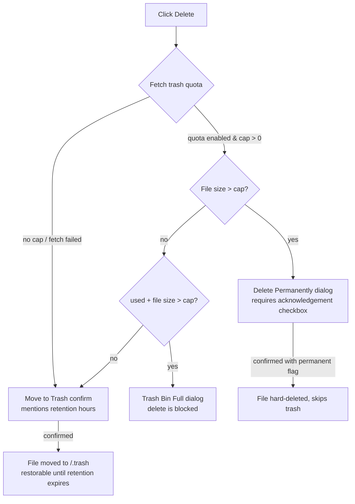

# File Manager Guide

Trash Bin Pro integrates directly into the stock Pterodactyl file manager. Deleted files are moved to a hidden `/.trash` folder on the server instead of being removed, and can be restored until their retention window expires.

---

## Opening the Trash

The `/.trash` folder **never appears in normal directory listings** — it is filtered out of the UI entirely, so it cannot be clicked, renamed, or deleted by accident.

Instead, a dedicated **Trash** button sits in the file manager toolbar, next to Upload and New File. Clicking it navigates to `#/.trash`.

::: tip Subusers
The Trash button is only shown to users with the **`trashbinpro.access`** permission (server **Users** tab → **Trash Bin Pro → Access**). The server owner always has it.
:::

## The Trash view

The trash view looks like a normal directory, with a few deliberate differences:

- The breadcrumb renders **Trash** instead of `.trash`.
- Each row shows a **trash icon**, the file's **original path** as its name (e.g. `plugins/broken-plugin.jar`), and its **real size**.
- A banner at the top reads: *"Files here are permanently deleted after their retention window."*
- The create actions — **New Directory, Upload, New File** — are hidden. Nothing new can be placed into the trash by hand.
- Rows are **not clickable**: you cannot open or navigate into a trashed item.
- Selecting rows tracks their numeric **trash IDs** instead of file names — the select-all checkbox selects every trash ID in the view, which is what powers mass restore and mass delete.

## Deleting files (move to trash)

Outside the trash, clicking **Delete** on a file or directory does not delete it immediately. The UI first checks the server's trash quota and then shows one of three dialogs:

- **Normal case** — a *Move to Trash* confirmation that tells you the retention window: *"…will be moved to the Trash and automatically deleted after {retention}h."*
- **File larger than the cap** — a *Delete Permanently* dialog. The danger button stays disabled until you tick the checkbox: *"I understand this file will be permanently deleted and cannot be recovered."* Confirming sends the delete with the `permanent` flag, so the file skips the trash entirely.
- **Trash full** — a *Trash Bin Full* dialog: *"The Trash Bin is full. Delete some files from the Trash and try again."* There is no confirm button — the delete is blocked until you free space.

::: info The same checks run server-side
If the quota changes between the dialog and the request, the API still enforces it and returns `409` with a `FileTooLargeForTrash` or `TrashBinFull` error. See the [API Reference](./api#quota-errors-409-conflict).
:::

## Restoring files

Inside the trash view, each row's context menu is reduced to two actions: **Restore** and **Delete Permanently** (rename, move, chmod, copy, archive, and download are not offered for trash entries).

- **Restore** (context menu, requires `trashbinpro.access`) — returns the file to its original path.
- **Mass restore** — select several rows and click **Restore** in the mass action bar.

If something already exists at the original path, the restored file is renamed with a suffix: `name (restored)`, then `name (restored 2)`, and so on — restoring never overwrites an existing file.

## Deleting from trash

**Delete Permanently** on a trash row (or **Delete** in the mass action bar) removes the selected entries for good — the files are deleted from `/.trash` on the daemon and their tracking rows are removed. The confirmation dialog makes this explicit: *"Permanently delete N file(s)? This cannot be undone."*

## Emptying the trash

The mass action bar inside the trash view has an **Empty Trash** button that permanently deletes **every** entry for the server in one call.

::: danger Bypasses retention
Empty Trash ignores the retention window — files are deleted immediately even if they were trashed seconds ago. There is no way to recover them afterwards.
:::

## Protections built in

Several guards keep the trash folder itself safe:

- `/.trash` is filtered out of every listing, so it can never be selected or targeted through the UI.
- Mass-delete requests silently exclude `.trash` even if a stale selection somehow contains it.
- The rename/move modal **silently refuses** any operation whose target is `.trash` or a path inside it — the dialog simply closes without submitting.
- Server-side, the API rejects any attempt to trash the trash directory itself (a `root` of `.trash`/`/.trash` or a path under it), so the protection cannot be bypassed with a hand-crafted request.
